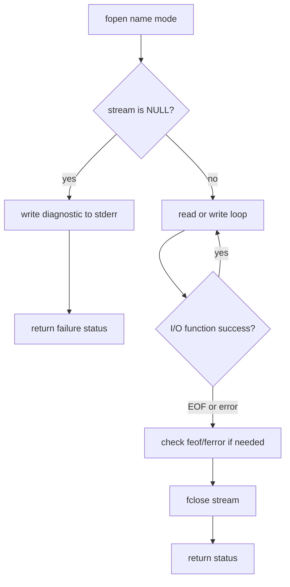

# File Access and Error Handling

K&R's I/O chapter moves from standard input and output to named files, error reporting, line input, string operations, character classification, command execution, and storage management. This is the portable interface layer above operating-system calls. Programs that use `fopen`, `fclose`, `getc`, `putc`, `fprintf`, and `fgets` can often move across systems without changing their core logic.


*Figure: C remains the reference language for low-level memory, pointers, and Unix interfaces. Image: [Wikimedia Commons](https://commons.wikimedia.org/wiki/File:C_Programming_Language.svg), ElodinKaldwin, public domain text logo.*

The central design idea is that a file is accessed through a stream, represented by `FILE *`. The stream buffers data, records status, and presents text or binary input in a standard form. Error handling is explicit: check return values, report failures on `stderr`, and return a useful status from `main`.

## Definitions

A file is opened with:

```c
FILE *fopen(const char *filename, const char *mode);
```

Common modes include:

- `"r"`: read text
- `"w"`: write text, truncating or creating
- `"a"`: append text
- `"r+"`: update, reading and writing
- `"rb"` and `"wb"`: binary read and write

`fopen` returns `NULL` on failure. A stream is closed with:

```c
int fclose(FILE *stream);
```

Character I/O on streams uses:

```c
int getc(FILE *stream);
int putc(int c, FILE *stream);
```

Line input and output use:

```c
char *fgets(char *s, int n, FILE *stream);
int fputs(const char *s, FILE *stream);
```

Formatted output to a stream uses `fprintf`; formatted input from a stream uses `fscanf`. `stderr` is the standard error stream and is conventionally used for diagnostics:

```c
fprintf(stderr, "prog: cannot open %s\n", name);
```

Program termination support comes from `<stdlib.h>`:

```c
exit(EXIT_FAILURE);
```

The standard library also provides helpers that K&R connects to I/O work: `<string.h>` for strings, `<ctype.h>` for character tests and conversions, `ungetc` for one-character pushback, `system` for command execution, and `malloc`/`free` for storage.

## Key results

Open failure is normal, not exceptional. A program may lack permission, the file may not exist, or a path may name a directory. Always test `fopen` before using the stream.

`stderr` should receive diagnostics. If standard output is redirected to a file or another program, writing errors to `stdout` can corrupt the intended data stream. K&R's examples consistently report errors with `fprintf(stderr, ...)`.

Line input is safer than unbounded input. `fgets` reads at most `n - 1` characters and appends `'\0'`. It may leave the remainder of a long line unread, so callers that care about full logical lines must detect whether a newline was included.

`gets` is unsafe. K&R lists it because it existed in the standard library of the time, but modern C removed it because it cannot be used safely; it has no buffer-size argument.

Update mode requires care. When a stream is open for both reading and writing, the standard requires a positioning or flushing operation between a read and a write in many cases. This prevents buffered state from becoming ambiguous.

File status and conversion status differ. End-of-file, I/O error, and parse failure are different conditions. Use return values first, then `feof`, `ferror`, or `perror` when needed.

The portable stream interface is intentionally higher-level than UNIX file descriptors. A `FILE *` stream may buffer input, buffer output, translate text newlines, and remember error and end-of-file indicators. This is why a program should not treat the stream as if it were only a thin integer handle. The stream object belongs to the library, and the program interacts with it through functions. That extra layer is what lets the same source code read a text file on systems with different physical newline representations.

Error handling should preserve useful context. A message such as `cannot open file` is less useful than `prog: cannot open notes.txt`. K&R examples often include the program name and the file name, and modern code can add `perror` or `strerror(errno)` to include the system reason. The important design rule is to report errors on the diagnostic stream without corrupting normal output. A filter that writes transformed data to `stdout` should keep errors on `stderr` so it can still be used safely in a pipeline.

When processing files, decide whether the program is record-oriented, line-oriented, or byte-oriented. `fgets` is line-oriented but bounded by a buffer; `getc` is character-oriented; `fread` is byte/block-oriented and does not interpret text. Mixing these approaches without a clear reason often creates off-by-one bugs or leaves unread data in the stream. K&R's examples usually pick one model per program, which keeps the loop condition and the error checks simple.

A second design choice is whether an error should stop the whole program or only skip one file. A command that processes many filenames often reports an error for one name, increments a failure status, and continues with the remaining names. A command whose output would be meaningless after a failed write should stop immediately. C leaves that policy to the program, so return statuses and cleanup paths should be chosen deliberately.

The file-positioning functions add another layer of state. After `fseek`, the next input or output operation observes the new position. This is useful for fixed-size records and binary files, but text streams can have implementation-specific restrictions on meaningful offsets. When portability matters, use positions returned by `ftell` or stay with sequential processing.

## Visual



| Function | Purpose | Success result | Failure or end result |
|---|---|---|---|
| `fopen` | open named file | `FILE *` | `NULL` |
| `fclose` | close stream | `0` | `EOF` |
| `getc` | read char from stream | character as `int` | `EOF` |
| `putc` | write char to stream | written char | `EOF` |
| `fgets` | read bounded line | `s` | `NULL` |
| `fputs` | write string | nonnegative | `EOF` |
| `fprintf` | formatted stream output | character count | negative |
| `fflush` | flush output buffer | `0` | `EOF` |

## Worked example 1: Copying a file with checked streams

Problem: copy text from `in.txt` to `out.txt`, reporting an error if either file cannot be opened.

Method:

1. Open input:

   ```c
   in = fopen("in.txt", "r");
   ```

2. If `in == NULL`, print a diagnostic to `stderr` and return failure.
3. Open output:

   ```c
   out = fopen("out.txt", "w");
   ```

4. If output open fails, close `in` before returning failure.
5. Copy:

   ```c
   while ((c = getc(in)) != EOF)
       putc(c, out);
   ```

6. Close both streams.
7. Check the conceptual result: every character read before `EOF` is written once.

Checked answer: if both opens succeed and no write error occurs, `out.txt` contains the same character sequence that was read from `in.txt`.

## Worked example 2: Detecting a long line with `fgets`

Problem: read into `char buf[8]` using `fgets(buf, sizeof buf, fp)` when the next input line is:

```text
abcdefghi\n
```

Method:

1. `sizeof buf` is 8, so `fgets` can store at most 7 characters plus `'\0'`.
2. It reads characters until newline, EOF, or 7 stored characters.
3. The first call stores:

   ```text
   a b c d e f g \0
   ```

4. The newline has not been read yet, because the buffer filled first.
5. To detect truncation, test whether the stored string contains `'\n'`.
6. The remaining input starts with:

   ```text
   h i \n
   ```

Checked answer: the first buffer contains `"abcdefg"` with no newline. The logical input line was longer than the buffer chunk, so code that processes whole lines must continue reading and combine or discard the remainder.

## Code

```c
#include <stdio.h>
#include <stdlib.h>

static int copy(FILE *in, FILE *out)
{
    int c;

    while ((c = getc(in)) != EOF) {
        if (putc(c, out) == EOF)
            return -1;
    }

    return ferror(in) ? -1 : 0;
}

int main(int argc, char *argv[])
{
    FILE *in;
    FILE *out;
    int status;

    if (argc != 3) {
        fprintf(stderr, "usage: fcopy input output\n");
        return EXIT_FAILURE;
    }

    if ((in = fopen(argv[1], "rb")) == NULL) {
        perror(argv[1]);
        return EXIT_FAILURE;
    }

    if ((out = fopen(argv[2], "wb")) == NULL) {
        perror(argv[2]);
        fclose(in);
        return EXIT_FAILURE;
    }

    status = copy(in, out);
    if (fclose(out) == EOF)
        status = -1;
    fclose(in);

    return status == 0 ? EXIT_SUCCESS : EXIT_FAILURE;
}
```

## Common pitfalls

- Using a `FILE *` after `fopen` returned `NULL`.
- Printing diagnostics to `stdout`, where they may mix with normal program output.
- Using `gets`; it cannot know the destination buffer size.
- Assuming one `fgets` call always reads a whole logical line.
- Forgetting to close files on error paths.
- Ignoring `fclose` on output streams; buffered write errors may appear only when closing or flushing.
- Mixing reads and writes on an update stream without an intervening flush or positioning operation.
- Treating `EOF` from `getc` as definitely end-of-file without considering `ferror`.

## Connections

- [Standard I/O and Formatted I/O](/cs/programming/c/standard-io-formatted-io)
- [Standard Library Reference](/cs/programming/c/standard-library-reference)
- [Unix System Interface](/cs/programming/c/unix-system-interface)
- [Storage Allocation](/cs/programming/c/storage-allocation)
- [Modern C Considerations](/cs/programming/c/modern-c-considerations)
