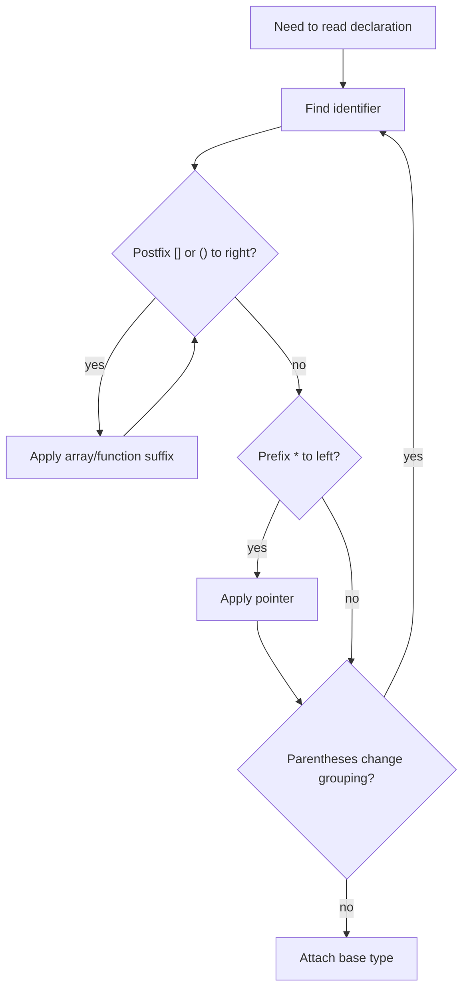

# Function Pointers and Complex Declarations

K&R's pointer chapter ends with two topics that define advanced C style: pointers to functions and complicated declarations. Function pointers let algorithms accept behavior as an argument, as in a sort routine that can compare strings lexicographically or numerically. Complex declarations arise because C declaration syntax mirrors expression syntax; this is elegant for simple cases and difficult for nested arrays, pointers, and functions.

The practical goal is not to write unreadable declarations. It is to understand the ones that appear in libraries, callbacks, signal handlers, sorting routines, and system interfaces. K&R's advice is still sound: build complex types in small steps, often with `typedef`, and verify declarations by reading from the identifier outward.

## Definitions

A function pointer stores the address of a function with a compatible type:

```c
int (*comp)(const void *, const void *);
```

Read it from the name: `comp` is a pointer to a function taking two `const void *` arguments and returning `int`.

The parentheses are essential. Without them:

```c
int *comp(const void *, const void *);
```

declares `comp` as a function returning `int *`, not as a pointer to a function.

Function names convert to pointers to functions in most expression contexts, so both forms are commonly equivalent:

```c
comp = strcmp_like;
comp = &strcmp_like;
```

Calling through a function pointer can be written as:

```c
(*comp)(a, b)
```

or, in modern style:

```c
comp(a, b)
```

K&R uses the explicit `(*comp)` form because it mirrors the declaration.

Complex declarators combine:

- `*` for pointer
- `[]` for array
- `()` for function

Postfix `[]` and `()` bind more tightly than prefix `*`, so parentheses are used to override grouping. For example:

```c
int *f();      /* function returning pointer to int */
int (*pf)();   /* pointer to function returning int */
```

`typedef` can name a complex type:

```c
typedef int (*Compare)(const void *, const void *);
Compare comp;
```

## Key results

Function pointers separate policy from mechanism. K&R's `qsort` does not need to know whether two lines are compared as strings, numbers, folded case, or directory-order fields. It only needs a comparison function that returns negative, zero, or positive.

`void *` makes generic object pointers possible. A generic sorter can move pointers or objects without knowing their concrete type, but the comparison function must cast back to the correct type before dereferencing. Function pointer casts should be treated carefully; incompatible function pointer calls are undefined behavior in modern C.

Declaration syntax follows use. If `(*pf)(x)` is an `int`, then `pf` is a pointer to function returning `int`. If `*daytab[13]` is an `int`, then `daytab` is an array of 13 pointers to `int`. If `(*daytab)[13]` is an array of 13 `int`, then `daytab` is a pointer to such an array.

Recursive-descent parsing is a natural way to decode declarations. K&R's `dcl` program uses a grammar: a declarator is optional stars followed by a direct declarator, and a direct declarator is a name, a parenthesized declarator, a function suffix, or an array suffix. This is both a lesson in C declarations and a lesson in parsing.

Use `typedef` for clarity, not to hide pointer semantics accidentally. A type name such as `Compare` improves readability. A type name such as `String` for `char *` can be convenient, but may obscure which variables are pointers and which objects are mutable.

## Visual



| Declaration | Reading | Different from |
|---|---|---|
| `int *f(void);` | function returning pointer to `int` | `int (*f)(void)` |
| `int (*f)(void);` | pointer to function returning `int` | `int *f(void)` |
| `int *a[10];` | array of 10 pointers to `int` | `int (*a)[10]` |
| `int (*a)[10];` | pointer to array of 10 `int` | `int *a[10]` |
| `char **argv;` | pointer to pointer to `char` | `char *argv[]` as parameter equivalent |
| `void (*signal(int, void (*)(int)))(int);` | function returning previous signal handler | best read with typedefs |

## Worked example 1: Sorting numbers with a comparison callback

Problem: sort pointers to strings as numbers rather than lexicographically. Compare `"10"` and `"2"`.

Method:

1. Lexicographic comparison checks characters:

   - First character of `"10"` is `'1'`.
   - First character of `"2"` is `'2'`.
   - Since `'1' < '2'`, lexicographic order says `"10"` comes before `"2"`.

2. Numeric comparison converts leading numeric values:

   $$\begin{aligned}
   atof("10") &= 10.0 \\
   atof("2") &= 2.0
   \end{aligned}$$

3. Numeric comparison function:

   ```c
   int numcmp(const char *s1, const char *s2)
   {
       double v1 = atof(s1);
       double v2 = atof(s2);
       if (v1 < v2)
           return -1;
       if (v1 > v2)
           return 1;
       return 0;
   }
   ```

4. Since `10.0 > 2.0`, `numcmp("10", "2")` returns positive.

Checked answer: lexicographic order is `"10"`, `"2"`; numeric order is `"2"`, `"10"`. Passing `numcmp` as a function pointer changes the sort policy without changing the sorting algorithm.

## Worked example 2: Reading `int (*daytab)[13]`

Problem: explain why `int (*daytab)[13]` is a pointer to an array, while `int *daytab[13]` is an array of pointers.

Method:

1. Start with:

   ```c
   int (*daytab)[13];
   ```

2. Find identifier `daytab`.
3. Parentheses force `*daytab` to group first: `daytab` is a pointer.
4. To the right of the parenthesized group is `[13]`: the pointed-to object is an array of 13.
5. Base type is `int`.

Checked reading: `daytab` is a pointer to an array of 13 `int`.

Now compare:

1. Declaration:

   ```c
   int *daytab[13];
   ```

2. `[]` binds before `*`, so `daytab[13]` groups first.
3. `daytab` is an array of 13.
4. The `*` says each element is a pointer.
5. Base type is `int`.

Checked reading: `daytab` is an array of 13 pointers to `int`.

## Code

```c
#include <stdio.h>
#include <stdlib.h>

typedef int (*Compare)(const void *, const void *);

static int intcmp(const void *left, const void *right)
{
    const int *a = left;
    const int *b = right;

    if (*a < *b)
        return -1;
    if (*a > *b)
        return 1;
    return 0;
}

int main(void)
{
    int v[] = { 30, 4, 11, 4, 19 };
    size_t n = sizeof v / sizeof v[0];
    Compare cmp = intcmp;

    qsort(v, n, sizeof v[0], cmp);

    for (size_t i = 0; i < n; ++i)
        printf("%d%c", v[i], i + 1 == n ? '\n' : ' ');

    return 0;
}
```

## Common pitfalls

- Dropping parentheses in function pointer declarations. `int (*pf)(void)` and `int *pf(void)` are entirely different.
- Casting function pointers to incompatible types and then calling through them. Generic object pointers and function pointers are different categories.
- Using `void *` without casting back to the correct pointed-to type before dereferencing.
- Hiding too much behind `typedef`, especially pointer types whose mutability matters.
- Assuming array declarators and pointer declarators are interchangeable outside parameter lists.
- Reading declarations strictly left to right. Start at the identifier and account for precedence.
- Writing callback signatures that do not exactly match the library function's expected type.

## Connections

- [Pointers, Addresses, and Arrays](/cs/programming/c/pointers-addresses-arrays)
- [Strings, Pointer Arrays, and Command-Line Arguments](/cs/programming/c/strings-pointer-arrays-command-line)
- [Preprocessor and Separate Compilation](/cs/programming/c/preprocessor-separate-compilation)
- [Standard Library Reference](/cs/programming/c/standard-library-reference)
- [Modern C Considerations](/cs/programming/c/modern-c-considerations)
