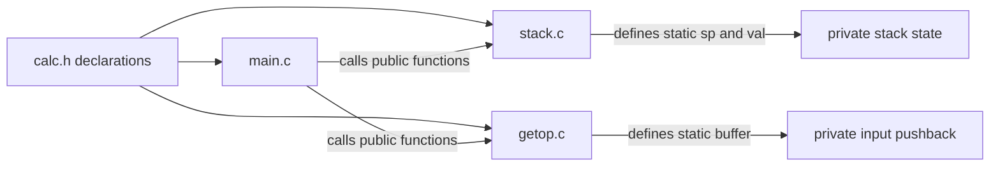

# Functions and Program Structure

Functions are the main unit of decomposition in C. K&R uses functions not only to avoid repetition, but to make data flow explicit: pass values in, return a result, and keep private details inside the function or source file. Chapter 4 develops this into a model for multi-file programs with prototypes, external variables, scope rules, headers, static storage, initialization, recursion, and preprocessor support.


*Figure: C remains the reference language for low-level memory, pointers, and Unix interfaces. Image: [Wikimedia Commons](https://commons.wikimedia.org/wiki/File:C_Programming_Language.svg), ElodinKaldwin, public domain text logo.*

This is also where ANSI C differs visibly from earlier C. Function prototypes let the compiler check argument counts and types. Old-style function definitions remain historically important, but K&R's second edition strongly prefers prototypes because they catch mistakes at compile time.

## Definitions

A function prototype declares a function's return type and parameter types:

```c
int power(int base, int n);
double atof(const char s[]);
void push(double f);
```

A function definition provides the body:

```c
int power(int base, int n)
{
    int p;

    for (p = 1; n > 0; --n)
        p *= base;

    return p;
}
```

Arguments are passed by value. The parameter `n` above is a local copy, so decrementing it does not change the caller's variable. A function returning no useful value is declared `void`; a function taking no arguments is declared with `void` in the parameter list, as in `int main(void)`.

Scope is the region of program text where a name can be used. Automatic variables declared inside a function or block have block scope and automatic storage duration. External variables are defined outside functions and have static storage duration. A declaration with `extern` tells the compiler about an object defined elsewhere:

```c
extern int lineno;
```

`static` has two common meanings. Applied to an external variable or function, it gives internal linkage, hiding the name within one source file. Applied to a local variable, it gives static storage duration while preserving block scope:

```c
static int calls;
```

Recursion means a function calls itself directly or indirectly. Each call receives fresh automatic variables, while static and external variables are shared across calls.

## Key results

The best default is to communicate through parameters and return values. K&R shows a version of a longest-line program rewritten with external variables, but notes that the original parameter-passing version is more general and easier to modify. External variables are sometimes useful for shared state inside a module, but broad global visibility makes data connections non-obvious.

Headers are contracts between translation units. A header should contain declarations shared by multiple `.c` files: function prototypes, external declarations, type definitions, and constants. Exactly one source file should define each external object. Multiple definitions of the same external object are a linkage error or, in older environments, a source of confusing behavior.

Static internal linkage is C's simple module boundary. If a helper function is only used in one source file, declare it `static`. This prevents name collisions and tells readers that the helper is not part of the module's public interface.

Initialization depends on storage duration. External and static objects default to zero. Automatic objects do not; if they lack an initializer, reading them before assignment is undefined behavior. This one rule explains a large class of C bugs.

Recursion is often clearer for recursive data or divide-and-conquer algorithms. K&R uses recursive `printd` and quicksort to show the idea. Recursion is not automatically faster and may not save storage, but it can match the problem structure closely.

A well-structured C program has two interfaces: the interface visible to other source files, and the private interface inside one source file. K&R's calculator example separates stack operations, input operations, and the main evaluator. The public functions need prototypes in a shared header. The private arrays and helper functions should stay in the implementation file, often marked `static`. This keeps the linker namespace small and makes accidental coupling less likely.

The distinction between declaration and definition is more than vocabulary. A function prototype declares how a function may be called. A function definition supplies code. An external variable declaration with `extern` announces an object defined elsewhere. An external variable definition actually allocates storage. Header files should normally contain declarations; source files should contain definitions. If that rule is followed, each translation unit receives the same type information, and the linker sees exactly one storage definition for each external object.

K&R's treatment of recursion also prepares for structures and trees. Recursive calls are not magic: every call has its own parameters and automatic variables, and all calls share external or static objects. That means a recursive function should avoid unnecessary shared mutable state. Passing the current node, current index, or current range as an argument usually makes the function easier to reason about and safer to reuse.

Function return values are part of the interface and should be chosen deliberately. A predicate can return `int` with zero for false and nonzero for true. A converter can return a status while writing the converted value through a pointer argument, as K&R's `getint` later does. A command-style function can return `void` only when there is genuinely no useful result or failure status for the caller to inspect.

## Visual



| Storage class or location | Scope | Lifetime | Typical K&R use |
|---|---|---|---|
| Automatic local | block | entry to block until exit | loop variables, temporaries |
| Static local | block | whole program execution | private remembered state |
| External | file after declaration, or other files via `extern` | whole execution | shared module state |
| External `static` | rest of source file | whole execution | private file-level state |
| Function parameter | function body | function call | input values, output pointers |

## Worked example 1: Call by value in `power`

Problem: evaluate `power(2, 4)` using K&R's version that decrements the parameter `n`, and show that the caller's variable is unchanged.

Method:

```c
int power(int base, int n)
{
    int p;
    for (p = 1; n > 0; --n)
        p *= base;
    return p;
}
```

Suppose the caller has:

```c
int k = 4;
int ans = power(2, k);
```

1. At the call, `base` receives `2` and local `n` receives a copy of `k`, so `n = 4`.
2. Initialize `p = 1`.
3. Iteration 1: `n = 4`, set `p = 1 * 2 = 2`, then `--n` gives `3`.
4. Iteration 2: `n = 3`, set `p = 2 * 2 = 4`, then `n = 2`.
5. Iteration 3: `n = 2`, set `p = 4 * 2 = 8`, then `n = 1`.
6. Iteration 4: `n = 1`, set `p = 8 * 2 = 16`, then `n = 0`.
7. Test fails and return `16`.

Checked answer: `ans` is `16`, and caller variable `k` is still `4` because only the parameter copy was decremented.

## Worked example 2: Recursive decimal printing

Problem: print `1234` without storing the digits in an array, using K&R's recursive idea.

Method:

```c
void printd(int n)
{
    if (n < 0) {
        putchar('-');
        n = -n;
    }
    if (n / 10)
        printd(n / 10);
    putchar(n % 10 + '0');
}
```

Trace:

1. `printd(1234)` sees `1234 / 10 = 123`, so it calls `printd(123)`.
2. `printd(123)` calls `printd(12)`.
3. `printd(12)` calls `printd(1)`.
4. `printd(1)` does not recurse because `1 / 10 = 0`; it prints `'1'`.
5. Return to `printd(12)`, print `12 % 10 + '0'`, which is `'2'`.
6. Return to `printd(123)`, print `'3'`.
7. Return to `printd(1234)`, print `'4'`.

Checked answer: output is `1234`. The call stack delays printing the low-order digits until higher-order digits have been printed.

## Code

```c
#include <stdio.h>

static int max_seen;

static int max(int a, int b)
{
    return a > b ? a : b;
}

int update_max(int value)
{
    max_seen = max(max_seen, value);
    return max_seen;
}

int factorial(int n)
{
    if (n < 0)
        return 0;
    if (n == 0)
        return 1;
    return n * factorial(n - 1);
}

int main(void)
{
    printf("max: %d\n", update_max(7));
    printf("max: %d\n", update_max(3));
    printf("5! = %d\n", factorial(5));
    return 0;
}
```

## Common pitfalls

- Declaring a function with empty parentheses in old style, such as `int f();`, when you mean "no arguments." Write `int f(void);`.
- Defining an external variable in a header. Put declarations in headers and exactly one definition in a source file.
- Using external variables to avoid thinking about interfaces. This makes functions less reusable and harder to test.
- Forgetting `static` on file-private helper functions, causing avoidable global name exposure.
- Reading an uninitialized automatic variable. Unlike static storage, automatic storage is not zeroed by default.
- Assuming recursion has shared locals. Each recursive call has its own automatic variables.
- Negating the most negative integer in recursive printing or `itoa`; on two's-complement machines it cannot be represented as positive `int`.

## Connections

- [Tutorial Introduction](/cs/programming/c/tutorial-introduction)
- [Preprocessor and Separate Compilation](/cs/programming/c/preprocessor-separate-compilation)
- [Pointers, Addresses, and Arrays](/cs/programming/c/pointers-addresses-arrays)
- [Function Pointers and Complex Declarations](/cs/programming/c/function-pointers-complex-declarations)
- [Modern C Considerations](/cs/programming/c/modern-c-considerations)
