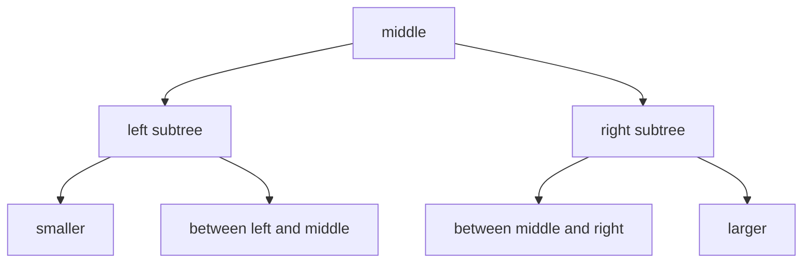

# Linked Structures and Hash Tables

After introducing structures, K&R immediately applies them to dynamic data structures: binary trees for word counting and linked lists for hash-table buckets. These examples matter because they combine several earlier ideas at once: pointers to structures, recursion, dynamic allocation, string copying, arrays of pointers, and careful ownership of memory.

The examples are small versions of real compiler and text-processing machinery. A tree stores sorted words with counts. A hash table stores names and replacement text for something like a macro processor. Both show why structures are more than grouped variables: a structure can point to another structure of the same type, creating a graph of objects.

## Definitions

A self-referential structure contains pointers to the same structure type:

```c
struct tnode {
    char *word;
    int count;
    struct tnode *left;
    struct tnode *right;
};
```

The members `left` and `right` are pointers, not embedded `struct tnode` objects. Directly embedding the same structure type would require infinite size; pointers have fixed size.

A binary search tree stores smaller keys in the left subtree and larger keys in the right subtree. A null pointer marks an empty subtree.

A linked list node similarly points to the next node:

```c
struct nlist {
    struct nlist *next;
    char *name;
    char *defn;
};
```

A hash table uses an array of pointers to linked lists:

```c
#define HASHSIZE 101
static struct nlist *hashtab[HASHSIZE];
```

A hash function maps a string to an array index:

```c
unsigned hash(char *s)
{
    unsigned hashval;

    for (hashval = 0; *s != '\0'; ++s)
        hashval = *s + 31 * hashval;
    return hashval % HASHSIZE;
}
```

Dynamic allocation uses `malloc` to obtain storage and `free` to release it. The allocated object must be large enough for the structure, commonly expressed as `sizeof *p` or `sizeof(struct tnode)`.

## Key results

Recursive definitions often lead to recursive functions. K&R's `addtree` inserts by comparing a new word with the current node, then recursively descending left or right. `treeprint` performs an in-order traversal: print left subtree, current node, right subtree. That traversal prints keys in sorted order.

Allocation and initialization must be paired. After `malloc` returns a node, the code must initialize every member before later logic depends on it. In K&R's tree insertion, a new node receives a copied word, count `1`, and null left and right children.

String ownership is explicit. If a tree node stores a word read into a temporary buffer, it must duplicate the string into storage that outlives the buffer. K&R's `strdup` does this with `malloc(strlen(s) + 1)` and `strcpy`.

Hash tables trade ordered traversal for faster lookup. A good hash function distributes names across buckets. Each bucket is a linked list for collisions. Lookup walks only one bucket rather than all entries, though worst-case behavior is still linear if many names collide.

Insertion at the front of a linked list is simple and common. K&R's `install` inserts a new hash entry by setting `np->next` to the current bucket head, then setting the bucket head to `np`.

The tree and hash-table examples also introduce ownership boundaries. A node owns the storage for its copied word, and the table owns the nodes chained from each bucket. That means an insertion routine is responsible not only for linking pointers but also for deciding what happens on allocation failure and replacement. If a replacement definition is installed, the old definition string must be freed after the program has decided it no longer needs that storage. If allocating the new definition fails, the table should not be left in a half-updated state.

Traversal order is part of the data structure contract. A binary search tree can produce sorted output without a separate sorting step because the left/current/right traversal matches the ordering invariant. A hash table cannot do that naturally; it is optimized for lookup by hash value, not ordered enumeration. When choosing between the two, the question is not only "which is faster?" but also "what operations must be natural?" K&R's word counter wants sorted output, so a tree is appropriate. A macro definition table wants fast lookup by name, so a hash table is appropriate.

The examples also show why C programmers often write small allocation wrappers. A helper such as `talloc` or `xstrdup` concentrates allocation details, casts in older code, and initialization decisions in one place. That does not remove the need to check failures, but it prevents every caller from repeating the same `malloc(sizeof(struct tnode))` expression and forgetting one member.

Deletion is harder than insertion in both trees and hash lists because it must preserve the surrounding links. Removing a hash-table node requires remembering the previous node or using a pointer-to-pointer technique. Removing a tree node may require replacing it with a child or successor. K&R leaves some of this as exercises, which is appropriate: deletion tests whether the representation invariant is really understood.

## Visual



```text
Hash table buckets:

hashtab[0] -> NULL
hashtab[1] -> [name="IN"] -> [name="OUT"] -> NULL
hashtab[2] -> NULL
hashtab[3] -> [name="MAXLINE"] -> NULL
```

| Structure | Shape | Lookup method | Sorted output? | Typical cost |
|---|---|---|---|---|
| Binary search tree | nodes with left/right | compare and descend | yes, in-order | balanced: logarithmic; bad order: linear |
| Linked list | next pointers | scan sequentially | insertion order unless sorted | linear in list length |
| Hash table | array of lists | hash then scan bucket | no | expected near constant with good distribution |
| Array of pointers | contiguous pointer table | index directly | by index only | constant for index |

## Worked example 1: Inserting words into a binary search tree

Problem: insert the words `dog`, `cat`, `eel`, and `dog` into an initially empty word-count tree.

Method:

1. Insert `dog`.
   The root is `NULL`, so allocate a node:

   ```text
   dog:1
   ```

2. Insert `cat`.
   Compare `cat` with `dog`. Since `cat < dog`, go left. Left child is `NULL`, so allocate:

   ```text
       dog:1
      /
   cat:1
   ```

3. Insert `eel`.
   Compare `eel` with `dog`. Since `eel > dog`, go right. Right child is `NULL`, so allocate:

   ```text
       dog:1
      /     \
   cat:1   eel:1
   ```

4. Insert `dog` again.
   Compare `dog` with root `dog`. Equal, so increment the count:

   ```text
       dog:2
      /     \
   cat:1   eel:1
   ```

Checked answer: the root word is `dog` with count `2`; `cat` is left child; `eel` is right child. In-order traversal prints `cat`, `dog`, `eel`.

## Worked example 2: Installing and replacing a hash-table definition

Problem: process two definitions:

```text
IN -> 1
IN -> inside
```

Show what happens in K&R's `install` logic.

Method:

1. First `install("IN", "1")` calls `lookup("IN")`.
2. The bucket for `hash("IN")` is empty, so lookup returns `NULL`.
3. Allocate a new node.
4. Duplicate the name `"IN"` into `np->name`.
5. Compute the bucket index and insert at the front:

   ```text
   hashtab[h] -> [name="IN", defn unfilled] -> old_head
   ```

6. Duplicate `"1"` into `np->defn`.

Now install replacement:

1. `install("IN", "inside")` calls `lookup("IN")`.
2. Lookup scans bucket `h` and finds the node whose name compares equal.
3. No new node is allocated.
4. Free the old `defn`.
5. Duplicate `"inside"` and assign it to `np->defn`.

Checked answer: the table still has one node for `IN`, and its replacement text is now `"inside"`. Replacing the definition avoids duplicate names in the same table.

## Code

```c
#include <stdio.h>
#include <stdlib.h>
#include <string.h>

struct tnode {
    char *word;
    int count;
    struct tnode *left;
    struct tnode *right;
};

static char *xstrdup(const char *s)
{
    char *p = malloc(strlen(s) + 1);
    if (p != NULL)
        strcpy(p, s);
    return p;
}

static struct tnode *talloc(const char *word)
{
    struct tnode *p = malloc(sizeof *p);
    if (p == NULL)
        return NULL;

    p->word = xstrdup(word);
    p->count = 1;
    p->left = NULL;
    p->right = NULL;
    return p;
}

struct tnode *addtree(struct tnode *p, const char *word)
{
    int cond;

    if (p == NULL)
        return talloc(word);

    cond = strcmp(word, p->word);
    if (cond == 0)
        ++p->count;
    else if (cond < 0)
        p->left = addtree(p->left, word);
    else
        p->right = addtree(p->right, word);

    return p;
}

void treeprint(const struct tnode *p)
{
    if (p != NULL) {
        treeprint(p->left);
        printf("%4d %s\n", p->count, p->word);
        treeprint(p->right);
    }
}

int main(void)
{
    struct tnode *root = NULL;
    const char *words[] = { "dog", "cat", "eel", "dog" };
    size_t n = sizeof words / sizeof words[0];

    for (size_t i = 0; i < n; ++i)
        root = addtree(root, words[i]);

    treeprint(root);
    return 0;
}
```

## Common pitfalls

- Defining a self-referential structure with an embedded member of its own type instead of a pointer.
- Forgetting to initialize child pointers to `NULL` after allocation.
- Storing pointers to temporary input buffers instead of duplicating strings.
- Ignoring `malloc` failure. K&R sometimes omits checks for brevity, but production code should not.
- Creating an unbalanced binary search tree by inserting already sorted input and assuming it remains fast.
- Losing the rest of a linked list when inserting because `next` was not set before replacing the head pointer.
- Freeing a node's memory while some table or tree still contains a pointer to it.

## Connections

- [Structures, Typedef, Unions, and Bit Fields](/cs/programming/c/structures-typedef-unions-bitfields)
- [Pointers, Addresses, and Arrays](/cs/programming/c/pointers-addresses-arrays)
- [Storage Allocation](/cs/programming/c/storage-allocation)
- [Preprocessor and Separate Compilation](/cs/programming/c/preprocessor-separate-compilation)
- [Standard Library Reference](/cs/programming/c/standard-library-reference)
