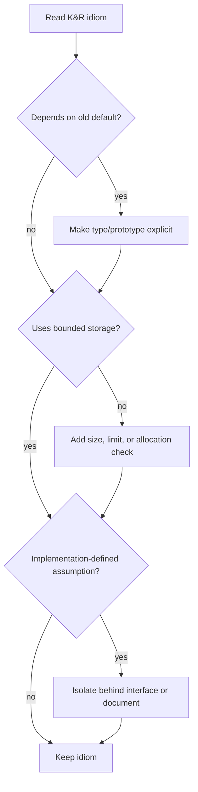

# Modern C Considerations

K&R second edition teaches ANSI C as it existed around the C89/C90 standard, and it deliberately preserves older idioms so readers can understand existing C and UNIX code. Modern C compilers still recognize much of this style, but the surrounding expectations have changed: prototypes are mandatory in practice, `main` should have a declared return type, unsafe library functions are avoided, warnings are treated seriously, and later standards added features that improve clarity and diagnostics.


*Figure: C remains the reference language for low-level memory, pointers, and Unix interfaces. Image: [Wikimedia Commons](https://commons.wikimedia.org/wiki/File:C_Programming_Language.svg), ElodinKaldwin, public domain text logo.*

The goal is not to rewrite K&R out of history. The goal is to read K&R fluently while writing C that survives modern compilers, larger codebases, security reviews, and different platforms. The original idioms remain valuable when they express data flow clearly; they need adjustment when they rely on old defaults, unchecked buffers, or implementation-specific behavior.

## Definitions

"K&R style" can mean several different things:

- The concise programming style shown in the book: filters, small functions, pointer traversal, and direct use of the standard library.
- Old-style function definitions, where parameter names appear in the parentheses and types follow before the function body.
- Pre-ANSI assumptions such as implicit `int` and undeclared functions.

Modern C generally means using a later ISO C mode such as C99, C11, C17, or C23 with prototypes, standard headers, explicit return types, and compiler diagnostics enabled.

Old-style function definition:

```c
power(base, n)
int base, n;
{
    /* ... */
}
```

Modern prototype-style definition:

```c
int power(int base, int n)
{
    /* ... */
}
```

Unsafe input example:

```c
gets(buf);      /* removed from modern C */
```

Bounded replacement:

```c
fgets(buf, sizeof buf, stdin);
```

Modern code also uses `const` more aggressively, especially for string literals and input buffers:

```c
size_t strlen(const char *s);
```

## Key results

Do not rely on implicit declarations. K&R explains the historical default of `int`, but modern compilers diagnose calls without visible prototypes. Missing prototypes are especially dangerous for functions returning pointers or taking floating-point arguments.

Prefer explicit `int main(void)` or `int main(int argc, char *argv[])`. Falling off the end of `main` is defined as returning zero in modern C, but an explicit `return 0;` remains clear and portable to older habits.

Treat string literals as read-only. K&R sometimes uses `char *` for string literals because the type rules of the time allowed it. Modern code should use `const char *` and copy into an array when modification is needed.

Avoid unbounded input and output. `gets` is removed. `scanf("%s", buf)` is unsafe without a field width. `sprintf` can overflow its destination; use `snprintf` when available and check truncation when it matters.

Use `size_t` for object sizes and array lengths. K&R often uses `int` for simplicity. Modern library functions use `size_t`, and large objects can exceed `int`.

Know where C leaves behavior undefined, unspecified, or implementation-defined. K&R warns about order of evaluation, pointer comparisons, signedness of `char`, integer sizes, and system dependencies. Modern compilers optimize assuming undefined behavior does not happen, so old "works on my machine" code can fail under optimization.

Preserve K&R's best idioms: small functions, simple loops, explicit data representation, clear ownership, and checking error returns. Modern C improves the contracts around those idioms; it does not replace the need for them.

Compiler settings are part of modern C practice. A student can read K&R with a permissive compiler mode, but production code should be built with warnings that catch missing prototypes, suspicious conversions, format mismatches, unreachable code, and use of uninitialized variables. The exact flags vary by compiler, but the engineering habit is stable: make the compiler a partner in enforcing the contracts that K&R describes informally.

Another modern adjustment is to separate ISO C from platform APIs. K&R's UNIX chapter is historically central and still useful, but functions such as `open`, `read`, `write`, `lseek`, and `sbrk` are not ISO C. Code intended to be portable across hosted C implementations should isolate those calls behind small wrappers or choose standard library facilities where possible. Code intended for POSIX systems can use them directly, but should include the right POSIX headers and types.

Modern C also makes const-correctness more important than the book's examples suggest. A function that only reads a string should accept `const char *`. A function that only reads an array should accept a pointer to const element type and a length. This does not make C memory-safe, but it communicates intent to readers and lets the compiler reject accidental writes through read-only interfaces.

Later C standards added conveniences, but they did not change the core discipline. Declarations can appear closer to first use, `//` comments are common, `stdint.h` provides fixed-width integer names, and newer standards refine library and language rules. These features are useful, but a programmer who understands K&R's storage, pointer, and expression model can adopt them without losing sight of what the machine-level operations mean.

## Visual

| K&R-era habit | Modern recommendation | Reason |
|---|---|---|
| `main()` | `int main(void)` | explicit return and parameter contract |
| `int f();` for unknown args | `int f(int x);` or `int f(void);` | enables argument checking |
| `char *s = "text";` | `const char *s = "text";` | string literal should not be modified |
| `gets(buf)` | `fgets(buf, sizeof buf, stdin)` | bounded input |
| `sprintf(buf, ...)` | `snprintf(buf, sizeof buf, ...)` | bounded output |
| `int n = strlen(s);` | `size_t n = strlen(s);` | library size type |
| `malloc(n * sizeof(Type))` | `malloc(n * sizeof *p)` | follows pointer type automatically |
| unchecked `malloc` | test for `NULL` | allocation can fail |
| dense side effects | split statements | avoids undefined behavior and improves review |



## Worked example 1: Modernizing an old function declaration

Problem: convert an old-style `power` function and call site to prototype style.

Old form:

```c
int power();

power(base, n)
int base, n;
{
    int p;
    for (p = 1; n > 0; --n)
        p *= base;
    return p;
}
```

Method:

1. Put parameter types in the prototype:

   ```c
   int power(int base, int n);
   ```

2. Put parameter types in the definition:

   ```c
   int power(int base, int n)
   ```

3. Keep the body unchanged, because call-by-value behavior is the same.
4. Compile-time checking now catches calls such as:

   ```c
   power("2", 4)
   ```

   because `"2"` has type `char *`, not `int`.

Checked answer: the modern function computes the same values, for example `power(2, 5) = 32`, while giving the compiler enough information to diagnose incorrect calls.

## Worked example 2: Replacing unsafe string input

Problem: read a name into `char name[8]` from input `Sunjunior\n` without overflowing the buffer.

Unsafe method:

```c
gets(name);
```

This has no size argument. The input needs 10 bytes including newline and terminator handling, while the array has only 8. Overflow is possible.

Modern bounded method:

```c
fgets(name, sizeof name, stdin);
```

Step-by-step:

1. `sizeof name` is `8`.
2. `fgets` reads at most `7` characters plus `'\0'`.
3. It stores:

   ```text
   S u n j u n i \0
   ```

4. The remaining input is:

   ```text
   o r \n
   ```

5. Because no newline appears in `name`, the program can detect that the line was truncated and drain the remainder if necessary.

Checked answer: the buffer is not overflowed. The program receives the first chunk `"Sunjuni"` and can explicitly handle the too-long line.

## Code

```c
#include <stdio.h>
#include <stdlib.h>
#include <string.h>

char *read_line(FILE *fp)
{
    size_t cap = 128;
    size_t len = 0;
    char *buf = malloc(cap);
    int c;

    if (buf == NULL)
        return NULL;

    while ((c = getc(fp)) != EOF) {
        if (len + 1 >= cap) {
            size_t newcap = cap * 2;
            char *tmp = realloc(buf, newcap);
            if (tmp == NULL) {
                free(buf);
                return NULL;
            }
            buf = tmp;
            cap = newcap;
        }

        buf[len++] = (char)c;
        if (c == '\n')
            break;
    }

    if (len == 0 && c == EOF) {
        free(buf);
        return NULL;
    }

    buf[len] = '\0';
    return buf;
}

int main(void)
{
    char *line = read_line(stdin);

    if (line != NULL) {
        fputs(line, stdout);
        free(line);
    }

    return 0;
}
```

## Common pitfalls

- Treating K&R's historical examples as permission to use implicit `int` or undeclared functions today.
- Modifying string literals because older code assigned them to `char *`.
- Replacing every pointer loop with indexing or every macro with a function mechanically. Preserve the idiom when it is correct and clear.
- Assuming modern compilers are forgiving of undefined behavior. Optimizers may remove or transform code based on the assumption that undefined behavior never occurs.
- Using `int` for sizes returned by `strlen` or `sizeof`.
- Ignoring compiler warnings. Many warnings point to real C type or lifetime bugs.
- Assuming POSIX functions are ISO C. `read`, `write`, `open`, and `lseek` are system interfaces, not standard C library calls.

## Connections

- [Tutorial Introduction](/cs/programming/c/tutorial-introduction)
- [Types, Operators, and Expressions](/cs/programming/c/types-operators-expressions)
- [Preprocessor and Separate Compilation](/cs/programming/c/preprocessor-separate-compilation)
- [Standard Library Reference](/cs/programming/c/standard-library-reference)
- [Unix System Interface](/cs/programming/c/unix-system-interface)
