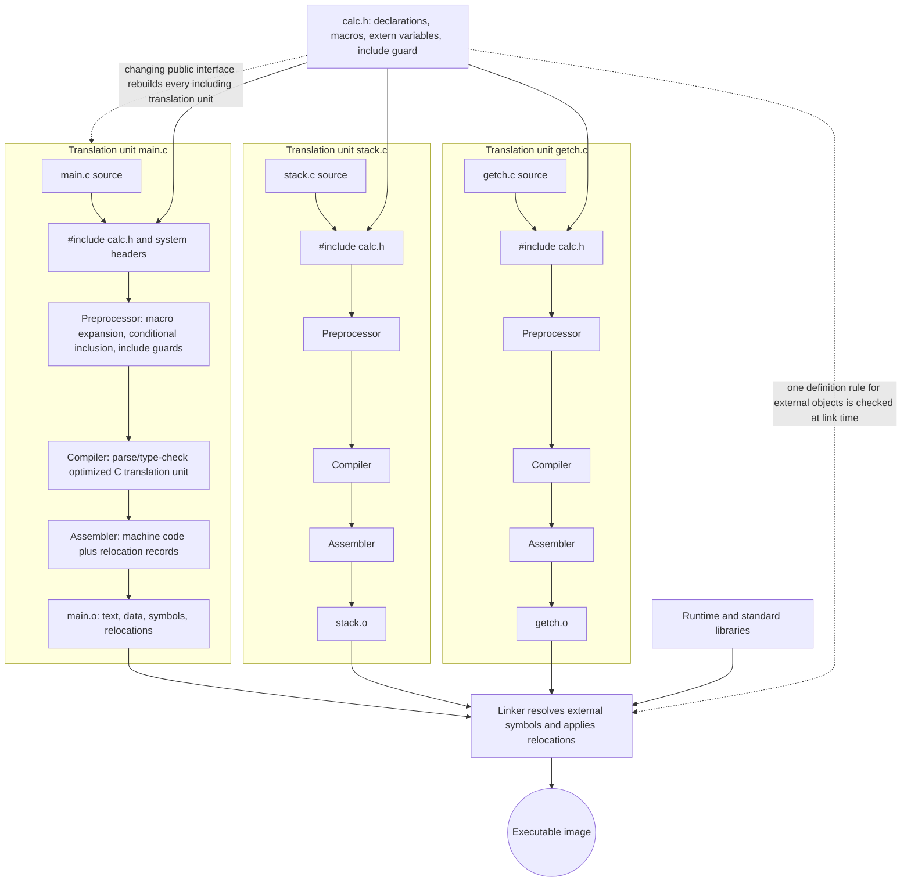

# Preprocessor and Separate Compilation

K&R treats the preprocessor as part of practical C programming, even though it runs before the compiler proper. It is how C programs include shared declarations, define symbolic constants, write small macro abstractions, and compile different code for different environments. Used carefully, it keeps multi-file programs consistent. Used carelessly, it bypasses the type system and creates bugs that are hard to see in the source text.


*Figure: C remains the reference language for low-level memory, pointers, and Unix interfaces. Image: [Wikimedia Commons](https://commons.wikimedia.org/wiki/File:C_Programming_Language.svg), ElodinKaldwin, public domain text logo.*

Separate compilation is the other half of the same story. Real C programs are not one long file. They are sets of source files connected by headers, external definitions, and linker-visible names. The discipline is simple but strict: headers declare shared interfaces, source files define storage and behavior, and file-private details are hidden with `static`.

## Definitions

The preprocessor handles directives beginning with `#`. The most common are:

```c
#include <stdio.h>
#include "calc.h"

#define MAXLINE 1000
#define forever for (;;)

#if !defined(CALC_H)
#define CALC_H
/* declarations */
#endif
```

`#include <name>` searches implementation-defined system include locations. `#include "name"` usually searches near the including source file first, then falls back to the system search path. Headers are used for declarations, macros, constants, and type definitions shared by more than one translation unit.

Object-like macros replace a token with replacement text:

```c
#define BUFSIZE 100
```

Function-like macros accept arguments:

```c
#define max(A, B) ((A) > (B) ? (A) : (B))
```

The preprocessor expands tokens, not strings or parts of identifiers. If `YES` is defined, it is not expanded inside `"YES"` or inside the longer identifier `YESMAN`.

Conditional inclusion lets the preprocessor include or skip source text:

```c
#ifndef HDR
#define HDR
/* header body */
#endif
```

The `#` operator in a macro turns an argument into a string literal. The `##` operator pastes tokens together. These are powerful but should be kept local and obvious.

Separate compilation divides a program into translation units. A declaration says what a name means. A definition allocates storage or provides a function body. For an external variable, there should be one definition:

```c
/* state.c */
int lineno = 0;
```

and declarations elsewhere:

```c
/* state.h */
extern int lineno;
```

## Key results

Headers prevent interface drift. If several source files need the same function prototype or external declaration, putting it in one header ensures the compiler sees the same contract everywhere. K&R's calculator example uses a header to share stack operations and input helpers among source files.

Include guards prevent multiple inclusion problems. A header may include another header, and the same header can be reached through several paths. A guard such as `#ifndef CALC_H` ensures the body is processed only once in a translation unit. Modern code often uses `#pragma once`, but the guarded macro pattern is the portable K&R-compatible idea.

Macros are textual substitution, not functions. They can avoid function-call overhead and can be generic over types, but their arguments may be evaluated more than once. Parenthesize macro parameters and the whole replacement expression unless the macro intentionally produces a statement or declaration.

The preprocessor has no understanding of C types. A macro can create invalid C, evaluate side effects twice, capture a local name, or change meaning through precedence. A function is usually safer when type checking or single evaluation matters.

`static` file scope supports separate compilation by hiding names from the linker. A source file can expose only its intended public functions while keeping helper functions and state private. This is the closest C gets to a built-in module system in K&R's style.

A useful header is small, stable, and free of surprising storage allocation. It should tell users what they may call and what types they may use. It should not silently define objects that every including file will instantiate. K&R's examples use headers to share declarations; that habit scales to libraries where changing a header forces many source files to recompile, so unnecessary includes have real build cost.

Conditional compilation should isolate real variation, not create many hidden programs in one file. It is appropriate for include guards, feature availability, debug-only checks, and small platform differences. It becomes dangerous when large unrelated branches are selected by macros because only one branch may be regularly compiled. The preprocessor can hide syntax errors from the compiler until a rarely used configuration is enabled.

Macros that behave like statements need special care. A multi-statement macro should usually be wrapped in `do { ... } while (0)` so it behaves like one statement in an `if` or `else` context. K&R's macro chapter focuses on expression macros, but the same principle applies: macro expansion must preserve the syntax expected by the caller.

The preprocessor is also the first phase where portability decisions appear. A header may choose one system header on BSD-like systems and another on System V-like systems, or it may expose a common typedef that hides those differences from the rest of the program. K&R's conditional-inclusion examples are small, but the same method is used in real libraries to keep platform-specific details from leaking everywhere.

At the same time, preprocessing can make debugging harder because the compiler sees the expanded program, not the source as written. When a macro produces confusing errors, inspect the expansion or temporarily replace the macro with a function. Good macro design minimizes the distance between the source expression and the expanded meaning.

Separate compilation also affects build dependencies. If a public header changes, every source file that includes it may need recompilation. If a private helper in one `.c` file changes, only that file should need recompilation. Keeping interfaces narrow is therefore both a design improvement and a practical build-time improvement.

## Visual



This C build diagram expands separate compilation into preprocessing, compiling, assembling, object files, symbol resolution, relocation, libraries, and the final executable. The shared header feeds each translation unit with declarations and macros, but each `.c` file is still compiled independently after preprocessing. The dotted edges call out the two architectural contracts that matter most in C projects: public header changes trigger recompilation, and external definitions must resolve exactly at link time.

| Tool | Operates on | Knows C types? | Typical failure |
|---|---|---|---|
| Preprocessor | tokens and source text | no | bad macro expansion |
| Compiler | one translation unit after preprocessing | yes | type or syntax error |
| Linker | object files and external symbols | limited | missing or duplicate definition |
| Header | declarations and macro definitions | seen by compiler after inclusion | inconsistent guard or definitions in header |

## Worked example 1: Why macro parentheses matter

Problem: compare a bad square macro with a parenthesized one for the expression `square(a + 1)` when `a = 3`.

Method:

1. Bad macro:

   ```c
   #define square(x) x * x
   ```

2. Expansion:

   ```c
   square(a + 1)
   ```

   becomes

   ```c
   a + 1 * a + 1
   ```

3. Apply precedence:

$$
\begin{aligned}
   a + 1 * a + 1 &= 3 + 1 * 3 + 1 \\
   &= 3 + 3 + 1 \\
   &= 7
   \end{aligned}
$$

4. Correct macro:

   ```c
   #define square(x) ((x) * (x))
   ```

5. Expansion:

   ```c
   ((a + 1) * (a + 1))
   ```

6. Evaluate:

$$
\begin{aligned}
   (3 + 1)(3 + 1) &= 4 \times 4 \\
   &= 16
   \end{aligned}
$$

Checked answer: the unparenthesized macro produces `7`; the parenthesized macro produces `16`.

## Worked example 2: Macro argument evaluated twice

Problem: evaluate `max(i++, j++)` with a typical macro when `i = 4` and `j = 3`.

Method:

```c
#define max(A, B) ((A) > (B) ? (A) : (B))
```

1. Expansion:

   ```c
   ((i++) > (j++) ? (i++) : (j++))
   ```

2. Compare first operands:

   - `i++` yields `4`, then `i` becomes `5`.
   - `j++` yields `3`, then `j` becomes `4`.
   - `4 > 3` is true.

3. Evaluate selected true branch:

   - `i++` yields `5`, then `i` becomes `6`.

4. The false branch `j++` is not evaluated because `?:` evaluates only the selected branch.

Checked answer: the macro result is `5`, final `i` is `6`, and final `j` is `4`. This is usually not what a caller expects from a maximum operation. A real function would evaluate each argument exactly once before the call.

## Code

```c
/* calc.h */
#ifndef CALC_H
#define CALC_H

void push(double value);
double pop(void);
int getop(char s[], int lim);

#endif
```

```c
/* stack.c */
#include <stdio.h>
#include "calc.h"

#define MAXVAL 100

static int sp = 0;
static double val[MAXVAL];

void push(double value)
{
    if (sp < MAXVAL)
        val[sp++] = value;
    else
        fprintf(stderr, "stack full\n");
}

double pop(void)
{
    if (sp > 0)
        return val[--sp];

    fprintf(stderr, "stack empty\n");
    return 0.0;
}
```

```c
/* main.c: compile with stack.c */
#include <stdio.h>
#include "calc.h"

int main(void)
{
    push(3.0);
    push(4.5);
    printf("%.1f\n", pop() + pop());
    return 0;
}
```

## Common pitfalls

- Putting definitions of external variables in headers, causing duplicate definitions when several source files include the header.
- Writing macros that evaluate arguments more than once, then calling them with `i++`, input functions, or other side effects.
- Failing to parenthesize macro parameters and the full macro expression.
- Using `#include` to share executable code casually instead of compiling source files separately.
- Forgetting that macro replacement does not occur inside string literals or inside longer identifiers.
- Omitting include guards in headers that may be included through multiple paths.
- Exposing helper functions globally when they should be `static` inside one source file.

## Connections

- [Functions and Program Structure](/cs/programming/c/functions-program-structure)
- [Types, Operators, and Expressions](/cs/programming/c/types-operators-expressions)
- [Function Pointers and Complex Declarations](/cs/programming/c/function-pointers-complex-declarations)
- [Standard Library Reference](/cs/programming/c/standard-library-reference)
- [Modern C Considerations](/cs/programming/c/modern-c-considerations)
