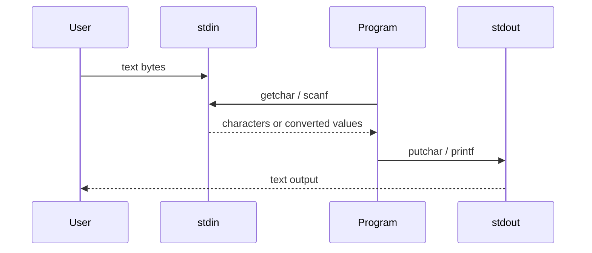

# Standard I/O and Formatted I/O

C itself does not define input and output statements. K&R therefore treats I/O as a standard-library topic: streams, `getchar`, `putchar`, `printf`, `scanf`, line input, and file access are provided by headers and functions rather than by language syntax. This division is important because portable C programs interact with their environment through library contracts.

The first I/O model is a text stream: a sequence of characters, often organized as lines ending in newline. The next layer is formatted conversion, where `printf` turns internal values into text and `scanf` turns text into internal values. These functions are powerful, but because they use variable argument lists, the compiler cannot always protect you from mismatched formats and arguments.

## Definitions

`<stdio.h>` declares standard I/O types, macros, and functions. A stream is represented by a `FILE *`. At program start, three streams are already open:

```c
stdin
stdout
stderr
```

The simplest character input function is:

```c
int getchar(void);
```

It returns the next character as an `unsigned char` converted to `int`, or `EOF` on end-of-file or error. The matching output function is:

```c
int putchar(int c);
```

Formatted output uses `printf`:

```c
int printf(const char *format, ...);
```

The format string contains ordinary characters and conversion specifications beginning with `%`. Common conversions include `%d` for signed decimal `int`, `%u` for unsigned decimal, `%x` for hexadecimal, `%c` for a character, `%s` for a string, `%f` for floating decimal, and `%%` for a literal percent sign.

Formatted input uses `scanf`:

```c
int scanf(const char *format, ...);
```

The arguments after the format must be pointers to storage where converted values are written:

```c
int n;
scanf("%d", &n);
```

For strings, an array name is already a pointer:

```c
char word[100];
scanf("%99s", word);
```

`sprintf` and `sscanf` perform formatted conversion to or from strings. Modern C also provides `snprintf`, which is safer because it takes a buffer size.

## Key results

Always store `getchar` in an `int`. `EOF` must be distinguishable from every possible character. Using `char` can break the classic loop.

Redirection and pipes make simple filters powerful. A program written with `getchar` and `putchar` can read from the keyboard, from a redirected file, or from another program without changing its source. This is a UNIX idea, but the C stream model supports the style.

`printf` trusts the format string. If the format says `%d`, the corresponding argument must be an `int`. If it says `%ld`, the argument must be a `long`. If it says `%s`, the argument must be a pointer to a null-terminated character array. A mismatch has undefined behavior.

`scanf` returns the number of successful assignments, or `EOF` if input ends before any conversion. This return value should drive input loops. Newlines are whitespace for most conversions, so `scanf` often reads across line boundaries. For robust input, K&R recommends reading a line and then parsing it with `sscanf`.

Variable-length argument functions use `<stdarg.h>`. K&R's `minprintf` example shows `va_list`, `va_start`, `va_arg`, and `va_end`. The format string is the only guide for interpreting the unnamed arguments.

## Visual



| Conversion | Expected `printf` argument | Expected `scanf` argument | Notes |
|---|---|---|---|
| `%d` | `int` | `int *` | signed decimal |
| `%ld` | `long` | `long *` | length modifier matters |
| `%u` | `unsigned int` | `unsigned int *` | unsigned decimal |
| `%x` | `unsigned int` | `unsigned int *` | hexadecimal |
| `%c` | `int` | `char *` | `scanf` does not skip whitespace for `%c` |
| `%s` | `char *` | `char *` to array | add width for input |
| `%f` | `double` | `float *` | `printf` receives promoted `double` |
| `%lf` | `double` | `double *` | important difference in `scanf` |

## Worked example 1: Reading numbers with `scanf` return values

Problem: sum input numbers from the text:

```text
1.5 2.0 x 4.0
```

using `scanf("%lf", &v)`.

Method:

1. Initialize:

   $$sum = 0.0.$$

2. First call reads `1.5`, assigns it to `v`, and returns `1`.

   $$sum = 0.0 + 1.5 = 1.5.$$

3. Second call reads `2.0`, returns `1`.

   $$sum = 1.5 + 2.0 = 3.5.$$

4. Third call sees `x`, which does not match a floating number. It returns `0`, not `EOF`, because input exists but conversion failed.

5. The loop should stop or consume the bad character.

Checked answer: the sum before the invalid token is `3.5`; the return value `0` signals a matching failure, different from end-of-file.

## Worked example 2: Formatting a string field

Problem: print the string `"hello, world"` in several fields and predict the output widths.

Method:

1. The string length is:

   $$12.$$

2. `%s` prints all characters:

   ```text
   hello, world
   ```

3. `%15s` prints in a field at least 15 wide. Since the string has 12 characters, add 3 leading spaces.

   ```text
      hello, world
   ```

4. `%.5s` prints at most 5 characters:

   ```text
   hello
   ```

5. `%-15.5s` prints at most 5 characters, left-adjusted in a 15-wide field:

   ```text
   hello          
   ```

Checked answer: width controls the minimum field size; precision controls maximum characters for strings.

## Code

```c
#include <ctype.h>
#include <stdio.h>

int main(void)
{
    int c;
    long lines = 0;
    long words = 0;
    long chars = 0;
    int inword = 0;

    while ((c = getchar()) != EOF) {
        ++chars;
        if (c == '\n')
            ++lines;

        if (isspace((unsigned char)c)) {
            inword = 0;
        } else if (!inword) {
            inword = 1;
            ++words;
        }
    }

    printf("%ld %ld %ld\n", lines, words, chars);
    return 0;
}
```

## Common pitfalls

- Passing a non-pointer to `scanf`, such as `scanf("%d", n)` instead of `scanf("%d", &n)`.
- Using `%f` with `scanf` for a `double *`; use `%lf` for `double *`.
- Calling `printf(s)` when `s` may contain `%`. Use `printf("%s", s)`.
- Omitting field widths for `%s` input, which can overflow the destination array.
- Treating `scanf` return value `0` as end-of-file. It means matching failed.
- Forgetting that most `scanf` conversions skip whitespace and may read across lines.
- Storing `getchar` in `char` instead of `int`.

## Connections

- [Tutorial Introduction](/cs/programming/c/tutorial-introduction)
- [File Access and Error Handling](/cs/programming/c/file-access-error-handling)
- [Standard Library Reference](/cs/programming/c/standard-library-reference)
- [Unix System Interface](/cs/programming/c/unix-system-interface)
- [Modern C Considerations](/cs/programming/c/modern-c-considerations)
