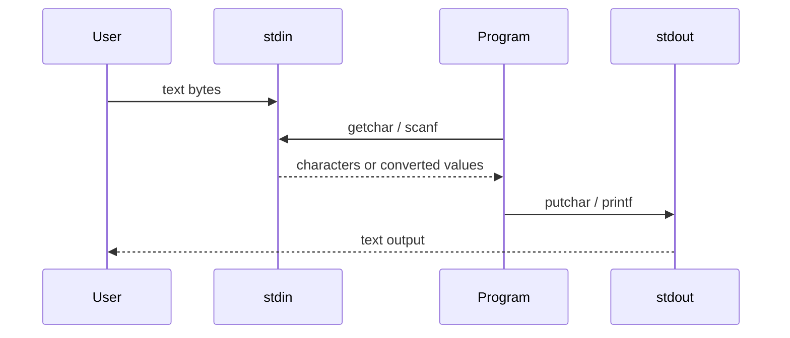

# Standard I/O and Formatted I/O

C itself does not define input and output statements. K&R therefore treats I/O as a standard-library topic: streams, `getchar`, `putchar`, `printf`, `scanf`, line input, and file access are provided by headers and functions rather than by language syntax. This division is important because portable C programs interact with their environment through library contracts.

The first I/O model is a text stream: a sequence of characters, often organized as lines ending in newline. The next layer is formatted conversion, where `printf` turns internal values into text and `scanf` turns text into internal values. These functions are powerful, but because they use variable argument lists, the compiler cannot always protect you from mismatched formats and arguments.

## Definitions

`<stdio.h>` declares standard I/O types, macros, and functions. A stream is represented by a `FILE *`. At program start, three streams are already open:

```c
stdin
stdout
stderr
```

The simplest character input function is:

```c
int getchar(void);
```

It returns the next character as an `unsigned char` converted to `int`, or `EOF` on end-of-file or error. The matching output function is:

```c
int putchar(int c);
```

Formatted output uses `printf`:

```c
int printf(const char *format, ...);
```

The format string contains ordinary characters and conversion specifications beginning with `%`. Common conversions include `%d` for signed decimal `int`, `%u` for unsigned decimal, `%x` for hexadecimal, `%c` for a character, `%s` for a string, `%f` for floating decimal, and `%%` for a literal percent sign.

Formatted input uses `scanf`:

```c
int scanf(const char *format, ...);
```

The arguments after the format must be pointers to storage where converted values are written:

```c
int n;
scanf("%d", &n);
```

For strings, an array name is already a pointer:

```c
char word[100];
scanf("%99s", word);
```

`sprintf` and `sscanf` perform formatted conversion to or from strings. Modern C also provides `snprintf`, which is safer because it takes a buffer size.

## Key results

Always store `getchar` in an `int`. `EOF` must be distinguishable from every possible character. Using `char` can break the classic loop.

Redirection and pipes make simple filters powerful. A program written with `getchar` and `putchar` can read from the keyboard, from a redirected file, or from another program without changing its source. This is a UNIX idea, but the C stream model supports the style.

`printf` trusts the format string. If the format says `%d`, the corresponding argument must be an `int`. If it says `%ld`, the argument must be a `long`. If it says `%s`, the argument must be a pointer to a null-terminated character array. A mismatch has undefined behavior.

`scanf` returns the number of successful assignments, or `EOF` if input ends before any conversion. This return value should drive input loops. Newlines are whitespace for most conversions, so `scanf` often reads across line boundaries. For robust input, K&R recommends reading a line and then parsing it with `sscanf`.

Variable-length argument functions use `<stdarg.h>`. K&R's `minprintf` example shows `va_list`, `va_start`, `va_arg`, and `va_end`. The format string is the only guide for interpreting the unnamed arguments.

The most reliable formatted-input pattern is often two-stage: read a whole line, then parse the line. This avoids the surprise that `scanf` treats newlines as whitespace for most conversions and may leave an unmatched character waiting for the next input call. A line buffer gives the program a complete record to validate, echo in an error message, or parse with multiple possible formats using `sscanf`.

Formatted output has a similar separation of concerns. A conversion specification controls representation, not computation. If a value must be rounded, clamped, converted to units, or checked for range, do that before the `printf` call. Then the format string should only decide width, precision, base, sign display, and alignment. K&R's examples are readable because the arithmetic and the formatting are close but not tangled.

Because `printf` and `scanf` are variadic, their safety depends heavily on the format string. Modern compilers can check literal format strings against arguments, but they cannot fully protect dynamically constructed formats. Treat the format string as code, not data. In particular, never pass untrusted input as the format argument; print it through `%s`.

K&R's stream examples are also a lesson in composability. A program that reads from `stdin` and writes to `stdout` can be tested with typed input, redirected files, or a pipeline. The program does not need to know which source is attached. That is why the tutorial begins with standard streams instead of named files: the simplest interface is already general enough for many command-line tools.

For formatted input, the destination object controls the pointer type. `%d` needs `int *`, `%ld` needs `long *`, `%f` needs `float *`, and `%lf` needs `double *`. This differs from `printf`, where `float` arguments are promoted to `double`. Remembering that contrast prevents one of the most common mistakes students make when moving from output to input.

Buffering is another reason to understand streams as objects. Output to a terminal may be line-buffered, output to a file may be fully buffered, and `stderr` is often unbuffered or differently buffered so diagnostics appear promptly. A program that prints a prompt without a newline may need `fflush(stdout)` before waiting for input. K&R does not dwell on buffering early, but it explains many observations students otherwise attribute to the compiler.

Finally, formatted I/O is not a parser generator. `scanf` is useful for simple, regular input, but it is awkward for diagnostics, optional fields, and recovery after errors. K&R's more careful examples often use character input or line input when the program needs control. That is a good rule: use `scanf` when the input format is genuinely simple; otherwise read text explicitly and parse it in smaller steps.

This is why many robust C tools use a layered pattern: get a line, validate the line, convert fields, then act. Each layer has one failure mode to report.

## Visual



| Conversion | Expected `printf` argument | Expected `scanf` argument | Notes |
|---|---|---|---|
| `%d` | `int` | `int *` | signed decimal |
| `%ld` | `long` | `long *` | length modifier matters |
| `%u` | `unsigned int` | `unsigned int *` | unsigned decimal |
| `%x` | `unsigned int` | `unsigned int *` | hexadecimal |
| `%c` | `int` | `char *` | `scanf` does not skip whitespace for `%c` |
| `%s` | `char *` | `char *` to array | add width for input |
| `%f` | `double` | `float *` | `printf` receives promoted `double` |
| `%lf` | `double` | `double *` | important difference in `scanf` |

## Worked example 1: Reading numbers with `scanf` return values

Problem: sum input numbers from the text:

```text
1.5 2.0 x 4.0
```

using `scanf("%lf", &v)`.

Method:

1. Initialize:

   $$sum = 0.0.$$

2. First call reads `1.5`, assigns it to `v`, and returns `1`.

   $$sum = 0.0 + 1.5 = 1.5.$$

3. Second call reads `2.0`, returns `1`.

   $$sum = 1.5 + 2.0 = 3.5.$$

4. Third call sees `x`, which does not match a floating number. It returns `0`, not `EOF`, because input exists but conversion failed.

5. The loop should stop or consume the bad character.

Checked answer: the sum before the invalid token is `3.5`; the return value `0` signals a matching failure, different from end-of-file.

## Worked example 2: Formatting a string field

Problem: print the string `"hello, world"` in several fields and predict the output widths.

Method:

1. The string length is:

   $$12.$$

2. `%s` prints all characters:

   ```text
   hello, world
   ```

3. `%15s` prints in a field at least 15 wide. Since the string has 12 characters, add 3 leading spaces.

   ```text
      hello, world
   ```

4. `%.5s` prints at most 5 characters:

   ```text
   hello
   ```

5. `%-15.5s` prints at most 5 characters, left-adjusted in a 15-wide field:

   ```text
   hello          
   ```

Checked answer: width controls the minimum field size; precision controls maximum characters for strings.

## Code

```c
#include <ctype.h>
#include <stdio.h>

int main(void)
{
    int c;
    long lines = 0;
    long words = 0;
    long chars = 0;
    int inword = 0;

    while ((c = getchar()) != EOF) {
        ++chars;
        if (c == '\n')
            ++lines;

        if (isspace((unsigned char)c)) {
            inword = 0;
        } else if (!inword) {
            inword = 1;
            ++words;
        }
    }

    printf("%ld %ld %ld\n", lines, words, chars);
    return 0;
}
```

## Common pitfalls

- Passing a non-pointer to `scanf`, such as `scanf("%d", n)` instead of `scanf("%d", &n)`.
- Using `%f` with `scanf` for a `double *`; use `%lf` for `double *`.
- Calling `printf(s)` when `s` may contain `%`. Use `printf("%s", s)`.
- Omitting field widths for `%s` input, which can overflow the destination array.
- Treating `scanf` return value `0` as end-of-file. It means matching failed.
- Forgetting that most `scanf` conversions skip whitespace and may read across lines.
- Storing `getchar` in `char` instead of `int`.

## Connections

- [Tutorial Introduction](/cs/programming/c/tutorial-introduction)
- [File Access and Error Handling](/cs/programming/c/file-access-error-handling)
- [Standard Library Reference](/cs/programming/c/standard-library-reference)
- [Unix System Interface](/cs/programming/c/unix-system-interface)
- [Modern C Considerations](/cs/programming/c/modern-c-considerations)
