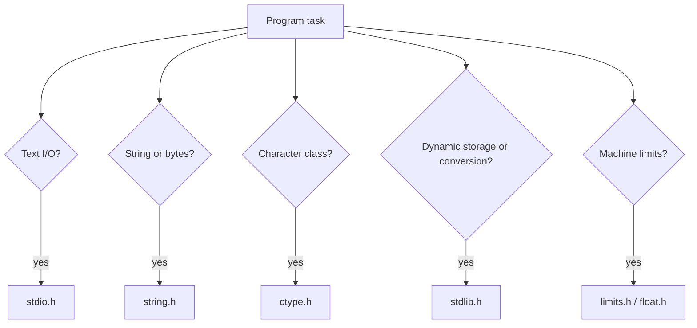

# Standard Library Reference

Appendix B of K&R summarizes the ANSI C standard library: headers, types, macros, and functions that a conforming hosted implementation supplies. The library is not the core language, but it is the practical environment in which most C programs live. K&R focuses on the facilities a working programmer reaches for: I/O, character classification, strings, math, utilities, diagnostics, variable arguments, non-local jumps, signals, time, and implementation limits.


*Figure: C remains the reference language for low-level memory, pointers, and Unix interfaces. Image: [Wikimedia Commons](https://commons.wikimedia.org/wiki/File:C_Programming_Language.svg), ElodinKaldwin, public domain text logo.*

This page is a selected reference rather than a replacement for a standard manual. It follows K&R's scope while emphasizing safe usage patterns, common return values, and how the headers relate to earlier chapters.

## Definitions

Standard headers declare library interfaces. Common K&R-relevant headers include:

```c
#include <stdio.h>
#include <ctype.h>
#include <string.h>
#include <stdlib.h>
#include <math.h>
#include <assert.h>
#include <stdarg.h>
#include <limits.h>
#include <float.h>
#include <time.h>
```

`<stdio.h>` declares stream I/O: `FILE`, `fopen`, `fclose`, `getc`, `putc`, `printf`, `scanf`, `fgets`, `fputs`, `fread`, `fwrite`, `fseek`, `ftell`, `fflush`, `feof`, `ferror`, and the streams `stdin`, `stdout`, `stderr`.

`<ctype.h>` declares character classification and conversion macros/functions such as `isdigit`, `isspace`, `isalpha`, `isalnum`, `isupper`, `islower`, `toupper`, and `tolower`.

`<string.h>` declares byte and string operations: `strlen`, `strcpy`, `strncpy`, `strcat`, `strcmp`, `strncmp`, `strchr`, `strstr`, `memcpy`, `memmove`, `memcmp`, and `memset`.

`<stdlib.h>` declares conversion, allocation, process control, and searching/sorting functions: `strtol`, `strtod`, `malloc`, `calloc`, `realloc`, `free`, `exit`, `atexit`, `system`, `getenv`, `bsearch`, `qsort`, `abs`, and `div`.

`<stdarg.h>` declares `va_list`, `va_start`, `va_arg`, and `va_end` for variable-length argument lists.

`<limits.h>` and `<float.h>` expose implementation limits such as `INT_MAX`, `CHAR_BIT`, `ULONG_MAX`, `DBL_DIG`, and `FLT_EPSILON`.

## Key results

Include the right header before using a library function. In pre-ANSI C, undeclared functions could be assumed to return `int`; modern C rejects or warns about this because it breaks type checking, especially for pointers and floating-point return values.

Many `<ctype.h>` facilities require arguments representable as `unsigned char` or equal to `EOF`. When passing a possibly negative `char`, cast first:

```c
isdigit((unsigned char)c)
```

String functions require valid null-terminated strings unless they are byte functions such as `memcpy`. `strlen` scans until `'\0'`; it cannot know the array's allocated size. `strncpy` is often misunderstood because it may fail to append `'\0'` when the source is too long.

`memcpy` and `memmove` differ on overlap. Use `memmove` when source and destination ranges may overlap. K&R's emphasis on pointer manipulation makes this distinction important in real buffers.

`strtol` is usually better than `atoi`. It reports where conversion stopped and can signal range errors through `errno`. K&R mentions `atoi` early for simplicity, but Appendix B includes the more robust conversion family.

`qsort` and `bsearch` use function pointers. The comparison function must implement a consistent ordering and must cast `const void *` arguments back to the element type, not to the wrong pointer level.

`assert` is for programmer assumptions, not user input validation. Defining `NDEBUG` before including `<assert.h>` disables assertions, so program logic must not depend on side effects inside `assert`.

The library also establishes common type vocabulary. `size_t` is the unsigned type used for object sizes and counts returned by `sizeof`. `NULL` is the null pointer constant macro. `EOF` is a negative integer value used by input functions to report end-of-file or error. `FILE` is an opaque stream-control type. Using these names instead of homemade substitutes makes code match the contracts expected by the library.

K&R's Appendix B is intentionally selective, but its organization is still a useful map. Headers are grouped by service, and each function's return value is part of the interface. C library calls rarely throw exceptions or terminate automatically on ordinary failure. They return a status, a pointer, a count, or a sentinel; the caller is responsible for checking it. That style is consistent from `fopen` returning `NULL` to `malloc` returning `NULL` to `strtol` reporting the end of conversion through a pointer argument.

Several library functions return pointers to static internal storage, especially older time functions such as `ctime` and `asctime`. Such results may be overwritten by the next call. K&R mentions this pattern in the appendix, and it is a reminder that a returned pointer does not automatically mean the caller owns storage or may keep it indefinitely unchanged.

The standard library also separates text functions from byte functions. String functions stop at `'\0'`; memory functions accept an explicit byte count and may process zero bytes, embedded zero bytes, or object representations. Choosing between `strcmp` and `memcmp`, or between `strcpy` and `memcpy`, is therefore a statement about the data representation. K&R's string examples use terminators; binary file and allocator code more often need explicit sizes.

Mathematical functions in `<math.h>` generally operate on floating values and may require linking the math library on some systems. They are part of the standard library summary because C keeps even common operations such as square root outside the core language.

Limit headers are not trivia. They are how a program asks the implementation what it can represent. Using `INT_MAX`, `CHAR_BIT`, or `DBL_DIG` is better than assuming the machine has the same widths and precision as the development computer.

## Visual

| Header | Main purpose | Representative functions/macros | Closely related page |
|---|---|---|---|
| `<stdio.h>` | streams and formatted I/O | `printf`, `scanf`, `fopen`, `fgets` | [Standard I/O](/cs/programming/c/standard-io-formatted-io) |
| `<ctype.h>` | character classes | `isdigit`, `isspace`, `tolower` | [Types and Expressions](/cs/programming/c/types-operators-expressions) |
| `<string.h>` | strings and memory bytes | `strlen`, `strcmp`, `memmove` | [Strings and Pointer Arrays](/cs/programming/c/strings-pointer-arrays-command-line) |
| `<stdlib.h>` | allocation, conversion, utilities | `malloc`, `strtol`, `qsort` | [Storage Allocation](/cs/programming/c/storage-allocation) |
| `<stdarg.h>` | variable arguments | `va_start`, `va_arg`, `va_end` | [Standard I/O](/cs/programming/c/standard-io-formatted-io) |
| `<limits.h>` | integer limits | `INT_MAX`, `CHAR_BIT` | [Modern C](/cs/programming/c/modern-c-considerations) |
| `<float.h>` | floating limits | `DBL_DIG`, `FLT_EPSILON` | [Types and Expressions](/cs/programming/c/types-operators-expressions) |
| `<time.h>` | date and time | `time`, `clock`, `strftime` | this page |



## Worked example 1: Robust integer conversion with `strtol`

Problem: parse `"123abc"` as a decimal long and detect the unconverted suffix.

Method:

```c
char *end;
long n = strtol("123abc", &end, 10);
```

1. `strtol` skips leading whitespace; none is present.
2. It reads decimal digits:

   $$1,\ 2,\ 3.$$

3. It stops at `a`, the first non-digit for base 10.
4. It stores a pointer to that `a` in `end`.
5. Numeric value:

$$
\begin{aligned}
   n &= 1 \times 100 + 2 \times 10 + 3 \\
   &= 123
   \end{aligned}
$$

6. Since `*end == 'a'`, the whole string was not consumed.

Checked answer: `n` is `123`, and `end` points to `"abc"`. This is more informative than `atoi`, which would return `123` without showing where conversion stopped.

## Worked example 2: Writing a `qsort` comparison correctly

Problem: sort `int v[] = { 4, 1, 10 }` with `qsort`.

Method:

1. `qsort` passes pointers to array elements as `const void *`.
2. The comparison function casts each argument to `const int *`:

   ```c
   const int *ia = a;
   const int *ib = b;
   ```

3. Compare pointed-to values:

   - Compare `4` and `1`: return positive because `4 > 1`.
   - Compare `1` and `10`: return negative because `1 < 10`.
   - Compare `4` and `10`: return negative because `4 < 10`.

4. The sorted order is:

   $$1,\ 4,\ 10.$$

Checked answer: the output array is `{1, 4, 10}`. Do not subtract blindly with `return *ia - *ib;` for general integers, because subtraction can overflow.

## Code

```c
#include <ctype.h>
#include <stdio.h>
#include <stdlib.h>
#include <string.h>

static int intcmp(const void *a, const void *b)
{
    const int *ia = a;
    const int *ib = b;

    return (*ia > *ib) - (*ia < *ib);
}

int main(int argc, char *argv[])
{
    int values[32];
    int n = 0;

    for (int i = 1; i < argc && n < 32; ++i) {
        char *end;
        long v = strtol(argv[i], &end, 10);

        if (*end == '\0')
            values[n++] = (int)v;
    }

    qsort(values, (size_t)n, sizeof values[0], intcmp);

    for (int i = 0; i < n; ++i)
        printf("%d%c", values[i], i + 1 == n ? '\n' : ' ');

    return 0;
}
```

## Common pitfalls

- Calling library functions without including their headers.
- Passing negative `char` values directly to `<ctype.h>` functions.
- Assuming `strncpy` always null-terminates the destination.
- Using `memcpy` on overlapping memory ranges; use `memmove`.
- Ignoring `ferror` or return values after I/O loops.
- Using `atoi` when invalid input and overflow must be diagnosed.
- Writing `assert(i++)` or any assertion with required side effects, because `NDEBUG` can remove it.
- Returning subtraction from a comparison function where overflow is possible.

## Connections

- [Standard I/O and Formatted I/O](/cs/programming/c/standard-io-formatted-io)
- [File Access and Error Handling](/cs/programming/c/file-access-error-handling)
- [Function Pointers and Complex Declarations](/cs/programming/c/function-pointers-complex-declarations)
- [Storage Allocation](/cs/programming/c/storage-allocation)
- [Modern C Considerations](/cs/programming/c/modern-c-considerations)
