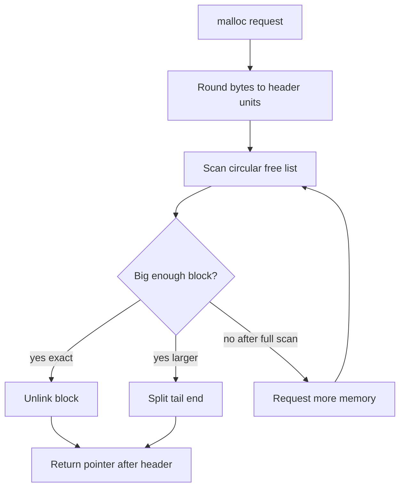

# Storage Allocation

K&R approaches storage allocation twice. First, Chapter 5 presents a tiny stack-like allocator over a fixed character array to explain pointer arithmetic. Later, Chapter 8 presents a more realistic free-list allocator resembling `malloc` and `free`. Together they show the same lesson at two scales: dynamic storage is just memory plus metadata, but getting alignment, lifetime, and ownership right is difficult.

This topic connects pointers, arrays, structures, unions, typedefs, and the UNIX system interface. It is also where undefined behavior becomes especially concrete. Writing one byte past an allocated block can corrupt allocator metadata. Freeing the same block twice can damage the free list. Returning an incorrectly aligned pointer can make otherwise valid object access fail.

## Definitions

Static and automatic storage are created by declarations:

```c
static int count;
int local;
```

Dynamic storage is requested at run time:

```c
void *malloc(size_t size);
void free(void *p);
```

K&R's simple allocator uses a fixed buffer:

```c
#define ALLOCSIZE 10000

static char allocbuf[ALLOCSIZE];
static char *allocp = allocbuf;
```

`alloc(n)` returns the current pointer if there is room, then advances `allocp`. `afree(p)` resets `allocp` to a previous pointer if `p` lies inside the buffer. This only works as a last-in, first-out allocator.

The general allocator in Chapter 8 stores a header before each block:

```c
typedef long Align;

union header {
    struct {
        union header *ptr;
        unsigned size;
    } s;
    Align x;
};

typedef union header Header;
```

The union forces alignment suitable for `Align`. Each free block contains a size and a pointer to the next free block. The free list is circular, and blocks are coalesced when adjacent.

The standard library versions are declared in `<stdlib.h>`:

```c
void *malloc(size_t size);
void *calloc(size_t nobj, size_t size);
void *realloc(void *p, size_t size);
void free(void *p);
```

## Key results

Pointer arithmetic is scaled by the pointed-to type. In the simple allocator, `allocp += n` advances by `n` characters because `allocp` is a `char *`. In the general allocator, `p + 1` advances by one `Header`, skipping allocator metadata and pointing at usable storage.

The null pointer signals allocation failure. A caller must check `malloc` before dereferencing the returned pointer. K&R examples sometimes omit checks to keep the example short; robust code cannot.

Alignment matters. A block returned by `malloc` must be usable for any object type whose size fits. K&R's allocator uses a union containing a restrictive type to force header alignment. Modern allocators have more precise alignment rules, but the problem is the same.

Free-list allocators store metadata next to user storage. That is efficient, but it means buffer overflows can destroy the allocator's internal structure. C does not protect the metadata.

Only free what was allocated, and free it once. Passing a pointer not returned by `malloc`, `calloc`, or `realloc`, or passing a pointer into the middle of an allocated object, has undefined behavior. `free(NULL)` is explicitly harmless.

`realloc` has a failure rule that protects the original block. If `realloc(p, new_size)` returns `NULL`, the original `p` is still allocated and must still be freed. Assigning directly to `p` loses the only pointer on failure.

K&R's simple allocator is intentionally limited, but it teaches a powerful idea: an allocator is a policy for carving a larger region into smaller regions. The fixed-buffer allocator has a stack policy. The Chapter 8 allocator has a first-fit free-list policy. Other allocators use segregated lists, arenas, reference counts, garbage collection, or region lifetime rules. C does not prescribe the policy; it only exposes enough pointer and object machinery to implement one.

The allocator boundary is also a type boundary. `malloc` returns `void *`, which says the storage has no declared effective type yet. The storage becomes suitable for an object when the program stores an object there or treats it through an appropriate lvalue under the language rules. K&R's examples focus on practical allocation, but modern C programmers also need to be aware that aliasing and effective type rules can affect optimized code.

Lifetime is separate from reachability. A pointer can still contain an address after `free`, but the object lifetime has ended. Conversely, allocated storage can remain live even if all pointers to it are lost, producing a memory leak. Correct C programs track both questions: who owns this allocation, and when is the last valid use?

A practical allocation convention is to make the allocating function and freeing responsibility obvious at the same abstraction level. If `read_line` returns a newly allocated string, its documentation or name should make clear that the caller must call `free`. If a table takes ownership of inserted strings, the table's destroy function should free them. K&R's small examples often end before cleanup is shown, but long-running programs and libraries need explicit release paths.

The size expression should follow the object being allocated. `malloc(n * sizeof *p)` remains correct if `p`'s pointed-to type changes, while `malloc(n * sizeof(struct old_name))` can silently become stale after a refactor. This idiom is not unique to modern C; it is a direct continuation of K&R's preference for declarations and expressions that agree.

A custom allocator should normally be hidden behind a small interface. Callers should not know where headers are stored, how the free list is ordered, or how blocks are coalesced. K&R exposes those details for teaching, but production code keeps allocator metadata private because one incorrect external write can invalidate the whole heap.

## Visual

```text
Allocated block as seen by allocator:

        Header                 user bytes
   +-------------+--------------------------------+
   | size, next  | object storage returned to p   |
   +-------------+--------------------------------+
                 ^
                 |
              p returned by malloc

free(p) computes the header address by stepping back one Header.
```



| Function | Initializes storage? | Can resize? | Failure result | Ownership rule |
|---|---|---|---|---|
| `malloc(size)` | no | no | `NULL` | caller owns returned block |
| `calloc(n, size)` | zero bytes | no | `NULL` | caller owns returned block |
| `realloc(p, size)` | new part uninitialized | yes | `NULL`, old block unchanged | returned pointer replaces old on success |
| `free(p)` | not applicable | releases | none | `p` must be allocated pointer or `NULL` |

## Worked example 1: Simple stack allocator pointer movement

Problem: a simple allocator has `ALLOCSIZE = 10`, `allocp = allocbuf`, and receives `alloc(4)`, then `alloc(3)`, then `afree(first)`. Track the offsets.

Method:

1. Initial state:

   $$allocp - allocbuf = 0.$$

2. First request `alloc(4)`:

   - Space left is `10 - 0 = 10`, enough.
   - Return old pointer at offset `0`.
   - Advance `allocp` by `4`.

   $$allocp - allocbuf = 4.$$

3. Second request `alloc(3)`:

   - Space left is `10 - 4 = 6`, enough.
   - Return pointer at offset `4`.
   - Advance by `3`.

   $$allocp - allocbuf = 7.$$

4. `afree(first)` where `first` is offset `0`:

   - Pointer lies inside the buffer.
   - Set `allocp = first`.

   $$allocp - allocbuf = 0.$$

Checked answer: both allocations are effectively discarded because this allocator can only free in stack order. If the second block were still in use, freeing the first would make future allocations overwrite it.

## Worked example 2: Rounding bytes to header units

Problem: suppose `sizeof(Header) = 16` and a user requests `20` bytes. Compute the number of header units needed in K&R's allocator formula:

```c
nunits = (nbytes + sizeof(Header) - 1) / sizeof(Header) + 1;
```

Method:

1. Substitute:

   $$nbytes = 20,\quad H = 16.$$

2. Round user bytes up to header units:

$$
\begin{aligned}
   (20 + 16 - 1) / 16 &= 35 / 16 \\
   &= 2
   \end{aligned}
$$

   Integer division gives `2`, enough for 32 user bytes.

3. Add one unit for the allocator header:

   $$nunits = 2 + 1 = 3.$$

4. Total block size:

   $$3 \times 16 = 48\text{ bytes}.$$

Checked answer: the allocator needs 3 header-sized units: one for metadata and two for user storage.

## Code

```c
#include <stdio.h>
#include <stdlib.h>
#include <string.h>

char *duplicate_line(const char *s)
{
    size_t n = strlen(s) + 1;
    char *p = malloc(n);

    if (p == NULL)
        return NULL;

    memcpy(p, s, n);
    return p;
}

int main(void)
{
    char *line = duplicate_line("allocated text");

    if (line == NULL) {
        fprintf(stderr, "out of memory\n");
        return 1;
    }

    puts(line);
    free(line);
    return 0;
}
```

## Common pitfalls

- Not checking `malloc` or `calloc` for `NULL`.
- Writing beyond the requested size, corrupting neighboring objects or allocator metadata.
- Freeing the same pointer twice.
- Freeing a pointer that points into the middle of an allocated block.
- Using a pointer after `free`; the pointer value remains, but the object lifetime has ended.
- Losing the original pointer with `p = realloc(p, n)` when `realloc` fails.
- Assuming `calloc` initializes pointers or floating values by semantic zero on every possible machine; it zeroes bytes, though this works for the common hosted targets students usually use.
- Implementing custom allocators without handling alignment.

## Connections

- [Pointers, Addresses, and Arrays](/cs/programming/c/pointers-addresses-arrays)
- [Linked Structures and Hash Tables](/cs/programming/c/linked-structures-hash-tables)
- [Unix System Interface](/cs/programming/c/unix-system-interface)
- [Standard Library Reference](/cs/programming/c/standard-library-reference)
- [Modern C Considerations](/cs/programming/c/modern-c-considerations)
