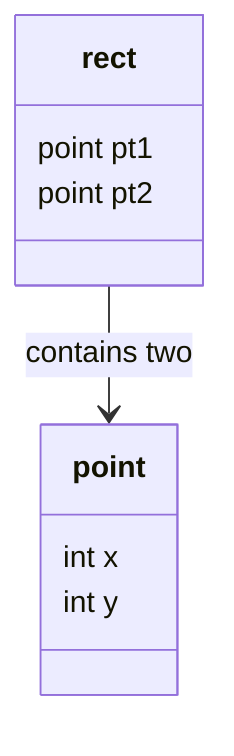

# Structures, Typedef, Unions, and Bit Fields

Structures let C group related objects under one name while keeping each member's type. K&R introduces them with geometric points and rectangles, then moves toward tables, trees, unions, typedefs, and bit fields. The theme is organization: once a program has more than a few related variables, a structure gives those variables a shape that functions can pass, return, store in arrays, and access through pointers.

ANSI C made structure assignment, passing, and returning precise, so structures are not merely layout tricks. They are real values, although they cannot be compared directly. This page covers the core structure operations plus `typedef`, `union`, and bit-field notation; linked structures and hash tables are handled separately.

## Definitions

A structure declaration names a collection of members:

```c
struct point {
    int x;
    int y;
};
```

The tag `point` names this structure type. A variable of that type is declared with:

```c
struct point pt;
```

Members are selected with the `.` operator:

```c
pt.x = 10;
pt.y = 20;
```

A pointer to a structure uses `->` as shorthand for dereference then member selection:

```c
struct point *pp = &pt;
printf("%d\n", pp->x);
```

Nested structures are ordinary members:

```c
struct rect {
    struct point pt1;
    struct point pt2;
};
```

Structures may be initialized with brace-enclosed initializers:

```c
struct point origin = { 0, 0 };
```

`typedef` creates a new name for an existing type:

```c
typedef struct point Point;
typedef int (*Compare)(const void *, const void *);
```

A union stores different member types in the same storage area, one active interpretation at a time:

```c
union value {
    int ival;
    float fval;
    char *sval;
};
```

A bit field declares a small integer field of a specified bit width inside a structure:

```c
struct flags {
    unsigned int is_keyword : 1;
    unsigned int is_extern  : 1;
    unsigned int is_static  : 1;
};
```

## Key results

The legal structure operations are assignment, copying, taking an address, accessing members, passing to functions, and returning from functions. Structures cannot be compared with `==` or `!=` as whole values. Compare individual members when equality matters.

Passing a structure by value copies it. This is simple and often fine for small structures such as points. For large structures, pass a pointer, preferably a pointer to `const` when the function should not modify the object.

The `.` and `->` operators bind tightly and associate left to right. Parentheses matter when dereferencing a structure pointer manually: `(*pp).x` is correct, while `*pp.x` is parsed as `*(pp.x)` and is wrong when `pp` is a pointer.

`typedef` does not create a new distinct type. It creates another name for an existing type. This improves readability for complicated declarations and supports portability names such as `size_t`, but it does not add runtime checking.

Unions require an external tag or convention to know which member is valid. Reading a different member from the one most recently written is implementation-defined or undefined depending on the case and standard details. K&R's symbol-table example pairs a union with a separate `utype`.

Bit fields are convenient for named flags, but almost every layout detail is implementation-defined: allocation order, alignment, whether fields cross storage units, and exact container choices. Use them for compact in-memory flags when portability of binary layout is not required; use masks when layout must be controlled.

Structure layout is visible enough to matter, but not fully portable at the byte level. The compiler may insert padding between members so that each member is properly aligned. It may also add padding at the end so arrays of the structure keep every element aligned. This means `sizeof(struct point)` is not always the sum of the member sizes in more complicated structures. Code should use `sizeof object` rather than hand-computed sizes.

Designing a structure is also an interface decision. If functions accept and return a small structure such as `struct point`, callers can treat it as a value. If functions accept a pointer to a structure, callers must think about mutation, null pointers, and object lifetime. K&R presents all three approaches: separate scalar arguments, structure values, and structure pointers. The right choice depends on size, clarity, and whether the function needs to modify the original object.

Unions and bit fields are closest to representation-level programming. They are useful in compilers, interpreters, packed state, and low-level interfaces, but they should not be used simply to avoid writing separate fields. If the program needs a variant value, pair the union with an explicit tag. If the program needs named boolean flags and does not expose the binary layout, bit fields can be clear. If the program needs portable serialized bits, masks and explicit shifts are usually better.

Arrays of structures and pointers to structures usually appear together. An array gives compact storage and direct indexing; a pointer lets functions operate on one element without copying it. K&R's table examples use both patterns. The expression `tab[i].name` selects from an array element, while `np->name` selects through a pointer as a linked list is traversed.

## Visual



| Feature | Stores | Access | Best use | Warning |
|---|---|---|---|---|
| `struct` | all members, separate storage | `.` and `->` | records, grouped data | no whole-structure comparison |
| `typedef` | no storage by itself | type name | readability, portability | does not make a new runtime type |
| `union` | one member's storage, shared | `.` and `->` | variant values, low-level overlays | caller must track active member |
| bit field | named bits in storage unit | `.` and `->` | compact flags | layout is implementation-defined |
| enum masks | integer flags | bitwise ops | portable flag logic | less self-documenting than fields |

## Worked example 1: Canonicalizing a rectangle

Problem: a rectangle is represented by two points, but the input points may arrive in any diagonal order. Given `pt1 = (8, 2)` and `pt2 = (3, 9)`, produce a canonical rectangle whose first point has the smaller coordinates and whose second point has the larger coordinates.

Method:

1. Define the structure:

   ```c
   struct point { int x; int y; };
   struct rect { struct point pt1; struct point pt2; };
   ```

2. Compute minimum coordinates:

$$
\begin{aligned}
   x_{\min} &= \min(8, 3) = 3 \\
   y_{\min} &= \min(2, 9) = 2
   \end{aligned}
$$

3. Compute maximum coordinates:

$$
\begin{aligned}
   x_{\max} &= \max(8, 3) = 8 \\
   y_{\max} &= \max(2, 9) = 9
   \end{aligned}
$$

4. Assign:

   ```c
   out.pt1.x = 3;
   out.pt1.y = 2;
   out.pt2.x = 8;
   out.pt2.y = 9;
   ```

Checked answer: the canonical rectangle is `(3, 2)` to `(8, 9)`. A point `(8, 9)` lies on the excluded top/right boundary if using K&R's half-open convention, while `(7, 8)` is inside.

## Worked example 2: Replacing masks with bit fields

Problem: represent three flags: keyword, external, and static. Turn on external and static, then test whether both are on.

Method with masks:

```c
enum { KEYWORD = 01, EXTERNAL = 02, STATIC = 04 };
unsigned flags = 0;
flags |= EXTERNAL | STATIC;
```

1. Start:

   $$flags = 0.$$

2. Turn on two bits:

   $$flags = 02 | 04 = 06.$$

3. Test:

   $$flags \& (02 | 04) = 06.$$

   Both requested bits are present.

Method with bit fields:

```c
struct flags f = { 0, 0, 0 };
f.is_extern = 1;
f.is_static = 1;
```

1. `f.is_extern` is set to `1`.
2. `f.is_static` is set to `1`.
3. Test:

   ```c
   if (f.is_extern && f.is_static)
       puts("both");
   ```

Checked answer: both representations record the same logical state. Masks give explicit numeric control; bit fields give named member access.

## Code

```c
#include <stdio.h>

typedef struct {
    int x;
    int y;
} Point;

typedef struct {
    Point pt1;
    Point pt2;
} Rect;

static int min_int(int a, int b) { return a < b ? a : b; }
static int max_int(int a, int b) { return a > b ? a : b; }

Rect canonrect(Rect r)
{
    Rect out;

    out.pt1.x = min_int(r.pt1.x, r.pt2.x);
    out.pt1.y = min_int(r.pt1.y, r.pt2.y);
    out.pt2.x = max_int(r.pt1.x, r.pt2.x);
    out.pt2.y = max_int(r.pt1.y, r.pt2.y);
    return out;
}

int ptinrect(Point p, Rect r)
{
    r = canonrect(r);
    return p.x >= r.pt1.x && p.x < r.pt2.x
        && p.y >= r.pt1.y && p.y < r.pt2.y;
}

int main(void)
{
    Rect r = { { 8, 2 }, { 3, 9 } };
    Point p = { 7, 8 };

    printf("%d\n", ptinrect(p, r));
    return 0;
}
```

## Common pitfalls

- Comparing structures directly with `==`. C does not define whole-structure equality.
- Forgetting parentheses in `(*p).member`; prefer `p->member` for structure pointers.
- Assuming a `typedef` hides pointer behavior safely. If the alias is a pointer type, assignment and const placement can become less obvious.
- Reading the wrong member of a union without tracking which member was last stored.
- Depending on bit-field layout for file formats, network protocols, or hardware registers without checking the implementation.
- Passing large structures by value when a `const` pointer would be clearer and cheaper.
- Reusing member names carelessly across unrelated structures, making code harder to scan even though C permits it.

## Connections

- [Linked Structures and Hash Tables](/cs/programming/c/linked-structures-hash-tables)
- [Types, Operators, and Expressions](/cs/programming/c/types-operators-expressions)
- [Pointers, Addresses, and Arrays](/cs/programming/c/pointers-addresses-arrays)
- [Storage Allocation](/cs/programming/c/storage-allocation)
- [Modern C Considerations](/cs/programming/c/modern-c-considerations)
