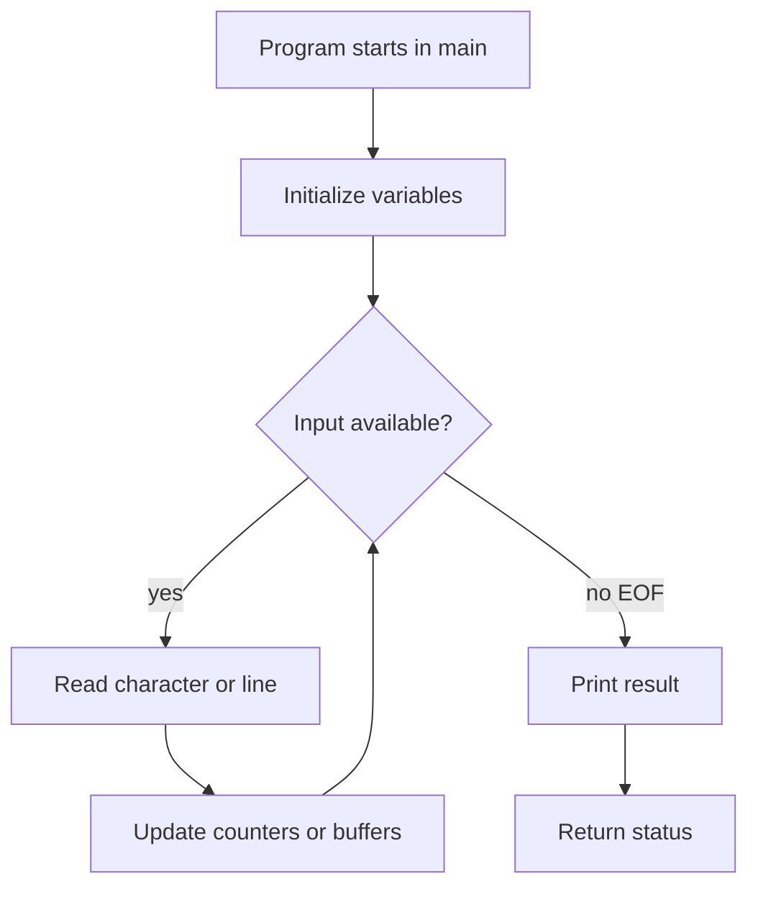

# Tutorial Introduction

K&R begins C by writing complete programs immediately. That is the right way to meet the language: C has few surface features, but every feature is close to the machine, the compiler, and the run-time environment. A tiny program already uses a translation unit, a function named `main`, a standard header, a library call, character constants, integer arithmetic, and a return status to the host environment.


*Figure: C remains the reference language for low-level memory, pointers, and Unix interfaces. Image: [Wikimedia Commons](https://commons.wikimedia.org/wiki/File:C_Programming_Language.svg), ElodinKaldwin, public domain text logo.*

The tutorial chapter is not meant to teach every rule. It gives a working core: output with `printf`, variables and arithmetic, `while` and `for`, symbolic constants, character input with `getchar`, arrays, functions, call by value, character arrays, and the first warning about external variables. Later chapters tighten the rules, but this chapter supplies the idioms that make C recognizable.

## Definitions

A C program is a collection of definitions and declarations. The smallest useful hosted program defines `main`, which is called by the execution environment:

```c
#include <stdio.h>

int main(void)
{
    printf("hello, world\n");
    return 0;
}
```

The directive `#include <stdio.h>` is handled before compilation. It makes declarations for standard input and output functions visible, including `printf`, `getchar`, and `putchar`. A function definition has a return type, a name, a parameter list, and a compound statement body. `int main(void)` says that `main` returns an `int` status and takes no arguments.

Variables name objects. A declaration states their type before use:

```c
int fahr, celsius;
int lower, upper, step;
```

An expression computes a value, often with side effects. The assignment `fahr = lower;` stores a value. The expression `fahr <= upper` is a test; in C, zero means false and nonzero means true. A statement is usually an expression followed by `;`, or a control form such as `while`, `for`, `if`, or a compound statement surrounded by braces.

K&R uses `#define` for symbolic constants:

```c
#define LOWER 0
#define UPPER 300
#define STEP 20
```

These names are replaced by the preprocessor before compilation. They do not allocate storage and they are traditionally written in capitals.

Character input is based on `int`, not `char`, because `getchar` must return every possible character plus the special value `EOF`. The usual loop is:

```c
int c;

while ((c = getchar()) != EOF)
    putchar(c);
```

Character arrays hold C strings when they end with the null character `'\0'`. The literal `"hello\n"` is stored as the characters `h`, `e`, `l`, `l`, `o`, newline, and `'\0'`.

## Key results

The first key result is that many C programs are filters: they read a stream, transform it, and write a stream. This is why `getchar` and `putchar` appear so early. The same structure scales from a file copy program to word count, line filtering, lexical scanning, and simple command-line tools.

The second key result is that integer arithmetic has type. In the Fahrenheit to Celsius example, the expression `5 * (fahr - 32) / 9` gives integer results when all operands are integers. Reordering as `5 * (fahr - 32) / 9` avoids the immediate truncation of `5 / 9`, but it is still integer arithmetic. To get fractional output, at least one operand must be floating point, for example `5.0 / 9.0`.

The third key result is that arrays and functions are the normal way to break a problem into parts. The longest-line program from K&R separates the job into: read a line, compare its length, copy the current line when it is the longest, and print the final result. That separation matters because functions in C are cheap enough to use for clarity.

Function arguments are passed by value. A function receives copies of scalar arguments, so changing a parameter does not change the caller's variable. Arrays are the exception in practice: passing an array passes the address of its first element, so the function can modify the elements. This distinction becomes central when pointers are introduced.

External variables are objects defined outside any function. They exist for the whole execution of the program and can be seen by multiple functions when declared properly. K&R shows an external-variable version of the longest-line program, but treats it as inferior because hidden data connections make programs harder to reason about.

The tutorial chapter also establishes K&R's example-driven method. Each program is complete enough to compile, but it is also deliberately small enough that one new idea is visible: a temperature table for arithmetic and loops, file copying for `EOF`, word counting for state, digit counting for arrays, `power` for functions, and longest-line for character arrays. This matters when studying C because isolated syntax rules are less useful than seeing how storage, control flow, and library calls cooperate in a real loop.

One more early lesson is that C does little implicitly for safety. A character array has exactly the size declared. A function using a buffer must know its limit. A string must be terminated. The language will not remember a line length for you or stop a write past the end of an array. K&R introduces these constraints gently, but they are the same constraints that govern advanced C.

## Visual



| K&R tutorial idiom | Meaning | Why it appears early | Common later refinement |
|---|---|---|---|
| `#include <stdio.h>` | Bring I/O declarations into scope | Needed for `printf`, `getchar`, `putchar` | Add narrower headers such as `<ctype.h>` and `<string.h>` |
| `#define MAXLINE 1000` | Symbolic constant | Avoid magic numbers | Prefer `const` objects where storage and type checking matter |
| `while ((c = getchar()) != EOF)` | Read until no input remains | Classic stream-processing loop | Check errors separately when using `ferror` |
| `char line[MAXLINE]` | Fixed character buffer | Simple storage for text lines | Use explicit bounds everywhere |
| `return 0;` | Successful program status | Communicates with environment | Return nonzero on failure |

## Worked example 1: Temperature table with integer and floating arithmetic

Problem: print Celsius equivalents for Fahrenheit values 0, 20, 40, 60, and 80. Show why integer arithmetic and floating arithmetic differ.

Method:

1. Use the formula

   $$C = \frac{5}{9}(F - 32).$$

2. With integer arithmetic, choose the K&R-safe ordering:

   $$C_{\text{int}} = 5 \times (F - 32) / 9.$$

3. With floating arithmetic, use `5.0 / 9.0`:

   $$C_{\text{float}} = (5.0 / 9.0) \times (F - 32).$$

4. Evaluate for `F = 80`:

$$
\begin{aligned}
   C_{\text{int}} &= 5 \times (80 - 32) / 9 \\
   &= 5 \times 48 / 9 \\
   &= 240 / 9 \\
   &= 26
   \end{aligned}
$$

   Integer division discards the fractional part.

5. Evaluate the floating version:

$$
\begin{aligned}
   C_{\text{float}} &= 0.555555\ldots \times 48 \\
   &= 26.6666\ldots
   \end{aligned}
$$

Checked answer: for `80 F`, the integer table prints `26`, while a table formatted with one decimal place prints about `26.7`. Both come from the same formula, but the types of the operands control the calculation.

## Worked example 2: Counting digits in a stream

Problem: given the input

```text
a1 b22
90!
```

count digit occurrences, whitespace characters, and all other characters.

Method:

1. Prepare an array `ndigit[10]` initialized to zero.
2. Maintain `nwhite` and `nother`.
3. For each character `c`, test in this order:
   `c >= '0' && c <= '9'`, then whitespace, then other.
4. Convert a digit character to an index with `c - '0'`.

Step-by-step:

| Character | Test result | Update |
|---|---|---|
| `a` | not digit, not whitespace | `nother = 1` |
| `1` | digit | `ndigit[1] = 1` |
| space | whitespace | `nwhite = 1` |
| `b` | other | `nother = 2` |
| `2` | digit | `ndigit[2] = 1` |
| `2` | digit | `ndigit[2] = 2` |
| newline | whitespace | `nwhite = 2` |
| `9` | digit | `ndigit[9] = 1` |
| `0` | digit | `ndigit[0] = 1` |
| `!` | other | `nother = 3` |

Checked answer: digit counts are `0:1`, `1:1`, `2:2`, `9:1`, all other digits zero; whitespace is `2`; other is `3`.

## Code

```c
#include <stdio.h>

#define MAXLINE 1000

int getline_kr(char s[], int lim);
void copy(char to[], const char from[]);

int main(void)
{
    int len;
    int max = 0;
    char line[MAXLINE];
    char longest[MAXLINE];

    while ((len = getline_kr(line, MAXLINE)) > 0) {
        if (len > max) {
            max = len;
            copy(longest, line);
        }
    }

    if (max > 0)
        printf("%s", longest);

    return 0;
}

int getline_kr(char s[], int lim)
{
    int c;
    int i;

    for (i = 0; i < lim - 1 && (c = getchar()) != EOF && c != '\n'; ++i)
        s[i] = (char)c;

    if (c == '\n') {
        s[i] = (char)c;
        ++i;
    }

    s[i] = '\0';
    return i;
}

void copy(char to[], const char from[])
{
    int i = 0;

    while ((to[i] = from[i]) != '\0')
        ++i;
}
```

## Common pitfalls

- Storing `getchar()` in `char` instead of `int`; this can make `EOF` indistinguishable from a valid character on some implementations.
- Writing `while (c = getchar() != EOF)`, which assigns the result of the comparison instead of the character. Use parentheses around the assignment.
- Forgetting `'\0'` at the end of a character array that is meant to be a string.
- Assuming integer division gives rounded results. It truncates toward zero in modern C.
- Making helper functions depend on external variables too early. It shortens argument lists but hides the data flow.
- Omitting braces in nested control flow where later edits may attach an `else` to the wrong `if`.

## Connections

- [Types, Operators, and Expressions](/cs/programming/c/types-operators-expressions)
- [Control Flow](/cs/programming/c/control-flow)
- [Functions and Program Structure](/cs/programming/c/functions-program-structure)
- [Pointers, Addresses, and Arrays](/cs/programming/c/pointers-addresses-arrays)
- [Standard I/O and Formatted I/O](/cs/programming/c/standard-io-formatted-io)
