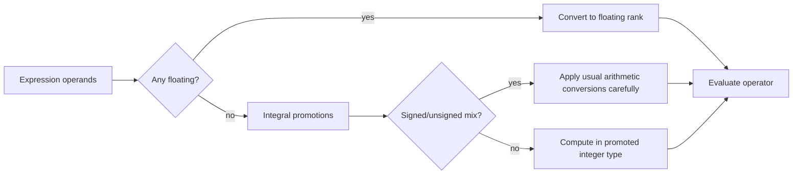

# Types, Operators, and Expressions

C expressions are compact because the language gives programmers direct access to arithmetic, comparisons, bit operations, assignments, and type conversions. K&R's second chapter is where C starts to look less like pseudocode and more like a systems language: the type of every object constrains its values, and the operator chosen often reveals how the underlying representation is being used.

This topic sits between the tutorial programs and the later chapters on pointers, structures, and I/O. You cannot understand pointer arithmetic without integer conversions, cannot read declarations without knowing qualifiers, and cannot write robust macros without knowing precedence and evaluation order. K&R's style is terse, but it depends on precise rules.

## Definitions

The basic arithmetic types introduced by K&R are `char`, `int`, `float`, and `double`, with qualifiers and related forms:

```c
char c;
short s;
int i;
long n;
unsigned int u;
float x;
double y;
long double z;
```

The standard guarantees relative ordering of integer widths: `short` is no wider than `int`, and `int` is no wider than `long`; minimum sizes are specified, but exact sizes are implementation-defined. `char` is a small integer type capable of holding characters from the execution character set. Plain `char` may be signed or unsigned, so use `signed char` or `unsigned char` when the distinction matters.

Constants have types too. `123` is an `int` if it fits; `123L` is `long`; `123U` is unsigned; `0x1f` is hexadecimal; a leading zero such as `037` is octal. Floating constants such as `1.0` are `double` unless suffixed with `f`, `F`, `l`, or `L`. A character constant such as `'A'` is an integer value. A string literal such as `"A"` is an array of characters ending in `'\0'`.

An expression combines operands and operators. Important operator families include:

- Arithmetic: `+`, `-`, `*`, `/`, `%`
- Relational and equality: `<`, `<=`, `>`, `>=`, `==`, `!=`
- Logical: `&&`, `||`, `!`
- Bitwise: `&`, `|`, `^`, `~`, `<<`, `>>`
- Assignment: `=`, `+=`, `-=`, `*=`, `/=`, `%=` and bitwise assignment forms
- Increment and decrement: `++`, `--`
- Conditional: `?:`
- Comma operator: `,`

Declarations can include initialization:

```c
int lower = 0;
const double scale = 5.0 / 9.0;
char msg[] = "warning";
```

For external and static objects, omitted initializers mean zero initialization. For automatic variables, omitted initialization leaves an indeterminate value.

## Key results

The usual arithmetic conversions are the heart of mixed-type expressions. Narrow integer types are promoted before arithmetic. If either operand is floating, the other is converted to a compatible floating type. If unsigned and signed operands are mixed, the signed operand may be converted to unsigned, which can surprise code that expected negative values to remain negative.

Character constants are portable when used symbolically. K&R emphasizes writing `'0'` rather than its numeric code. The digit values are guaranteed to be consecutive in C, so `c - '0'` is the portable way to turn a digit character into an integer in the range 0 through 9.

Logical operators short-circuit. In `p != NULL && *p == 'x'`, the dereference is evaluated only when `p != NULL` is true. This rule is not merely an optimization; it is a semantic guarantee and is often used to guard a dangerous operation.

Bitwise operators manipulate integer representations. They are essential for flags, masks, packed fields, device interfaces, and later structure bit-fields. The expression `flags |= MASK` turns bits on, `flags &= ~MASK` turns bits off, and `(flags & MASK) != 0` tests whether any masked bit is set.

Precedence is not the same as evaluation order. Precedence decides how an expression groups; it does not generally decide which operand is evaluated first. K&R repeatedly warns against expressions that modify an object more than once between sequence points, such as `a[i] = i++`, because their behavior is undefined.

The type system is deliberately small, but it is not weak in the sense of being irrelevant. Every operator has operand requirements and a result type. `%` requires integer operands. `&&` and `||` produce `0` or `1`. A comparison also produces `0` or `1`. Assignment expressions have the value stored in the left operand, which is why chained assignment works. These rules are what allow compact idioms such as `while ((c = getchar()) != EOF)` to be both legal and meaningful.

Implementation-defined behavior is part of writing portable C. The exact size of `int`, whether plain `char` is signed, and the representation of negative integers were historically machine-dependent. K&R points readers toward `<limits.h>` and `<float.h>` for machine properties rather than hard-coding assumptions. Modern machines are more uniform than the machines K&R had to support, but portable code should still ask the implementation through standard macros where possible.

The conditional operator `?:` is an expression, not a statement. That means it can be used in initializers, arguments, and return statements when the two alternatives are simple values. K&R uses it for compact choices such as selecting a sign or choosing a space after an argument. It should not replace a clear `if` when each branch has several side effects.

Declarations are part of expression safety. A variable declared `const` communicates that assignments through that name are not permitted. An unsigned type communicates modular arithmetic for that object. A cast communicates an explicit conversion, but it can also silence useful warnings. K&R uses casts where representation boundaries are real, such as generic allocation; they should not be used merely to force an expression past the compiler.

## Visual

| Concept | Example | Result or rule | Note |
|---|---|---|---|
| Integer division | `7 / 3` | `2` | Fractional part is discarded |
| Remainder | `7 % 3` | `1` | Operands must be integer types |
| Digit conversion | `'8' - '0'` | `8` | Portable for decimal digits |
| Short-circuit AND | `p && *p` | second operand guarded | Left operand evaluated first |
| Set bit | `x |= 04` | bit 2 on | Octal constants are common in old C |
| Clear bit | `x &= ~04` | bit 2 off | Parentheses matter with compound masks |
| Conditional | `a > b ? a : b` | larger value | Only one selected branch is evaluated |
| Assignment value | `a = b = 0` | both zero | Assignment associates right to left |



## Worked example 1: Parsing a digit character safely

Problem: convert the character `'7'` to the integer `7`, then update a digit-count array.

Method:

1. Confirm the character is a digit:

   $$'0' \le c \le '9'.$$

2. Compute the index:

$$
\begin{aligned}
   index &= c - '0' \\
   &= '7' - '0' \\
   &= 7
   \end{aligned}
$$

3. Increment the counter:

   ```c
   ++ndigit[c - '0'];
   ```

4. Check bounds: because the test guarantees `c` lies between `'0'` and `'9'`, the index lies between `0` and `9`.

Checked answer: for `c == '7'`, `ndigit[7]` is incremented exactly once, and no other array element changes.

## Worked example 2: Setting, clearing, and testing flags

Problem: store three boolean properties in one integer: keyword, external, and static. Use bit masks to turn on external and static, then clear external, then test static.

Method:

```c
enum { KEYWORD = 01, EXTERNAL = 02, STATIC = 04 };
unsigned flags = 0;
```

1. Initial value:

   $$flags = 0.$$

2. Turn on `EXTERNAL` and `STATIC`:

   ```c
   flags |= EXTERNAL | STATIC;
   ```

   In octal:

$$
\begin{aligned}
   EXTERNAL | STATIC &= 02 | 04 \\
   &= 06
   \end{aligned}
$$

   So `flags` becomes `06`.

3. Clear `EXTERNAL`:

   ```c
   flags &= ~EXTERNAL;
   ```

   This keeps all bits except the `02` bit. `06` becomes `04`.

4. Test static:

   ```c
   if ((flags & STATIC) != 0)
       puts("static");
   ```

   $$04 \& 04 = 04,$$ so the test is true.

Checked answer: after the operations, `EXTERNAL` is off, `STATIC` is on, and `KEYWORD` is still off.

## Code

```c
#include <ctype.h>
#include <stdio.h>

enum { SEEN_DIGIT = 01, SEEN_SPACE = 02, SEEN_OTHER = 04 };

int main(void)
{
    int c;
    unsigned flags = 0;
    int ndigit[10] = { 0 };

    while ((c = getchar()) != EOF) {
        if (isdigit((unsigned char)c)) {
            flags |= SEEN_DIGIT;
            ++ndigit[c - '0'];
        } else if (isspace((unsigned char)c)) {
            flags |= SEEN_SPACE;
        } else {
            flags |= SEEN_OTHER;
        }
    }

    for (int i = 0; i < 10; ++i)
        printf("%d%c", ndigit[i], i == 9 ? '\n' : ' ');

    if ((flags & SEEN_OTHER) != 0)
        fprintf(stderr, "input contained non-digit, non-space characters\n");

    return 0;
}
```

## Common pitfalls

- Confusing a character constant and a string literal: `'x'` is an integer character constant, while `"x"` is an array containing `x` and `'\0'`.
- Writing octal constants accidentally by prefixing a decimal number with `0`; `010` is eight, not ten.
- Depending on whether plain `char` is signed. Cast to `unsigned char` before passing arbitrary byte values to `<ctype.h>` functions.
- Using `=` where `==` was intended. K&R idioms often put assignments in conditions, so parentheses and compiler warnings matter.
- Assuming `&&` and `||` return arbitrary true values. They return `1` for true and `0` for false.
- Depending on operand evaluation order in expressions with side effects. Split the expression into statements when in doubt.
- Forgetting that bitwise `&` has lower precedence than `==`, so write `(flags & MASK) == 0`.

## Connections

- [Tutorial Introduction](/cs/programming/c/tutorial-introduction)
- [Control Flow](/cs/programming/c/control-flow)
- [Preprocessor and Separate Compilation](/cs/programming/c/preprocessor-separate-compilation)
- [Structures, Typedef, Unions, and Bit Fields](/cs/programming/c/structures-typedef-unions-bitfields)
- [Modern C Considerations](/cs/programming/c/modern-c-considerations)
