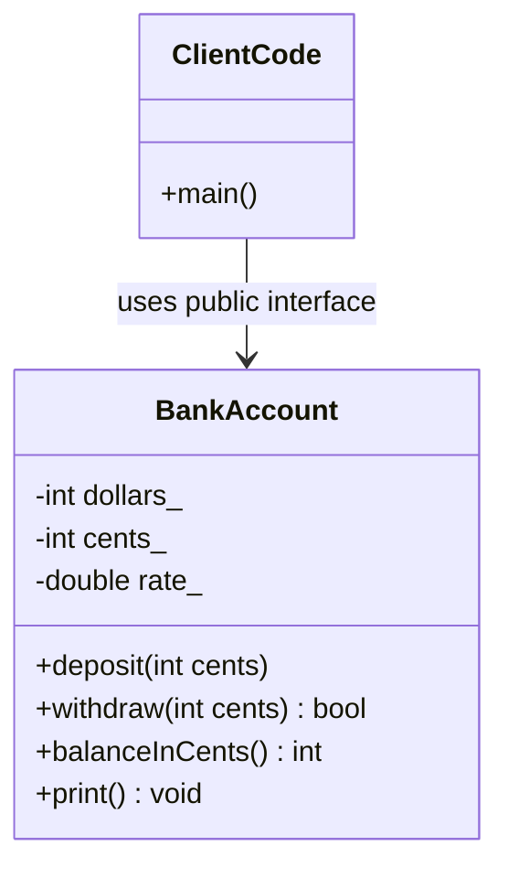

# Classes and Encapsulation

Classes are the point where C++ stops being only a procedural language and becomes a language for defining new types. A class can store data, protect representation details, and provide operations that preserve the meaning of the type. Savitch introduces structures first, then classes, so the transition is concrete: a `struct` groups related variables, while a class usually adds member functions and hides member variables behind a public interface.


*Figure: C++ extends systems programming with abstraction, generic code, and deterministic resource management. Image: [Wikimedia Commons](https://commons.wikimedia.org/wiki/File:ISO_C%2B%2B_Logo.svg), Jeremy Kratz, public domain text logo.*

Encapsulation is the main idea. A well-designed class lets users think in terms of dates, bank accounts, time values, students, or money amounts instead of raw fields. The implementation can change later, but code using the class should continue to work if the public interface keeps the same contract.

## Definitions

A **structure** groups member variables under one type name.

```cpp
struct Date {
    int month;
    int day;
    int year;
};
```

A structure object uses the dot operator to access members.

```cpp
Date due = {12, 31, 2026};
std::cout << due.month << "/" << due.day << "/" << due.year << '\n';
```

A **class** is a user-defined type that can contain member variables and member functions. In typical C++ style, member variables are private and member functions form the public interface.

```cpp
class DayOfYear {
public:
    void set(int month, int day);
    int monthNumber() const;
    int dayOfMonth() const;

private:
    int month_;
    int day_;
};
```

A **member function** is called through an object.

```cpp
DayOfYear today;
today.set(5, 15);
```

The **scope resolution operator** `::` qualifies a member function definition outside the class body.

```cpp
void DayOfYear::set(int month, int day) {
    month_ = month;
    day_ = day;
}
```

An **accessor** returns information without changing the object. A **mutator** changes object state, usually after validation.

```cpp
int DayOfYear::monthNumber() const {
    return month_;
}
```

An **abstract data type** hides representation details. Users know what operations mean, but not how data is stored internally.

## Key results

The default access for `struct` members is public. The default access for `class` members is private. Good C++ style does not rely on this difference alone; it marks the interface intentionally.

Private data protects invariants. Suppose a date object should never have month `13`. If `month_` is public, any code can assign invalid state. If `month_` is private, all changes must pass through member functions that can reject invalid values.

```cpp
bool DayOfYear::isValid(int month, int day) const {
    return (month >= 1 && month <= 12 && day >= 1 && day <= 31);
}
```

The member functions of a class can access private members of any object of the same class, not only the calling object. This matters in comparisons:

```cpp
bool sameDay(const DayOfYear& other) const {
    return month_ == other.month_ && day_ == other.day_;
}
```

Interface and implementation should be conceptually separate even before files are physically separated. The class declaration and comments explain how to use the type. The private data layout and member function bodies explain how the type is implemented.

The public interface should use vocabulary from the problem domain:

| Weak interface | Better interface | Reason |
|---|---|---|
| `setX(int)` | `setMonth(int)` | exposes meaning |
| `getA()` | `balance()` | names the domain value |
| public `rate` | `setInterestRate(double)` | validates mutation |
| public date fields | `set(month, day, year)` | preserves date invariant |

The `const` marker at the end of a member function promises not to change the calling object.

```cpp
double balance() const;
```

This promise is important because const objects and const reference parameters can call only const member functions.

## Visual



| Member category | Accessible from client code? | Accessible inside member functions? | Typical use |
|---|---:|---:|---|
| `public` member function | yes | yes | interface operation |
| `public` member variable | yes | yes | rare simple aggregate cases |
| `private` member function | no | yes | helper operation |
| `private` member variable | no | yes | representation |

## Worked example 1: designing a validated date class

Problem: Build a date-like class for month and day. Prevent invalid month or day values from entering the object.

Method:

1. Store `month_` and `day_` privately.
2. Provide a `set` mutator.
3. Check the proposed values before assigning.
4. Return `true` for success and `false` for failure.
5. Make accessors const.

```cpp
#include <iostream>

class DayOfYear {
public:
    DayOfYear() : month_(1), day_(1) {}

    bool set(int month, int day) {
        if (month < 1 || month > 12 || day < 1 || day > 31) {
            return false;
        }
        month_ = month;
        day_ = day;
        return true;
    }

    int monthNumber() const {
        return month_;
    }

    int dayOfMonth() const {
        return day_;
    }

private:
    int month_;
    int day_;
};

int main() {
    DayOfYear date;
    bool ok = date.set(13, 4);
    std::cout << std::boolalpha << ok << '\n';
    std::cout << date.monthNumber() << "/" << date.dayOfMonth() << '\n';
}
```

Checked answer:

1. The default date starts as `1/1`.
2. `set(13, 4)` fails because `13` is outside `1..12`.
3. The function returns `false`.
4. The object remains `1/1`.

The class protects its invariant because clients cannot assign to `month_` directly.

## Worked example 2: comparing two objects of the same class

Problem: Add a member function that tells whether two `TimeOfDay` objects represent the same minute.

Method:

1. Store hour and minute privately.
2. Inside a member function, compare the calling object's private fields with the other object's private fields.
3. Mark the comparison const.

```cpp
#include <iostream>

class TimeOfDay {
public:
    bool set(int hour, int minute) {
        if (hour < 0 || hour > 23 || minute < 0 || minute > 59) {
            return false;
        }
        hour_ = hour;
        minute_ = minute;
        return true;
    }

    bool sameAs(const TimeOfDay& other) const {
        return hour_ == other.hour_ && minute_ == other.minute_;
    }

private:
    int hour_ = 0;
    int minute_ = 0;
};

int main() {
    TimeOfDay start;
    TimeOfDay end;
    start.set(9, 30);
    end.set(9, 30);
    std::cout << std::boolalpha << start.sameAs(end) << '\n';
}
```

Checked answer: `sameAs` returns `true`. Even though `other.hour_` is private, the function is a member of `TimeOfDay`, so it can access private members of any `TimeOfDay` object.

## Code

This class models a small bank account using cents as the representation to avoid floating-point rounding in the stored balance.

```cpp
#include <iostream>

class BankAccount {
public:
    BankAccount() : cents_(0) {}

    bool deposit(int cents) {
        if (cents < 0) {
            return false;
        }
        cents_ += cents;
        return true;
    }

    bool withdraw(int cents) {
        if (cents < 0 || cents > cents_) {
            return false;
        }
        cents_ -= cents;
        return true;
    }

    int balanceInCents() const {
        return cents_;
    }

    void print() const {
        std::cout << "$" << cents_ / 100 << ".";
        int centsPart = cents_ % 100;
        if (centsPart < 10) {
            std::cout << "0";
        }
        std::cout << centsPart << '\n';
    }

private:
    int cents_;
};

int main() {
    BankAccount account;
    account.deposit(1250);
    account.withdraw(275);
    account.print();
}
```

## Common pitfalls

- Making all member variables public and losing control of class invariants.
- Treating accessor and mutator functions as useless boilerplate. Their value is validation, abstraction, and future representation changes.
- Forgetting the semicolon after a class or struct definition.
- Omitting `ClassName::` when defining a member function outside the class.
- Forgetting `const` on member functions that do not change the object.
- Writing member functions that expose too much representation detail.
- Confusing an object with a class. A class is the type; an object is a value of that type.
- Using public data for a class that has real invariants or behavior.

Design checks for class code:

- State the class invariant in one sentence. For `TimeOfDay`, the invariant might be `0 <= hour < 24` and `0 <= minute < 60`; for `BankAccount`, the invariant might be that the stored balance is never negative unless overdraft is explicitly modeled.
- Make constructors establish the invariant immediately. A class that can be created in an invalid state forces every member function to defend against a situation that should not exist.
- Let public functions describe operations in the problem domain. A caller should ask an account to `deposit` or `withdraw`, not fetch a raw representation, modify it, and store it back.
- Keep representation choices replaceable. If clients never see `cents_`, the class can later switch to a larger integer type, a database-backed balance, or a decimal class without changing client code.
- Use `const` member functions aggressively for observers. This lets the same function work for ordinary objects, const objects, and const references passed to functions.
- Prefer small, testable member functions. A member function that validates input, changes state, prints output, and reads from `cin` is difficult to reuse because it mixes several responsibilities.
- Use `struct` for simple passive records and `class` for types with invariants and behavior. The technical difference is default access, but the naming convention communicates design intent to readers.

Quick self-test: after writing a class, try to misuse it from `main`. If invalid states can be created with ordinary public operations, the interface is too permissive. If a client must know the private representation to use the class correctly, the abstraction is too weak. A well-encapsulated class makes correct use straightforward and incorrect use difficult.

A final review question for any class is: "What can change without forcing client code to change?" If the answer is "almost nothing," the class is probably exposing representation instead of behavior. Encapsulation is successful when the private data can evolve while the public operations remain stable.

## Connections

- [constructors and copy semantics](/cs/programming/cpp/constructors-and-copy-semantics)
- [references and operator overloading](/cs/programming/cpp/references-and-operator-overloading)
- [separate compilation and namespaces](/cs/programming/cpp/separate-compilation-and-namespaces)
- [inheritance](/cs/programming/cpp/inheritance)
- [polymorphism](/cs/programming/cpp/polymorphism-and-virtual-functions)
