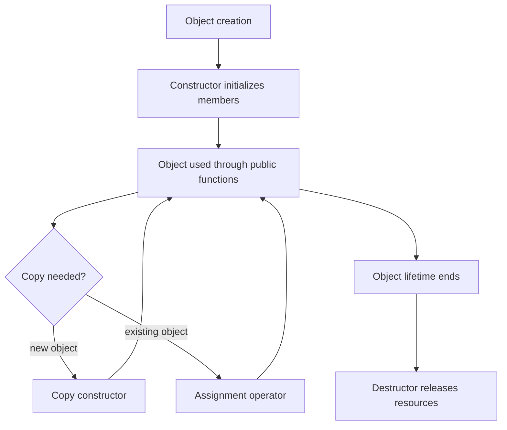

# Constructors and Copy Semantics

Constructors make class objects usable from the moment they are created. Destructors release resources when objects die. Copy constructors and assignment operators define what it means to duplicate an object. Savitch introduces these tools gradually: constructors first for initialization, then `const`, static members, vectors, destructors, copy constructors, and overloaded assignment when classes own dynamic memory.

The guiding principle is resource ownership. If a class only stores simple values, the compiler-generated copy behavior is often fine. If a class owns memory, a file handle, or another resource, memberwise copying is usually not enough. The class must decide whether copying means deep copy, shared ownership, disabled copy, or move-style transfer in modern C++.

## Definitions

A **constructor** is a member function with the same name as the class and no return type. It initializes new objects.

```cpp
class Point {
public:
    Point() : x_(0.0), y_(0.0) {}
    Point(double x, double y) : x_(x), y_(y) {}

private:
    double x_;
    double y_;
};
```

A **default constructor** can be called with no arguments.

```cpp
Point origin;
```

An **initialization list** initializes members before the constructor body runs.

```cpp
Point(double x, double y) : x_(x), y_(y) {}
```

A **destructor** releases resources and has the form `~ClassName()`.

```cpp
~Buffer() {
    delete[] data_;
}
```

A **copy constructor** creates a new object from an existing object.

```cpp
Buffer(const Buffer& other);
```

An **assignment operator** replaces the value of an existing object.

```cpp
Buffer& operator=(const Buffer& rhs);
```

The **rule of three** says that if a class needs a custom destructor, copy constructor, or copy assignment operator, it likely needs all three.

Modern C++ adds move construction and move assignment, giving the **rule of five**. Savitch's fifth edition centers on copy control, but the same ownership reasoning explains move semantics.

## Key results

Constructors should establish class invariants. If a `BankAccount` stores dollars and cents separately, every constructor must ensure the representation is consistent.

Initialization lists are not only style; they are required for const members, reference members, and member objects without default constructors. They also avoid unnecessary default construction followed by assignment.

Destructors run automatically when automatic objects leave scope and when dynamic objects are deleted. For an object created with `new`, the destructor runs when `delete` is applied. For arrays created with `new[]`, each element's destructor runs when `delete[]` is applied.

Shallow copy copies pointer values. Deep copy creates independent dynamic storage and copies pointed-to elements.

```text
shallow copy: two objects point to same array
deep copy:    each object owns its own array
```

Assignment must handle self-assignment:

```cpp
if (this == &rhs) {
    return *this;
}
```

It should also avoid destroying the old resource before successfully allocating the new resource. A robust pattern is allocate-copy-delete-swap or copy-and-swap.

Static members belong to the class as a whole rather than to one object. They are useful for shared counters, configuration, or factory state, but should not replace ordinary object state.

## Visual



| Function | Called when | Typical responsibility |
|---|---|---|
| default constructor | `T obj;` | create valid default state |
| converting constructor | `T obj(arg);` | build from another type |
| copy constructor | `T copy = original;` | create independent copy |
| assignment operator | `a = b;` | replace existing state |
| destructor | scope exit or `delete` | release owned resources |
| move constructor | `T x = std::move(y);` | transfer resources when supported |

## Worked example 1: constructor initialization for a clock time

Problem: Define a `ClockTime` class that stores hour and minute. Normalize `24:00` to `0:00` and reject invalid values.

Method:

1. Store `hour_` and `minute_` privately.
2. Default time is midnight.
3. Constructor with arguments validates ranges.
4. If `hour == 24` and `minute == 0`, store `0:00`.
5. Use a `bool` helper to keep logic readable.

```cpp
#include <cstdlib>
#include <iostream>

class ClockTime {
public:
    ClockTime() : hour_(0), minute_(0) {}

    ClockTime(int hour, int minute) {
        if (!valid(hour, minute)) {
            std::cerr << "Invalid time\n";
            std::exit(1);
        }
        if (hour == 24) {
            hour = 0;
        }
        hour_ = hour;
        minute_ = minute;
    }

    void print() const {
        std::cout << hour_ << ":";
        if (minute_ < 10) {
            std::cout << "0";
        }
        std::cout << minute_ << '\n';
    }

private:
    bool valid(int hour, int minute) const {
        return ((hour >= 0 && hour <= 23) || (hour == 24 && minute == 0))
            && minute >= 0 && minute <= 59;
    }

    int hour_;
    int minute_;
};

int main() {
    ClockTime midnight(24, 0);
    midnight.print();
}
```

Checked answer: the constructor accepts `24:00`, stores `0:00`, and prints `0:00`.

## Worked example 2: shallow copy failure and deep copy fix

Problem: A class owns a dynamic array. Show why the default copy constructor is wrong and how a deep copy fixes it.

Method:

1. A class contains `int* data_`.
2. Default copying copies the pointer.
3. Both objects point to the same array.
4. Changing one object changes the other's apparent data.
5. When both destructors run, the same array may be deleted twice.
6. Define a copy constructor that allocates a new array.

```cpp
#include <algorithm>
#include <iostream>

class Scores {
public:
    Scores(const int values[], int size)
        : size_(size), data_(new int[size]) {
        std::copy(values, values + size_, data_);
    }

    Scores(const Scores& other)
        : size_(other.size_), data_(new int[other.size_]) {
        std::copy(other.data_, other.data_ + size_, data_);
    }

    ~Scores() {
        delete[] data_;
    }

    int get(int index) const {
        return data_[index];
    }

private:
    int size_;
    int* data_;
};

int main() {
    int raw[] = {80, 90, 100};
    Scores first(raw, 3);
    Scores second = first;
    std::cout << second.get(2) << '\n';
}
```

Checked answer: `second` owns a separate array and prints `100`. When `first` and `second` are destroyed, each deletes only its own storage.

## Code

This complete rule-of-three example supports assignment safely.

```cpp
#include <algorithm>
#include <iostream>

class DoubleArray {
public:
    explicit DoubleArray(int size)
        : size_(size), data_(new double[size]) {
        std::fill(data_, data_ + size_, 0.0);
    }

    DoubleArray(const DoubleArray& other)
        : size_(other.size_), data_(new double[other.size_]) {
        std::copy(other.data_, other.data_ + size_, data_);
    }

    DoubleArray& operator=(const DoubleArray& rhs) {
        if (this == &rhs) {
            return *this;
        }

        double* replacement = new double[rhs.size_];
        std::copy(rhs.data_, rhs.data_ + rhs.size_, replacement);

        delete[] data_;
        data_ = replacement;
        size_ = rhs.size_;
        return *this;
    }

    ~DoubleArray() {
        delete[] data_;
    }

    double& at(int index) {
        return data_[index];
    }

    double at(int index) const {
        return data_[index];
    }

private:
    int size_;
    double* data_;
};

int main() {
    DoubleArray a(2);
    a.at(0) = 1.5;
    a.at(1) = 2.5;

    DoubleArray b(1);
    b = a;
    b.at(0) = 9.0;

    std::cout << a.at(0) << " " << b.at(0) << '\n';
}
```

## Common pitfalls

- Assuming constructors return values. They initialize objects; they do not have return types.
- Forgetting to define a default constructor when code needs arrays or default-created objects.
- Doing validation after assigning invalid member state and then returning normally.
- Using assignment in a constructor body when an initialization list is required or clearer.
- Defining a destructor for dynamic memory but forgetting copy constructor and assignment.
- Writing assignment that deletes current storage before checking self-assignment.
- Returning a local object by reference instead of by value.
- Forgetting to make base class destructors virtual when deleting derived objects through base pointers.

Copy-control checks:

- Ask whether the class owns a resource. Dynamic memory, file handles, locks, and network connections all count. If ownership exists, the compiler-generated copy operations may be wrong even when the code compiles cleanly.
- Trace the lifetime of one object on paper: construction, ordinary member calls, copying, assignment, and destruction. Every allocated resource should appear exactly once in the construction path and exactly once in the destruction path.
- In an assignment operator, allocate replacement storage before deleting the old storage when possible. This keeps the original object valid if allocation or copying fails.
- Return `*this` by reference from assignment. This supports chained assignment such as `a = b = c` and matches built-in assignment behavior.
- Test self-assignment explicitly: `x = x;`. A correct assignment operator should leave `x` unchanged and should not free storage before it is copied.
- Prefer member initialization lists for all data members, not just for references and constants. Initialization lists express construction directly and avoid default-construct-then-assign behavior for class-type members.
- If a class only stores standard library members such as `string` and `vector`, the compiler-generated destructor, copy constructor, and assignment operator are usually correct. Manual copy control is mainly needed when the class directly owns a lower-level resource.

Quick self-test: create two objects, copy one into the other, mutate one object, and then let both destructors run. If changing the copy changes the original, the copy is shallow. If the program crashes at destruction, two objects may be trying to free the same resource. These tests are small but catch many copy-control errors.

## Connections

- [classes and encapsulation](/cs/programming/cpp/classes-and-encapsulation)
- [pointers and dynamic memory](/cs/programming/cpp/pointers-and-dynamic-memory)
- [references and operator overloading](/cs/programming/cpp/references-and-operator-overloading)
- [inheritance](/cs/programming/cpp/inheritance)
- [polymorphism](/cs/programming/cpp/polymorphism-and-virtual-functions)
