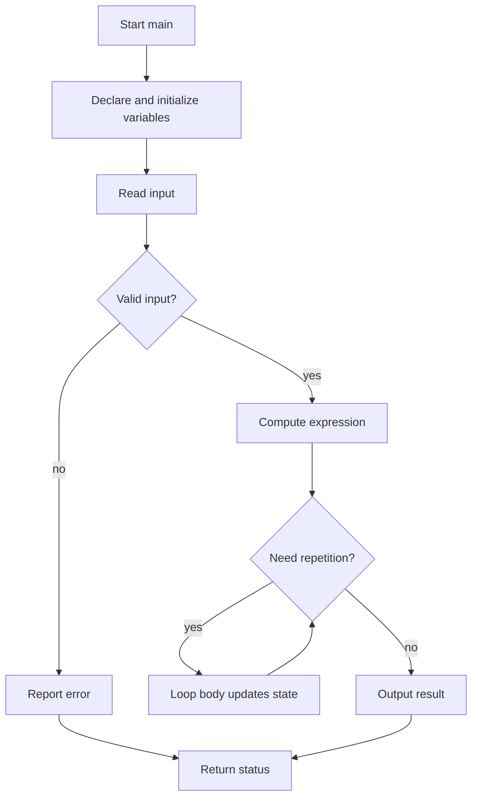

# C++ Basics and Control Flow

C++ begins with a small set of precise rules: every program has a `main`, every variable has a type, expressions are evaluated according to precedence, and execution normally moves from one statement to the next. Control-flow statements are the first tools that let a program stop being a straight-line calculator and start making decisions. Savitch treats these early topics as the grammar of the language: identifiers, declarations, assignment, console I/O, Boolean expressions, branches, loops, and the first contact with file input.

These notes connect Chapter 1 and Chapter 2 into a single foundation. The main idea is that a C++ program is a sequence of state changes. Declarations create named storage, assignments update that storage, input statements fill it from outside the program, output statements reveal it, and control-flow statements choose which updates happen and how often.

## Definitions

A **C++ program** is normally organized around the function `int main()`. Execution starts there. A minimal program includes headers for library facilities and may use `std::` qualification or a `using` declaration.

```cpp
#include <iostream>

int main() {
    std::cout << "Hello, C++\n";
    return 0;
}
```

An **identifier** names a variable, function, constant, class, or namespace member. It starts with a letter or underscore and then uses letters, digits, or underscores. C++ is case-sensitive, so `rate`, `Rate`, and `RATE` are different identifiers. A **keyword** such as `int`, `double`, `if`, `while`, or `return` cannot be reused as an identifier.

A **variable declaration** gives a variable a type before use. Common basic types include `int`, `double`, `char`, `bool`, and `std::string`. A declaration may also initialize a variable.

```cpp
#include <string>

int count = 0;
double price = 19.95;
char grade = 'A';
bool passed = true;
std::string name = "Ada";
```

An **assignment statement** stores the value of an expression in a modifiable object.

```cpp
total = subtotal + tax;
count += 1;
```

A **literal** is a value written directly in the program, such as `42`, `3.14`, `'x'`, `"hello"`, `true`, or `false`. Character literals use single quotes. String literals use double quotes. Escape sequences such as `'\n'`, `'\t'`, and `'\0'` represent special characters.

A **declared constant** uses `const` to prevent later modification.

```cpp
const double PI = 3.141592653589793;
const int DAYS_PER_WEEK = 7;
```

A **Boolean expression** evaluates to `true` or `false`. It usually combines comparisons with logical operators.

```cpp
bool inRange = (0 <= score) && (score <= 100);
bool needsReview = (grade == 'F') || (absences > 5);
```

The main control-flow forms are:

```cpp
if (condition) {
    // chosen when condition is true
} else {
    // chosen otherwise
}

while (condition) {
    // repeated while condition remains true
}

for (initialization; condition; update) {
    // counted or indexed repetition
}

switch (choice) {
    case 1:
        break;
    default:
        break;
}
```

## Key results

C++ evaluates arithmetic using the types of operands. If both operands of `/` are integers, the result uses integer division and discards the fractional part. Thus `9 / 2` is `4`, while `9 / 2.0` is `4.5`. The remainder operator `%` works on integer operands and returns the remainder from integer division.

Type conversion should be explicit when the meaning matters. Savitch emphasizes `static_cast` because it makes the programmer's intention visible:

```cpp
double average = static_cast<double>(total) / count;
```

This avoids the common error where `total / count` performs integer division before being assigned to a `double`.

Comparison operators have lower precedence than arithmetic operators, and logical operators have lower precedence than comparisons. Parentheses make intent clear:

```cpp
if ((temperature > 90) && (humidity > 0.80)) {
    std::cout << "Heat warning\n";
}
```

C++ uses **short-circuit evaluation** for `&&` and `||`. In `A && B`, if `A` is false, `B` is not evaluated. In `A || B`, if `A` is true, `B` is not evaluated. This is both an efficiency rule and a safety tool:

```cpp
if ((kids != 0) && (pieces / kids >= 2)) {
    std::cout << "Each child gets at least two pieces\n";
}
```

The division is evaluated only when `kids != 0`.

Loops must make progress toward termination. A `while` loop is best when the number of repetitions is not known in advance, such as reading until a sentinel. A `for` loop is best when an index or count is central. A `do-while` loop executes the body at least once, then tests the condition.

File input begins with `std::ifstream`. Even in early programs, checking that the file opened successfully is part of the algorithm, not decoration.

```cpp
#include <fstream>
#include <iostream>

int main() {
    std::ifstream input("numbers.txt");
    if (!input) {
        std::cerr << "Could not open numbers.txt\n";
        return 1;
    }

    int value;
    while (input >> value) {
        std::cout << value << '\n';
    }
}
```

## Visual

| Construct | Purpose | Usual question | Common risk |
|---|---|---|---|
| `if` | one-way choice | Should this action happen? | forgetting braces around multiple statements |
| `if-else` | two-way choice | Which of two paths applies? | using `=` instead of `==` |
| multiway `if-else` | ordered conditions | Which condition is first true? | putting broad cases before specific cases |
| `switch` | discrete menu or tag dispatch | Which constant case matches? | missing `break` |
| `while` | pretest repetition | Should another iteration run? | condition never changes |
| `do-while` | posttest repetition | Should the already-started process repeat? | running once when zero times was intended |
| `for` | counted repetition | What are initialization, condition, and update? | extra semicolon after header |



## Worked example 1: avoiding integer division in an average

Problem: A student has scores `8`, `9`, and `10`. Compute the average as a decimal value.

Method:

1. Add the integer scores.

$$
8 + 9 + 10 = 27
$$

2. Count the scores.

$$
n = 3
$$

3. If the program uses `sum / n`, both operands are `int`, so the result is integer division.

$$
27 / 3 = 9
$$

   This example happens to divide evenly, so it hides the danger.

4. Check a less convenient set: `8`, `9`, `9`.

$$
8 + 9 + 9 = 26
$$

Integer division gives:

$$
26 / 3 = 8
$$

The correct average is:

$$
26 / 3.0 = 8.666\ldots
$$

5. Force floating-point division with `static_cast<double>`.

```cpp
#include <iostream>

int main() {
    int a = 8;
    int b = 9;
    int c = 9;
    int sum = a + b + c;
    int count = 3;

    double average = static_cast<double>(sum) / count;
    std::cout << "Average: " << average << '\n';
    return 0;
}
```

Checked answer: the program prints approximately `8.66667`. The cast is applied before division, so no fractional part is lost.

## Worked example 2: menu loop with `switch`

Problem: Write a small menu that repeatedly lets a user add or subtract from a balance until choosing quit.

Method:

1. Keep state in a `double balance`.
2. Use a `do-while` loop because the menu must appear at least once.
3. Read a character command.
4. Use `switch` for discrete choices.
5. Use `break` in each case to prevent fall-through.
6. Stop when the command is `q`.

```cpp
#include <iostream>

int main() {
    double balance = 0.0;
    char command;

    do {
        std::cout << "(d)eposit, (w)ithdraw, (q)uit: ";
        std::cin >> command;

        switch (command) {
            case 'd': {
                double amount;
                std::cout << "Amount: ";
                std::cin >> amount;
                if (amount >= 0) {
                    balance += amount;
                }
                break;
            }
            case 'w': {
                double amount;
                std::cout << "Amount: ";
                std::cin >> amount;
                if ((amount >= 0) && (amount <= balance)) {
                    balance -= amount;
                }
                break;
            }
            case 'q':
                break;
            default:
                std::cout << "Unknown command\n";
                break;
        }

        std::cout << "Balance: " << balance << '\n';
    } while (command != 'q');

    return 0;
}
```

Checked answer: after `d 100`, `w 30`, `q`, the balance shown before exit is `70`. The `switch` cases are isolated by braces where local variables are declared.

## Code

The following complete program combines console input, validation, constants, a counted loop, and formatted output. It computes the price of several items with tax.

```cpp
#include <iomanip>
#include <iostream>

int main() {
    const double TAX_RATE = 0.0825;

    int itemCount;
    std::cout << "How many items? ";
    std::cin >> itemCount;

    if (itemCount <= 0) {
        std::cerr << "Item count must be positive.\n";
        return 1;
    }

    double subtotal = 0.0;
    for (int i = 1; i <= itemCount; ++i) {
        double price;
        std::cout << "Price for item " << i << ": ";
        std::cin >> price;

        if (price < 0.0) {
            std::cerr << "Negative prices are not allowed.\n";
            return 1;
        }

        subtotal += price;
    }

    double tax = subtotal * TAX_RATE;
    double total = subtotal + tax;

    std::cout << std::fixed << std::setprecision(2);
    std::cout << "Subtotal: " << subtotal << '\n';
    std::cout << "Tax: " << tax << '\n';
    std::cout << "Total: " << total << '\n';
    return 0;
}
```

## Common pitfalls

- Using an uninitialized local variable and assuming it starts at zero. Local variables of fundamental type contain indeterminate values unless initialized.
- Writing `if (x = 10)` when the intention is `if (x == 10)`. The first assigns and then tests the assigned value.
- Chaining inequalities as `0 <= x <= 100`. In C++, write `(0 <= x) && (x <= 100)`.
- Forgetting that `9 / 2` is `4`, not `4.5`.
- Putting a semicolon immediately after a loop header: `for (...) ;`.
- Omitting `break` in a `switch` case and accidentally falling into the next case.
- Mixing `std::cin >> value` with line-based input without consuming the leftover newline.
- Treating any nonzero integer as a preferred Boolean style. It is legal in many contexts, but clear code uses `bool` expressions directly.

## Connections

- [functions and parameters](/cs/programming/cpp/functions-parameters-and-scope)
- [arrays](/cs/programming/cpp/arrays)
- [strings](/cs/programming/cpp/strings)
- [streams and file I/O](/cs/programming/cpp/streams-and-file-io)
- [exception handling](/cs/programming/cpp/exception-handling)

