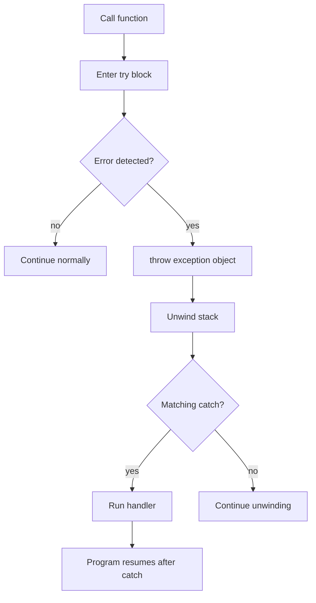

# Exception Handling

Exception handling gives C++ a structured way to report and respond to unusual errors without forcing every function to return a special error code. Savitch presents exceptions after classes and dynamic memory because exceptions interact with control flow, object lifetime, and resource cleanup.

The central pattern is `try`, `throw`, and `catch`. Code that may detect an exceptional condition throws an exception object. Code that knows how to recover catches it. Functions in between do not need to pass the error manually, but they must still be written so local objects clean themselves up correctly during stack unwinding.

## Definitions

A **throw expression** raises an exception:

```cpp
throw DivideByZero();
```

A **try block** encloses code that may throw:

```cpp
try {
    result = quotient(numerator, denominator);
}
```

A **catch block** handles exceptions of a matching type:

```cpp
catch (const DivideByZero& e) {
    cout << "division by zero" << endl;
}
```

An **exception class** is a class used as an exception type. It may be empty when the type alone communicates the error, or it may store a message and related values.

```cpp
class NegativeNumber {
public:
    explicit NegativeNumber(double value) : value(value) {}
    double getValue() const { return value; }
private:
    double value;
};
```

**Stack unwinding** is the process of leaving functions between the throw point and the catch point. Local objects in those functions are destroyed as the stack unwinds, which is why destructors and RAII are so important.

**RAII** means Resource Acquisition Is Initialization: a resource is owned by an object whose destructor releases it. If an exception leaves a scope, destructors still run for fully constructed local objects.

## Key results

The nearest matching catch block handles the exception. Matching is based on type, so catch blocks should be ordered from more specific to more general:

```cpp
try {
    // work
} catch (const FileOpenError& e) {
    // specific
} catch (const std::exception& e) {
    // general
}
```

Catch exception objects by `const` reference unless there is a clear reason not to. This avoids copying and preserves derived exception information:

```cpp
catch (const runtime_error& e) {
    cout << e.what() << endl;
}
```

Exceptions are best for exceptional conditions, not ordinary loop decisions. A missing optional value, a normal end-of-file state, or a user choosing "quit" is often better represented by ordinary control flow.

When a function cannot handle an exception, it should usually let the exception continue to a caller that can handle it. A catch block can rethrow the same exception with `throw;`.

Historically, older C++ books discuss exception specifications such as `throw(Type)`. Modern C++ has deprecated and removed dynamic exception specifications, so new code should not use them. The durable ideas are still the same: document what can fail, use precise exception types, and write resource-owning classes so cleanup is automatic.

A useful correctness rule is this: after any exception, every object that was fully constructed before the throw must be in a valid destroyed or still-usable state. This is why raw `new` followed by later throwing code is fragile unless ownership is transferred to a class object.

## Visual



| Strategy | How error is reported | Strength | Risk |
|---|---|---|---|
| Return code | Return special value | Simple and explicit | Caller may ignore it |
| Output parameter | Fill status variable | Works with normal return value | Clutters interfaces |
| Exception | `throw` object | Separates error path from main path | Can hide control flow if overused |
| Program exit | Call `exit` or terminate | Stops unsafe continuation | Prevents caller recovery |

## Worked example 1: Division by zero

Problem: Write a function `safeDivide(10, 0)` that reports division by zero with an exception, then trace the control flow.

Method:

1. Define an exception type:

   ```cpp
   class DivideByZero {};
   ```

2. Define the function:

   ```cpp
   double safeDivide(double numerator, double denominator) {
       if (denominator == 0.0) {
           throw DivideByZero();
       }
       return numerator / denominator;
   }
   ```

3. Call it inside a try block:

   ```cpp
   try {
       cout << safeDivide(10.0, 0.0) << endl;
   } catch (const DivideByZero&) {
       cout << "cannot divide by zero" << endl;
   }
   ```

4. Trace the evaluation:

   - `safeDivide(10.0, 0.0)` starts.
   - The test `denominator == 0.0` is true.
   - The function throws `DivideByZero()`.
   - The return statement is skipped.
   - Control jumps to the matching catch block.

Checked answer: the program prints `cannot divide by zero`. It does not attempt to compute `10.0 / 0.0`.

## Worked example 2: Preserving diagnostic values

Problem: A square-root function should reject negative inputs and report the offending value. What does `checkedSqrt(-9.0)` do?

Method:

1. Define an exception class that stores the invalid value:

   ```cpp
   class NegativeNumber {
   public:
       explicit NegativeNumber(double value) : value(value) {}
       double getValue() const { return value; }
   private:
       double value;
   };
   ```

2. Define the function:

   ```cpp
   double checkedSqrt(double value) {
       if (value < 0.0) {
           throw NegativeNumber(value);
       }
       return sqrt(value);
   }
   ```

3. Evaluate `checkedSqrt(-9.0)`:

   - `value` is `-9.0`.
   - The condition `value < 0.0` is true.
   - The function constructs `NegativeNumber(-9.0)`.
   - The function throws that object.

4. Catch it:

   ```cpp
   catch (const NegativeNumber& e) {
       cout << "negative input: " << e.getValue() << endl;
   }
   ```

Checked answer: the handler can print `negative input: -9`, so the exception carries both the error category and the data needed to explain it.

## Code

```cpp
#include <cmath>
#include <iostream>
#include <stdexcept>
using namespace std;

double checkedSqrt(double value) {
    if (value < 0.0) {
        throw invalid_argument("square root of a negative number");
    }
    return sqrt(value);
}

int main() {
    double values[] = {25.0, -4.0, 9.0};

    for (int i = 0; i < 3; ++i) {
        try {
            cout << "sqrt(" << values[i] << ") = "
                 << checkedSqrt(values[i]) << endl;
        } catch (const invalid_argument& e) {
            cout << "error for " << values[i] << ": "
                 << e.what() << endl;
        }
    }
}
```

```cpp
#include <iostream>
#include <string>
using namespace std;

class BadInput {
public:
    explicit BadInput(string message) : message(message) {}
    string getMessage() const { return message; }
private:
    string message;
};

int readAge(int age) {
    if (age < 0) {
        throw BadInput("age cannot be negative");
    }
    if (age > 150) {
        throw BadInput("age is unrealistically large");
    }
    return age;
}

int main() {
    try {
        cout << readAge(42) << endl;
        cout << readAge(-3) << endl;
    } catch (const BadInput& e) {
        cout << e.getMessage() << endl;
    }
}
```

## Common pitfalls

- Catching a general exception type before a specific one. The specific handler may become unreachable.
- Throwing raw string literals everywhere instead of using meaningful exception classes or standard exception types.
- Catching by value and accidentally slicing derived exception objects.
- Using exceptions for normal loop control or ordinary input validation that can be handled locally.
- Allocating memory with `new` and then throwing before ownership is protected by a class object. Prefer standard containers or resource-owning classes.
- Assuming code after `throw` in the same block will run. A throw transfers control immediately.

Exception-safety checks:

- Decide where recovery belongs. A low-level function can detect that a file failed to open, but the caller may be the only code that knows whether to ask for another filename, use a default file, or stop the program.
- Keep thrown objects informative but small. A type and a short message are often enough; storing large buffers or references to local variables inside an exception object creates new lifetime risks.
- Do not catch an exception just to print a message and continue as if the failed operation succeeded. After a catch block, the program state should be known and valid.
- Use destructors for cleanup, not catch blocks scattered throughout the program. If a resource is owned by an object, stack unwinding will call the destructor automatically.
- Make catch blocks narrow. Catching every exception at a deep level with `catch (...)` can hide programming errors and make debugging much harder.
- Check whether a function can provide the strong guarantee: either it completes successfully, or the visible state is unchanged. Copy-then-swap assignment is a common way to reach this behavior for resource-owning classes.
- Treat exceptions and file streams carefully together. Opening a stream, reading data, and validating the result are separate steps; exceptions can report invalid states, but the program still needs to check what recovery is sensible.

Quick self-test: for each exception a function can throw, write the sentence "the caller can recover by ...". If no reasonable recovery exists at that level, do not catch it there. Let it travel to a part of the program that can choose a fallback, ask the user for new input, roll back a transaction, or end the program with a useful diagnostic.

A final review question is whether the exception leaves enough context to diagnose the failure. "Bad input" is less useful than "negative radius" or "could not open scores.txt." Precise exceptions help the caller recover and help the programmer find the failing assumption during testing.

Extended practice: rewrite one return-code example as an exception example, then rewrite it back. This comparison shows whether the exceptional version really improves the design. If every caller must handle the failure immediately in the same way, a return value may be simpler. If failure must travel through several layers to a meaningful recovery point, exceptions usually express the control flow more cleanly.

## Connections

- [constructors and copy semantics](/cs/programming/cpp/constructors-and-copy-semantics)
- [file I/O](/cs/programming/cpp/streams-and-file-io)
- [classes and encapsulation](/cs/programming/cpp/classes-and-encapsulation)
- [pointers and dynamic memory](/cs/programming/cpp/pointers-and-dynamic-memory)
- [stl containers](/cs/programming/cpp/stl-containers)
