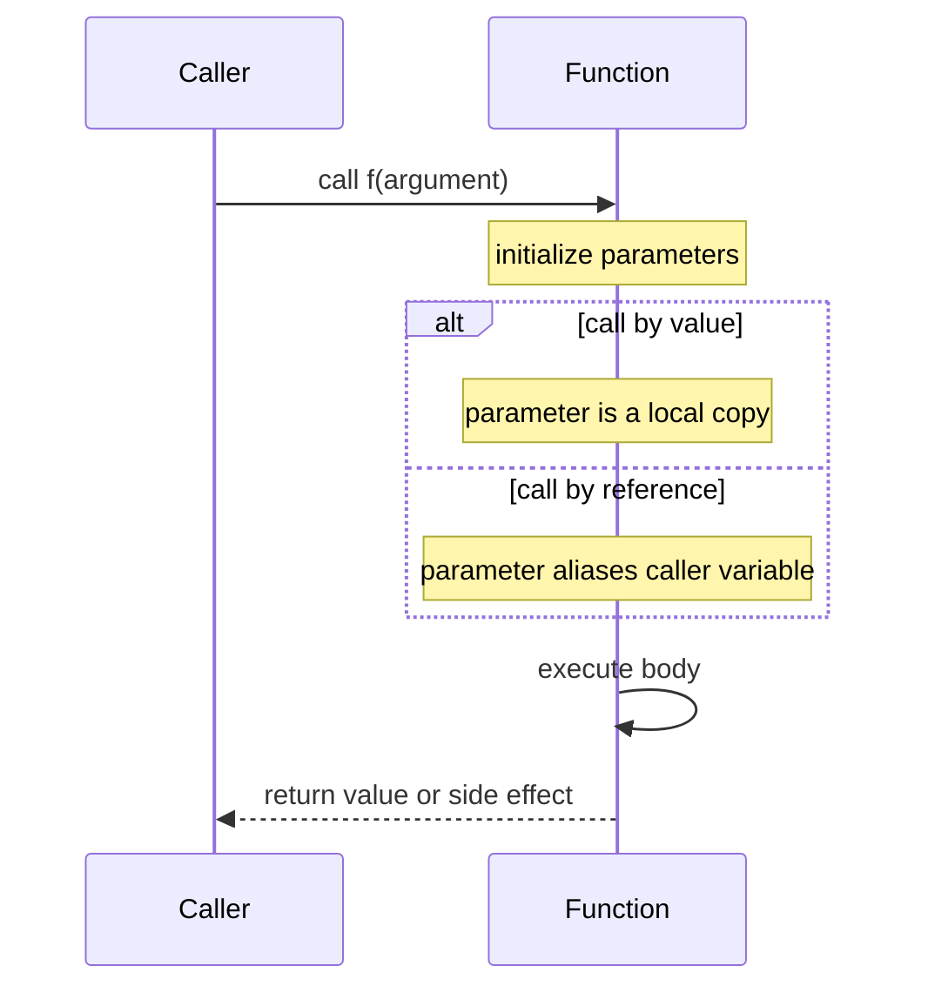

# Functions, Parameters, and Scope

Functions are the first major abstraction tool in C++. They let a program give a name to a computation, isolate local state, document preconditions and postconditions, and reuse one tested operation in many places. Savitch presents functions in two stages: first the mechanics of predefined and programmer-defined functions, then the parameter-passing rules that determine whether a function receives a copy of a value or direct access to the caller's variable.


*Figure: C++ extends systems programming with abstraction, generic code, and deterministic resource management. Image: [Wikimedia Commons](https://commons.wikimedia.org/wiki/File:ISO_C%2B%2B_Logo.svg), Jeremy Kratz, public domain text logo.*

The central discipline is to think about what a function promises, not only what lines of code it contains. A good function has a narrow purpose, a clear parameter list, and a return mode that matches the job. It either computes and returns a value, performs an action through side effects, or carefully combines both when that combination is justified.

## Definitions

A **function declaration** or **prototype** tells the compiler the function name, return type, and parameter types before the function is called.

```cpp
double unitPrice(int diameter, double price);
void swapValues(int& left, int& right);
```

A **function definition** gives the body.

```cpp
double unitPrice(int diameter, double price) {
    const double PI = 3.141592653589793;
    double radius = diameter / 2.0;
    double area = PI * radius * radius;
    return price / area;
}
```

A **parameter** is the placeholder in the declaration or definition. An **argument** is the expression supplied in a call.

```cpp
double cost = unitPrice(12, 13.50);
```

Here `diameter` and `price` are parameters; `12` and `13.50` are arguments.

A **value-returning function** computes an expression and returns it with `return`. A **void function** performs an action but does not return a value.

```cpp
void printLine(char ch, int count) {
    for (int i = 0; i < count; ++i) {
        std::cout << ch;
    }
    std::cout << '\n';
}
```

**Call by value** copies the argument value into a local parameter variable. Changes to the parameter do not change the caller's object.

```cpp
void addOne(int x) {
    x += 1; // changes only the local copy
}
```

**Call by reference** binds the parameter directly to the caller's variable. It is marked with `&`.

```cpp
void addOne(int& x) {
    x += 1; // changes the caller's variable
}
```

A **constant reference parameter** combines reference efficiency with protection against modification.

```cpp
void printName(const std::string& name) {
    std::cout << name << '\n';
}
```

**Scope** is the region of a program where a name can be used. Local variables are visible only inside their block. A nested block may introduce a new variable whose name hides an outer one.

## Key results

Function calls evaluate arguments first, initialize parameters, execute the function body, then return control to the caller. With call by value, the parameter is a new local variable. With call by reference, the parameter is another name for the caller's variable. This difference explains why `swap` needs references:

```cpp
void swapValues(int& a, int& b) {
    int temp = a;
    a = b;
    b = temp;
}
```

Without `&`, the function would only swap local copies.

Use parameter modes deliberately:

| Need | Preferred parameter mode | Reason |
|---|---|---|
| read a small value | by value, `int x` | simple and cheap |
| read a large object | by const reference, `const T& x` | avoids copy, prevents change |
| change caller's object | by non-const reference, `T& x` | communicates output or update |
| optional absence | pointer or modern wrapper | reference must bind to an object |

Function **overloading** lets multiple functions share a name when their parameter lists differ.

```cpp
double average(double a, double b) {
    return (a + b) / 2.0;
}

double average(double a, double b, double c) {
    return (a + b + c) / 3.0;
}
```

The compiler chooses the overload by matching argument count and types. A return type alone is not enough to distinguish overloads.

**Default arguments** provide values when the caller omits trailing arguments.

```cpp
double compound(double principal, double rate, int years = 1);
```

Defaults belong in the declaration visible to callers. They should not make calls ambiguous.

Preconditions and postconditions are not enforced by the language, but they are a compact way to specify the contract. `assert` can test assumptions during development:

```cpp
#include <cassert>

double divide(double numerator, double denominator) {
    assert(denominator != 0.0);
    return numerator / denominator;
}
```

## Visual



| Name category | Example | Lifetime | Scope |
|---|---|---|---|
| local variable | `int count` inside a function | created on block entry, destroyed on exit | block |
| formal parameter | `double price` | created for function call | function body |
| global constant | `const int MAX = 100` outside functions | whole program | from declaration onward |
| global variable | `int total` outside functions | whole program | from declaration onward |

## Worked example 1: choosing parameter modes for a pizza comparison

Problem: Given diameters and prices for two pizzas, decide which has lower price per square inch.

Method:

1. The unit price formula uses area.

$$
\mathrm{area} = \pi r^2
$$

2. Diameter is converted to radius.

$$
r = \frac{d}{2}
$$

3. Unit price is:

$$
\mathrm{unitPrice} = \frac{\mathrm{price}}{\mathrm{area}}
$$

4. The calculation does not change its inputs, so use call by value for small numeric parameters.
5. The function returns a `double`, because the computed unit price is a value.

```cpp
#include <iostream>

double unitPrice(int diameter, double price) {
    const double PI = 3.141592653589793;
    double radius = diameter / 2.0;
    double area = PI * radius * radius;
    return price / area;
}

int main() {
    int smallDiameter = 10;
    double smallPrice = 7.50;
    int largeDiameter = 13;
    double largePrice = 14.75;

    double smallUnit = unitPrice(smallDiameter, smallPrice);
    double largeUnit = unitPrice(largeDiameter, largePrice);

    if (smallUnit < largeUnit) {
        std::cout << "Small pizza is cheaper per square inch\n";
    } else {
        std::cout << "Large pizza is cheaper per square inch\n";
    }
}
```

Checked answer:

1. Small radius is `5`, area is about `78.54`.
2. Small unit price is `7.50 / 78.54`, about `0.0955`.
3. Large radius is `6.5`, area is about `132.73`.
4. Large unit price is `14.75 / 132.73`, about `0.1111`.
5. The small pizza is the better buy.

## Worked example 2: tracing value and reference parameters

Problem: Predict the output when a function receives one value parameter and one reference parameter.

```cpp
#include <iostream>

void update(int valueCopy, int& referenceAlias) {
    valueCopy += 10;
    referenceAlias += 10;
    std::cout << "inside: " << valueCopy << " "
              << referenceAlias << '\n';
}

int main() {
    int first = 1;
    int second = 2;
    update(first, second);
    std::cout << "outside: " << first << " "
              << second << '\n';
}
```

Method:

1. Before the call, `first == 1` and `second == 2`.
2. `valueCopy` is initialized from `first`, so `valueCopy == 1`.
3. `referenceAlias` binds to `second`, so it is not a copy.
4. `valueCopy += 10` makes the local copy `11`.
5. `referenceAlias += 10` changes `second` from `2` to `12`.
6. The function prints `inside: 11 12`.
7. After the function returns, `first` is still `1`; `second` is `12`.

Checked answer: the output is:

```text
inside: 11 12
outside: 1 12
```

## Code

This program uses a small function set, const references, reference output parameters, and overloads.

```cpp
#include <iostream>
#include <string>

void readScore(const std::string& label, int& score) {
    do {
        std::cout << label << " score (0-100): ";
        std::cin >> score;
    } while (score < 0 || score > 100);
}

double average(int a, int b) {
    return (a + b) / 2.0;
}

double average(int a, int b, int c) {
    return (a + b + c) / 3.0;
}

char letterGrade(double score) {
    if (score >= 90) return 'A';
    if (score >= 80) return 'B';
    if (score >= 70) return 'C';
    if (score >= 60) return 'D';
    return 'F';
}

int main() {
    int exam1;
    int exam2;
    int project;

    readScore("First exam", exam1);
    readScore("Second exam", exam2);
    readScore("Project", project);

    double examAverage = average(exam1, exam2);
    double courseAverage = average(exam1, exam2, project);

    std::cout << "Exam average: " << examAverage << '\n';
    std::cout << "Course average: " << courseAverage << '\n';
    std::cout << "Grade: " << letterGrade(courseAverage) << '\n';
}
```

## Common pitfalls

- Omitting a function prototype when the call appears before the definition.
- Confusing parameters with arguments. Parameters are in the function definition; arguments are supplied at the call site.
- Forgetting `&` on a parameter that is supposed to modify the caller's variable.
- Using a non-const reference for an input-only object, which prevents calls with temporaries and hides intent.
- Returning a reference to a local variable. The local object is destroyed when the function exits.
- Depending on globals instead of passing parameters. This makes the function harder to test and reuse.
- Overloading functions whose calls become ambiguous after implicit conversions.
- Putting default arguments in multiple declarations inconsistently.

Parameter-design checks:

- Use call-by-value when the function needs its own independent copy or when the value is small and cheap to copy, such as an `int`, `char`, or `double`.
- Use call-by-reference when the function's purpose is to modify the caller's object, as in `readInput(int& value)` or `swapValues(int& a, int& b)`.
- Use `const` reference for larger inputs that should not be modified. This communicates intent and avoids unnecessary copying for strings, vectors, and user-defined classes.
- Keep input parameters and output parameters visually distinct in the function name and documentation. If a function both computes and changes several arguments, consider returning a value or defining a small result type.
- Avoid hidden dependencies on global variables. A function whose result depends only on its parameters is easier to test, reuse, and reason about.
- Check each return path. Every non-`void` function should return a value on every possible path, including error branches and boundary cases.

## Connections

- [C++ basics and control flow](/cs/programming/cpp/cpp-basics-and-control-flow)
- [arrays](/cs/programming/cpp/arrays)
- [references and operator overloading](/cs/programming/cpp/references-and-operator-overloading)
- [templates](/cs/programming/cpp/templates)
- [recursion](/cs/programming/cpp/recursion)
