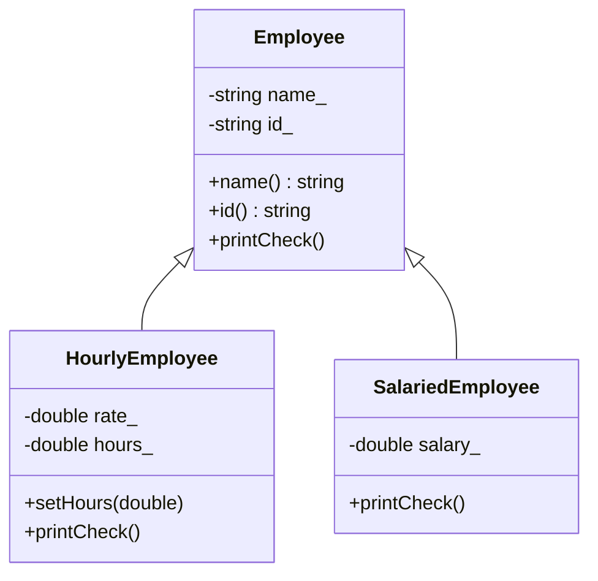

# Inheritance

Inheritance lets a class reuse and specialize another class. A derived class automatically has the data and ordinary member functions of its base class, then adds or redefines behavior for its more specific role. Savitch introduces inheritance through employee classes: an hourly employee and a salaried employee are both employees, but their pay calculations differ.


*Figure: C++ extends systems programming with abstraction, generic code, and deterministic resource management. Image: [Wikimedia Commons](https://commons.wikimedia.org/wiki/File:ISO_C%2B%2B_Logo.svg), Jeremy Kratz, public domain text logo.*

The most important design question is whether the relationship is truly "is a." If a `SalariedEmployee` is an `Employee`, inheritance may fit. If a `Car` has an `Engine`, composition is better. Inheritance is powerful, but using it where composition belongs creates brittle designs.

## Definitions

A **base class** defines common state and behavior.

```cpp
class Employee {
public:
    Employee(const std::string& name, const std::string& id);
    std::string name() const;
    std::string id() const;

private:
    std::string name_;
    std::string id_;
};
```

A **derived class** is declared with a base class list.

```cpp
class HourlyEmployee : public Employee {
public:
    HourlyEmployee(const std::string& name,
                   const std::string& id,
                   double rate);
private:
    double rate_;
};
```

With **public inheritance**, public base members remain public in the derived class. This models substitutability: a derived object can be used where a base object is expected.

A derived class **inherits** ordinary base-class member functions and member variables. Constructors are not inherited in the older style Savitch presents; a derived constructor calls a base constructor in its initialization list.

```cpp
HourlyEmployee::HourlyEmployee(const std::string& name,
                               const std::string& id,
                               double rate)
    : Employee(name, id), rate_(rate) {}
```

A derived class may **redefine** a base member function by declaring and defining a function with the same signature. If the base function is virtual, the derived definition **overrides** it; that dynamic behavior is covered with polymorphism.

The `protected` access level makes a member accessible to derived classes but not to ordinary client code.

## Key results

Construction proceeds from base to derived:

1. Base class constructor runs first.
2. Derived member objects are initialized.
3. Derived constructor body runs.

Destruction proceeds in reverse:

1. Derived destructor body runs.
2. Derived members are destroyed.
3. Base destructor runs.

Private base members exist inside derived objects, but derived member functions cannot access them by name. They must use public or protected base functions.

```cpp
// Not allowed if name_ is private in Employee:
// std::cout << name_;

// Allowed:
std::cout << name();
```

This preserves encapsulation. If derived classes could freely access base private data, any programmer could bypass the base interface by creating a derived class.

Public inheritance enables upward conversion:

```cpp
HourlyEmployee hourly("Ada", "E101", 40.0);
Employee base = hourly;
```

However, assigning a derived object into a base object slices away the derived part. The base object keeps only the base subobject. Polymorphism with pointers or references is the usual way to avoid slicing when behavior must remain derived-specific.

Inheritance and copy control interact. Derived assignment should account for the base part and the derived part. If dynamic memory is involved, both levels need correct ownership behavior.

## Visual



| Relationship | Use inheritance? | Example |
|---|---:|---|
| "is a" | usually | `HourlyEmployee` is an `Employee` |
| "has a" | no, use composition | `Employee` has an `Address` |
| "uses a" | no, use parameter/member | `ReportPrinter` uses an `ostream` |
| "implemented in terms of" | usually composition | `Stack` implemented with `vector` |

## Worked example 1: calling a base constructor

Problem: Define `HourlyEmployee` so it initializes the inherited name and id through the `Employee` constructor.

Method:

1. `Employee` owns `name_` and `id_`.
2. `HourlyEmployee` owns `rate_` and `hours_`.
3. The derived constructor must initialize the base subobject first.
4. Use `: Employee(name, id), rate_(rate), hours_(0.0)`.

```cpp
#include <iostream>
#include <string>

class Employee {
public:
    Employee(std::string name, std::string id)
        : name_(name), id_(id) {}

    std::string name() const {
        return name_;
    }

    std::string id() const {
        return id_;
    }

private:
    std::string name_;
    std::string id_;
};

class HourlyEmployee : public Employee {
public:
    HourlyEmployee(std::string name, std::string id, double rate)
        : Employee(name, id), rate_(rate), hours_(0.0) {}

    void setHours(double hours) {
        hours_ = hours;
    }

    double pay() const {
        return rate_ * hours_;
    }

private:
    double rate_;
    double hours_;
};

int main() {
    HourlyEmployee worker("Ada", "E101", 25.0);
    worker.setHours(8.0);
    std::cout << worker.name() << " " << worker.pay() << '\n';
}
```

Checked answer: inherited `name()` returns `"Ada"`, and pay is:

$$25.0 \times 8.0 = 200.0$$

## Worked example 2: private base data and accessor use

Problem: A derived `SalariedEmployee` needs to print the employee name, but `Employee::name_` is private.

Method:

1. Do not make `name_` public.
2. Provide `Employee::name() const`.
3. Call `name()` inside the derived member function.
4. This preserves the base class representation.

```cpp
#include <iostream>
#include <string>

class Employee {
public:
    Employee(std::string name) : name_(name) {}

    std::string name() const {
        return name_;
    }

private:
    std::string name_;
};

class SalariedEmployee : public Employee {
public:
    SalariedEmployee(std::string name, double salary)
        : Employee(name), salary_(salary) {}

    void printCheck() const {
        std::cout << "Pay to " << name() << ": " << salary_ << '\n';
    }

private:
    double salary_;
};

int main() {
    SalariedEmployee employee("Grace", 1500.0);
    employee.printCheck();
}
```

Checked answer: the function prints `Pay to Grace: 1500`. It accesses the name through the public base interface rather than touching private storage.

## Code

This example shows redefinition without virtual dispatch. The static type of the object determines which function is called unless virtual functions and references/pointers are used.

```cpp
#include <iostream>
#include <string>

class Employee {
public:
    explicit Employee(std::string name) : name_(name) {}

    void describe() const {
        std::cout << "Employee: " << name_ << '\n';
    }

private:
    std::string name_;
};

class Contractor : public Employee {
public:
    Contractor(std::string name, std::string agency)
        : Employee(name), agency_(agency) {}

    void describe() const {
        Employee::describe();
        std::cout << "Agency: " << agency_ << '\n';
    }

private:
    std::string agency_;
};

int main() {
    Contractor contractor("Lin", "Systems Group");
    contractor.describe();
}
```

## Common pitfalls

- Using inheritance for "has a" relationships.
- Expecting a derived class to access private base members directly.
- Forgetting to call the right base constructor in a derived constructor.
- Confusing redefining with overloading.
- Forgetting that constructors, destructors, and assignment have special inheritance rules.
- Assigning derived objects into base variables and accidentally slicing derived data.
- Overusing `protected` data and weakening base-class encapsulation.
- Forgetting that public inheritance is a promise of substitutability.

Hierarchy-design checks:

- Test the substitution rule: anywhere a base object is expected, a derived object should make sense without surprising the caller. If this is false, public inheritance is probably the wrong relationship.
- Keep base classes stable and small. Every public or protected member becomes part of the contract inherited by derived classes, so a large base interface creates many ways to break substitutability.
- Prefer private data in the base class plus protected or public member functions when derived classes need controlled access. Protected data often turns representation details into long-term obligations.
- Put shared behavior in the base class only when it is truly common. If a derived class must constantly ignore or work around inherited functions, the hierarchy is sending the wrong message.
- Separate "is a" from "uses a." A `Rectangle` may use two `Point` objects, but it is not a `Point`. Composition keeps that relationship explicit.
- Check constructor order when debugging initialization. Base-class constructors run before derived-class constructors, and derived destructors run before base destructors.
- If the hierarchy will be used polymorphically, design the base class with virtual functions from the start. Retrofitting virtual behavior later can change semantics throughout the program.

Quick self-test: write three ordinary-language statements about the hierarchy. "A savings account is an account" supports public inheritance. "A car has an engine" supports composition. "A file logger uses an output stream" suggests membership or dependency, not inheritance. This language test is not a formal proof, but it catches many designs that use inheritance only to borrow code.

Another useful check is to read every inherited public function from the derived-class point of view. If a derived class cannot honestly support one of those inherited operations, clients will eventually discover the mismatch through surprising behavior. That is a design problem, not just an implementation detail.

A final review question is whether the base class represents a real abstraction or just a convenient storage bundle. If derived classes share data but not behavior, a helper object or member variable may be better. Inheritance is strongest when clients can program against the base interface and remain deliberately unaware of the derived class they are using.

Extended practice: implement the same example once with inheritance and once with composition. If the composition version has fewer special cases and clearer construction, keep composition. If the inheritance version lets a caller use several derived objects through one base interface without checking their exact types, inheritance is earning its place.

One last check: if a base pointer will own derived objects, the base destructor belongs in the public virtual interface.

## Connections

- [classes and encapsulation](/cs/programming/cpp/classes-and-encapsulation)
- [constructors and copy semantics](/cs/programming/cpp/constructors-and-copy-semantics)
- [polymorphism](/cs/programming/cpp/polymorphism-and-virtual-functions)
- [pointers and dynamic memory](/cs/programming/cpp/pointers-and-dynamic-memory)
- [templates](/cs/programming/cpp/templates)
