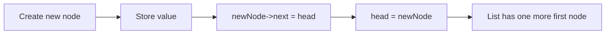

# Linked Data Structures

Linked data structures store data in nodes connected by pointers. Unlike arrays, the nodes do not need to occupy one contiguous block of memory. This makes linked structures useful when a collection grows, shrinks, or rearranges frequently, but the flexibility comes with pointer management responsibilities.

Savitch's linked-list material builds directly on pointers, dynamic memory, classes, destructors, and copy control. A node allocated with `new` must eventually be released with `delete`, and a class that owns a chain of nodes needs a destructor, copy constructor, and assignment operator if it allows copying.

## Definitions

A **node** is a small object that stores data plus one or more links to other nodes. A singly linked list node usually has a data field and a pointer to the next node:

```cpp
struct Node {
    int data;
    Node* next;
};
```

The **head pointer** points to the first node in the list. The empty list is represented by `head == nullptr`.

```text
head
 |
 v
+----+------+     +----+------+     +----+------+
| 10 |  *---+---->| 20 |  *---+---->| 30 | null |
+----+------+     +----+------+     +----+------+
```

A **linked list** is a sequence of nodes where each node points to the next. A **stack** can be implemented by inserting and removing at the head. A **queue** can be implemented with both front and back pointers. A **tree** uses nodes with multiple child pointers.

A **traversal** walks through a linked structure by following links:

```cpp
for (Node* p = head; p != nullptr; p = p->next) {
    cout << p->data << endl;
}
```

## Key results

Inserting at the front of a singly linked list is constant time because it changes only two pointers:

```cpp
Node* newNode = new Node;
newNode->data = value;
newNode->next = head;
head = newNode;
```

Searching a linked list is linear time because there is no direct indexing. To find a value, a program may need to inspect every node:

$$
T(n) = O(n)
$$

Deleting a node requires preserving the link to the rest of the list before releasing memory. To delete the head:

```cpp
Node* doomed = head;
head = head->next;
delete doomed;
```

To delete a node after a pointer `before`, update `before->next` to skip the doomed node:

```cpp
Node* doomed = before->next;
before->next = doomed->next;
delete doomed;
```

A class that owns a linked list must obey the same resource-management rule introduced for dynamic arrays: if it defines a destructor, it usually also needs a copy constructor and assignment operator. Otherwise, two list objects may point to the same nodes, causing double deletion or accidental shared mutation.

The central invariant for a well-formed singly linked list is: starting at `head`, following `next` pointers eventually reaches `nullptr` and does not revisit a node. Operations preserve this invariant by connecting new nodes before exposing them through `head`, and by bypassing deleted nodes before freeing them.

## Visual



| Operation | Array cost | Singly linked list cost | Reason |
|---|---:|---:|---|
| Access item by index | `O(1)` | `O(n)` | Linked list must follow links |
| Insert at front | `O(n)` | `O(1)` | Array shifts; list relinks head |
| Delete after known node | `O(n)` shift | `O(1)` | List changes one link |
| Search by value | `O(n)` | `O(n)` | Both may inspect many elements |
| Extra memory per item | Low | Higher | List stores pointer field |

## Worked example 1: Inserting at the head

Problem: Start with an empty list and insert `30`, then `20`, then `10` at the head. What is the final list?

Method:

1. Begin empty:

   ```text
   head = null
   ```

2. Insert `30`:

   ```cpp
   newNode->data = 30;
   newNode->next = head;  // null
   head = newNode;
   ```

   List:

   ```text
   head -> 30 -> null
   ```

3. Insert `20`:

   ```cpp
   newNode->data = 20;
   newNode->next = head;  // old 30 node
   head = newNode;
   ```

   List:

   ```text
   head -> 20 -> 30 -> null
   ```

4. Insert `10`:

   ```cpp
   newNode->data = 10;
   newNode->next = head;  // old 20 node
   head = newNode;
   ```

Checked answer:

```text
head -> 10 -> 20 -> 30 -> null
```

Head insertion reverses the order of insertion because each new value becomes the first node.

## Worked example 2: Deleting a middle node

Problem: A list contains `10 -> 20 -> 30 -> 40 -> null`. A pointer `before` points to the node containing `20`. Delete the following node.

Method:

1. Identify the node to delete:

   ```text
   before -> [20 | next] -> [30 | next] -> [40 | null]
   ```

   So `before->next` is the node containing `30`.

2. Save that pointer:

   ```cpp
   Node* doomed = before->next;
   ```

3. Link around it:

   ```cpp
   before->next = doomed->next;
   ```

   Now the logical list is:

   ```text
   10 -> 20 -> 40 -> null
   ```

4. Release the removed node:

   ```cpp
   delete doomed;
   ```

Checked answer: the value `30` is removed, `20` now points to `40`, and no allocated node has been leaked.

## Code

```cpp
#include <iostream>
using namespace std;

class IntList {
private:
    struct Node {
        int data;
        Node* next;
    };

public:
    IntList() : head(nullptr) {}

    IntList(const IntList& other) : head(nullptr) {
        Node* tail = nullptr;
        for (Node* p = other.head; p != nullptr; p = p->next) {
            Node* copy = new Node{p->data, nullptr};
            if (head == nullptr) {
                head = copy;
                tail = copy;
            } else {
                tail->next = copy;
                tail = copy;
            }
        }
    }

    ~IntList() {
        clear();
    }

    IntList& operator=(const IntList& right) {
        if (this == &right) {
            return *this;
        }

        IntList temp(right);
        swapHeads(temp);
        return *this;
    }

    void pushFront(int value) {
        Node* newNode = new Node{value, head};
        head = newNode;
    }

    bool contains(int value) const {
        for (Node* p = head; p != nullptr; p = p->next) {
            if (p->data == value) {
                return true;
            }
        }
        return false;
    }

    void print() const {
        for (Node* p = head; p != nullptr; p = p->next) {
            cout << p->data << " ";
        }
        cout << endl;
    }

private:
    Node* head;

    void clear() {
        while (head != nullptr) {
            Node* doomed = head;
            head = head->next;
            delete doomed;
        }
    }

    void swapHeads(IntList& other) {
        Node* temp = head;
        head = other.head;
        other.head = temp;
    }
};

int main() {
    IntList list;
    list.pushFront(30);
    list.pushFront(20);
    list.pushFront(10);

    list.print();
    cout << boolalpha << list.contains(20) << endl;

    IntList copy = list;
    copy.pushFront(5);
    copy.print();
    list.print();
}
```

```cpp
#include <iostream>
using namespace std;

struct Node {
    int data;
    Node* next;
};

int length(Node* head) {
    int count = 0;
    for (Node* p = head; p != nullptr; p = p->next) {
        ++count;
    }
    return count;
}

int main() {
    Node third = {30, nullptr};
    Node second = {20, &third};
    Node first = {10, &second};

    cout << length(&first) << endl;
}
```

## Common pitfalls

- Losing the rest of the list by overwriting `head` before storing the old value in `newNode->next`.
- Deleting a node and then reading `doomed->next`. Save all needed links before `delete`.
- Forgetting to delete dynamically allocated nodes in the destructor.
- Allowing the default copy constructor for a class that owns nodes. The default copy is shallow and makes two list objects share the same chain.
- Treating linked lists as if they had constant-time indexing. To reach item `i`, the program follows `i` links.
- Failing to handle the empty-list and one-node-list cases separately when they need special pointer updates.

Pointer-tracing checks:

- Draw the list before and after every insertion or deletion. Label `head`, any traversal pointer, and the node that will be deleted. Many linked-list bugs become obvious when the arrows are visible.
- Never overwrite the only pointer to a node unless another pointer already reaches that node. Losing the last pointer to allocated memory creates a leak because the program has no address to pass to `delete`.
- Treat deletion as two separate actions: first remove the node from the chain, then release its memory. Reversing the order makes it tempting to read through a dangling pointer.
- Test operations on the empty list, the first node, a middle node, and the last node. A deletion function that works only for the middle case is incomplete.
- For a class-owned list, decide whether copying is allowed. If copying is not meaningful, disable it; if it is meaningful, implement a deep copy so each list owns its own nodes.
- Keep traversal loops simple. A loop that advances two or three pointers at once should have a clear invariant, such as "`previous` is always the node before `current`."
- Prefer STL containers in application code unless the goal is to study links directly. `list`, `vector`, `queue`, and `stack` already implement ownership and cleanup correctly.

Quick self-test: for every pointer variable in a linked-list function, state what it points to before the loop, during one middle iteration, and after the loop. If a pointer's meaning changes from "current node" to "previous node" halfway through the function, rename it or split the logic. Clear pointer roles are more reliable than clever pointer movement.

When debugging, print node addresses as well as data values if the output looks impossible. Seeing two list objects print the same node addresses is strong evidence of a shallow copy. Seeing a cycle of repeated addresses explains an infinite traversal loop.

A final review question is whether every path through the operation preserves reachability. After insertion, the new node should be reachable from `head`. After deletion, the remaining nodes should still be reachable, and the deleted node should no longer be reachable from the list.

## Connections

- [pointers and dynamic memory](/cs/programming/cpp/pointers-and-dynamic-memory)
- [constructors and copy semantics](/cs/programming/cpp/constructors-and-copy-semantics)
- [recursion](/cs/programming/cpp/recursion)
- [stl containers](/cs/programming/cpp/stl-containers)
- [classes and encapsulation](/cs/programming/cpp/classes-and-encapsulation)
