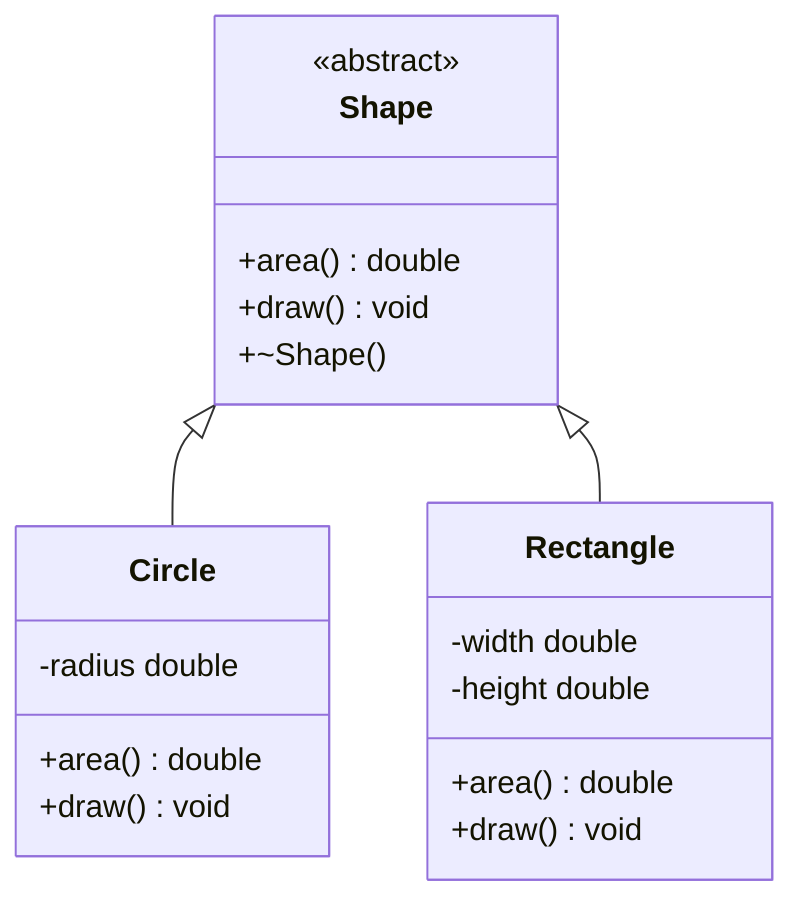

# Polymorphism and Virtual Functions

Inheritance lets a derived class reuse and specialize a base class, but polymorphism is what lets a program treat related objects through a common interface while still running the derived behavior. In Savitch's treatment, this is the point where an inheritance hierarchy becomes more than shared code: a base-class pointer or reference can refer to objects of several derived types, and a virtual member function chooses the right implementation at run time.

This matters whenever a program should work with a general concept such as a sale, employee, shape, account, or stream, while the exact subtype is not known until the program is running. The cost is that the programmer must design the base interface carefully, avoid slicing, and remember that destruction through a base pointer needs a virtual destructor.

## Definitions

A **virtual function** is a member function declared with the keyword `virtual` in a base class. When a virtual function is called through a base-class pointer or reference, C++ uses the dynamic type of the object to select the function body.

```cpp
class Sale {
public:
    virtual double bill() const;
};
```

**Static binding** means the compiler decides the function call at compile time. Ordinary nonvirtual member function calls use static binding. **Dynamic binding** means the function body is selected at run time according to the actual object type.

A **base-class pointer** can point to a derived object:

```cpp
Sale regular(100.0);
DiscountSale discount(100.0, 0.20);

Sale* p = &discount;     // allowed if DiscountSale publicly derives from Sale
```

A **base-class reference** can bind to a derived object:

```cpp
void printBill(const Sale& sale) {
    cout << sale.bill() << endl; // dynamic binding if bill is virtual
}
```

A **pure virtual function** has the form `virtual double area() const = 0;`. A class with at least one pure virtual function is an **abstract class**. Abstract classes cannot be instantiated directly, but they can define an interface and hold shared behavior for derived classes.

Object **slicing** occurs when a derived object is copied into a base object. The base subobject is copied, but derived-only data is discarded. Slicing prevents polymorphic behavior because the result is no longer a derived object.

```cpp
DiscountSale d(100.0, 0.20);
Sale s = d;              // slicing: s is a Sale, not a DiscountSale
```

## Key results

If a member function should behave differently for different derived classes, declare it virtual in the base class. The `virtual` keyword is needed in the base-class declaration; derived declarations are also commonly marked `virtual` or `override` in modern C++, but the essential decision begins in the base interface.

Dynamic binding requires both of the following:

1. The function is virtual.
2. The call is made through a pointer or reference to the base class.

For example, if `Sale::bill` is virtual, then `saleRef.bill()` chooses `DiscountSale::bill` when `saleRef` refers to a `DiscountSale`. If `bill` is not virtual, `Sale::bill` is used because the static type of the expression is `Sale`.

Constructors are not virtual. A constructor builds an object from the base part upward, so there is no complete derived object to dispatch to at the start. Destructors, however, often should be virtual in polymorphic base classes. If a derived object is deleted through a base pointer and the base destructor is not virtual, the derived destructor may not run correctly.

```cpp
class Shape {
public:
    virtual ~Shape() {}
    virtual double area() const = 0;
};
```

Abstract base classes are useful when the base concept is real but incomplete. A generic `Shape` can promise that every shape has an area, but only a `Circle`, `Rectangle`, or `Triangle` can define the actual formula.

A short proof sketch for dynamic dispatch is design-based rather than algebraic. The compiler knows the static type of a base pointer, but the object it points to can vary at run time. A virtual function call therefore cannot be fully resolved from the pointer's declared type. The implementation stores enough class information with the object to choose the final override when the call happens.

## Visual



| Call form | Virtual? | Object expression | Binding result |
|---|---:|---|---|
| `base.bill()` | Yes | Base object | Calls base version because the object is base |
| `baseRef.bill()` | Yes | Base reference to derived object | Calls derived override |
| `basePtr->bill()` | Yes | Base pointer to derived object | Calls derived override |
| `baseRef.bill()` | No | Base reference to derived object | Calls base version |
| `baseObject = derivedObject; baseObject.bill()` | Yes | Sliced base object | Calls base version |

## Worked example 1: Computing bills through a base reference

Problem: A regular sale costs `$100.00`. A discount sale has the same starting price but gives a `25%` discount. A reporting function accepts `const Sale&`. Which bill should it print for each object?

Method:

1. Define the base behavior:

   ```cpp
   class Sale {
   public:
       Sale(double price) : price(price) {}
       virtual double bill() const { return price; }
       virtual ~Sale() {}
   private:
       double price;
   };
   ```

2. Define the derived behavior:

   ```cpp
   class DiscountSale : public Sale {
   public:
       DiscountSale(double price, double discount)
           : Sale(price), discount(discount), original(price) {}

       double bill() const override {
           return original * (1.0 - discount);
       }
   private:
       double discount;
       double original;
   };
   ```

3. Call through a base reference:

   ```cpp
   void printBill(const Sale& sale) {
       cout << sale.bill() << endl;
   }
   ```

4. Evaluate each call:

   - `printBill(regular)` binds `sale` to an actual `Sale`, so `Sale::bill()` returns `100.00`.
   - `printBill(discount)` binds `sale` to an actual `DiscountSale`, so dynamic binding selects `DiscountSale::bill()`.
   - The discount bill is:

$$
100.00(1 - 0.25) = 100.00(0.75) = 75.00
$$

Checked answer: the regular sale prints `100`, and the discount sale prints `75`. The key check is that the call uses a reference and `bill` is virtual.

## Worked example 2: Detecting object slicing

Problem: A program has a `Pet` base class and a `Dog` derived class. The base class has a virtual `speak` function. Compare these three cases:

```cpp
Dog dog("Rex");
Pet pet = dog;
Pet& petRef = dog;
Pet* petPtr = &dog;
```

Method:

1. `Dog dog("Rex");` creates a complete `Dog` object. It contains a `Pet` base part plus any `Dog` data.

2. `Pet pet = dog;` creates a separate `Pet` object from the base part of `dog`. Derived data is not present in `pet`.

3. `Pet& petRef = dog;` creates a reference to the existing `Dog`. No new object is created and no slicing happens.

4. `Pet* petPtr = &dog;` stores the address of the existing `Dog` in a base-class pointer. Again, no slicing happens.

5. If `speak` is virtual:

   - `pet.speak()` calls `Pet::speak()` because `pet` is actually a `Pet`.
   - `petRef.speak()` calls `Dog::speak()` because `petRef` refers to a `Dog`.
   - `petPtr->speak()` calls `Dog::speak()` because `petPtr` points to a `Dog`.

Checked answer: the assignment `Pet pet = dog;` is the slicing case. The reference and pointer forms preserve polymorphism.

## Code

```cpp
#include <cmath>
#include <iostream>
#include <vector>
using namespace std;

class Shape {
public:
    virtual ~Shape() {}
    virtual double area() const = 0;
    virtual void print() const = 0;
};

class Circle : public Shape {
public:
    explicit Circle(double radius) : radius(radius) {}

    double area() const override {
        return 3.141592653589793 * radius * radius;
    }

    void print() const override {
        cout << "circle radius=" << radius << " area=" << area() << endl;
    }

private:
    double radius;
};

class Rectangle : public Shape {
public:
    Rectangle(double width, double height) : width(width), height(height) {}

    double area() const override {
        return width * height;
    }

    void print() const override {
        cout << "rectangle " << width << "x" << height
             << " area=" << area() << endl;
    }

private:
    double width;
    double height;
};

int main() {
    Circle c(2.0);
    Rectangle r(3.0, 4.0);

    vector<Shape*> shapes;
    shapes.push_back(&c);
    shapes.push_back(&r);

    for (size_t i = 0; i < shapes.size(); ++i) {
        shapes[i]->print();
    }

    return 0;
}
```

```cpp
#include <iostream>
using namespace std;

class Account {
public:
    explicit Account(double balance) : balance(balance) {}
    virtual ~Account() {}

    virtual void monthEnd() {
        cout << "ordinary account: no interest" << endl;
    }

protected:
    double balance;
};

class SavingsAccount : public Account {
public:
    SavingsAccount(double balance, double rate)
        : Account(balance), rate(rate) {}

    void monthEnd() override {
        balance += balance * rate;
        cout << "savings balance after interest: " << balance << endl;
    }

private:
    double rate;
};

void closeMonth(Account& account) {
    account.monthEnd();
}

int main() {
    Account checking(200.0);
    SavingsAccount savings(1000.0, 0.03);

    closeMonth(checking);
    closeMonth(savings);
}
```

## Common pitfalls

- Declaring an override in the derived class but forgetting `virtual` in the base class. The call will be statically bound when made through a base pointer or reference.
- Passing polymorphic objects by value. This slices derived objects and removes the part that dynamic binding needs.
- Deleting through a base pointer when the base destructor is not virtual.
- Confusing overloading with overriding. Overloading means same function name with different parameter lists; overriding means redefining a virtual base function with a compatible signature.
- Changing the parameter type or `const` qualifier accidentally. `double area()` does not override `double area() const`.
- Using inheritance where a simple member object would express the design better. Polymorphism is for an "is a" relationship with substitutable behavior.

## Connections

- [inheritance](/cs/programming/cpp/inheritance)
- [classes and encapsulation](/cs/programming/cpp/classes-and-encapsulation)
- [constructors and copy semantics](/cs/programming/cpp/constructors-and-copy-semantics)
- [references and operator overloading](/cs/programming/cpp/references-and-operator-overloading)
- [templates](/cs/programming/cpp/templates)
