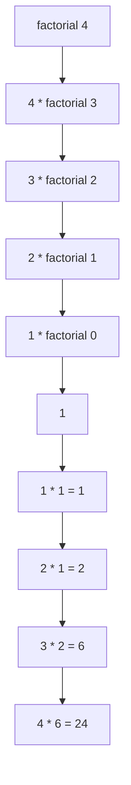

# Recursion

Recursion is a way to solve a problem by reducing it to smaller versions of the same problem. A recursive function calls itself directly or indirectly. Savitch presents recursion as a design technique, not a magic trick: identify a base case that needs no recursive call, identify a recursive case that moves closer to the base case, and trust the smaller call to do the smaller job.

Recursion is especially natural for numbers written digit by digit, divide-and-conquer search, tree traversal, expression parsing, and backtracking. It is not always faster than iteration, but it can make the structure of a solution match the structure of the problem.

## Definitions

A **recursive function** contains a call to itself, directly or through another function.

```cpp
void countdown(int n) {
    if (n <= 0) {
        return;
    }
    std::cout << n << '\n';
    countdown(n - 1);
}
```

A **base case** or **stopping case** handles a small input without recursion.

```cpp
if (n == 0) {
    return 1;
}
```

A **recursive case** calls the same function on a smaller or simpler input.

```cpp
return n * factorial(n - 1);
```

The **call stack** stores activation frames for active function calls. Each recursive call gets its own parameters and local variables.

**Stack overflow** occurs when recursive calls are too deep for available stack memory, often because a base case is missing or unreachable.

**Tail recursion** occurs when the recursive call is the final action of the function. Some compilers can optimize simple tail recursion, but C++ does not require all such calls to be optimized.

## Key results

Every correct recursive function needs progress toward a base case. A common proof structure is induction:

1. Prove the base case is correct.
2. Assume the function works for smaller inputs.
3. Show the recursive case uses those smaller correct results to solve the current input.

For factorial:

$$
0! = 1
$$

and for $n \gt  0$:

$$
n! = n(n - 1)!
$$

The recursive function:

```cpp
int factorial(int n) {
    if (n == 0) {
        return 1;
    }
    return n * factorial(n - 1);
}
```

follows the formula directly.

Recursion can use more memory than iteration because every active call occupies stack space. For a simple `factorial(n)`, recursion depth is `n + 1`, so stack usage is $O(n)$. An iterative version can use $O(1)$ extra stack space.

Binary search is a recursive design pattern over sorted arrays. It compares with the middle element, then searches only the left or right half.

$$
T(n) = T(n / 2) + O(1)
$$

This yields $O(\log n)$ comparisons.

Mutual recursion occurs when functions call each other. For example, `isEven(n)` may call `isOdd(n - 1)`, and `isOdd(n)` may call `isEven(n - 1)`.

## Visual



| Problem shape | Recursive pattern | Base case |
|---|---|---|
| digits of a number | process `n / 10`, then `n % 10` | `n < 10` |
| factorial | `n * factorial(n - 1)` | `n == 0` |
| sum array range | first element plus sum of rest | empty range |
| binary search | search half of range | empty range or match |
| tree traversal | visit child subtrees | null child |

## Worked example 1: writing digits vertically

Problem: Write the digits of `1234` one per line.

Method:

1. If the number is one digit, print it.
2. Otherwise, print all digits except the last using a recursive call.
3. Then print the last digit.
4. For integer arithmetic:

$$
1234 / 10 = 123
$$

   $$1234 \% 10 = 4$$

```cpp
#include <iostream>

void writeVertical(int n) {
    if (n < 10) {
        std::cout << n << '\n';
    } else {
        writeVertical(n / 10);
        std::cout << n % 10 << '\n';
    }
}

int main() {
    writeVertical(1234);
}
```

Trace:

1. `writeVertical(1234)` calls `writeVertical(123)`, then plans to print `4`.
2. `writeVertical(123)` calls `writeVertical(12)`, then plans to print `3`.
3. `writeVertical(12)` calls `writeVertical(1)`, then plans to print `2`.
4. `writeVertical(1)` prints `1`.
5. The suspended calls resume and print `2`, then `3`, then `4`.

Checked answer:

```text
1
2
3
4
```

## Worked example 2: recursive binary search

Problem: In the sorted array `{2, 5, 9, 14, 20, 33, 41}`, find the index of `20`.

Method:

1. Search range `low = 0`, `high = 6`.
2. Middle index is:

$$
\lfloor(0 + 6) / 2\rfloor = 3
$$

   `a[3] == 14`.
3. Since `20 > 14`, search right half: `low = 4`, `high = 6`.
4. Middle index is:

$$
\lfloor(4 + 6) / 2\rfloor = 5
$$

   `a[5] == 33`.
5. Since `20 < 33`, search left half: `low = 4`, `high = 4`.
6. Middle index is `4`.
7. `a[4] == 20`, so return `4`.

```cpp
#include <iostream>

int binarySearch(const int a[], int low, int high, int target) {
    if (low > high) {
        return -1;
    }

    int mid = low + (high - low) / 2;
    if (a[mid] == target) {
        return mid;
    }
    if (target < a[mid]) {
        return binarySearch(a, low, mid - 1, target);
    }
    return binarySearch(a, mid + 1, high, target);
}

int main() {
    int data[] = {2, 5, 9, 14, 20, 33, 41};
    std::cout << binarySearch(data, 0, 6, 20) << '\n';
}
```

Checked answer: the function returns index `4`.

## Code

This program demonstrates mutual recursion for even and odd numbers.

```cpp
#include <cstdlib>
#include <iostream>

bool isOdd(int n);

bool isEven(int n) {
    if (n < 0) {
        n = -n;
    }
    if (n == 0) {
        return true;
    }
    return isOdd(n - 1);
}

bool isOdd(int n) {
    if (n < 0) {
        n = -n;
    }
    if (n == 0) {
        return false;
    }
    return isEven(n - 1);
}

int main() {
    for (int n = 0; n <= 5; ++n) {
        std::cout << n << " even? " << std::boolalpha << isEven(n) << '\n';
    }
}
```

## Common pitfalls

- Missing a base case.
- Writing a recursive case that does not make the input smaller or simpler.
- Trusting recursion without checking the first few traces by hand.
- Duplicating expensive recursive calls, such as naive Fibonacci, and accidentally creating exponential work.
- Using recursion where an iterative loop is clearer and safer.
- Forgetting that every recursive call has separate local variables.
- Causing stack overflow with extremely deep recursion.
- Modifying global state in recursive functions without carefully undoing it during backtracking.

Recursion-design checks:

- Identify the measure that gets smaller on every recursive call. For factorial it is `n`; for a list it might be the number of remaining nodes; for a binary search it is the length of the current interval.
- Write the base case before the recursive case. If the base case is unclear, the recursive version is probably not ready to code.
- Check that the recursive call uses a strictly smaller or simpler problem. A call such as `f(n)` from inside `f(n)` is immediate infinite recursion; a call such as `f(n - 1)` still fails if `n` can become negative without a base case.
- Decide what each call returns. Many recursive bugs happen because the programmer makes the recursive call but forgets to use or return its result.
- Trace a small input completely. For a function on `n`, try `n = 0`, `n = 1`, and `n = 2` before trusting larger inputs.
- Separate "do work before the recursive call" from "do work after the recursive call." The first gives forward-order behavior; the second often gives reverse-order behavior.
- Watch stack depth. Recursion is elegant for trees and divide-and-conquer algorithms, but a simple loop may be safer for a million-element linear process.

Quick self-test: write the recursive function's contract without mentioning recursion. For example, "`sum(a, n)` returns the sum of the first `n` values" is clearer than "`sum` calls itself on a smaller array." The recursive case should then combine one small piece of work with a call that satisfies the same contract for a smaller input.

For debugging, add temporary output that prints the argument at function entry and just before returning. The indentation depth can be increased on each call. This makes the call tree visible and helps separate two common failures: never reaching the base case, and reaching the base case but combining the returned values incorrectly.

A final review question is whether the recursive solution mirrors the structure of the data. Recursion is natural for trees because each subtree is itself a tree. It is also natural for divide-and-conquer ranges because each subrange is the same kind of problem. For simple counting loops, recursion may add stack cost without adding clarity.

Extended practice: convert a simple loop to recursion and then convert it back. The loop version usually carries state in variables; the recursive version carries state in parameters and return values. Seeing the same computation in both forms clarifies which parts are essential and which parts are artifacts of the chosen control structure.

Also compare tail-recursive and non-tail-recursive shapes. A tail-recursive function returns the recursive call directly, while a non-tail-recursive function still has work to do after the call returns. That difference affects tracing and, in some languages, optimization.

## Connections

- [functions and parameters](/cs/programming/cpp/functions-parameters-and-scope)
- [arrays](/cs/programming/cpp/arrays)
- [linked data structures](/cs/programming/cpp/linked-data-structures)
- [STL algorithms and iterators](/cs/programming/cpp/stl-algorithms-and-iterators)
- [templates](/cs/programming/cpp/templates)
