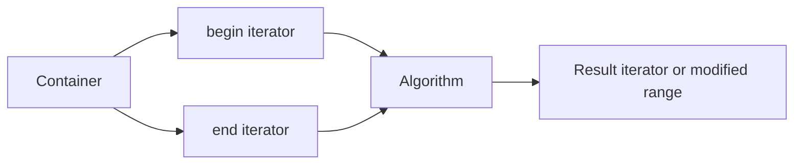

# STL Algorithms and Iterators

STL algorithms are generic functions that operate on ranges. They are separate from containers, so the same algorithm can search a `vector`, traverse a `list`, or copy from one container to another as long as the iterators provide the required operations. This is the bridge between Savitch's template material and real library programming.

Iterators make generic algorithms possible. Instead of hard-coding array indexes or node pointers, an algorithm receives a beginning iterator and an ending iterator. The ending iterator is one past the last element, which gives C++ a consistent half-open range notation: `[begin, end)`.

## Definitions

An **iterator** is an object that refers to a position in a container. It behaves somewhat like a pointer:

```cpp
vector<int>::iterator p = numbers.begin();
cout << *p << endl;  // dereference
++p;                // move to next position
```

A **range** is described by two iterators: the first element and one past the last element.

```cpp
sort(numbers.begin(), numbers.end());
```

The expression `container.end()` does not refer to a real element. It is a sentinel used to mark the stopping point.

A **const iterator** allows reading but not modifying elements:

```cpp
vector<int>::const_iterator p;
```

A **reverse iterator** traverses backward:

```cpp
for (vector<int>::reverse_iterator p = v.rbegin(); p != v.rend(); ++p) {
    cout << *p << endl;
}
```

An **STL algorithm** is a template function such as `find`, `count`, `sort`, `copy`, or `for_each`. Algorithms are declared in headers such as `<algorithm>` and `<numeric>`.

## Key results

Most STL algorithms use half-open ranges:

```cpp
algorithm_name(first, last);
```

The algorithm includes `first`, then repeatedly increments until it reaches `last`. It does not dereference `last`.

```text
indexes:   0   1   2   3
values:   10  20  30  40
          ^               ^
        begin            end
range contains 10, 20, 30, 40, but end is not an item
```

Iterator category matters. `sort` requires random-access iterators, so it works with `vector` and `deque` but not with `list`. A `list` has its own member function `sort` because list nodes cannot be jumped over by index-like arithmetic.

```cpp
vector<int> v;
sort(v.begin(), v.end());     // OK

list<int> values;
values.sort();                // OK
```

Algorithms usually do not change container size unless they are paired with an inserter or followed by a container member operation. For example, `remove` rearranges elements and returns a new logical end; it does not erase items from the container by itself. This leads to the common erase-remove pattern for `vector`.

The complexity of an algorithm depends on both the algorithm and the iterator/container. `find` is linear because it may inspect every item. `sort` is typically `O(n log n)`. Associative containers such as `set` and `map` provide logarithmic member `find`, which is usually better than the generic linear `find`.

## Visual



| Iterator category | Required operations | Example containers | Algorithms enabled |
|---|---|---|---|
| Input | Read and move forward | Input streams | Single-pass reading |
| Output | Write and move forward | Output streams | Single-pass writing |
| Forward | Multi-pass forward traversal | Some sets | `find`, `replace` |
| Bidirectional | Forward and backward | `list`, `set`, `map` | Reverse traversal |
| Random access | Jump by offset, compare positions | `vector`, `deque`, arrays | `sort`, binary search |

## Worked example 1: Tracing find

Problem: Given `vector<int> v = {4, 8, 15, 16, 23, 42};`, trace `find(v.begin(), v.end(), 16)`.

Method:

1. Initialize the current iterator to `v.begin()`, which refers to `4`.

2. Compare each dereferenced value with `16`:

   | Step | `*p` | Match? |
   |---:|---:|---|
   | 1 | 4 | No |
   | 2 | 8 | No |
   | 3 | 15 | No |
   | 4 | 16 | Yes |

3. Stop when the match is found. The algorithm returns an iterator pointing to the element `16`.

4. Check against `v.end()`:

   ```cpp
   vector<int>::iterator p = find(v.begin(), v.end(), 16);
   if (p != v.end()) {
       cout << "found " << *p << endl;
   }
   ```

Checked answer: the result is not `v.end()`, and dereferencing it gives `16`.

## Worked example 2: Sorting and removing duplicates

Problem: Transform `4, 2, 4, 1, 2` into a sorted list of unique values using a vector.

Method:

1. Start with:

   ```text
   [4, 2, 4, 1, 2]
   ```

2. Sort:

   ```cpp
   sort(v.begin(), v.end());
   ```

   Result:

   ```text
   [1, 2, 2, 4, 4]
   ```

3. Call `unique`:

   ```cpp
   vector<int>::iterator newEnd = unique(v.begin(), v.end());
   ```

   `unique` compacts adjacent duplicates toward the front. The meaningful prefix becomes:

   ```text
   [1, 2, 4, ?, ?]
            ^
          newEnd is one past 4
   ```

4. Erase the leftover tail:

   ```cpp
   v.erase(newEnd, v.end());
   ```

Checked answer:

```text
[1, 2, 4]
```

The sort step is necessary because `unique` removes adjacent duplicates, not all duplicates scattered throughout an unsorted range.

## Code

```cpp
#include <algorithm>
#include <iostream>
#include <vector>
using namespace std;

void printVector(const vector<int>& values) {
    for (vector<int>::const_iterator p = values.begin();
         p != values.end(); ++p) {
        cout << *p << " ";
    }
    cout << endl;
}

int main() {
    vector<int> values;
    values.push_back(4);
    values.push_back(2);
    values.push_back(4);
    values.push_back(1);
    values.push_back(2);

    sort(values.begin(), values.end());
    vector<int>::iterator newEnd = unique(values.begin(), values.end());
    values.erase(newEnd, values.end());

    printVector(values);

    vector<int>::iterator p = find(values.begin(), values.end(), 2);
    if (p != values.end()) {
        cout << "found: " << *p << endl;
    }
}
```

```cpp
#include <algorithm>
#include <iostream>
#include <string>
#include <vector>
using namespace std;

bool shorterThanFive(const string& word) {
    return word.size() < 5;
}

int main() {
    vector<string> words;
    words.push_back("templates");
    words.push_back("map");
    words.push_back("array");
    words.push_back("list");

    int shortCount = count_if(words.begin(), words.end(), shorterThanFive);
    cout << "short words: " << shortCount << endl;

    sort(words.begin(), words.end());
    for (vector<string>::const_iterator p = words.begin();
         p != words.end(); ++p) {
        cout << *p << endl;
    }
}
```

## Common pitfalls

- Dereferencing `end()`. The end iterator is a sentinel and not an element.
- Passing the wrong range, especially mixing iterators from different containers.
- Expecting generic `remove` or `unique` to shrink a container by itself. Use `erase` afterward when needed.
- Calling `sort` on a `list` with the generic algorithm. Use `list::sort()` instead.
- Forgetting that associative containers have faster member search functions than generic linear `find`.
- Modifying a container while iterating without understanding whether the operation invalidates the iterator.

Iterator-safety checks:

- Treat every algorithm call as a contract over a range. The iterators must come from the same container, the start must be reachable from the end, and the algorithm must support that iterator category.
- Check whether the algorithm changes values, order, or neither. `find` only observes; `sort` reorders; `copy` writes to an output range; `remove` moves kept values forward but does not erase from the container.
- Make destination ranges large enough. `copy(source.begin(), source.end(), dest.begin())` assumes `dest` already has enough elements; use `back_inserter(dest)` when the destination should grow.
- Prefer container member functions when they are semantically stronger. `map::find` uses the map's ordered structure, while generic `find` scans pairs linearly.
- After any operation that can invalidate iterators, rebuild the iterator from the container before using it again. This is especially important with `vector` insertion and erasure.
- For half-open ranges, read `[first, last)` as "start included, stop excluded." This convention makes empty ranges natural because `first == last`.
- When `unique` or `remove` returns an iterator, name it `newEnd` or similar. That reminder helps prevent the common mistake of thinking the container has already changed size.

Quick self-test: read an algorithm call from left to right and name the range before naming the operation. In `sort(v.begin() + 1, v.end())`, the range is "all elements except the first," not the whole vector. Many algorithm bugs are range bugs rather than sorting, searching, or copying bugs.

When an algorithm returns an iterator, immediately decide what that iterator means. `find` returns the found position or `end`; `lower_bound` returns an insertion position; `remove` and `unique` return a new logical end. Treating all returned iterators as "the answer element" leads to wrong code.

If a container has a member algorithm-like function, check it first. `list::sort`, `set::find`, and `map::find` know the container's structure, while generic algorithms only see an iterator range.

A final review question is whether an algorithm's preconditions match the range. Binary search algorithms require sorted ranges. `unique` only removes adjacent duplicates. `sort` requires random-access iterators. Generic code is powerful, but it assumes the caller supplies a range where the algorithm's contract is true.

Extended practice: implement a small search loop manually, then replace it with `find`. The manual loop teaches what the iterator is doing; the algorithm call removes boilerplate once the pattern is familiar. Do the same with counting, copying, and sorting. STL algorithms become readable when each is recognized as a named version of a loop pattern.

When an algorithm takes a predicate, test the predicate alone first. If `count_if` returns an unexpected answer, the bug may be in the predicate rather than in the algorithm or container.

One last check: never dereference an iterator until you have proved it is not the range's end iterator.

## Connections

- [stl containers](/cs/programming/cpp/stl-containers)
- [templates](/cs/programming/cpp/templates)
- [arrays](/cs/programming/cpp/arrays)
- [strings](/cs/programming/cpp/strings)
- [linked data structures](/cs/programming/cpp/linked-data-structures)
