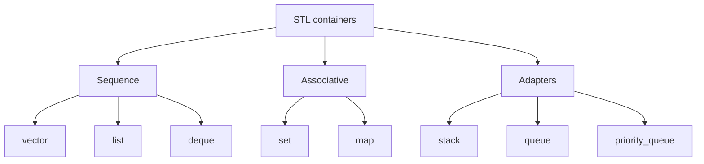

# STL Containers

The Standard Template Library gives C++ reusable containers such as `vector`, `list`, `set`, and `map`. Savitch places the STL after templates, exceptions, and linked data structures because STL containers are class templates that hide most of the memory management details while preserving efficient specialized behavior.

The practical lesson is not merely "use a library." It is to choose a container whose operations match the problem. A `vector` is usually the first choice for a growable sequence with fast indexing. A `list` supports efficient insertion and deletion when an iterator already points to the position. A `set` stores unique ordered keys. A `map` stores key-value pairs.

## Definitions

A **container** is an object that stores a collection of values. STL containers are template classes:

```cpp
vector<int> scores;
list<string> names;
set<int> uniqueIds;
map<string, int> counts;
```

A **sequence container** stores elements in a linear order controlled primarily by insertion position. Important sequence containers include:

- `vector<T>`: dynamic array with fast indexing.
- `list<T>`: doubly linked list with efficient insertion and deletion at known positions.
- `deque<T>`: double-ended queue with efficient insertion at both ends.

An **associative container** stores elements ordered by keys:

- `set<T>`: unique keys.
- `multiset<T>`: keys may repeat.
- `map<Key, Value>`: unique keys associated with values.
- `multimap<Key, Value>`: repeated keys allowed.

A **container adapter** provides a restricted interface over an underlying container:

- `stack<T>`: last-in, first-out.
- `queue<T>`: first-in, first-out.
- `priority_queue<T>`: highest-priority element removed first.

An **iterator** is an object that identifies a position in a container. Iterators connect containers to STL algorithms.

## Key results

The standard containers manage their own storage. For most programming tasks, this removes the need to write manual `new[]`, `delete[]`, linked-list destructors, and copy constructors. A `vector<int>` can grow dynamically, copy safely, and free its own memory when it goes out of scope.

Different containers optimize different operations:

```cpp
vector<int> v;
v.push_back(10);      // efficient at the end
cout << v[0] << endl; // constant-time indexing
```

```cpp
map<string, int> count;
count["apple"] += 1;  // find or create key, then increment
```

The expression `m[key]` for a `map` is convenient, but it inserts a default value when the key is not already present. Use `find` when you need to test for existence without insertion.

```cpp
map<string, int>::iterator it = count.find("apple");
if (it != count.end()) {
    cout << it->second << endl;
}
```

`set` and `map` keep elements ordered by key. This gives logarithmic search, insertion, and deletion in traditional tree-based implementations. `vector` gives constant-time indexing but may invalidate iterators and references when it reallocates during growth.

Container adapters intentionally hide some operations. For example, `stack` lets you use `push`, `pop`, and `top`; it does not let you iterate through all elements. Also, `pop` removes an item but does not return it, so read `top()` or `front()` before calling `pop()` if the value is needed.

## Visual



| Container | Best at | Cost to access by index | Typical insert/search cost | Notes |
|---|---|---:|---:|---|
| `vector` | Compact sequence, indexing | `O(1)` | End insert amortized `O(1)`, search `O(n)` | Default first choice |
| `list` | Insert/delete at known position | `O(n)` | Known-position insert `O(1)` | No random access |
| `set` | Unique sorted keys | Not indexed | `O(log n)` | Stores keys only |
| `map` | Key-value lookup | Not indexed | `O(log n)` | `operator[]` can insert |
| `stack` | LIFO behavior | Not available | Top push/pop `O(1)` | Adapter |
| `queue` | FIFO behavior | Not available | Back push/front pop `O(1)` | Adapter |

## Worked example 1: Choosing vector or list

Problem: A program stores quiz scores. It frequently appends new scores and computes the average. It rarely inserts in the middle. Should it use `vector<int>` or `list<int>`?

Method:

1. Identify required operations:

   - Add score at end.
   - Traverse all scores.
   - Sometimes access by index for display.
   - Rare middle insertion.

2. Compare with container strengths:

   - `vector<int>` has efficient `push_back`, compact storage, and constant-time indexing.
   - `list<int>` has no constant-time indexing and uses extra memory for links.

3. Compute an average with a vector:

   ```cpp
   vector<int> scores;
   scores.push_back(90);
   scores.push_back(80);
   scores.push_back(100);
   ```

   Sum:

$$
90 + 80 + 100 = 270
$$

   Average:

$$
270 / 3 = 90
$$

Checked answer: `vector<int>` is the better default here. It supports the common operations directly and efficiently.

## Worked example 2: Counting words with a map

Problem: Count the words in the sequence `red blue red green blue red`.

Method:

1. Start with an empty map:

   ```cpp
   map<string, int> count;
   ```

2. Process `red`:

   - `count["red"]` is inserted with default `0`.
   - Increment to `1`.

3. Process `blue`:

   - Insert `blue: 0`.
   - Increment to `1`.

4. Process second `red`:

   - Existing value is `1`.
   - Increment to `2`.

5. Process `green`:

   - Insert `green: 0`.
   - Increment to `1`.

6. Process second `blue`:

   - Existing value is `1`.
   - Increment to `2`.

7. Process third `red`:

   - Existing value is `2`.
   - Increment to `3`.

Checked answer:

| Word | Count |
|---|---:|
| `blue` | 2 |
| `green` | 1 |
| `red` | 3 |

The output order of a `map` is sorted by key, not by first appearance.

## Code

```cpp
#include <iostream>
#include <map>
#include <set>
#include <string>
#include <vector>
using namespace std;

int main() {
    vector<string> words;
    words.push_back("red");
    words.push_back("blue");
    words.push_back("red");
    words.push_back("green");
    words.push_back("blue");
    words.push_back("red");

    map<string, int> counts;
    set<string> uniqueWords;

    for (size_t i = 0; i < words.size(); ++i) {
        counts[words[i]] += 1;
        uniqueWords.insert(words[i]);
    }

    cout << "counts" << endl;
    for (map<string, int>::const_iterator it = counts.begin();
         it != counts.end(); ++it) {
        cout << it->first << ": " << it->second << endl;
    }

    cout << "unique word count: " << uniqueWords.size() << endl;
}
```

```cpp
#include <iostream>
#include <queue>
#include <stack>
using namespace std;

int main() {
    stack<int> undo;
    undo.push(10);
    undo.push(20);
    undo.push(30);

    cout << "last action: " << undo.top() << endl;
    undo.pop();

    queue<int> line;
    line.push(101);
    line.push(102);
    line.push(103);

    cout << "first customer: " << line.front() << endl;
    line.pop();
    cout << "next customer: " << line.front() << endl;
}
```

## Common pitfalls

- Using `map[key]` just to test whether a key exists. This inserts the key if it is absent.
- Calling `pop()` on `stack` or `queue` and expecting it to return the removed value. Read `top()` or `front()` first.
- Assuming all containers support `operator[]`. `list`, `set`, and `map` do not provide ordinary numeric indexing.
- Ignoring iterator invalidation after modifying a `vector`.
- Choosing `list` because it sounds flexible, even when the program mostly needs indexing and traversal. `vector` is often faster and simpler.
- Forgetting that `set` stores unique values. Inserting a duplicate does not create a second copy.

Container-choice checks:

- Start with `vector` unless a specific operation argues against it. It is compact, cache-friendly, simple to traverse, and supports random access.
- Choose `list` only when stable iterators and frequent insertion or deletion at known positions matter more than indexing and compact storage.
- Choose `map` when each key has one associated value and ordered traversal is useful. Use `find` instead of `operator[]` when looking should not insert.
- Choose `set` when uniqueness is the point. If duplicates matter, use `multiset` or store counts in a `map`.
- Use adapters when the restricted interface is the feature. A `stack` prevents accidental access to non-top elements, and a `queue` makes first-in, first-out behavior explicit.
- Check iterator invalidation rules before storing iterators across modifications. A valid iterator before an insertion is not always valid afterward.
- Prefer storing values directly in containers. Storing raw owning pointers in containers reintroduces manual memory management and complicates copying, destruction, and exception safety.

Quick self-test: list the three most common operations before choosing the container. If the operations are "append, index, traverse," choose `vector`. If they are "look up by name, update count, print sorted keys," choose `map`. If they are "remember unique IDs," choose `set`. Container choice should follow behavior, not habit.

Also check what order matters. `vector` preserves insertion order unless you reorder it. `set` and `map` iterate in key order. `stack` and `queue` expose only the next removable item. A program that depends on first-entry order should not accidentally switch to an ordered associative container without noticing the semantic change.

A final review question is what invalidates a stored position. A `vector` may move its elements when it grows, so saved iterators, pointers, and references can become stale. Node-based containers have different rules. Correct container code respects these lifetime details.

Extended practice: solve the same word-frequency problem with a sorted `vector` of pairs and then with a `map`. The vector version makes searching and insertion costs visible; the map version packages the key lookup behavior. Comparing them explains why container choice affects both code clarity and complexity.

## Connections

- [templates](/cs/programming/cpp/templates)
- [stl algorithms and iterators](/cs/programming/cpp/stl-algorithms-and-iterators)
- [linked data structures](/cs/programming/cpp/linked-data-structures)
- [arrays](/cs/programming/cpp/arrays)
- [exception handling](/cs/programming/cpp/exception-handling)
