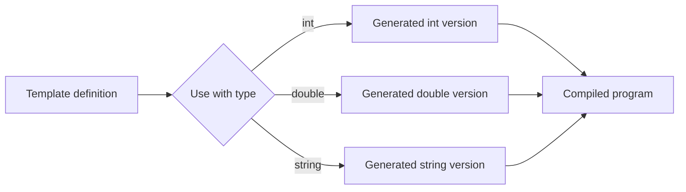

# Templates

Templates let C++ describe a pattern for code instead of one fixed function or one fixed class. Savitch introduces them as a way to avoid rewriting the same algorithm for `int`, `double`, `char`, or a user-defined class when the logic is identical and only the type changes.

The important idea is that a template is checked and instantiated by the compiler. It is not a run-time container of unknown values. A function template such as `swapValues` or `maximum` becomes an actual function for each set of types used by the program, provided those types support the operations used inside the template body.

## Definitions

A **function template** defines a family of functions. A type parameter stands for a type that will be supplied later.

```cpp
template <class T>
T maximum(T first, T second) {
    return (first < second) ? second : first;
}
```

The keyword `typename` can be used instead of `class` in a template parameter list:

```cpp
template <typename T>
void swapValues(T& first, T& second);
```

A **class template** defines a family of classes:

```cpp
template <class T>
class Pair {
public:
    Pair(T first, T second);
    T getFirst() const;
    T getSecond() const;
private:
    T first;
    T second;
};
```

An **instantiation** is the compiler-created version for a concrete type, such as `Pair<int>` or `maximum<double>`.

Template code is usually placed in header files because the compiler needs the full template definition when it instantiates the code. Separating a template declaration into a header and its definition into an ordinary `.cpp` file often causes linker errors unless explicit instantiation is used.

## Key results

Templates express generic programming. The same source definition can produce functions or classes for many different types:

```cpp
cout << maximum(3, 9) << endl;          // T is int
cout << maximum(2.5, 1.75) << endl;     // T is double
```

The template body determines the requirements on the type. If a template uses `<`, then the type must support `<`. If a template writes to an output stream, the type must support `operator<<`. These requirements may be implicit in older C++ code, but they are still real.

For a function template call, the compiler often deduces the type parameter from the arguments. In `maximum(3, 9)`, both arguments are `int`, so `T` is `int`. In `maximum(3, 9.5)`, deduction is not a single exact type for both arguments, so the programmer may need to convert explicitly or call `maximum<double>(3, 9.5)`.

Class templates usually require the type argument in the declaration:

```cpp
Pair<string> name("Ada", "Lovelace");
Pair<int> dice(3, 6);
```

Template classes can have member functions defined outside the class body, but every definition must repeat the template prefix and use the specialized class name:

```cpp
template <class T>
T Pair<T>::getFirst() const {
    return first;
}
```

The proof of reuse is direct. If the algorithm's steps are independent of the exact type and depend only on operations such as assignment, comparison, or output, then replacing the concrete type by a type parameter preserves the algorithm's structure. The compiler checks whether the concrete type satisfies the needed operations when the template is instantiated.

## Visual



| Template kind | Produces | Example use | Typical purpose |
|---|---|---|---|
| Function template | Family of functions | `swapValues<int>` | Generic algorithms |
| Class template | Family of classes | `Pair<string>` | Generic data structures |
| Template parameter | Placeholder for a type or value | `class T` | Type-independent source |
| Instantiation | Concrete generated code | `Pair<double>` | Compilable specialized version |

## Worked example 1: Deducing a maximum function

Problem: Define a generic `maximum` function and determine what happens in these calls:

```cpp
maximum(7, 12)
maximum(2.5, 1.25)
maximum('b', 'z')
```

Method:

1. Write the template:

   ```cpp
   template <class T>
   T maximum(T first, T second) {
       if (first < second) {
           return second;
       }
       return first;
   }
   ```

2. For `maximum(7, 12)`, both arguments are `int`. The compiler instantiates:

   ```cpp
   int maximum(int first, int second) {
       if (first < second) {
           return second;
       }
       return first;
   }
   ```

   Since `7 < 12`, the return value is `12`.

3. For `maximum(2.5, 1.25)`, both arguments are `double`. Since `2.5 < 1.25` is false, the return value is `2.5`.

4. For `maximum('b', 'z')`, both arguments are `char`. Characters are compared by their character codes. Since `'b' < 'z'`, the return value is `'z'`.

Checked answer: the calls produce `12`, `2.5`, and `'z'`. Each call uses the same template source but a different instantiated type.

## Worked example 2: Building a Pair class template

Problem: Create a `Pair<T>` class template and trace the object `Pair<int> scores(80, 95)`.

Method:

1. Define the template class:

   ```cpp
   template <class T>
   class Pair {
   public:
       Pair(T first, T second) : first(first), second(second) {}
       T getFirst() const { return first; }
       T getSecond() const { return second; }
   private:
       T first;
       T second;
   };
   ```

2. Instantiate with `int`:

   ```cpp
   Pair<int> scores(80, 95);
   ```

3. Substitute `T = int` conceptually:

   ```cpp
   class PairInt {
   public:
       PairInt(int first, int second) : first(first), second(second) {}
       int getFirst() const { return first; }
       int getSecond() const { return second; }
   private:
       int first;
       int second;
   };
   ```

4. Evaluate the accessors:

   - `scores.getFirst()` returns `80`.
   - `scores.getSecond()` returns `95`.

Checked answer: `scores` stores two integers, and the template gives type-safe access without using casts or `void*`.

## Code

```cpp
#include <iostream>
#include <string>
using namespace std;

template <class T>
void swapValues(T& first, T& second) {
    T temp = first;
    first = second;
    second = temp;
}

template <class T>
void selectionSort(T a[], int size) {
    for (int start = 0; start < size - 1; ++start) {
        int smallest = start;
        for (int i = start + 1; i < size; ++i) {
            if (a[i] < a[smallest]) {
                smallest = i;
            }
        }
        swapValues(a[start], a[smallest]);
    }
}

template <class T>
void printArray(const T a[], int size) {
    for (int i = 0; i < size; ++i) {
        cout << a[i] << " ";
    }
    cout << endl;
}

int main() {
    int numbers[] = {5, 2, 9, 1};
    string words[] = {"pear", "apple", "orange"};

    selectionSort(numbers, 4);
    selectionSort(words, 3);

    printArray(numbers, 4);
    printArray(words, 3);
}
```

```cpp
#include <iostream>
using namespace std;

template <class T>
class Box {
public:
    explicit Box(T value) : value(value) {}

    T getValue() const {
        return value;
    }

    void setValue(T newValue) {
        value = newValue;
    }

private:
    T value;
};

int main() {
    Box<int> count(5);
    Box<double> temperature(21.5);

    count.setValue(count.getValue() + 1);
    cout << count.getValue() << endl;
    cout << temperature.getValue() << endl;
}
```

## Common pitfalls

- Putting a template definition only in a `.cpp` file and then including only the declaration elsewhere. Most template definitions must be visible at the point of instantiation.
- Assuming templates accept every type. A type must support every operation the template body uses.
- Mixing argument types and expecting deduction to guess a common type. `maximum(3, 4.5)` may need an explicit template argument or a conversion.
- Forgetting `Pair<T>::` and the repeated `template <class T>` prefix on out-of-class member definitions.
- Writing code that works for built-in types but fails for classes because it depends on missing operators such as `<` or `<<`.
- Creating a huge template when an ordinary function would be clearer. Templates pay off when the same logic truly applies to multiple types.

Template-design checks:

- Write down the operations required of `T`. A sorting template needs comparison; a printing template needs stream insertion; a numeric template may need addition, multiplication, or a default value.
- Keep template definitions visible to translation units that instantiate them. For ordinary projects, that usually means placing the full template definition in a header.
- Prefer simple type parameters before adding multiple parameters, non-type parameters, or specialization. A complicated template is harder to diagnose when substitution fails.
- Test a template with at least two different types. If it works only for `int`, the code may be accidentally depending on integer-specific behavior.
- Avoid assuming that `T()` is a meaningful neutral value. Some types have no cheap default construction, and others may default to a value that is not mathematically neutral.
- Keep error messages in mind. Template errors can be long because the compiler reports the instantiation path; smaller helper functions make those messages easier to read.
- Use STL templates as models. Containers such as `vector<T>` and algorithms such as `sort` show how generic code can remain type-safe while still compiling to concrete specialized operations.

Quick self-test: instantiate the template mentally with a user-defined class, not just `int`. If the body uses `<`, ask where that class gets `operator<`. If the body uses `T total = 0`, ask whether `0` can initialize that type. This catches hidden assumptions that built-in numeric tests do not expose.

When a template error is long, find the first line that mentions your source file and the concrete type used for `T`. That is usually where the compiler discovered that an operation required by the template is unavailable or ambiguous.

## Connections

- [functions, parameters, and scope](/cs/programming/cpp/functions-parameters-and-scope)
- [references and operator overloading](/cs/programming/cpp/references-and-operator-overloading)
- [classes and encapsulation](/cs/programming/cpp/classes-and-encapsulation)
- [arrays](/cs/programming/cpp/arrays)
- [stl containers](/cs/programming/cpp/stl-containers)
