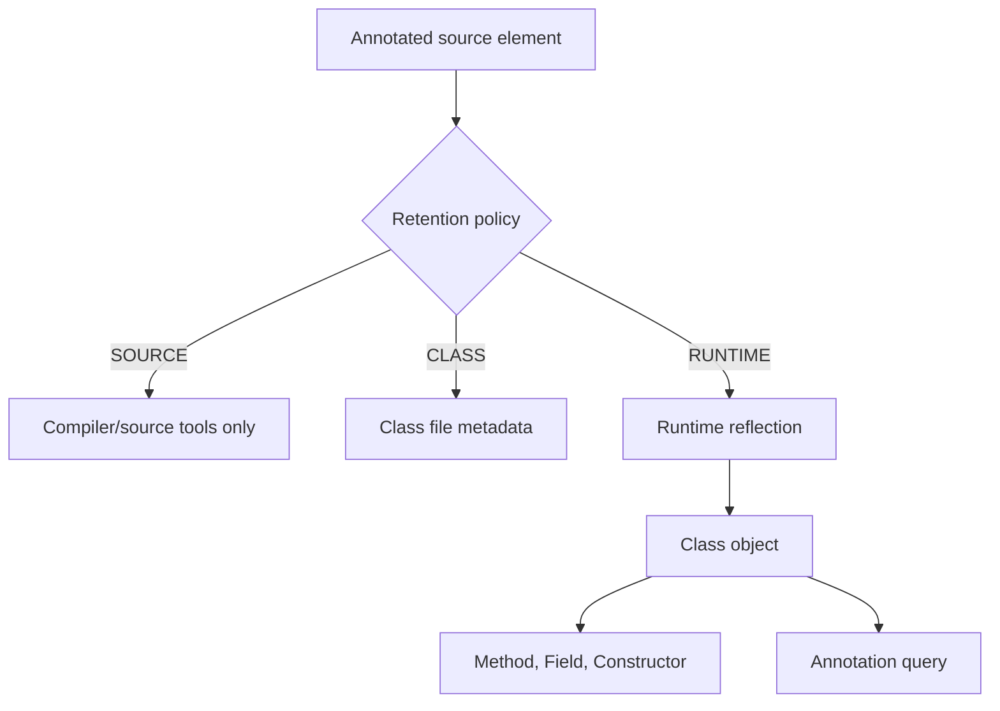

# Annotations and Reflection

Annotations attach structured metadata to program elements. Reflection lets a running program inspect classes, methods, fields, constructors, annotations, generic signatures, arrays, packages, and sometimes create objects or invoke methods dynamically. Together, they let tools and frameworks reason about Java programs using standardized metadata rather than ad hoc naming conventions.


*Figure: Java's early development at Sun shaped its portability, virtual-machine model, and library ecosystem. Image: [Wikimedia Commons](https://commons.wikimedia.org/wiki/File:Sun_Microsystems_logo.svg), Sun Microsystems and Afrank99, public domain text logo.*

The source book presents these features carefully because they cross boundaries. Ordinary Java code is statically checked and direct. Reflective code asks questions at runtime and may bypass normal compile-time visibility checks under controlled circumstances. Annotations can be retained only in source, in class files, or at runtime, so their usefulness depends on retention and target choices.

## Definitions

The source basis for this page is Chapter 15 on annotations, annotation types, annotating elements, applicability, retention policies, and working with annotations; Chapter 16 on `Class`, annotation queries, modifiers, members, fields, methods, constructors, generic type inspection, arrays, packages, proxies, class loading, and runtime assertion control. The terms below are written as contracts: each one tells you what the compiler can check, what the runtime must preserve, and what a reader of the program may rely on.

**Annotation.** An annotation is metadata written with `@` syntax on a program element. It has an annotation type and optional element values. In Java, this is rarely just vocabulary. It controls which operations are legal, when a value exists, what names are visible, or which object receives a message. When reading code, ask what the term promises before asking how the implementation happens to work.

**Annotation type.** An annotation type declares the elements an annotation may contain. It is defined with `@interface` syntax. In Java, this is rarely just vocabulary. It controls which operations are legal, when a value exists, what names are visible, or which object receives a message. When reading code, ask what the term promises before asking how the implementation happens to work.

**Target.** `@Target` restricts which program elements an annotation type may be applied to, such as types, methods, fields, or parameters. In Java, this is rarely just vocabulary. It controls which operations are legal, when a value exists, what names are visible, or which object receives a message. When reading code, ask what the term promises before asking how the implementation happens to work.

**Retention.** `@Retention` controls how long annotation information is kept: source only, class file, or runtime availability. In Java, this is rarely just vocabulary. It controls which operations are legal, when a value exists, what names are visible, or which object receives a message. When reading code, ask what the term promises before asking how the implementation happens to work.

**Reflection.** Reflection is the ability of a running program to inspect and manipulate program structure through objects such as `Class`, `Method`, `Field`, and `Constructor`. In Java, this is rarely just vocabulary. It controls which operations are legal, when a value exists, what names are visible, or which object receives a message. When reading code, ask what the term promises before asking how the implementation happens to work.

**`Class` object.** A `Class` object represents a loaded class, interface, enum, annotation type, primitive type, or array type at runtime. In Java, this is rarely just vocabulary. It controls which operations are legal, when a value exists, what names are visible, or which object receives a message. When reading code, ask what the term promises before asking how the implementation happens to work.

**Accessible object.** `AccessibleObject` is the reflective base for objects whose access checks can be controlled under security rules, such as fields, methods, and constructors. In Java, this is rarely just vocabulary. It controls which operations are legal, when a value exists, what names are visible, or which object receives a message. When reading code, ask what the term promises before asking how the implementation happens to work.

**Dynamic proxy.** A proxy class can implement interfaces at runtime and route method calls to an invocation handler. The source includes proxies as part of reflection coverage. In Java, this is rarely just vocabulary. It controls which operations are legal, when a value exists, what names are visible, or which object receives a message. When reading code, ask what the term promises before asking how the implementation happens to work.

## Key results

**Annotation usefulness depends on retention and target.** An annotation meant for runtime reflection must have runtime retention. An annotation meant only for source analysis does not need to be carried into runtime. A well-designed annotation type states both where it applies and how long it matters. A good check is to rewrite the idea as a rule a compiler, library, or maintainer can enforce. If the rule cannot be stated clearly, the design is probably relying on habit instead of a contract.

**Reflection trades static clarity for dynamic flexibility.** Direct calls are checked by the compiler and easy to search. Reflective calls can load names dynamically, inspect unknown classes, or build tools, but failures move to runtime and code becomes more complex. Use reflection where the dynamic behavior is the point. A good check is to rewrite the idea as a rule a compiler, library, or maintainer can enforce. If the rule cannot be stated clearly, the design is probably relying on habit instead of a contract.

**`Class` is the root of runtime type inspection.** From a `Class` object, code can ask about names, modifiers, superclasses, interfaces, constructors, methods, fields, annotations, array component types, and packages. Many reflective tasks start by obtaining the right `Class` object. A good check is to rewrite the idea as a rule a compiler, library, or maintainer can enforce. If the rule cannot be stated clearly, the design is probably relying on habit instead of a contract.

**Access control still matters.** Reflection has APIs related to access checks, and security policy may limit what code can do. Bypassing ordinary access should be exceptional because it breaks encapsulation assumptions that classes rely on. A good check is to rewrite the idea as a rule a compiler, library, or maintainer can enforce. If the rule cannot be stated clearly, the design is probably relying on habit instead of a contract.

**Generic reflection reveals declarations, not full reification.** The source covers generic type inspection, but erasure still shapes what is available at runtime. Reflection can inspect declared generic signatures in many places, but object instances do not generally carry full actual type arguments. A good check is to rewrite the idea as a rule a compiler, library, or maintainer can enforce. If the rule cannot be stated clearly, the design is probably relying on habit instead of a contract.

When designing metadata, start with the consumer. If a compiler tool consumes the annotation, source or class retention may be enough. If runtime code must query it through reflection, choose runtime retention. Then choose the narrowest target that matches the concept. For reflection, start from the most specific question: do you need to create an object, read an annotation, call a method, inspect a generic signature, or load a class by name? Each task has different failure modes, such as missing class, inaccessible member, wrong arguments, invocation exception, or absent runtime annotation.

## Visual



| Reflection object | Represents | Common operation |
|---|---|---|
| `Class` | Runtime type descriptor | Find methods, fields, annotations |
| `Method` | Method declaration | Inspect or invoke |
| `Field` | Field declaration | Inspect or get/set value |
| `Constructor` | Constructor declaration | Create new object |
| `Modifier` | Modifier bits | Test `public`, `static`, `final`, etc. |
| `Package` | Package metadata | Inspect package annotations and names |

## Worked example 1: making an annotation visible at runtime

Problem: Create an annotation `@Command` that a runtime dispatcher can discover on methods.

Method:

1. The annotation applies to methods, so set its target to method elements.
2. The dispatcher runs at runtime and uses reflection, so the retention must be runtime.
3. Declare an element such as `String name();` so each command can provide a command name.
4. Annotate public or otherwise intended methods with `@Command(name = "...")`.
5. At runtime, inspect the class's methods and query each method for the annotation.

Checked answer: The checked annotation needs `@Target(ElementType.METHOD)` and `@Retention(RetentionPolicy.RUNTIME)`. Without runtime retention, reflection cannot see it.

## Worked example 2: invoking a no-argument method reflectively

Problem: Call method `size` on an object using reflection and explain the failure points.

Method:

1. Obtain the object's `Class` with `obj.getClass()`.
2. Find a public no-argument method named `size` using a reflective lookup such as `getMethod("size")`.
3. Invoke the method with the object as receiver and no arguments.
4. Handle the possibility that no such method exists, access is not allowed, the receiver is wrong, or the invoked method throws.
5. Cast or inspect the returned `Object` carefully because reflective invocation returns a general object reference for non-void results.

Checked answer: Reflection can call the method, but each assumption formerly checked by direct source code becomes a runtime condition that must be handled.

## Code

```java
import java.lang.annotation.ElementType;
import java.lang.annotation.Retention;
import java.lang.annotation.RetentionPolicy;
import java.lang.annotation.Target;
import java.lang.reflect.Method;

public class AnnotationReflectionDemo {
    @Retention(RetentionPolicy.RUNTIME)
    @Target(ElementType.METHOD)
    public @interface Command {
        String name();
    }

    static class Commands {
        @Command(name = "hello")
        public void hello() {
            System.out.println("hello");
        }
    }

    public static void main(String[] args) throws Exception {
        Commands commands = new Commands();
        Method[] methods = Commands.class.getMethods();
        for (int i = 0; i < methods.length; i++) {
            Command command = methods[i].getAnnotation(Command.class);
            if (command != null && command.name().equals("hello")) {
                methods[i].invoke(commands);
            }
        }
    }
}
```

## Common pitfalls

- Do not expect an annotation to be visible at runtime unless its retention policy says so.
- Do not use broad annotation targets when the concept only makes sense on one kind of element.
- Do not use reflection where direct calls would be clearer and type-checked.
- Do not bypass access controls casually. Encapsulation assumptions still matter.
- Do not assume generic type arguments are fully available from every runtime object. Erasure still shapes reflection.

## Connections

- [Generics, Wildcards, and Erasure](/cs/programming/java/generics-wildcards-erasure): explains why generic reflection has limits.
- [Classes, Objects, and Encapsulation](/cs/programming/java/classes-objects-encapsulation): supplies the access-control contracts reflection may inspect or bypass.
- [Packages, Documentation, System, and Internationalization](/cs/programming/java/packages-documentation-system-i18n): covers package metadata and documentation conventions.
- [Interfaces, Nested Classes, and Enums](/cs/programming/java/interfaces-nested-classes-enums): connects annotation types and enum constants to type declarations.
