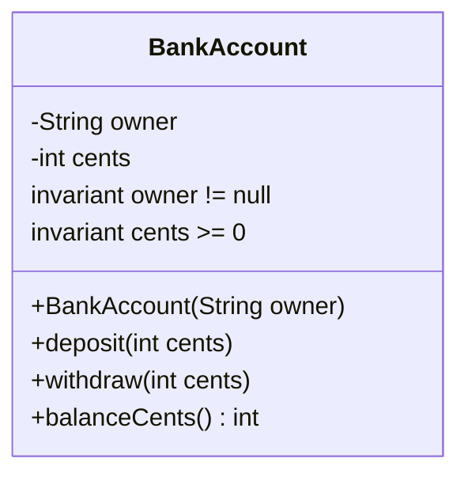

# Classes, Objects, and Encapsulation

Classes are where Java programs define new kinds of objects. A class can hold state in fields, expose behavior through methods, control object creation through constructors, and hide representation details with access modifiers. The source book's early examples use small classes not because Java objects are small, but because the design rules are easiest to see when the state and operations are concrete.

Encapsulation is the central discipline. A class should protect its invariants by deciding which fields are private, which operations are public, and which representation details are hidden from clients. If outside code can write directly into an object's internal fields, the object cannot reliably enforce its own contract. This is why the book quickly moves from visible fields to methods that mediate access.

## Definitions

The source basis for this page is Chapter 2 on simple classes, fields, access control, object creation, construction, methods, `this`, overloading, static imports, `main`, and native methods. The terms below are written as contracts: each one tells you what the compiler can check, what the runtime must preserve, and what a reader of the program may rely on.

**Object.** An object is a runtime instance with identity, state, and behavior determined by its class. Variables of class type hold references to objects. In Java, this is rarely just vocabulary. It controls which operations are legal, when a value exists, what names are visible, or which object receives a message. When reading code, ask what the term promises before asking how the implementation happens to work.

**Field.** A field is a member variable declared in a class. Instance fields belong to each object; static fields belong to the class itself. In Java, this is rarely just vocabulary. It controls which operations are legal, when a value exists, what names are visible, or which object receives a message. When reading code, ask what the term promises before asking how the implementation happens to work.

**Method.** A method is a named operation declared in a class or interface. Instance methods are invoked on objects and can use the receiving object's state. In Java, this is rarely just vocabulary. It controls which operations are legal, when a value exists, what names are visible, or which object receives a message. When reading code, ask what the term promises before asking how the implementation happens to work.

**Constructor.** A constructor initializes a new object. It has the class name, no return type, and runs after storage for the object has been allocated. In Java, this is rarely just vocabulary. It controls which operations are legal, when a value exists, what names are visible, or which object receives a message. When reading code, ask what the term promises before asking how the implementation happens to work.

**Access control.** Access modifiers such as `public`, `private`, and `protected`, plus package access, determine which code may refer to a member or type. In Java, this is rarely just vocabulary. It controls which operations are legal, when a value exists, what names are visible, or which object receives a message. When reading code, ask what the term promises before asking how the implementation happens to work.

**Encapsulation.** Encapsulation hides representation and exposes a controlled interface. It lets a class change internals without breaking clients that obey the public contract. In Java, this is rarely just vocabulary. It controls which operations are legal, when a value exists, what names are visible, or which object receives a message. When reading code, ask what the term promises before asking how the implementation happens to work.

**Invariant.** An invariant is a condition that should remain true for every valid object state, such as a nonnegative balance or a non-null name. In Java, this is rarely just vocabulary. It controls which operations are legal, when a value exists, what names are visible, or which object receives a message. When reading code, ask what the term promises before asking how the implementation happens to work.

**Static member.** A static field or method is associated with the class rather than with a particular object. Static state is shared across all uses of the class. In Java, this is rarely just vocabulary. It controls which operations are legal, when a value exists, what names are visible, or which object receives a message. When reading code, ask what the term promises before asking how the implementation happens to work.

## Key results

**Private fields protect future change.** If clients directly depend on a field's existence, type, or update timing, the class has committed to that representation. Making fields private and providing methods leaves room to compute a value differently later, validate inputs, add logging, or preserve invariants. A good check is to rewrite the idea as a rule a compiler, library, or maintainer can enforce. If the rule cannot be stated clearly, the design is probably relying on habit instead of a contract.

**Objects should be born valid.** Construction is the best place to establish required state. If a constructor allows a partially valid object to escape, every method must defend against states that should never have existed. The source book repeatedly favors constructors and setters that keep object state coherent. A good check is to rewrite the idea as a rule a compiler, library, or maintainer can enforce. If the rule cannot be stated clearly, the design is probably relying on habit instead of a contract.

**The public interface is the class contract.** A public method is not just code; it is a promise to clients. Changing a method's meaning, accepted inputs, returned values, or exception behavior can break programs even if the code still compiles. Encapsulation is therefore about stable contracts as much as hidden fields. A good check is to rewrite the idea as a rule a compiler, library, or maintainer can enforce. If the rule cannot be stated clearly, the design is probably relying on habit instead of a contract.

**Static state must be treated carefully.** Static fields are useful for constants or class-wide counters, but mutable static state is shared by all users of the class. That sharing can create hidden coupling and becomes especially important in threaded code. A good check is to rewrite the idea as a rule a compiler, library, or maintainer can enforce. If the rule cannot be stated clearly, the design is probably relying on habit instead of a contract.

**Accessor methods are not automatically good design.** A getter or setter can preserve flexibility, but blindly adding getters and setters for every field may still expose the representation. The better question is what operation the object should provide, not how to publish every internal slot. A good check is to rewrite the idea as a rule a compiler, library, or maintainer can enforce. If the rule cannot be stated clearly, the design is probably relying on habit instead of a contract.

To evaluate a class, list its invariants and then check every constructor and public method against them. A constructor should establish the invariants. A query method should not break them. An update method should validate its arguments and leave the object valid when it returns normally. If a class has public mutable fields, anyone can violate the invariant without going through the class's checks. That is the concrete reason the book's design advice favors private state and public behavior.

## Visual



| Member choice | Who can use it? | Design implication |
|---|---|---|
| `private` field | Only the declaring class | Strongest representation hiding |
| Package access member | Same package | Useful for package-internal collaboration |
| `protected` member | Same package and subclasses | Exposes details to extension code |
| `public` method | All clients | Part of the stable contract |
| `static final` constant | Through class name | Shared named value when immutable |

## Worked example 1: protecting a nonnegative balance

Problem: Design a small account object that never has a negative balance.

Method:

1. Declare the balance field `private` so client code cannot write `account.cents = -100` directly.
2. Initialize the field to `0` in the constructor or field declaration. This establishes the nonnegative invariant at object creation.
3. In `deposit`, reject negative deposits because adding a negative amount would be a disguised withdrawal.
4. In `withdraw`, reject negative withdrawals and reject withdrawals larger than the current balance.
5. Return the balance through a query method so clients can observe the state without changing it.

Checked answer: The object remains valid because every state change is forced through methods that check the invariant `cents >= 0` before committing the update.

## Worked example 2: deciding whether a field should be public

Problem: A `Person` class has a `name` field. Decide whether to expose it as public or keep it private with methods.

Method:

1. Ask whether every string is a valid name. If `null` or the empty string should be rejected, direct public access is unsafe.
2. Ask whether the representation might change. A future version might store separate family and given names or normalize whitespace.
3. Ask whether updates need side effects. A name change might update a search index, invalidate cached display text, or notify another object.
4. If the field is public, all clients can bypass these rules and become dependent on the representation.
5. Keep the field private and provide operations that express the contract, such as `name()` and `rename(String newName)`.

Checked answer: The checked design keeps `name` private. The class can validate, normalize, and evolve its representation while preserving a stable public contract.

## Code

```java
public class BankAccountDemo {
    static class BankAccount {
        private final String owner;
        private int cents;

        BankAccount(String owner) {
            if (owner == null || owner.length() == 0) {
                throw new IllegalArgumentException("owner required");
            }
            this.owner = owner;
            this.cents = 0;
        }

        void deposit(int amount) {
            if (amount < 0) {
                throw new IllegalArgumentException("negative deposit");
            }
            cents += amount;
        }

        boolean withdraw(int amount) {
            if (amount < 0 || amount > cents) {
                return false;
            }
            cents -= amount;
            return true;
        }

        int balanceCents() {
            return cents;
        }
    }

    public static void main(String[] args) {
        BankAccount account = new BankAccount("Ada");
        account.deposit(2500);
        System.out.println(account.withdraw(700));
        System.out.println(account.balanceCents());
    }
}
```

## Common pitfalls

- Do not make fields public just because examples are short. Public fields become representation commitments.
- Do not allow constructors to create objects that methods cannot handle. Establish invariants before the object is used.
- Do not use mutable static fields as convenient global variables without considering shared state and threading.
- Do not confuse a getter-heavy class with a well-designed class. Encapsulation is about meaningful operations, not only private syntax.
- Do not widen access for testing or convenience without recognizing that access becomes part of who can depend on the member.

## Connections

- [Constructors, Methods, and Overloading](/cs/programming/java/constructors-methods-overloading): develops object creation and method selection.
- [Inheritance, Polymorphism, and Object](/cs/programming/java/inheritance-polymorphism-object): shows how class contracts behave under extension.
- [Exceptions and Assertions](/cs/programming/java/exceptions-assertions): uses exceptions to reject invalid operations.
- [Threads, Synchronization, and the Memory Model](/cs/programming/java/threads-synchronization-memory-model): explains why shared mutable state needs synchronization.
