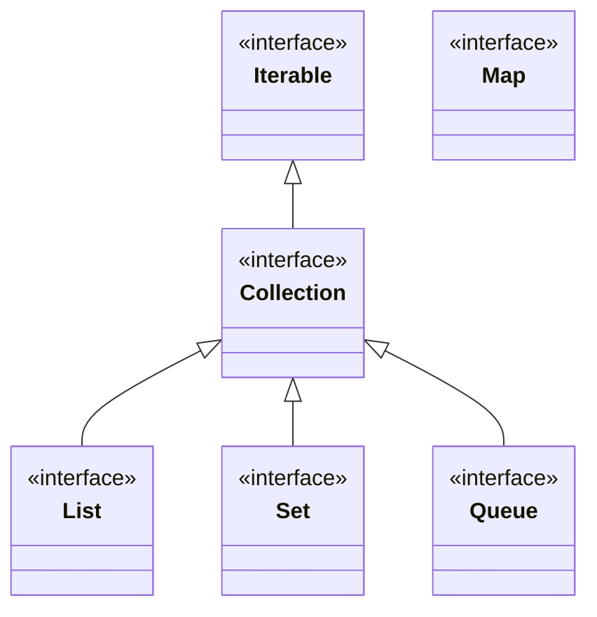

# Collections, Iteration, and Maps

The collections framework is the standard vocabulary for groups of objects in Java. Lists preserve sequence, sets prevent duplicates according to equality rules, queues model ordered processing, and maps associate keys with values. Java 5 generics make these contracts more precise by letting a collection say what element, key, or value type it is intended to contain.

Iteration is the bridge between collection abstraction and algorithms. A program can traverse a collection through `Iterator`, enhanced `for`, or specialized interfaces without needing to know whether the data is stored in an array, linked list, tree, hash table, or wrapper. The source book presents collections as contracts first and implementations second.

## Definitions

The source basis for this page is Chapter 21 on collections, iteration, ordering with `Comparable` and `Comparator`, `Collection`, `Set`, `SortedSet`, `List`, `Queue`, `Map`, enum collections, wrappers, synchronized wrappers, concurrent collections, arrays utilities, iterator implementations, legacy collection types, and properties. The terms below are written as contracts: each one tells you what the compiler can check, what the runtime must preserve, and what a reader of the program may rely on.

**`Collection<E>`.** `Collection` is the root interface for many groups of elements. It declares operations such as adding, removing, querying size, testing containment, and iterating. In Java, this is rarely just vocabulary. It controls which operations are legal, when a value exists, what names are visible, or which object receives a message. When reading code, ask what the term promises before asking how the implementation happens to work.

**`List<E>`.** `List` is an ordered collection that permits positional access and usually permits duplicates. Implementations differ in random-access and insertion costs. In Java, this is rarely just vocabulary. It controls which operations are legal, when a value exists, what names are visible, or which object receives a message. When reading code, ask what the term promises before asking how the implementation happens to work.

**`Set<E>`.** `Set` is a collection that does not contain duplicate elements according to its equality contract. Hash-based and sorted sets differ in ordering behavior. In Java, this is rarely just vocabulary. It controls which operations are legal, when a value exists, what names are visible, or which object receives a message. When reading code, ask what the term promises before asking how the implementation happens to work.

**`Queue<E>`.** `Queue` represents elements waiting for processing. Queue methods distinguish insertion, removal, and inspection operations. In Java, this is rarely just vocabulary. It controls which operations are legal, when a value exists, what names are visible, or which object receives a message. When reading code, ask what the term promises before asking how the implementation happens to work.

**`Map<K,V>`.** `Map` associates keys with values and is not a subtype of `Collection`. Key equality and ordering rules control lookup behavior. In Java, this is rarely just vocabulary. It controls which operations are legal, when a value exists, what names are visible, or which object receives a message. When reading code, ask what the term promises before asking how the implementation happens to work.

**`Iterator<E>`.** `Iterator` provides sequential access through `hasNext`, `next`, and optional `remove`. Iterator contracts define how traversal interacts with modification. In Java, this is rarely just vocabulary. It controls which operations are legal, when a value exists, what names are visible, or which object receives a message. When reading code, ask what the term promises before asking how the implementation happens to work.

**`Comparable<T>`.** `Comparable` defines natural ordering by a method on the objects being compared. It is used by sorted collections and utility algorithms. In Java, this is rarely just vocabulary. It controls which operations are legal, when a value exists, what names are visible, or which object receives a message. When reading code, ask what the term promises before asking how the implementation happens to work.

**`Comparator<T>`.** `Comparator` defines an external ordering object. It is useful when a class has no natural order or when several orderings are needed. In Java, this is rarely just vocabulary. It controls which operations are legal, when a value exists, what names are visible, or which object receives a message. When reading code, ask what the term promises before asking how the implementation happens to work.

## Key results

**Choose the interface that states the needed contract.** A method that only needs to traverse elements should accept `Iterable` or `Collection`, not `ArrayList`. A method that needs key lookup should use `Map`. Programming to interfaces keeps callers free to choose suitable implementations. A good check is to rewrite the idea as a rule a compiler, library, or maintainer can enforce. If the rule cannot be stated clearly, the design is probably relying on habit instead of a contract.

**Equality and hashing are collection design issues.** Hash-based sets and maps rely on `equals` and `hashCode`. If these methods disagree, lookups and duplicate detection fail. Sorted sets and maps rely on comparison; the ordering should be consistent with equality when the set contract requires it. A good check is to rewrite the idea as a rule a compiler, library, or maintainer can enforce. If the rule cannot be stated clearly, the design is probably relying on habit instead of a contract.

**Iteration does not automatically mean snapshot.** The source notes that iterator contracts do not inherently promise a snapshot of the collection. Modifying a collection while iterating can affect traversal or fail unless the iterator or collection explicitly supports the pattern. Copying into a new collection can create a snapshot when needed. A good check is to rewrite the idea as a rule a compiler, library, or maintainer can enforce. If the rule cannot be stated clearly, the design is probably relying on habit instead of a contract.

**Wrappers adapt behavior without changing the underlying collection type.** The `Collections` utility class can provide unmodifiable, synchronized, checked, or otherwise wrapped views. A wrapper may protect access through that view, but it does not magically make all external references to the original collection obey the wrapper. A good check is to rewrite the idea as a rule a compiler, library, or maintainer can enforce. If the rule cannot be stated clearly, the design is probably relying on habit instead of a contract.

**Enum collections exploit enum structure.** `EnumSet` and `EnumMap` can be efficient because enum constants form a fixed universe. When keys or elements are enum constants, these specialized collections communicate intent and can outperform general implementations. A good check is to rewrite the idea as a rule a compiler, library, or maintainer can enforce. If the rule cannot be stated clearly, the design is probably relying on habit instead of a contract.

When selecting a collection, start from operations rather than implementation names. Need indexed access? Consider a list. Need uniqueness? Consider a set. Need key-to-value lookup? Use a map. Need processing order? Consider a queue. Then ask about ordering, duplicates, nulls, mutation, concurrency, and expected size. Only after that choose an implementation. This source-era discipline is still sound because APIs should reveal semantic needs, while implementations should remain replaceable when performance or ordering requirements change.

## Visual



| Need | Interface | Common source-era implementation family |
|---|---|---|
| Preserve insertion sequence and index | `List<E>` | `ArrayList`, `LinkedList` |
| Unique elements | `Set<E>` | `HashSet`, `TreeSet`, `EnumSet` |
| Key-value lookup | `Map<K,V>` | `HashMap`, `TreeMap`, `EnumMap` |
| Ordered processing | `Queue<E>` | `LinkedList`, priority-style queues |
| Utility algorithms and wrappers | `Collections`, `Arrays` | Static helper methods |

## Worked example 1: counting words with a map

Problem: Given tokens `red blue red green blue red`, count each word.

Method:

1. Choose `Map<String, Integer>` because the problem associates each distinct word key with a count value.
2. Start with an empty map.
3. Read token `red`. It is absent, so store `red -> 1`.
4. Read token `blue`. Store `blue -> 1`. Read `red` again; fetch `1`, add one, store `2`.
5. Continue with `green -> 1`, `blue -> 2`, and finally `red -> 3`.
6. The final map records counts without requiring a separate search list for every update.

Checked answer: The checked counts are `red = 3`, `blue = 2`, and `green = 1`. A map is the right abstraction because lookup by key is central.

## Worked example 2: choosing between list and set

Problem: Store user-selected tags where duplicates should not matter, but display should be alphabetical.

Method:

1. Duplicates should not matter, so a `List` is not the semantic match because lists permit duplicates by contract.
2. Uniqueness suggests `Set<String>`.
3. Alphabetical display suggests a sorted set rather than an unordered hash set.
4. Use a sorted set implementation or store in a set and sort a list view when displaying.
5. Check equality and ordering. For strings, natural ordering is available through `Comparable<String>`.

Checked answer: A `SortedSet<String>` style abstraction fits the requirements: one copy of each tag and ordered traversal for display.

## Code

```java
import java.util.HashMap;
import java.util.Iterator;
import java.util.Map;
import java.util.TreeSet;

public class CollectionsDemo {
    public static void main(String[] args) {
        String[] words = { "red", "blue", "red", "green", "blue", "red" };
        Map<String, Integer> counts = new HashMap<String, Integer>();

        for (int i = 0; i < words.length; i++) {
            Integer old = counts.get(words[i]);
            counts.put(words[i], old == null ? Integer.valueOf(1) : Integer.valueOf(old.intValue() + 1));
        }

        TreeSet<String> sortedKeys = new TreeSet<String>(counts.keySet());
        for (Iterator<String> it = sortedKeys.iterator(); it.hasNext(); ) {
            String word = it.next();
            System.out.println(word + " = " + counts.get(word));
        }
    }
}
```

## Common pitfalls

- Do not accept or return a concrete implementation when an interface states the contract more accurately.
- Do not put mutable objects into hash-based collections if their equality or hash code can change while stored.
- Do not assume an iterator is a stable snapshot unless the API explicitly says so.
- Do not confuse `Map` with `Collection`. A map has collection views, but it is not itself a collection of elements.
- Do not wrap a collection and then keep mutating it through an older unwrapped reference while expecting wrapper guarantees everywhere.

## Connections

- [Generics, Wildcards, and Erasure](/cs/programming/java/generics-wildcards-erasure): explains parameterized collection types and wildcards.
- [Interfaces, Nested Classes, and Enums](/cs/programming/java/interfaces-nested-classes-enums): supplies interface contracts and enum collections.
- [Inheritance, Polymorphism, and Object](/cs/programming/java/inheritance-polymorphism-object): explains `equals`, `hashCode`, and ordering contracts.
- [Concurrent Utilities and Executors](/cs/programming/java/concurrent-utilities-executors): introduces concurrent collection variants.
