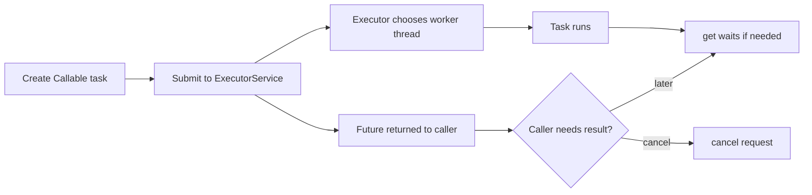

# Concurrent Utilities and Executors

The main thread chapter teaches the core monitor model: `Thread`, `Runnable`, `synchronized`, `wait`, and notification. The source also surveys the newer Java 5 concurrency utilities in `java.util.concurrent`. These utilities do not replace the need to understand synchronization, but they package common patterns into tested abstractions such as concurrent collections, executors, futures, locks, conditions, and synchronizers.

This page stays within the source-era boundary. It covers `Executor`, `ExecutorService`, `Callable`, `Future`, concurrent collections, locks, and conditions as Java 5 concepts. It does not teach `CompletableFuture`, which is a later Java 8 feature and therefore outside the textbook.

## Definitions

The source basis for this page is Chapter 21's synchronized wrappers and concurrent collections plus Chapter 25's survey of `java.util.concurrent`, including synchronizers, the executor framework, `Callable`, `Future`, locks, and conditions. The terms below are written as contracts: each one tells you what the compiler can check, what the runtime must preserve, and what a reader of the program may rely on.

**Concurrent collection.** A concurrent collection is designed for use by multiple threads, often with better concurrency properties than wrapping a collection in one synchronized lock. In Java, this is rarely just vocabulary. It controls which operations are legal, when a value exists, what names are visible, or which object receives a message. When reading code, ask what the term promises before asking how the implementation happens to work.

**Synchronized wrapper.** A synchronized wrapper from `Collections` serializes access through wrapper methods. Correct iteration may still require external synchronization according to the wrapper contract. In Java, this is rarely just vocabulary. It controls which operations are legal, when a value exists, what names are visible, or which object receives a message. When reading code, ask what the term promises before asking how the implementation happens to work.

**`Executor`.** `Executor` abstracts task execution. A caller submits a `Runnable`, and the executor decides whether to run it in the current thread, a new thread, or a pool. In Java, this is rarely just vocabulary. It controls which operations are legal, when a value exists, what names are visible, or which object receives a message. When reading code, ask what the term promises before asking how the implementation happens to work.

**`ExecutorService`.** `ExecutorService` extends executor behavior with lifecycle management and task submission methods that can return futures. In Java, this is rarely just vocabulary. It controls which operations are legal, when a value exists, what names are visible, or which object receives a message. When reading code, ask what the term promises before asking how the implementation happens to work.

**`Callable<V>`.** `Callable` represents a task that returns a result and may throw an exception. It is the result-producing counterpart to `Runnable`. In Java, this is rarely just vocabulary. It controls which operations are legal, when a value exists, what names are visible, or which object receives a message. When reading code, ask what the term promises before asking how the implementation happens to work.

**`Future<V>`.** `Future` represents a computation that may not be complete. It can be queried, cancelled, or waited on for a result. In Java, this is rarely just vocabulary. It controls which operations are legal, when a value exists, what names are visible, or which object receives a message. When reading code, ask what the term promises before asking how the implementation happens to work.

**`Lock`.** `Lock` abstracts locking beyond `synchronized`, with operations such as try-locking, interruptible locking, and explicit unlock. In Java, this is rarely just vocabulary. It controls which operations are legal, when a value exists, what names are visible, or which object receives a message. When reading code, ask what the term promises before asking how the implementation happens to work.

**`Condition`.** `Condition` works with a `Lock` to provide wait/notification-style condition queues associated with explicit locks. In Java, this is rarely just vocabulary. It controls which operations are legal, when a value exists, what names are visible, or which object receives a message. When reading code, ask what the term promises before asking how the implementation happens to work.

## Key results

**Executors separate task generation from thread management.** Instead of creating a new `Thread` for every unit of work, code can submit tasks to an executor. This lets execution policy be changed without rewriting task creation. A thread pool, direct executor, or scheduled executor can all satisfy the same basic role. A good check is to rewrite the idea as a rule a compiler, library, or maintainer can enforce. If the rule cannot be stated clearly, the design is probably relying on habit instead of a contract.

**`Future` turns asynchronous work into a handle.** A submitted `Callable` can run independently while the caller holds a `Future`. The caller can ask whether the task is done, cancel it, or block until the result is available. Exceptions from the task are reported through the future's result retrieval path. A good check is to rewrite the idea as a rule a compiler, library, or maintainer can enforce. If the rule cannot be stated clearly, the design is probably relying on habit instead of a contract.

**Concurrent collections are not the same as synchronized wrappers.** A synchronized wrapper protects each method call with a lock. Concurrent collections are designed internally for concurrent access and may allow more parallelism or different iterator behavior. The right choice depends on the required compound operations and traversal semantics. A good check is to rewrite the idea as a rule a compiler, library, or maintainer can enforce. If the rule cannot be stated clearly, the design is probably relying on habit instead of a contract.

**Explicit locks require explicit discipline.** `Lock` can express patterns impossible with a single synchronized block, but it also requires `unlock` to be called reliably, usually in a `finally` block. More power means more ways to forget cleanup or obscure ownership. A good check is to rewrite the idea as a rule a compiler, library, or maintainer can enforce. If the rule cannot be stated clearly, the design is probably relying on habit instead of a contract.

**Later async APIs are outside the source.** `CompletableFuture` and stream-oriented parallel APIs are important in modern Java but not part of this source. The source-era abstraction to understand here is `Future`: a handle for a task result that may arrive later. A good check is to rewrite the idea as a rule a compiler, library, or maintainer can enforce. If the rule cannot be stated clearly, the design is probably relying on habit instead of a contract.

A useful concurrency-utility decision tree starts with the unit of work. If the work has no result and no checked failure to return, `Runnable` may be enough. If it has a result, use `Callable<V>`. If the program should not decide thread creation directly, submit the task to an `ExecutorService`. If the caller needs the result later, keep the `Future<V>`. If several threads share a collection, choose between a concurrent collection and a synchronized wrapper by looking at iteration, compound operations, and contention. If monitor synchronization cannot express the locking pattern cleanly, consider `Lock`, but document the ownership rule.

## Visual



| Abstraction | Solves | Source-era caution |
|---|---|---|
| Synchronized wrapper | Simple serialized collection access | Iteration may need external locking |
| Concurrent collection | Multi-threaded collection use | Iterator semantics differ by implementation |
| `ExecutorService` | Thread lifecycle and task submission | Must be shut down when owned by application |
| `Future` | Later result or cancellation handle | `get` can block |
| `Lock` / `Condition` | Flexible locking and waiting | Use `finally` to unlock |

## Worked example 1: submitting a result-producing task

Problem: Compute the sum of numbers in the background and retrieve it later.

Method:

1. The task produces a result, so use `Callable<Integer>` rather than `Runnable`.
2. Create or receive an `ExecutorService` so the caller does not manage a raw `Thread` directly.
3. Submit the callable. The submit call returns a `Future<Integer>` immediately.
4. Do independent work if available. When the sum is needed, call `future.get()`.
5. Shut down the executor when this code owns its lifecycle.

Checked answer: The checked pattern is `Callable` -> `ExecutorService.submit` -> `Future` -> `get`. The task execution policy is separated from the task logic.

## Worked example 2: using an explicit lock safely

Problem: A method must lock, update a field, and always release the lock even if the update throws.

Method:

1. Acquire the lock before accessing the protected state.
2. Immediately enter a `try` block after acquiring the lock.
3. Perform the state update inside the `try` block.
4. Call `unlock` in the `finally` block so it runs after normal completion or exception.
5. Keep the locked region as small as the invariant allows.

Checked answer: The checked idiom is `lock.lock(); try { ... } finally { lock.unlock(); }`. Without the `finally`, a thrown exception could leave the lock permanently held.

## Code

```java
import java.util.concurrent.Callable;
import java.util.concurrent.ExecutorService;
import java.util.concurrent.Executors;
import java.util.concurrent.Future;

public class ExecutorFutureDemo {
    public static void main(String[] args) throws Exception {
        ExecutorService executor = Executors.newFixedThreadPool(2);
        try {
            Callable<Integer> sumTask = new Callable<Integer>() {
                public Integer call() {
                    int total = 0;
                    for (int i = 1; i <= 100; i++) {
                        total += i;
                    }
                    return Integer.valueOf(total);
                }
            };

            Future<Integer> result = executor.submit(sumTask);
            System.out.println("sum = " + result.get());
        } finally {
            executor.shutdown();
        }
    }
}
```

## Common pitfalls

- Do not create raw threads everywhere when an executor expresses the execution policy more cleanly.
- Do not call `Future.get()` too early if the caller could be doing useful work while the task runs.
- Do not forget to shut down an executor service that the application owns.
- Do not use `Lock` without `finally` for `unlock`.
- Do not assume `CompletableFuture` is covered by this source. It is a later Java feature.

## Connections

- [Threads, Synchronization, and the Memory Model](/cs/programming/java/threads-synchronization-memory-model): supplies the monitor and visibility foundation.
- [Collections, Iteration, and Maps](/cs/programming/java/collections-iteration-maps): introduces synchronized wrappers and concurrent collections.
- [Interfaces, Nested Classes, and Enums](/cs/programming/java/interfaces-nested-classes-enums): explains `Runnable` and source-era anonymous task objects.
- [Exceptions and Assertions](/cs/programming/java/exceptions-assertions): explains exceptions returned through task boundaries.
