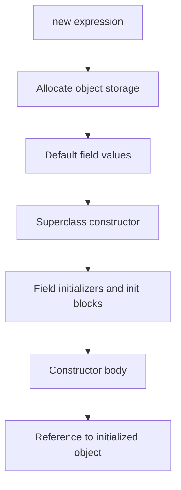

# Constructors, Methods, and Overloading

Construction and method invocation are the everyday mechanics of object-oriented Java. A constructor gives a new object its initial state. A method gives clients a named operation. The keyword `this` names the current receiver, making it possible to distinguish fields from parameters and to delegate among constructors or methods.


*Figure: Java's early development at Sun shaped its portability, virtual-machine model, and library ecosystem. Image: [Wikimedia Commons](https://commons.wikimedia.org/wiki/File:Sun_Microsystems_logo.svg), Sun Microsystems and Afrank99, public domain text logo.*

Overloading lets several methods or constructors share a name when their parameter lists differ. This can make APIs natural, but it also means the compiler must choose a most specific applicable method. The source book treats this choice as a precise language rule, not as a matter of intuition. Good overloaded APIs make the intended choice obvious to both compiler and reader.

## Definitions

The source basis for this page is Chapter 2 sections on creating objects, construction and initialization, methods, `this`, overloading methods, static member imports, `main`, and native methods. The terms below are written as contracts: each one tells you what the compiler can check, what the runtime must preserve, and what a reader of the program may rely on.

**Constructor invocation.** Constructor invocation creates and initializes a new object, usually through `new`. A constructor can delegate to another constructor in the same class with `this(...)` or to a superclass constructor with `super(...)`. In Java, this is rarely just vocabulary. It controls which operations are legal, when a value exists, what names are visible, or which object receives a message. When reading code, ask what the term promises before asking how the implementation happens to work.

**Initialization order.** Object initialization follows an order involving default field values, explicit field initializers, initialization blocks, superclass construction, and constructor bodies. Understanding the order prevents use of state before it is ready. In Java, this is rarely just vocabulary. It controls which operations are legal, when a value exists, what names are visible, or which object receives a message. When reading code, ask what the term promises before asking how the implementation happens to work.

**Receiver.** The receiver is the object on which an instance method is invoked. Inside the method, `this` refers to that receiver. In Java, this is rarely just vocabulary. It controls which operations are legal, when a value exists, what names are visible, or which object receives a message. When reading code, ask what the term promises before asking how the implementation happens to work.

**Parameter.** A parameter is a method or constructor variable initialized by the caller's argument. Parameter names can shadow field names, making `this.field` useful. In Java, this is rarely just vocabulary. It controls which operations are legal, when a value exists, what names are visible, or which object receives a message. When reading code, ask what the term promises before asking how the implementation happens to work.

**Return value.** A method may return a value whose type is declared in the method header, or it may be declared `void` and return no value. In Java, this is rarely just vocabulary. It controls which operations are legal, when a value exists, what names are visible, or which object receives a message. When reading code, ask what the term promises before asking how the implementation happens to work.

**Overloading.** Overloading declares multiple methods or constructors with the same name but different parameter lists. The compiler chooses among them using argument types and conversion rules. In Java, this is rarely just vocabulary. It controls which operations are legal, when a value exists, what names are visible, or which object receives a message. When reading code, ask what the term promises before asking how the implementation happens to work.

**Varargs.** A variable arity parameter, written with `...`, lets callers pass zero or more trailing arguments that are received as an array. Java 5 added this feature. In Java, this is rarely just vocabulary. It controls which operations are legal, when a value exists, what names are visible, or which object receives a message. When reading code, ask what the term promises before asking how the implementation happens to work.

**Native method.** A native method is declared in Java but implemented outside Java, usually to connect with platform-specific code. The source mentions native methods as a boundary, not as ordinary application style. In Java, this is rarely just vocabulary. It controls which operations are legal, when a value exists, what names are visible, or which object receives a message. When reading code, ask what the term promises before asking how the implementation happens to work.

## Key results

**Constructors should centralize validity.** A class with several constructors should avoid duplicating validation inconsistently. Constructor delegation lets one constructor perform common checks and initialization for the others. This supports the same invariant regardless of which public constructor a client uses. A good check is to rewrite the idea as a rule a compiler, library, or maintainer can enforce. If the rule cannot be stated clearly, the design is probably relying on habit instead of a contract.

**`this` is a precision tool.** `this` can clarify that `this.name` is the field while `name` is the parameter. It can also pass the current object to another method. Overusing it everywhere may be noisy, but using it where shadowing or receiver identity matters prevents ambiguity. A good check is to rewrite the idea as a rule a compiler, library, or maintainer can enforce. If the rule cannot be stated clearly, the design is probably relying on habit instead of a contract.

**Overloading is compile-time selection.** The compiler selects an overloaded method based on the compile-time argument types and applicable conversions. Runtime dynamic dispatch applies after a signature has been chosen. Confusing overloading with overriding leads to surprising method calls. A good check is to rewrite the idea as a rule a compiler, library, or maintainer can enforce. If the rule cannot be stated clearly, the design is probably relying on habit instead of a contract.

**Varargs are arrays at the method boundary.** A varargs parameter is received as an array inside the method. It improves call-site convenience, but the method still needs to handle the array length and possible values carefully. Overloaded varargs methods can be hard to read if several calls appear applicable. A good check is to rewrite the idea as a rule a compiler, library, or maintainer can enforce. If the rule cannot be stated clearly, the design is probably relying on habit instead of a contract.

**A method's contract includes effects as well as return type.** The signature tells which arguments and return type are involved, but the method documentation and implementation define state changes, exceptions, and invariants. A `void` method can still be the most important operation in a class if it changes object state safely. A good check is to rewrite the idea as a rule a compiler, library, or maintainer can enforce. If the rule cannot be stated clearly, the design is probably relying on habit instead of a contract.

When tracing an invocation, do it in two passes. First, choose the signature: list the method name, argument expressions, compile-time argument types, and conversions allowed for overload resolution. Second, choose the implementation: if the selected method is an instance method and can be overridden, dynamic dispatch uses the actual receiver object's class. Constructors are different: they are not inherited and not dynamically dispatched. This two-pass separation is a compact way to avoid many errors around overloaded methods, subclass methods, and calls through superclass references.

## Visual



| Feature | Chosen when? | Main question |
|---|---|---|
| Constructor overload | Compile time | Which parameter list matches the `new` arguments? |
| Method overload | Compile time | Which signature is most specific and applicable? |
| Method override | Runtime after signature choice | Which implementation belongs to the receiver object? |
| Varargs call | Compile time | Are fixed arguments enough, or is an array created for extras? |

## Worked example 1: constructor delegation for a rectangle

Problem: Design `Rectangle(int width, int height)` and `Rectangle(int side)` so both reject nonpositive sizes.

Method:

1. Identify the invariant: width and height must both be greater than zero.
2. Put the full validation in the two-argument constructor because it has all state explicitly.
3. Make the one-argument square constructor delegate with `this(side, side)` as its first statement.
4. If `side` is invalid, the delegated constructor rejects it using the same rule as every other rectangle.
5. Store the validated arguments in private final fields.

Checked answer: Both constructors produce valid rectangles or throw the same exception for invalid dimensions. The invariant is centralized in one constructor body.

## Worked example 2: separating overload and override

Problem: Suppose a class has `print(Object o)` and `print(String s)`, and the variable is declared `Object x = "hi";`. Which overload is selected by `print(x)`?

Method:

1. Overload selection uses the compile-time type of the argument expression.
2. The variable `x` is declared as `Object`, even though its runtime value is a `String` object.
3. `print(Object)` is applicable directly. `print(String)` would require treating the compile-time `Object` expression as a `String`, which overload resolution does not assume.
4. The selected signature is therefore `print(Object)`.
5. If `print(Object)` is an instance method overridden in a subclass, dynamic dispatch may choose a subclass implementation of that same signature, but it will not switch to `print(String)`.

Checked answer: `print(Object)` is selected. Overloading is decided before runtime receiver dispatch and uses compile-time argument types.

## Code

```java
public class ConstructorOverloadDemo {
    static class Rectangle {
        private final int width;
        private final int height;

        Rectangle(int side) {
            this(side, side);
        }

        Rectangle(int width, int height) {
            if (width <= 0 || height <= 0) {
                throw new IllegalArgumentException("positive dimensions required");
            }
            this.width = width;
            this.height = height;
        }

        int area() {
            return width * height;
        }
    }

    static void print(Object value) {
        System.out.println("Object: " + value);
    }

    static void print(String value) {
        System.out.println("String: " + value);
    }

    public static void main(String[] args) {
        Rectangle square = new Rectangle(5);
        System.out.println(square.area());

        Object text = "hello";
        print(text);
        print((String) text);
    }
}
```

## Common pitfalls

- Do not duplicate constructor validation in several places if delegation can centralize it.
- Do not forget that `this(...)` or `super(...)` must be the first statement when used in a constructor.
- Do not confuse overloaded method choice with overridden method dispatch.
- Do not create overloaded methods whose calls differ only by subtle boxing, widening, or varargs choices unless the API benefit is clear.
- Do not let parameter names shadow fields accidentally. Use clear names or `this.field` where the distinction matters.

## Connections

- [Classes, Objects, and Encapsulation](/cs/programming/java/classes-objects-encapsulation): explains the invariants constructors protect.
- [Inheritance, Polymorphism, and Object](/cs/programming/java/inheritance-polymorphism-object): separates overriding from overloading.
- [Primitives, Operators, and Conversions](/cs/programming/java/primitives-operators-conversions): supplies conversion rules used in overload resolution.
- [Generics, Wildcards, and Erasure](/cs/programming/java/generics-wildcards-erasure): shows how generic methods add another layer to method selection.
