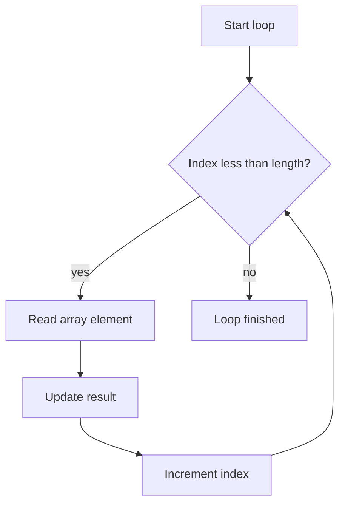

# Control Flow, Arrays, and Strings

Control flow determines which statements run, how often they run, and when a method returns. Java's constructs are familiar to C-family programmers: blocks, `if`, `switch`, `while`, `do`, `for`, labels, `break`, `continue`, and `return`. The source book emphasizes that these constructs are simple but precise. The right loop shape makes code easier to verify; the wrong one hides the condition that ends the computation.

Arrays and strings are the first compound data structures many Java programs use. An array is an object with a fixed length and indexed components. A `String` is an object representing a sequence of characters, and string operations create or use objects rather than changing a primitive value. Together, loops, arrays, and strings form the base of searching, counting, formatting, parsing, and many examples in later chapters.

## Definitions

The source basis for this page is Chapter 10 on statements and control flow, Chapter 7 on array variables, and Chapter 13 on strings and character sequences. The terms below are written as contracts: each one tells you what the compiler can check, what the runtime must preserve, and what a reader of the program may rely on.

**Block.** A block is a sequence of statements and local declarations enclosed in braces. It is a single statement syntactically and also creates a scope for local variables declared inside it. In Java, this is rarely just vocabulary. It controls which operations are legal, when a value exists, what names are visible, or which object receives a message. When reading code, ask what the term promises before asking how the implementation happens to work.

**`if` statement.** An `if` chooses between a true branch and an optional false branch based on a boolean expression. Java does not use integers as boolean conditions. In Java, this is rarely just vocabulary. It controls which operations are legal, when a value exists, what names are visible, or which object receives a message. When reading code, ask what the term promises before asking how the implementation happens to work.

**`switch` statement.** A `switch` selects among case labels based on a compatible expression value. In the source-era language, cases fall through unless a `break`, `return`, or other transfer interrupts them. In Java, this is rarely just vocabulary. It controls which operations are legal, when a value exists, what names are visible, or which object receives a message. When reading code, ask what the term promises before asking how the implementation happens to work.

**Loop.** A loop repeats a statement. `while` tests before the body, `do` tests after the body, and `for` groups initialization, test, and update in one header. In Java, this is rarely just vocabulary. It controls which operations are legal, when a value exists, what names are visible, or which object receives a message. When reading code, ask what the term promises before asking how the implementation happens to work.

**Enhanced `for`.** The enhanced `for` loop introduced by Java 5 iterates over arrays and `Iterable` objects. It is useful when the index itself is not part of the algorithm. In Java, this is rarely just vocabulary. It controls which operations are legal, when a value exists, what names are visible, or which object receives a message. When reading code, ask what the term promises before asking how the implementation happens to work.

**Array.** An array is an object whose length is fixed at creation and whose components are accessed by zero-based integer index. Every array has a `length` field. In Java, this is rarely just vocabulary. It controls which operations are legal, when a value exists, what names are visible, or which object receives a message. When reading code, ask what the term promises before asking how the implementation happens to work.

**String.** A `String` object represents an immutable character sequence. Operations such as concatenation or replacement produce new string values rather than changing the original object. In Java, this is rarely just vocabulary. It controls which operations are legal, when a value exists, what names are visible, or which object receives a message. When reading code, ask what the term promises before asking how the implementation happens to work.

**`StringBuilder`.** `StringBuilder` is a mutable builder for constructing strings efficiently when repeated appending would create many intermediate `String` objects. In Java, this is rarely just vocabulary. It controls which operations are legal, when a value exists, what names are visible, or which object receives a message. When reading code, ask what the term promises before asking how the implementation happens to work.

## Key results

**Every loop needs a visible invariant.** A loop should make clear what remains true before and after each iteration. For an array scan, the invariant might be that all elements before index `i` have already been examined. Naming the invariant helps place updates, `break`, and `continue` correctly. A good check is to rewrite the idea as a rule a compiler, library, or maintainer can enforce. If the rule cannot be stated clearly, the design is probably relying on habit instead of a contract.

**Fall-through is both feature and hazard.** `switch` fall-through can intentionally share code among cases, but an omitted `break` can silently run the next case. Because the source-era `switch` uses statement labels rather than isolated arms, the programmer must make every fall-through obvious. A good check is to rewrite the idea as a rule a compiler, library, or maintainer can enforce. If the rule cannot be stated clearly, the design is probably relying on habit instead of a contract.

**Arrays are objects with fixed length.** Assigning an array variable copies a reference, not the array contents. The length cannot change after creation. To grow a sequence, use a collection such as `ArrayList` or create a new array and copy components. A good check is to rewrite the idea as a rule a compiler, library, or maintainer can enforce. If the rule cannot be stated clearly, the design is probably relying on habit instead of a contract.

**Index boundaries are half-open in idiomatic loops.** The common loop `for (int i = 0; i < a.length; i++)` visits valid indices from `0` through `a.length - 1`. The condition uses `<`, not `<=`, because the first invalid index is exactly `a.length`. This half-open habit also appears in substring and range thinking. A good check is to rewrite the idea as a rule a compiler, library, or maintainer can enforce. If the rule cannot be stated clearly, the design is probably relying on habit instead of a contract.

**String immutability changes update strategy.** A statement such as `s = s + part` does not mutate the original string object. It creates or computes a new string value and stores a reference in `s`. For many repeated appends, `StringBuilder` communicates the intent and avoids unnecessary intermediate strings. A good check is to rewrite the idea as a rule a compiler, library, or maintainer can enforce. If the rule cannot be stated clearly, the design is probably relying on habit instead of a contract.

When debugging control flow, write down the exact transfer target of each `break`, `continue`, and `return`. An unlabeled `break` exits the nearest loop or `switch`; an unlabeled `continue` continues the nearest loop; a labeled form targets the labeled statement allowed by the language. When debugging arrays, write down the valid index interval `[0, length)`. When debugging strings, ask whether the operation returns a new string or mutates a builder. These habits turn vague runtime symptoms such as off-by-one errors, missing cases, and unexpected unchanged strings into concrete rule checks.

## Visual



| Construct | Best fit | Key risk |
|---|---|---|
| `if` / `else` | One decision or small decision tree | Dangling or visually misleading branch |
| `switch` | Fixed set of cases | Accidental fall-through |
| `while` | Input- or condition-driven repetition | Condition never changes |
| `do` / `while` | Body must run at least once | Forgetting the post-test behavior |
| Classic `for` | Index or counter loop | Off-by-one condition |
| Enhanced `for` | Visit each element | Cannot naturally replace elements by index |

## Worked example 1: finding the maximum array element

Problem: Given `int[] values = {4, 9, 2, 9, 5};`, find the maximum and show the loop invariant.

Method:

1. The array is nonempty, so initialize `max` with `values[0]`. At this point, `max` is the maximum of the examined prefix containing index `0`.
2. Start `i` at `1` because index `0` has already been included.
3. Before each iteration, the invariant is: `max` is the maximum among elements from index `0` through `i - 1`.
4. At `i = 1`, compare `values[1] = 9` with `max = 4`; update `max` to `9`.
5. At `i = 2`, compare `2` with `9`; keep `9`. At `i = 3`, compare `9` with `9`; keep `9`. At `i = 4`, compare `5` with `9`; keep `9`.
6. When `i == values.length`, the examined prefix is the whole array.

Checked answer: The maximum is `9`. The invariant proves the answer because the loop ends only after every valid index has been examined.

## Worked example 2: building a comma-separated string

Problem: Build `red, green, blue` from `String[] names = {"red", "green", "blue"};` without leaving an extra comma.

Method:

1. Use `StringBuilder` because the algorithm appends several parts.
2. Loop over indices `0` through `names.length - 1`. The index is useful because the comma depends on position.
3. Before appending a name, check whether `i > 0`. If true, append `", "`; if false, append no separator.
4. Append `names[i]` after any needed separator.
5. After the loop, call `toString` to create the final immutable `String` result.

Checked answer: The result is `red, green, blue`. The separator rule is checked before each element after the first, so no leading or trailing comma appears.

## Code

```java
public class ArrayStringDemo {
    public static void main(String[] args) {
        int[] values = { 4, 9, 2, 9, 5 };
        int max = values[0];
        for (int i = 1; i < values.length; i++) {
            if (values[i] > max) {
                max = values[i];
            }
        }

        String[] names = { "red", "green", "blue" };
        StringBuilder joined = new StringBuilder();
        for (int i = 0; i < names.length; i++) {
            if (i > 0) {
                joined.append(", ");
            }
            joined.append(names[i]);
        }

        System.out.println("max = " + max);
        System.out.println(joined.toString());
    }
}
```

## Common pitfalls

- Do not use `<= array.length` in an index loop. The valid index range ends at `array.length - 1`.
- Do not assume `switch` cases stop automatically. Add `break` unless fall-through is deliberate and obvious.
- Do not use an enhanced `for` loop when the algorithm needs the index for replacement, position-based separators, or neighboring elements.
- Do not expect `String` methods or concatenation to mutate an existing string object.
- Do not hide loop termination. A loop whose stopping condition is far from its update is harder to verify.

## Connections

- [Tokens, Values, and Variables](/cs/programming/java/tokens-values-variables): explains local variables, references, and array variables.
- [Primitives, Operators, and Conversions](/cs/programming/java/primitives-operators-conversions): explains boolean conditions and arithmetic updates.
- [Strings, Regular Expressions, Formatter, and Scanner](/cs/programming/java/strings-regex-formatter-scanner): develops string processing in detail.
- [Collections, Iteration, and Maps](/cs/programming/java/collections-iteration-maps): introduces growable collection alternatives to arrays.
