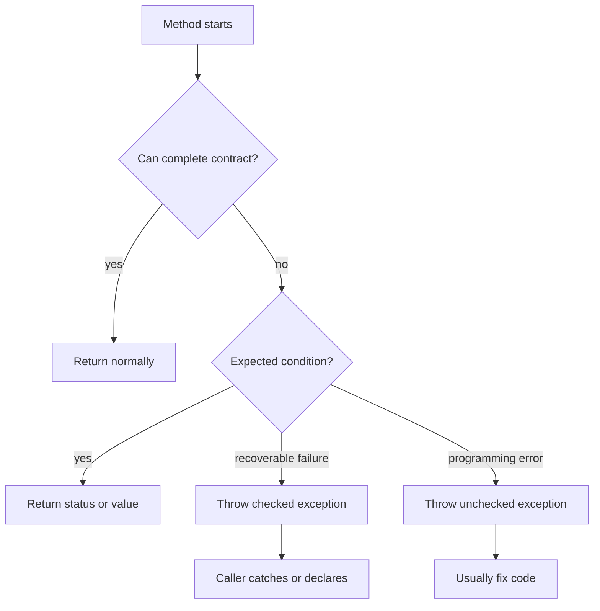

# Exceptions and Assertions

Exceptions separate ordinary control flow from unexpected failure. A method can throw an exception when it cannot complete its contract, and callers either handle that exception or allow it to propagate. The source book treats exception design as a clarity tool: code should not be buried under error checks, but exceptions should not be abused for expected situations such as normal end-of-input.

Assertions serve a different purpose. An assertion checks a condition that should be true if the program logic is correct, such as an invariant, precondition, or postcondition. Assertions can be enabled or disabled, so they are a debugging and validation aid rather than a substitute for required argument checks in public APIs.

## Definitions

The source basis for this page is Chapter 12 on exception types, `throw`, `throws`, `try`, `catch`, `finally`, exception chaining, stack traces, when to use exceptions, assertions, and enabling assertions. The terms below are written as contracts: each one tells you what the compiler can check, what the runtime must preserve, and what a reader of the program may rely on.

**Exception.** An exception is an object representing an abnormal condition that interrupts normal control flow. It is thrown and may be caught by matching handlers. In Java, this is rarely just vocabulary. It controls which operations are legal, when a value exists, what names are visible, or which object receives a message. When reading code, ask what the term promises before asking how the implementation happens to work.

**Checked exception.** A checked exception must be declared or caught, except for subclasses of unchecked categories. The compiler enforces handling so callers cannot ignore declared recoverable failures accidentally. In Java, this is rarely just vocabulary. It controls which operations are legal, when a value exists, what names are visible, or which object receives a message. When reading code, ask what the term promises before asking how the implementation happens to work.

**Unchecked exception.** An unchecked exception is a `RuntimeException` or `Error` subclass. It usually represents programming errors or conditions not intended for ordinary recovery. In Java, this is rarely just vocabulary. It controls which operations are legal, when a value exists, what names are visible, or which object receives a message. When reading code, ask what the term promises before asking how the implementation happens to work.

**`throw`.** `throw` transfers control by throwing an exception object. Execution resumes only if a matching handler is found during stack unwinding. In Java, this is rarely just vocabulary. It controls which operations are legal, when a value exists, what names are visible, or which object receives a message. When reading code, ask what the term promises before asking how the implementation happens to work.

**`throws` clause.** A `throws` clause declares checked exceptions that a method or constructor may let escape. It is part of the method contract. In Java, this is rarely just vocabulary. It controls which operations are legal, when a value exists, what names are visible, or which object receives a message. When reading code, ask what the term promises before asking how the implementation happens to work.

**`try`, `catch`, `finally`.** `try` protects a block, `catch` handles selected exceptions, and `finally` runs cleanup code regardless of normal completion, exception, or many control transfers. In Java, this is rarely just vocabulary. It controls which operations are legal, when a value exists, what names are visible, or which object receives a message. When reading code, ask what the term promises before asking how the implementation happens to work.

**Exception chaining.** Exception chaining records an underlying cause when one exception is translated into another. It preserves diagnostic information across abstraction boundaries. In Java, this is rarely just vocabulary. It controls which operations are legal, when a value exists, what names are visible, or which object receives a message. When reading code, ask what the term promises before asking how the implementation happens to work.

**Assertion.** An assertion checks a boolean condition and throws `AssertionError` if assertions are enabled and the condition is false. In Java, this is rarely just vocabulary. It controls which operations are legal, when a value exists, what names are visible, or which object receives a message. When reading code, ask what the term promises before asking how the implementation happens to work.

## Key results

**Use exceptions for exceptional contract failure, not ordinary loop endings.** The source explicitly contrasts using a return flag for expected end-of-input with throwing an exception for reading past the end. If a condition is part of normal control flow and easy to test, a direct condition is usually clearer than exception-driven looping. A good check is to rewrite the idea as a rule a compiler, library, or maintainer can enforce. If the rule cannot be stated clearly, the design is probably relying on habit instead of a contract.

**Checked exceptions document recoverable obligations.** A checked exception in a `throws` clause tells the caller that the method may fail in a way the caller should address or propagate. This can make APIs more honest, but it also requires careful design so callers are not forced to catch failures they cannot meaningfully handle. A good check is to rewrite the idea as a rule a compiler, library, or maintainer can enforce. If the rule cannot be stated clearly, the design is probably relying on habit instead of a contract.

**`finally` preserves cleanup across exits.** A `finally` block runs when the `try` block completes normally, throws, returns, breaks, or continues, unless the VM itself is terminated. The source-era cleanup idiom for resources such as streams is therefore `try` plus `finally`. Java's later try-with-resources feature is outside this book. A good check is to rewrite the idea as a rule a compiler, library, or maintainer can enforce. If the rule cannot be stated clearly, the design is probably relying on habit instead of a contract.

**Do not let `finally` hide the original reason for exit.** If a `finally` block throws a new exception or returns a value, it can replace the original exception or return reason. Cleanup code should usually avoid creating a new control transfer unless that is truly intended. A good check is to rewrite the idea as a rule a compiler, library, or maintainer can enforce. If the rule cannot be stated clearly, the design is probably relying on habit instead of a contract.

**Assertions are for internal truth, not user input validation.** A public method should check invalid arguments even when assertions are disabled. Assertions are better for conditions that should be impossible if the code is correct, such as postconditions after an internal calculation. A good check is to rewrite the idea as a rule a compiler, library, or maintainer can enforce. If the rule cannot be stated clearly, the design is probably relying on habit instead of a contract.

When designing error handling, classify each condition before writing code. Is it expected and common, like reaching the end of a token stream? Use a normal condition or return value. Is it a recoverable failure that the caller can address, like an I/O problem? A checked exception may make the contract explicit. Is it a programming error, like passing `null` where the contract forbids it? An unchecked exception may be appropriate. Is it an invariant that should never fail inside correct code? Use an assertion during development. This classification is more important than memorizing exception class names.

## Visual



| Mechanism | Use for | Avoid for |
|---|---|---|
| Return value | Expected alternatives | Hidden serious failure |
| Checked exception | Recoverable failure callers must see | Routine loop termination |
| Unchecked exception | Programming errors or contract violations | Normal user choices |
| `finally` | Cleanup after any exit | Returning over an existing exception |
| Assertion | Internal invariant checks | Required public validation |

## Worked example 1: choosing end-of-input behavior

Problem: A token reader reaches the end of input. Should `next()` throw an exception to end a loop?

Method:

1. Classify end-of-input. In a reader, reaching the end is expected and common.
2. If `next()` throws to signal the normal end, the loop may look infinite and the exit condition is hidden in a `catch` block.
3. Provide a test such as `hasNext()` or an end marker if a marker value is unambiguous.
4. Use an exception for reading past the end after the caller failed to check, because that violates the reader's contract.
5. Write the loop with the normal condition visible: `while (reader.hasNext()) process(reader.next());`.

Checked answer: Normal end-of-input should not be exception-driven. A visible condition is clearer; an exception is appropriate for misuse such as reading after the end.

## Worked example 2: resource cleanup with `finally`

Problem: Open a stream, read data, and ensure the stream is closed if reading succeeds, fails, or returns early.

Method:

1. Declare the stream reference outside the `try` so the `finally` block can see it.
2. Assign the stream after opening. If opening fails, the reference remains `null` and there is nothing to close.
3. Perform reading inside the `try`. The read code may return normally, return early, or throw an exception.
4. In `finally`, check whether the stream is non-null before closing it.
5. Avoid allowing a close failure to hide the more important read failure unless that is the intended API behavior.

Checked answer: The checked source-era idiom is `try` plus `finally` with a null check. Later Java try-with-resources automates this pattern, but it is not covered by the source book.

## Code

```java
import java.io.ByteArrayInputStream;
import java.io.IOException;
import java.io.InputStream;

public class ExceptionDemo {
    static int firstByte(byte[] data) throws IOException {
        InputStream in = null;
        try {
            in = new ByteArrayInputStream(data);
            int value = in.read();
            if (value < 0) {
                throw new IOException("empty input");
            }
            assert value >= 0 && value <= 255;
            return value;
        } finally {
            if (in != null) {
                in.close();
            }
        }
    }

    public static void main(String[] args) throws IOException {
        System.out.println(firstByte(new byte[] { 65, 66 }));
    }
}
```

## Common pitfalls

- Do not use exceptions to hide ordinary control flow such as an expected loop ending.
- Do not catch an exception and discard it silently unless the contract explicitly says the failure is irrelevant.
- Do not let a `finally` block return or throw accidentally, because it can replace the original reason for leaving the `try` block.
- Do not use assertions to validate public method arguments that must be checked in production.
- Do not translate exceptions without preserving the cause when the lower-level failure is diagnostically important.

## Connections

- [I/O Streams, Files, Serialization, and NIO](/cs/programming/java/io-streams-files-serialization-nio): uses checked `IOException` and cleanup idioms.
- [Classes, Objects, and Encapsulation](/cs/programming/java/classes-objects-encapsulation): uses exceptions to enforce object contracts.
- [Control Flow, Arrays, and Strings](/cs/programming/java/control-flow-arrays-strings): contrasts normal branch/loop control with exceptional transfer.
- [Threads, Synchronization, and the Memory Model](/cs/programming/java/threads-synchronization-memory-model): explains exceptions crossing thread boundaries and synchronization cleanup.
