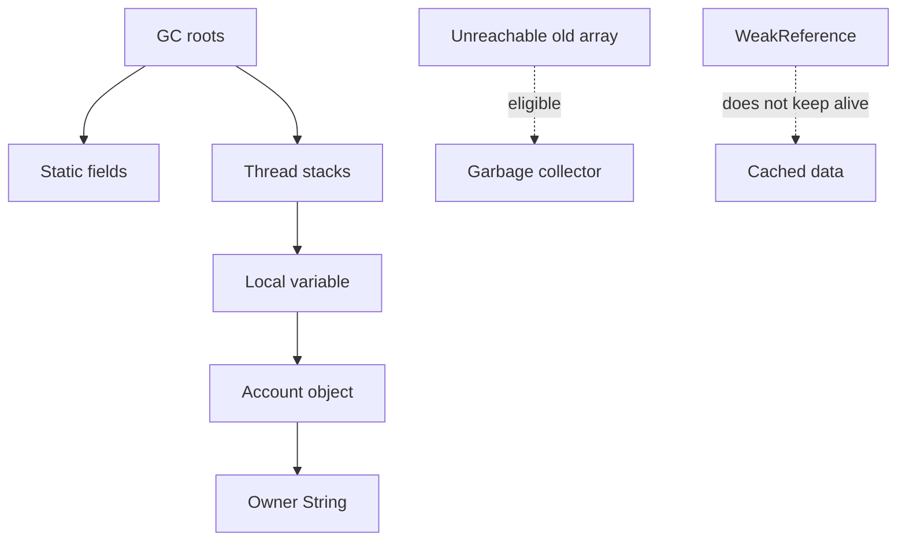

# Garbage Collection, References, and Memory

Java manages object memory through garbage collection. Programs allocate objects, keep references to the objects they still need, and the runtime reclaims objects that are no longer reachable. This does not eliminate resource management, but it changes what programmers manage directly: object memory is automatic, while files, sockets, locks, and other external resources still require explicit cleanup.


*Figure: Java's early development at Sun shaped its portability, virtual-machine model, and library ecosystem. Image: [Wikimedia Commons](https://commons.wikimedia.org/wiki/File:Sun_Microsystems_logo.svg), Sun Microsystems and Afrank99, public domain text logo.*

The source book's memory chapter focuses on reachability. An object is alive for program purposes while it can be reached from active roots through strong references. Reference objects such as soft, weak, and phantom references allow programs to interact with reachability in controlled ways. Finalization is covered, but with strong warnings about design hazards.

## Definitions

The source basis for this page is Chapter 17 on garbage collection, a simple memory model, finalization, interacting with the garbage collector, reachability states, and reference objects. The terms below are written as contracts: each one tells you what the compiler can check, what the runtime must preserve, and what a reader of the program may rely on.

**Garbage collection.** Garbage collection is automatic reclamation of memory occupied by objects that are no longer reachable by the program. In Java, this is rarely just vocabulary. It controls which operations are legal, when a value exists, what names are visible, or which object receives a message. When reading code, ask what the term promises before asking how the implementation happens to work.

**Reachability.** Reachability describes whether an object can be accessed from active roots such as local variables, static fields, thread stacks, and other reachable objects. In Java, this is rarely just vocabulary. It controls which operations are legal, when a value exists, what names are visible, or which object receives a message. When reading code, ask what the term promises before asking how the implementation happens to work.

**Strong reference.** A strong reference is an ordinary reference that keeps an object strongly reachable while the reference itself is reachable. In Java, this is rarely just vocabulary. It controls which operations are legal, when a value exists, what names are visible, or which object receives a message. When reading code, ask what the term promises before asking how the implementation happens to work.

**Soft reference.** A soft reference can refer to an object that may be reclaimed under memory pressure. It is often associated with caches. In Java, this is rarely just vocabulary. It controls which operations are legal, when a value exists, what names are visible, or which object receives a message. When reading code, ask what the term promises before asking how the implementation happens to work.

**Weak reference.** A weak reference does not keep its referent alive. Weak references are useful for associations that should disappear when the key object is otherwise unused. In Java, this is rarely just vocabulary. It controls which operations are legal, when a value exists, what names are visible, or which object receives a message. When reading code, ask what the term promises before asking how the implementation happens to work.

**Phantom reference.** A phantom reference supports post-reachability cleanup coordination after an object becomes phantom reachable and is enqueued. In Java, this is rarely just vocabulary. It controls which operations are legal, when a value exists, what names are visible, or which object receives a message. When reading code, ask what the term promises before asking how the implementation happens to work.

**Finalization.** Finalization is a mechanism by which an object's `finalize` method may be invoked before reclamation. The source warns against relying on it for ordinary cleanup. In Java, this is rarely just vocabulary. It controls which operations are legal, when a value exists, what names are visible, or which object receives a message. When reading code, ask what the term promises before asking how the implementation happens to work.

**Object resurrection.** Resurrection occurs when finalization or related logic makes an otherwise unreachable object reachable again. The source treats this as a design smell. In Java, this is rarely just vocabulary. It controls which operations are legal, when a value exists, what names are visible, or which object receives a message. When reading code, ask what the term promises before asking how the implementation happens to work.

## Key results

**Reachability, not scope alone, determines collection.** A local variable going out of scope can remove one reference, but the object remains alive if reachable through another path. Conversely, an object may be eligible for collection even if its allocation site is recent, provided no live reference can reach it. A good check is to rewrite the idea as a rule a compiler, library, or maintainer can enforce. If the rule cannot be stated clearly, the design is probably relying on habit instead of a contract.

**Garbage collection does not close resources on time.** The collector reclaims memory, not external resources in a predictable schedule. A file stream should be closed through program logic, not left for finalization. This connects memory management directly to the I/O chapter's cleanup idioms. A good check is to rewrite the idea as a rule a compiler, library, or maintainer can enforce. If the rule cannot be stated clearly, the design is probably relying on habit instead of a contract.

**Finalization is uncertain and hazardous.** The runtime does not promise prompt finalization, and finalizers can create ordering, performance, security, and resurrection problems. The source's guidance is to review designs that seem to require resurrection or finalizer-dependent behavior. A good check is to rewrite the idea as a rule a compiler, library, or maintainer can enforce. If the rule cannot be stated clearly, the design is probably relying on habit instead of a contract.

**Reference objects are specialized tools.** Soft and weak references are useful when cached or associated data should not force an object to remain alive. They are not ordinary substitutes for fields. Code using them must handle the referent disappearing between checks. A good check is to rewrite the idea as a rule a compiler, library, or maintainer can enforce. If the rule cannot be stated clearly, the design is probably relying on habit instead of a contract.

**Reachability can change when a reference is read.** Calling `get` on a reference object and storing a non-null result in a local variable creates a strong reference for as long as that local is live. This is why code should copy the referent to a strong variable before using it after a null check. A good check is to rewrite the idea as a rule a compiler, library, or maintainer can enforce. If the rule cannot be stated clearly, the design is probably relying on habit instead of a contract.

To reason about garbage collection, draw an object graph. Mark roots such as active locals, static fields, and live thread objects. Follow strong references from those roots. Every object reached by that traversal is strongly reachable. Objects not reached may be reclaimable, subject to softer reference categories and runtime details. Then separately list non-memory resources. If an object owns a file, socket, native handle, or lock, ask where program logic releases it. Garbage collection may eventually reclaim object memory, but correctness should not depend on when that happens.

## Visual



| Reference kind | Keeps object alive? | Typical source-era use |
|---|---|---|
| Strong reference | Yes | Ordinary object graph |
| Soft reference | Not necessarily under pressure | Memory-sensitive cache |
| Weak reference | No | Associations such as weak maps |
| Phantom reference | No direct `get` use | Cleanup coordination after reachability |
| Finalizer reference | Runtime-managed | Discouraged as cleanup strategy |

## Worked example 1: finding unreachable objects

Problem: Given `Node a = new Node(); Node b = new Node(); a.next = b; b = null;`, decide whether the second node is collectible.

Method:

1. `a` is a local variable holding a strong reference to the first node.
2. The first node's `next` field holds a strong reference to the second node.
3. The variable `b` is set to `null`, so it no longer refers directly to the second node.
4. However, the second node is still reachable from root `a` through `a.next`.
5. Therefore the second node is not eligible for collection while `a` remains live and `a.next` still points to it.

Checked answer: The second node is still reachable. Clearing one variable is not enough when another strong path remains.

## Worked example 2: using a weak reference safely

Problem: A weak reference may contain a cached byte array. Show why the referent should be copied to a strong local before use.

Method:

1. Call `ref.get()` to retrieve the referent. The result may be `null` if the object has already been cleared.
2. Store the result in a local variable, such as `byte[] data = ref.get();`.
3. Test the local variable for `null`.
4. If it is non-null, use the local variable for the whole operation. That local is a strong reference while it remains live.
5. Do not call `ref.get()` once for the null check and again later for use, because the second call could see a cleared reference.

Checked answer: The checked pattern is `T value = ref.get(); if (value != null) use(value);`. The local variable stabilizes the referent for the current operation.

## Code

```java
import java.lang.ref.WeakReference;

public class ReferenceDemo {
    static class Data {
        private final String name;

        Data(String name) {
            this.name = name;
        }

        public String toString() {
            return name;
        }
    }

    public static void main(String[] args) {
        Data data = new Data("cached");
        WeakReference<Data> ref = new WeakReference<Data>(data);

        Data strong = ref.get();
        if (strong != null) {
            System.out.println("using " + strong);
        }

        data = null;
        strong = null;
        System.gc();

        Data maybe = ref.get();
        System.out.println(maybe == null ? "cleared or may be cleared" : "still present: " + maybe);
    }
}
```

## Common pitfalls

- Do not rely on `System.gc()` as a command that immediately collects a specific object. It is only an interaction request.
- Do not use finalizers for timely release of files, sockets, or locks.
- Do not assume setting one reference to `null` makes an object collectible if other strong paths remain.
- Do not call `WeakReference.get()` twice when one strong local would make the operation stable.
- Do not confuse memory cleanup with logical cleanup. Object memory and external resources have different lifecycles.

## Connections

- [Tokens, Values, and Variables](/cs/programming/java/tokens-values-variables): explains reference variables and object sharing.
- [I/O Streams, Files, Serialization, and NIO](/cs/programming/java/io-streams-files-serialization-nio): shows explicit cleanup for non-memory resources.
- [Collections, Iteration, and Maps](/cs/programming/java/collections-iteration-maps): includes weak map ideas in collection design.
- [Threads, Synchronization, and the Memory Model](/cs/programming/java/threads-synchronization-memory-model): connects reachability to live threads and memory visibility.
