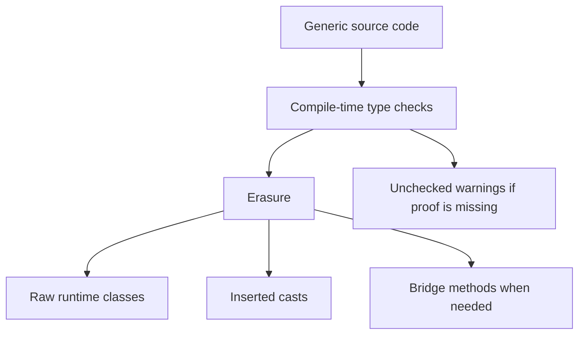

# Generics, Wildcards, and Erasure

Generics are one of the major Java 5 additions emphasized by the fourth edition. They let classes, interfaces, methods, and constructors express type relationships without giving up reusable code. A `List<String>` says that the list is intended to contain strings; a `Comparable<T>` says that comparison is tied to a type parameter; a generic method can preserve a relationship between input and output types.


*Figure: Java's early development at Sun shaped its portability, virtual-machine model, and library ecosystem. Image: [Wikimedia Commons](https://commons.wikimedia.org/wiki/File:Sun_Microsystems_logo.svg), Sun Microsystems and Afrank99, public domain text logo.*

The source book also stresses the cost of migration compatibility. Java generics are implemented with erasure rather than fully reified runtime type arguments. That choice allowed old and new code to interoperate, but it explains raw types, unchecked warnings, limits around generic arrays, bridge methods, and why some type information is not available at runtime.

## Definitions

The source basis for this page is Chapter 11 on generic type declarations, working with generic types, generic methods and constructors, wildcard capture, erasure, raw types, method finding, class extension with generic types, and Appendix A's migration discussion. The terms below are written as contracts: each one tells you what the compiler can check, what the runtime must preserve, and what a reader of the program may rely on.

**Type parameter.** A type parameter is a placeholder such as `T`, `E`, or `K` declared by a generic type or method. It stands for an actual type argument supplied by use or inference. In Java, this is rarely just vocabulary. It controls which operations are legal, when a value exists, what names are visible, or which object receives a message. When reading code, ask what the term promises before asking how the implementation happens to work.

**Parameterized type.** A parameterized type is a generic type with actual type arguments, such as `List<String>` or `Map<String, Integer>`. In Java, this is rarely just vocabulary. It controls which operations are legal, when a value exists, what names are visible, or which object receives a message. When reading code, ask what the term promises before asking how the implementation happens to work.

**Bound.** A bound restricts a type parameter, as in `<T extends Number>`. Bounds let generic code call methods known to be available through the bound. In Java, this is rarely just vocabulary. It controls which operations are legal, when a value exists, what names are visible, or which object receives a message. When reading code, ask what the term promises before asking how the implementation happens to work.

**Wildcard.** A wildcard `?` represents an unknown type argument. Bounded wildcards such as `? extends T` and `? super T` express producer and consumer relationships. In Java, this is rarely just vocabulary. It controls which operations are legal, when a value exists, what names are visible, or which object receives a message. When reading code, ask what the term promises before asking how the implementation happens to work.

**Generic method.** A generic method declares its own type parameters before the return type. The type parameter can relate several arguments and the return value. In Java, this is rarely just vocabulary. It controls which operations are legal, when a value exists, what names are visible, or which object receives a message. When reading code, ask what the term promises before asking how the implementation happens to work.

**Erasure.** Erasure is the compilation strategy that removes most type-argument information from runtime representation while inserting casts and bridge methods as needed. In Java, this is rarely just vocabulary. It controls which operations are legal, when a value exists, what names are visible, or which object receives a message. When reading code, ask what the term promises before asking how the implementation happens to work.

**Raw type.** A raw type is the name of a generic type used without type arguments, such as `List`. Raw types exist for compatibility with pre-generics code and produce unchecked risks. In Java, this is rarely just vocabulary. It controls which operations are legal, when a value exists, what names are visible, or which object receives a message. When reading code, ask what the term promises before asking how the implementation happens to work.

**Wildcard capture.** Wildcard capture is the compiler's internal treatment of an unknown wildcard as a specific, though unnamed, type within a limited context. In Java, this is rarely just vocabulary. It controls which operations are legal, when a value exists, what names are visible, or which object receives a message. When reading code, ask what the term promises before asking how the implementation happens to work.

## Key results

**Generics move type errors earlier.** Without generics, a collection can accept any `Object`, and mistakes may appear later as casts fail. With `List<String>`, adding the wrong type is rejected at compile time. The runtime representation is not fully specialized, but the source-level contract is still valuable. A good check is to rewrite the idea as a rule a compiler, library, or maintainer can enforce. If the rule cannot be stated clearly, the design is probably relying on habit instead of a contract.

**Invariance is deliberate.** `List<Integer>` is not a subtype of `List<Number>`, even though `Integer` is a subtype of `Number`. If it were, code could insert a `Double` into a list that was actually an integer list. Wildcards express the safe direction of use instead. A good check is to rewrite the idea as a rule a compiler, library, or maintainer can enforce. If the rule cannot be stated clearly, the design is probably relying on habit instead of a contract.

**Use `extends` for producers and `super` for consumers.** A `List<? extends Number>` can produce numbers to read, but you cannot safely add an arbitrary number because the exact element type is unknown. A `List<? super Integer>` can consume integers, but reading gives only `Object` without further knowledge. This is the practical meaning behind wildcard bounds. A good check is to rewrite the idea as a rule a compiler, library, or maintainer can enforce. If the rule cannot be stated clearly, the design is probably relying on habit instead of a contract.

**Unchecked warnings identify migration boundaries.** Raw types and some casts are allowed so old and new code can work together, but the compiler warns when it cannot prove type safety. Treat unchecked warnings as design signals. They often mean a generic boundary should be tightened. A good check is to rewrite the idea as a rule a compiler, library, or maintainer can enforce. If the rule cannot be stated clearly, the design is probably relying on habit instead of a contract.

**Erasure shapes what reflection and arrays can do.** Because most type arguments are erased, runtime checks cannot always distinguish `List<String>` from `List<Integer>`. Arrays, however, carry runtime component type information, so generic array creation has restrictions. This mismatch is one of the key practical limits of Java generics. A good check is to rewrite the idea as a rule a compiler, library, or maintainer can enforce. If the rule cannot be stated clearly, the design is probably relying on habit instead of a contract.

A reliable generic-design method is to decide whether each parameter is an input producer, an output consumer, or both. If a method only reads elements from a source, an upper-bounded wildcard often makes it more flexible. If it only writes elements to a destination, a lower-bounded wildcard may be right. If it both reads and writes values of the same exact element type, use a named type parameter. Then look for raw types and unchecked warnings; each warning marks a place where the compiler has lost evidence. The source's discussion of erasure is not an implementation curiosity. It is the reason these design rules exist.

## Visual



| Type form | Can read as | Can add | Typical use |
|---|---|---|---|
| `List<T>` | `T` | `T` | Exact element type needed |
| `List<? extends Number>` | `Number` | Usually only `null` | Producer of numbers |
| `List<? super Integer>` | `Object` | `Integer` values | Consumer of integers |
| Raw `List` | `Object` with unchecked casts | Anything | Legacy boundary only |
| `List<?>` | `Object` | Usually only `null` | Unknown but type-safe list |

## Worked example 1: copying with bounded wildcards

Problem: Design a method that copies integers from a source list into a destination list that can accept integers.

Method:

1. The source produces values to read. If it produces `Integer` or a subtype, `List<? extends Integer>` is flexible, though `Integer` is final in practice.
2. For a numeric example, use `<T>` and source `List<? extends T>` so the source can produce values compatible with `T`.
3. The destination consumes values. It can be a `List<T>` or a list of some supertype of `T`, so use `List<? super T>`.
4. Loop through the source and add each value to the destination. Reading from the source yields `T`; writing to the destination accepts `T`.
5. The same method can copy from `List<Integer>` to `List<Number>` when `T` is inferred as `Integer` or as a compatible type according to the call.

Checked answer: A checked signature is `<T> void copy(List<? extends T> source, List<? super T> dest)`. The bounds match producer and consumer roles.

## Worked example 2: why `List<Integer>` is not `List<Number>`

Problem: Explain the bug that would occur if a `List<Integer>` could be assigned to a `List<Number>` variable.

Method:

1. Assume `List<Integer> ints = new ArrayList<Integer>();`.
2. If assignment to `List<Number> nums = ints;` were allowed, `nums` and `ints` would refer to the same list object.
3. A `List<Number>` should accept any `Number`, so `nums.add(Double.valueOf(3.14))` would seem legal.
4. The underlying list would now contain a `Double` even though it is also known as a `List<Integer>` through `ints`.
5. Reading from `ints` as `Integer` would fail the type promise.

Checked answer: The assignment is forbidden to preserve type safety. Use a wildcard when a method only needs producer or consumer behavior instead of exact list element type.

## Code

```java
import java.util.ArrayList;
import java.util.List;

public class GenericsDemo {
    public static <T> void copy(List<? extends T> source, List<? super T> destination) {
        for (T value : source) {
            destination.add(value);
        }
    }

    public static double sum(List<? extends Number> values) {
        double total = 0.0;
        for (Number value : values) {
            total += value.doubleValue();
        }
        return total;
    }

    public static void main(String[] args) {
        List<Integer> ints = new ArrayList<Integer>();
        ints.add(Integer.valueOf(1));
        ints.add(Integer.valueOf(2));

        List<Number> numbers = new ArrayList<Number>();
        copy(ints, numbers);

        System.out.println(numbers);
        System.out.println(sum(numbers));
    }
}
```

## Common pitfalls

- Do not use raw types in new code except at unavoidable legacy boundaries. They remove compile-time evidence.
- Do not expect `List<Integer>` to be assignable to `List<Number>`. Generic types are invariant unless wildcards express a safe relationship.
- Do not create generic arrays casually. Array runtime type checks and erased generic type arguments do not fit cleanly together.
- Do not ignore unchecked warnings. They mark places where type safety depends on programmer reasoning rather than compiler proof.
- Do not overuse wildcards in return types. Callers often need a concrete relationship that a named type parameter expresses better.

## Connections

- [Collections, Iteration, and Maps](/cs/programming/java/collections-iteration-maps): applies generics to everyday container APIs.
- [Interfaces, Nested Classes, and Enums](/cs/programming/java/interfaces-nested-classes-enums): explains generic interfaces such as `Comparable<T>`.
- [Annotations and Reflection](/cs/programming/java/annotations-reflection): returns to generic type inspection limits.
- [Primitives, Operators, and Conversions](/cs/programming/java/primitives-operators-conversions): explains boxing needed for primitive values in generic collections.
