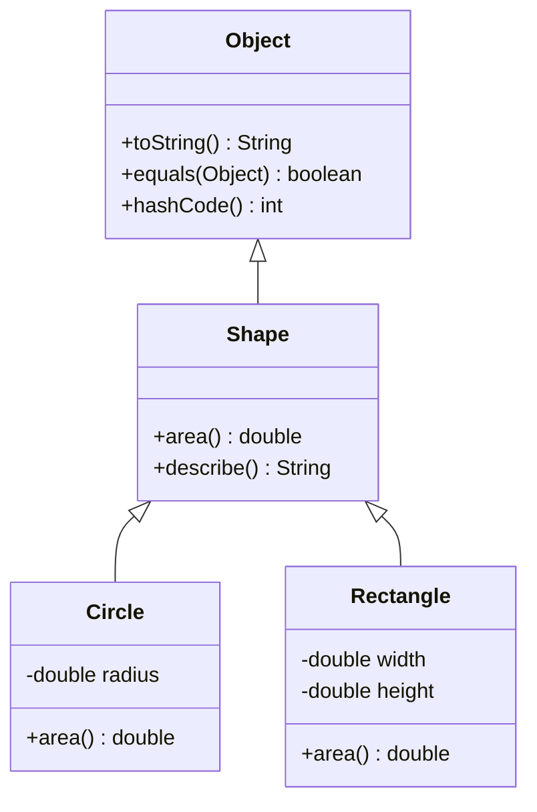

# Inheritance, Polymorphism, and Object

Inheritance lets a class extend another class, reusing and refining behavior under a subtype relationship. A subclass object can be used where a superclass reference is expected, and overridden instance methods are selected dynamically according to the actual object. That is the heart of Java polymorphism.

The source book is careful about inheritance because extension is powerful but easy to misuse. A superclass contract must remain valid for subclass objects. Fields should usually remain private, `protected` must be understood precisely, `final` can prevent unsafe extension, and `Object` methods such as `toString`, `equals`, `hashCode`, and `clone` have contracts that affect all classes.

## Definitions

The source basis for this page is Chapter 3 on extending classes, constructors in extended classes, inherited and redefined members, type compatibility, `protected`, `final`, abstract classes and methods, `Object`, cloning, and designing classes for extension. The terms below are written as contracts: each one tells you what the compiler can check, what the runtime must preserve, and what a reader of the program may rely on.

**Superclass.** A superclass is the class named after `extends`, or `Object` if no superclass is explicitly named. Its accessible members and contract influence every subclass. In Java, this is rarely just vocabulary. It controls which operations are legal, when a value exists, what names are visible, or which object receives a message. When reading code, ask what the term promises before asking how the implementation happens to work.

**Subclass.** A subclass extends a superclass. It may add fields and methods, override inherited methods, and use superclass constructors through `super`. In Java, this is rarely just vocabulary. It controls which operations are legal, when a value exists, what names are visible, or which object receives a message. When reading code, ask what the term promises before asking how the implementation happens to work.

**Overriding.** Overriding supplies a subclass implementation for an inherited instance method with a compatible signature and return type rules. Runtime dispatch chooses the overriding implementation. In Java, this is rarely just vocabulary. It controls which operations are legal, when a value exists, what names are visible, or which object receives a message. When reading code, ask what the term promises before asking how the implementation happens to work.

**Polymorphism.** Polymorphism allows a reference of a superclass type to refer to an object of a subclass type. Calls to overridden instance methods use the actual object's class. In Java, this is rarely just vocabulary. It controls which operations are legal, when a value exists, what names are visible, or which object receives a message. When reading code, ask what the term promises before asking how the implementation happens to work.

**`protected`.** `protected` access permits use from the same package and from subclasses under specific rules. It is not simply public-to-subclasses in every possible expression. In Java, this is rarely just vocabulary. It controls which operations are legal, when a value exists, what names are visible, or which object receives a message. When reading code, ask what the term promises before asking how the implementation happens to work.

**`final` method or class.** A final method cannot be overridden, and a final class cannot be extended. Finality can preserve contracts or prevent extension points that were not designed. In Java, this is rarely just vocabulary. It controls which operations are legal, when a value exists, what names are visible, or which object receives a message. When reading code, ask what the term promises before asking how the implementation happens to work.

**Abstract class.** An abstract class cannot be instantiated directly and may contain abstract methods that subclasses must implement. It can also provide shared fields and concrete methods. In Java, this is rarely just vocabulary. It controls which operations are legal, when a value exists, what names are visible, or which object receives a message. When reading code, ask what the term promises before asking how the implementation happens to work.

**`Object`.** `Object` is the root of the class hierarchy. Every object supports methods declared by `Object`, either inherited directly or overridden by its class. In Java, this is rarely just vocabulary. It controls which operations are legal, when a value exists, what names are visible, or which object receives a message. When reading code, ask what the term promises before asking how the implementation happens to work.

## Key results

**A subclass must honor the superclass contract.** If client code works with a superclass reference, it should not be broken by receiving a subclass object. Overriding methods may specialize behavior, but they must preserve expectations about arguments, results, state, and exceptions. This is why inheritance is a design commitment, not only a code-sharing device. A good check is to rewrite the idea as a rule a compiler, library, or maintainer can enforce. If the rule cannot be stated clearly, the design is probably relying on habit instead of a contract.

**Dynamic dispatch applies to instance methods, not fields.** When an overridden instance method is invoked, the runtime class of the receiver selects the implementation. Field access is resolved differently and should not be used as a polymorphic mechanism. Hiding fields with the same name in subclasses makes code harder to understand. A good check is to rewrite the idea as a rule a compiler, library, or maintainer can enforce. If the rule cannot be stated clearly, the design is probably relying on habit instead of a contract.

**Constructors are chained, not inherited.** A subclass constructor must arrange for superclass construction before completing its own initialization. The superclass part of the object must be valid before subclass initialization finishes. Constructors themselves are not overridden or inherited as methods are. A good check is to rewrite the idea as a rule a compiler, library, or maintainer can enforce. If the rule cannot be stated clearly, the design is probably relying on habit instead of a contract.

**`protected` exposes representation to future subclasses.** Making a member protected can help extension, but it also locks in details for subclass code. The source contrasts cases where direct access is useful with cases where private fields plus public or protected methods are safer. Protected state should be a deliberate extension API, not a convenience. A good check is to rewrite the idea as a rule a compiler, library, or maintainer can enforce. If the rule cannot be stated clearly, the design is probably relying on habit instead of a contract.

**`Object` methods are global contracts.** Overriding `toString`, `equals`, `hashCode`, or `clone` affects debugging, collections, copying, and logical equality. These methods are inherited by every class, so their contracts matter even in small domain objects. A good check is to rewrite the idea as a rule a compiler, library, or maintainer can enforce. If the rule cannot be stated clearly, the design is probably relying on habit instead of a contract.

When evaluating inheritance, write down three questions. First, is the subclass truly substitutable for the superclass, or is it only reusing code? Second, which methods are intended extension points, and are their preconditions and postconditions documented? Third, what state is private, protected, final, or exposed through methods? If these questions cannot be answered, composition or forwarding may be clearer than subclassing. The source's design advice around extension is practical: inheritance should be designed into a class, not discovered accidentally by someone extending it later.

## Visual



| Mechanism | Compile-time view | Runtime behavior |
|---|---|---|
| Superclass reference | Declared type controls accessible members | Object may be any compatible subclass |
| Overridden method | Signature selected by declared type | Implementation selected by receiver class |
| Field access | Resolved by declared type rules | Not dynamically dispatched like methods |
| Constructor | Chosen by `new` expression or `super` call | Runs in construction chain |

## Worked example 1: dynamic dispatch through a superclass reference

Problem: A `Shape` reference refers to a `Circle` object. Determine which `area` method runs.

Method:

1. Declare `Shape s = new Circle(2.0);`. The compile-time type of `s` is `Shape`, so only members available through `Shape` may be called directly.
2. Call `s.area()`. The compiler checks that `Shape` declares or inherits an accessible `area` method.
3. At runtime, the receiver object is a `Circle`.
4. Because `area` is an instance method and `Circle` overrides it, dynamic dispatch selects `Circle.area`.
5. The result is computed using the circle's radius, not a generic shape implementation.

Checked answer: `Circle.area` runs. The declared type controls whether the call is legal, while the runtime receiver class controls the overridden implementation.

## Worked example 2: choosing private fields over protected fields

Problem: A superclass `Range` stores `low` and `high`. Decide whether subclasses should access those fields directly.

Method:

1. Identify the invariant: `low <= high`.
2. If fields are protected, a subclass can assign `low = 10; high = 1;` and break the invariant unless every subclass is careful.
3. If fields are private, subclasses cannot corrupt the representation directly.
4. Provide protected or public methods such as `contains`, `lowerBound`, `upperBound`, or a checked `reset` operation.
5. If a future implementation stores a center and width instead of endpoints, method-based access can keep subclass code working.

Checked answer: The checked design keeps fields private unless direct subclass access is a deliberate, documented extension point. Methods preserve the invariant and keep representation flexible.

## Code

```java
public class PolymorphismDemo {
    static abstract class Shape {
        abstract double area();

        public String toString() {
            return getClass().getName() + " area=" + area();
        }
    }

    static class Circle extends Shape {
        private final double radius;

        Circle(double radius) {
            this.radius = radius;
        }

        double area() {
            return Math.PI * radius * radius;
        }
    }

    static class Box extends Shape {
        private final double width;
        private final double height;

        Box(double width, double height) {
            this.width = width;
            this.height = height;
        }

        double area() {
            return width * height;
        }
    }

    public static void main(String[] args) {
        Shape[] shapes = { new Circle(2.0), new Box(3.0, 4.0) };
        for (int i = 0; i < shapes.length; i++) {
            System.out.println(shapes[i]);
        }
    }
}
```

## Common pitfalls

- Do not use inheritance only to share code when the subtype relationship is false. Composition or forwarding may be clearer.
- Do not make fields protected by default. Protected members are extension contracts and can restrict future implementation changes.
- Do not confuse method overriding with field hiding or method overloading.
- Do not override `equals` without considering `hashCode`. Collections depend on their relationship.
- Do not call overridable methods from constructors without understanding that subclass state may not yet be initialized.

## Connections

- [Classes, Objects, and Encapsulation](/cs/programming/java/classes-objects-encapsulation): supplies the private-state discipline that inheritance can weaken.
- [Constructors, Methods, and Overloading](/cs/programming/java/constructors-methods-overloading): separates overload choice from overridden method dispatch.
- [Interfaces, Nested Classes, and Enums](/cs/programming/java/interfaces-nested-classes-enums): compares class inheritance with interface-based contracts.
- [Collections, Iteration, and Maps](/cs/programming/java/collections-iteration-maps): uses `equals`, `hashCode`, `Comparable`, and `Comparator` contracts.
