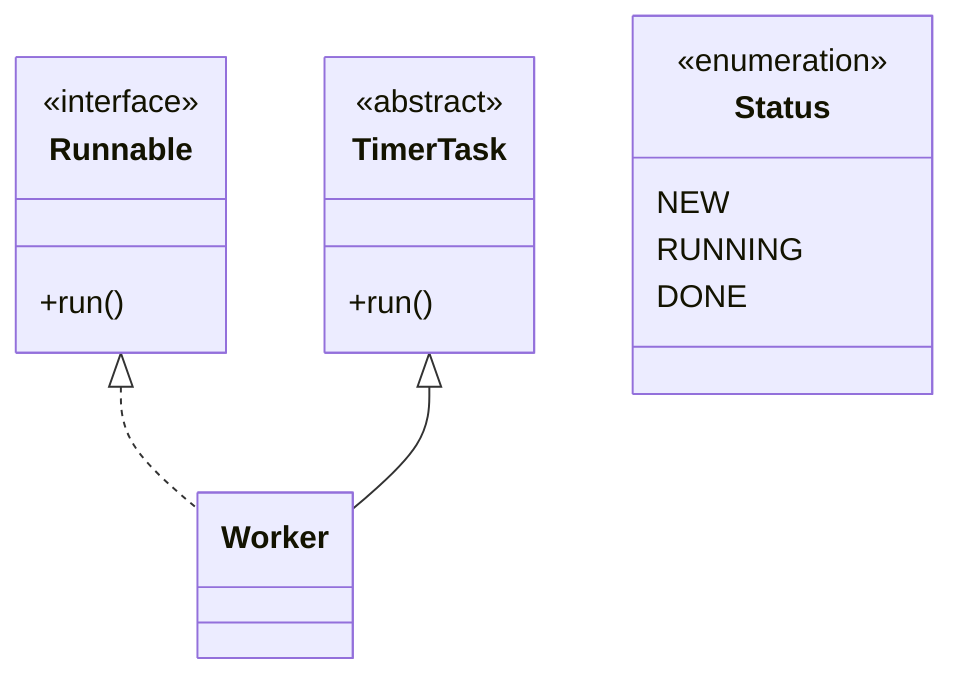

# Interfaces, Nested Classes, and Enums

Interfaces define contracts independent of a single class hierarchy. A class can extend only one class, but it can implement multiple interfaces, which makes interfaces Java's main tool for expressing roles such as comparable, iterable, runnable, cloneable, or serializable. The source book predates lambda syntax, so single-method interfaces are shown through named or anonymous classes rather than lambda expressions.

Nested classes and enums add structure. A nested type can keep helper code close to the class that uses it, while an enum defines a fixed set of named instances with type safety. These features reduce loose conventions: instead of passing arbitrary integers for a mode, use an enum; instead of exposing a helper class globally, nest it where its relationship is clear.

## Definitions

The source basis for this page is Chapters 4, 5, and 6 on interfaces, marker interfaces, nested types, inner classes, local and anonymous classes, nesting in interfaces, enum declarations, enum constants, and `java.lang.Enum`. The terms below are written as contracts: each one tells you what the compiler can check, what the runtime must preserve, and what a reader of the program may rely on.

**Interface.** An interface declares a contract that classes can implement. Source-era interfaces declare constants and abstract methods, with later Java default methods outside this textbook's coverage. In Java, this is rarely just vocabulary. It controls which operations are legal, when a value exists, what names are visible, or which object receives a message. When reading code, ask what the term promises before asking how the implementation happens to work.

**Implementation.** A class implements an interface by providing concrete methods matching the interface contract. A value of interface type can refer to an object of any implementing class. In Java, this is rarely just vocabulary. It controls which operations are legal, when a value exists, what names are visible, or which object receives a message. When reading code, ask what the term promises before asking how the implementation happens to work.

**Marker interface.** A marker interface has no methods and marks a class as having a property recognized by library code, such as `Serializable` or `Cloneable`. In Java, this is rarely just vocabulary. It controls which operations are legal, when a value exists, what names are visible, or which object receives a message. When reading code, ask what the term promises before asking how the implementation happens to work.

**Static nested class.** A static nested class is a nested type associated with its enclosing class name but without an implicit enclosing object reference. In Java, this is rarely just vocabulary. It controls which operations are legal, when a value exists, what names are visible, or which object receives a message. When reading code, ask what the term promises before asking how the implementation happens to work.

**Inner class.** An inner class is a non-static nested class whose instances are associated with an enclosing instance. It can access members of that enclosing object. In Java, this is rarely just vocabulary. It controls which operations are legal, when a value exists, what names are visible, or which object receives a message. When reading code, ask what the term promises before asking how the implementation happens to work.

**Anonymous class.** An anonymous class declares and instantiates a class expression in one place, often to implement a small interface or extend a simple class. In Java, this is rarely just vocabulary. It controls which operations are legal, when a value exists, what names are visible, or which object receives a message. When reading code, ask what the term promises before asking how the implementation happens to work.

**Enum.** An enum declares a type with a fixed set of named constants. Enum constants are objects of the enum type and may have fields, constructors, and methods. In Java, this is rarely just vocabulary. It controls which operations are legal, when a value exists, what names are visible, or which object receives a message. When reading code, ask what the term promises before asking how the implementation happens to work.

**Functional-interface boundary.** The source uses interfaces such as `Runnable`, but Java 8's lambda expressions and `@FunctionalInterface` annotation are later features and are not taught by this book. In Java, this is rarely just vocabulary. It controls which operations are legal, when a value exists, what names are visible, or which object receives a message. When reading code, ask what the term promises before asking how the implementation happens to work.

## Key results

**Interfaces express capability without forcing superclass choice.** A class may already extend a useful superclass and still implement interfaces. This makes interfaces the source-era answer to many multiple-inheritance design needs: a type can promise several roles while inheriting implementation from only one class. A good check is to rewrite the idea as a rule a compiler, library, or maintainer can enforce. If the rule cannot be stated clearly, the design is probably relying on habit instead of a contract.

**Interface variables support polymorphism.** A variable of interface type can hold a reference to any object whose class implements that interface. Method calls through the interface are dynamically dispatched to the object's implementation, just as overridden class methods are. A good check is to rewrite the idea as a rule a compiler, library, or maintainer can enforce. If the rule cannot be stated clearly, the design is probably relying on habit instead of a contract.

**Anonymous classes are concise but can become unreadable.** The source explicitly warns that anonymous classes are best when small. Nesting future behavior inside current method code can be convenient, but long anonymous classes hide control flow and make debugging harder. A good check is to rewrite the idea as a rule a compiler, library, or maintainer can enforce. If the rule cannot be stated clearly, the design is probably relying on habit instead of a contract.

**Enums are stronger than integer constants.** An enum type limits possible values to declared constants, supports `switch`, provides useful inherited methods from `Enum`, and prevents mixing unrelated sets of constants. It makes illegal states harder to represent than `int` constants do. A good check is to rewrite the idea as a rule a compiler, library, or maintainer can enforce. If the rule cannot be stated clearly, the design is probably relying on habit instead of a contract.

**Default methods and lambdas are outside the source.** Modern Java interfaces can include default methods, static methods, and lambda-friendly functional interfaces. Those are important in current Java, but they are not part of this Java 5 source. These notes therefore explain the older mechanisms that later features build on. A good check is to rewrite the idea as a rule a compiler, library, or maintainer can enforce. If the rule cannot be stated clearly, the design is probably relying on habit instead of a contract.

When choosing among a class, interface, nested type, anonymous class, and enum, ask what kind of relationship you are representing. Use a class for shared implementation and object state. Use an interface for a role that unrelated classes can implement. Use a static nested class when a helper belongs conceptually under an outer type but does not need an outer object. Use an inner class when it genuinely needs enclosing instance state. Use an enum when the set of values is closed and named. Use anonymous classes only when the implementation is short enough that naming it would add more noise than clarity.

## Visual



| Type form | Main purpose | Source-era note |
|---|---|---|
| Interface | Declare a role or capability | No default methods in the source |
| Anonymous class | Small one-off implementation | Keep short and local |
| Static nested class | Namespaced helper type | No enclosing instance reference |
| Inner class | Helper tied to enclosing object | Has access to enclosing instance |
| Enum | Closed set of typed constants | Can have fields and methods |

## Worked example 1: replacing integer modes with an enum

Problem: A program uses `0`, `1`, and `2` to represent job states. Replace them with a safer enum.

Method:

1. Name the concept: the values are not arbitrary numbers; they are states.
2. Declare `enum JobState { NEW, RUNNING, DONE }` so only those constants are valid values.
3. Change variables from `int state` to `JobState state`.
4. Replace comparisons such as `state == 1` with `state == JobState.RUNNING`.
5. Use a `switch` or methods on the enum if behavior depends on the state.

Checked answer: The checked result is a typed state model. Code cannot accidentally assign `17` as a state, and readers see the domain names instead of decoding numbers.

## Worked example 2: choosing an interface variable

Problem: A method needs to sort objects that can compare themselves. Should it require a specific class or an interface?

Method:

1. Identify the required operation: the method needs comparison, not a particular representation.
2. Use an interface such as `Comparable<T>` to express the comparison role.
3. Any class that implements the interface can be accepted, even if the classes are otherwise unrelated.
4. The method calls the interface method, and dynamic dispatch reaches each object's implementation.
5. Avoid requiring a superclass unless the method actually needs shared implementation or state from that superclass.

Checked answer: The checked design depends on an interface role. This reduces coupling and lets unrelated classes participate if they satisfy the comparison contract.

## Code

```java
public class InterfaceEnumDemo {
    enum JobState {
        NEW, RUNNING, DONE
    }

    interface Described {
        String description();
    }

    static class Job implements Described, Runnable {
        private JobState state = JobState.NEW;

        public String description() {
            return "Job is " + state;
        }

        public void run() {
            state = JobState.RUNNING;
            System.out.println(description());
            state = JobState.DONE;
        }
    }

    public static void main(String[] args) {
        Described described = new Job();
        System.out.println(described.description());

        Runnable task = (Runnable) described;
        task.run();
        System.out.println(described.description());
    }
}
```

## Common pitfalls

- Do not treat interfaces as weak classes. They are contracts and should be designed around meaningful roles.
- Do not write long anonymous classes inside complex methods. Name the class when the behavior needs explanation.
- Do not use integer constants for a closed domain when an enum would make illegal values impossible.
- Do not assume source-era interfaces include default methods. That is a later Java feature outside this book.
- Do not confuse a static nested class with an inner class. Only the inner class carries an enclosing instance relationship.

## Connections

- [Inheritance, Polymorphism, and Object](/cs/programming/java/inheritance-polymorphism-object): compares class extension with interface roles.
- [Generics, Wildcards, and Erasure](/cs/programming/java/generics-wildcards-erasure): explains generic interfaces such as `Comparable<T>` and `Iterable<E>`.
- [Threads, Synchronization, and the Memory Model](/cs/programming/java/threads-synchronization-memory-model): uses `Runnable` as a core thread task interface.
- [Collections, Iteration, and Maps](/cs/programming/java/collections-iteration-maps): uses interfaces for collection contracts.
