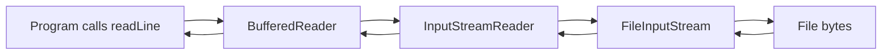

# I/O Streams, Files, Serialization, and NIO

The source book's I/O chapter uses the word stream in the classic Java sense: a sequence of bytes or characters flowing from a source to a destination. This is not the later Java 8 `java.util.stream` API for functional-style collection processing. Source-era I/O streams are about files, memory buffers, filters, readers, writers, object serialization, and checked `IOException`.


*Figure: Java's early development at Sun shaped its portability, virtual-machine model, and library ecosystem. Image: [Wikimedia Commons](https://commons.wikimedia.org/wiki/File:Sun_Microsystems_logo.svg), Sun Microsystems and Afrank99, public domain text logo.*

I/O is a library topic where language features become practical. You need classes, inheritance, wrapping, interfaces, exceptions, `finally` cleanup, arrays, strings, and sometimes synchronization. The stream classes are designed for composition: a file stream supplies bytes, a buffering stream improves efficiency, a reader decodes bytes into characters, and a data or object stream interprets structured values.

## Definitions

The source basis for this page is Chapter 20 on streams overview, byte streams, character streams, stream readers and writers, stream class tour, data streams, files, object serialization, `IOException`, and a taste of new I/O. The terms below are written as contracts: each one tells you what the compiler can check, what the runtime must preserve, and what a reader of the program may rely on.

**Byte stream.** A byte stream reads or writes raw 8-bit byte values through classes such as `InputStream` and `OutputStream`. In Java, this is rarely just vocabulary. It controls which operations are legal, when a value exists, what names are visible, or which object receives a message. When reading code, ask what the term promises before asking how the implementation happens to work.

**Character stream.** A character stream reads or writes characters through `Reader` and `Writer`. It is the appropriate abstraction for text when character decoding matters. In Java, this is rarely just vocabulary. It controls which operations are legal, when a value exists, what names are visible, or which object receives a message. When reading code, ask what the term promises before asking how the implementation happens to work.

**Filter stream.** A filter stream wraps another stream to add behavior such as buffering, data conversion, pushback, or object serialization. In Java, this is rarely just vocabulary. It controls which operations are legal, when a value exists, what names are visible, or which object receives a message. When reading code, ask what the term promises before asking how the implementation happens to work.

**Buffering.** Buffering collects several small operations into larger operations on the underlying source or destination. It can improve efficiency and reduce system calls. In Java, this is rarely just vocabulary. It controls which operations are legal, when a value exists, what names are visible, or which object receives a message. When reading code, ask what the term promises before asking how the implementation happens to work.

**File.** `File` represents filesystem pathnames and can be used to inspect, create, delete, or list files and directories in the source-era API. In Java, this is rarely just vocabulary. It controls which operations are legal, when a value exists, what names are visible, or which object receives a message. When reading code, ask what the term promises before asking how the implementation happens to work.

**Serialization.** Object serialization writes an object graph to bytes and reads an equivalent graph back, subject to class compatibility and serialization rules. In Java, this is rarely just vocabulary. It controls which operations are legal, when a value exists, what names are visible, or which object receives a message. When reading code, ask what the term promises before asking how the implementation happens to work.

**`IOException`.** `IOException` and its subclasses report I/O failures. They are checked exceptions, so methods must catch or declare them. In Java, this is rarely just vocabulary. It controls which operations are legal, when a value exists, what names are visible, or which object receives a message. When reading code, ask what the term promises before asking how the implementation happens to work.

**New I/O.** The source gives a taste of the `java.nio` APIs, which introduce buffers, channels, and related abstractions beyond classic streams. In Java, this is rarely just vocabulary. It controls which operations are legal, when a value exists, what names are visible, or which object receives a message. When reading code, ask what the term promises before asking how the implementation happens to work.

## Key results

**Choose byte streams for bytes and readers/writers for text.** Binary data should not be forced through character APIs. Text data should be decoded and encoded deliberately. `InputStreamReader` and `OutputStreamWriter` bridge byte streams and character streams by applying a character encoding. A good check is to rewrite the idea as a rule a compiler, library, or maintainer can enforce. If the rule cannot be stated clearly, the design is probably relying on habit instead of a contract.

**Wrapping is the central stream design pattern.** A program can wrap a `FileInputStream` in a `BufferedInputStream`, or a byte stream in a reader, or an output stream in an object stream. Each wrapper has a focused responsibility while delegating actual source or destination operations to the wrapped stream. A good check is to rewrite the idea as a rule a compiler, library, or maintainer can enforce. If the rule cannot be stated clearly, the design is probably relying on habit instead of a contract.

**Close resources reliably.** I/O objects often represent scarce operating-system resources. In the source-era idiom, cleanup is handled with `finally` so close runs after success, failure, or early return. Later try-with-resources is not part of this book, but it automates the same obligation. A good check is to rewrite the idea as a rule a compiler, library, or maintainer can enforce. If the rule cannot be stated clearly, the design is probably relying on habit instead of a contract.

**Serialization preserves graphs, not design wisdom.** Object serialization can write entire object graphs, including shared references, but it also creates compatibility, security, and versioning concerns. A class should be deliberately designed for serialization rather than accidentally made persistent. A good check is to rewrite the idea as a rule a compiler, library, or maintainer can enforce. If the rule cannot be stated clearly, the design is probably relying on habit instead of a contract.

**NIO is a different abstraction, not merely faster streams.** Buffers and channels change the programming model. The source only gives a taste, so these notes treat NIO as a boundary and basic concept rather than a complete guide. A good check is to rewrite the idea as a rule a compiler, library, or maintainer can enforce. If the rule cannot be stated clearly, the design is probably relying on habit instead of a contract.

When reading stream code, draw the wrapper stack from outermost object to innermost source or destination. Calls are made on the outer object, but actual bytes or characters eventually come from or go to the innermost object. Then mark where exceptions can be thrown and where cleanup happens. This visual stack explains why closing the outer wrapper is usually enough, why buffering changes performance but not logical content, and why mixing byte and character layers without an explicit bridge is a design smell.

## Visual



| Need | Source-era class family | Notes |
|---|---|---|
| Raw bytes | `InputStream` / `OutputStream` | Binary files, network bytes, byte arrays |
| Text characters | `Reader` / `Writer` | Decode and encode character data |
| Efficiency | `BufferedInputStream`, `BufferedReader`, etc. | Reduce many small underlying operations |
| Primitive data values | `DataInputStream` / `DataOutputStream` | Structured binary primitive values |
| Object graph persistence | `ObjectInputStream` / `ObjectOutputStream` | Requires serialization design |
| Buffer/channel model | `java.nio` | Introduced as new I/O taste |

## Worked example 1: choosing layers for reading text from a file

Problem: Read lines of text from a file using source-era I/O classes.

Method:

1. Start with the physical source: a file path. `FileInputStream` can read bytes from that file.
2. Because the content is text, bridge bytes to characters with `InputStreamReader` and a chosen encoding where available.
3. Because line-by-line reading benefits from buffering and a line API, wrap the reader in `BufferedReader`.
4. Call `readLine()` in a loop until it returns `null`, which is the expected end-of-input signal.
5. Close the outer reader in a `finally` block so the underlying stream is also closed.

Checked answer: The checked wrapper stack is `BufferedReader` over `InputStreamReader` over `FileInputStream`. The loop ends on `null`, while I/O failures are reported with `IOException`.

## Worked example 2: deciding whether to serialize an object

Problem: A program has a `HashMap<String, Integer>` of counts and wants to save it for later. Decide whether object serialization is suitable.

Method:

1. Check whether every object reachable from the map is serializable. Strings and wrapper integers are serializable in the standard library.
2. Ask whether the file is only for this Java program and compatible versions of its classes. Serialization is less suitable as a long-term external data format.
3. Use `ObjectOutputStream` around a file output stream to write the object graph.
4. Use `ObjectInputStream` to read it back, then cast with care because deserialization returns `Object`.
5. Handle `IOException` and possible class-related failures at the boundary.

Checked answer: Serialization can work for a short-lived Java-specific persistence need. For stable interchange, a deliberate text or binary format may be better.

## Code

```java
import java.io.BufferedReader;
import java.io.ByteArrayInputStream;
import java.io.IOException;
import java.io.InputStream;
import java.io.InputStreamReader;

public class IODemo {
    static int countLines(byte[] data) throws IOException {
        InputStream in = null;
        BufferedReader reader = null;
        try {
            in = new ByteArrayInputStream(data);
            reader = new BufferedReader(new InputStreamReader(in));
            int count = 0;
            while (reader.readLine() != null) {
                count++;
            }
            return count;
        } finally {
            if (reader != null) {
                reader.close();
            } else if (in != null) {
                in.close();
            }
        }
    }

    public static void main(String[] args) throws IOException {
        byte[] data = "one\ntwo\nthree\n".getBytes("UTF-8");
        System.out.println(countLines(data));
    }
}
```

## Common pitfalls

- Do not confuse classic I/O streams with the later `java.util.stream` API. This source covers byte and character I/O streams.
- Do not read text through byte APIs without thinking about character encoding.
- Do not forget to close the outermost stream or reader. Cleanup is part of the I/O contract.
- Do not use exceptions to signal normal end-of-input when a stream method already has an end marker such as `-1` or `null`.
- Do not assume serialization is a neutral file format. It ties data to Java class structure and compatibility rules.

## Connections

- [Exceptions and Assertions](/cs/programming/java/exceptions-assertions): explains checked `IOException` and cleanup with `finally`.
- [Strings, Regular Expressions, Formatter, and Scanner](/cs/programming/java/strings-regex-formatter-scanner): handles text read from streams.
- [Collections, Iteration, and Maps](/cs/programming/java/collections-iteration-maps): often stores parsed I/O results.
- [Packages, Documentation, System, and Internationalization](/cs/programming/java/packages-documentation-system-i18n): covers system streams and locale-aware text concerns.
