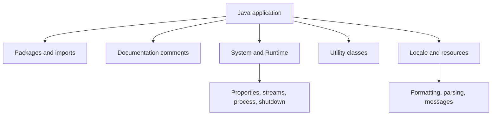

# Packages, Documentation, System, and Internationalization

The later source chapters widen from individual language constructs to the organization and environment of Java programs. Packages create namespaces and access boundaries. Documentation comments describe contracts for tools and readers. Utility classes provide formatting, random numbers, timers, UUIDs, math, scanning, and observable patterns. System classes expose standard streams, properties, environment interactions, process creation, shutdown behavior, and security checks.

Internationalization and localization show why text, dates, numbers, currency, resources, and calendars should not be hard-coded as if every user shared one language and region. The source also surveys standard packages and discusses application evolution across language, library, and virtual-machine versions. Modern build tools such as Maven and Gradle, and Java 9 modules, are outside this 2005 source and are noted only as later ecosystem boundaries.

## Definitions

The source basis for this page is Chapters 18, 19, 22, 23, 24, 25, and Appendix A on packages, imports, package access, package annotations, package objects and specifications, documentation comments, selected utilities, system programming, processes, shutdown, security, locales, resource bundles, currency, dates, calendars, formatting, parsing, text internationalization, standard packages, and application evolution. The terms below are written as contracts: each one tells you what the compiler can check, what the runtime must preserve, and what a reader of the program may rely on.

**Package.** A package groups related top-level types under a namespace and participates in access control. Package names are usually chosen to avoid global collisions. In Java, this is rarely just vocabulary. It controls which operations are legal, when a value exists, what names are visible, or which object receives a message. When reading code, ask what the term promises before asking how the implementation happens to work.

**Import.** An import declaration lets source code refer to types or static members by shorter names. It does not include code or change runtime loading by itself. In Java, this is rarely just vocabulary. It controls which operations are legal, when a value exists, what names are visible, or which object receives a message. When reading code, ask what the term promises before asking how the implementation happens to work.

**Package access.** A top-level type or member with no explicit public, private, or protected modifier may be accessible within its package. Package boundaries can therefore be design boundaries. In Java, this is rarely just vocabulary. It controls which operations are legal, when a value exists, what names are visible, or which object receives a message. When reading code, ask what the term promises before asking how the implementation happens to work.

**Documentation comment.** A documentation comment begins with `/**` and is processed by documentation tools to produce API documentation. It should describe contracts rather than drifting implementation details. In Java, this is rarely just vocabulary. It controls which operations are legal, when a value exists, what names are visible, or which object receives a message. When reading code, ask what the term promises before asking how the implementation happens to work.

**System class.** `System` exposes standard streams, properties, time-related methods, array copying, and hooks into runtime services. In Java, this is rarely just vocabulary. It controls which operations are legal, when a value exists, what names are visible, or which object receives a message. When reading code, ask what the term promises before asking how the implementation happens to work.

**Runtime.** `Runtime` represents the running application environment and includes operations such as process creation and shutdown-related behavior. In Java, this is rarely just vocabulary. It controls which operations are legal, when a value exists, what names are visible, or which object receives a message. When reading code, ask what the term promises before asking how the implementation happens to work.

**Locale.** A `Locale` represents language, country, and variant information used by locale-sensitive formatting, parsing, and resource lookup. In Java, this is rarely just vocabulary. It controls which operations are legal, when a value exists, what names are visible, or which object receives a message. When reading code, ask what the term promises before asking how the implementation happens to work.

**Resource bundle.** A resource bundle supplies locale-specific resources, commonly text messages, without hard-coding every string in program logic. In Java, this is rarely just vocabulary. It controls which operations are legal, when a value exists, what names are visible, or which object receives a message. When reading code, ask what the term promises before asking how the implementation happens to work.

## Key results

**Packages are both naming and access tools.** A package name prevents type-name collisions across libraries, but package access also lets related classes cooperate without making every member public. Good package design groups types that form a coherent internal unit. A good check is to rewrite the idea as a rule a compiler, library, or maintainer can enforce. If the rule cannot be stated clearly, the design is probably relying on habit instead of a contract.

**Imports do not create dependencies by magic.** An import only affects how names are written in source. If a class is used, the dependency exists whether the name is fully qualified or imported. Static imports can reduce noise for constants or utility methods but can also hide where names come from if overused. A good check is to rewrite the idea as a rule a compiler, library, or maintainer can enforce. If the rule cannot be stated clearly, the design is probably relying on habit instead of a contract.

**Documentation should specify contracts.** The source warns about comment skew: comments become wrong when code changes. API documentation should focus on what clients can rely on, including parameters, return values, exceptions, side effects, and threading expectations, rather than restating implementation steps likely to change. A good check is to rewrite the idea as a rule a compiler, library, or maintainer can enforce. If the rule cannot be stated clearly, the design is probably relying on habit instead of a contract.

**System programming crosses security and portability boundaries.** Operations such as reading system properties, creating processes, exiting the VM, or interacting with security checks depend on runtime policy and platform behavior. Code should not assume every environment grants the same permissions or has the same operating-system commands. A good check is to rewrite the idea as a rule a compiler, library, or maintainer can enforce. If the rule cannot be stated clearly, the design is probably relying on habit instead of a contract.

**Internationalization separates program logic from local presentation.** Dates, currency, number formats, collation, messages, and calendars vary by locale. Using locale-aware classes and resource bundles lets a program adapt without scattering hard-coded strings and formats through the code. A good check is to rewrite the idea as a rule a compiler, library, or maintainer can enforce. If the rule cannot be stated clearly, the design is probably relying on habit instead of a contract.

For package and documentation design, think like a client. Which types are meant to be public entry points? Which helper types should remain package-private? Which methods have contracts that deserve documentation? Which exceptions or threading rules must a caller know? For system and internationalization code, think like a deployment engineer. Which assumptions depend on local files, process permissions, default locale, default encoding, time zone, or security policy? The source's late chapters are less about syntax and more about making Java programs survive real environments and future evolution.

## Visual



| Topic | Source coverage | Boundary note |
|---|---|---|
| Packages and imports | Detailed package naming, access, contents, annotations | Java 9 modules are later and not covered |
| Documentation comments | Javadoc-style comments and tags | Build-site generation is outside the source |
| System programming | `System`, `Runtime`, processes, shutdown, security | Platform policy affects behavior |
| Internationalization | `Locale`, resource bundles, currency, dates, calendars, text | Defaults should not be assumed universal |
| Build tools | Not a source topic | Maven and Gradle are later ecosystem tools, not textbook content |

## Worked example 1: deciding package visibility

Problem: A package contains `Parser`, `Token`, and `TokenBuffer`. Clients should call `Parser`, but not depend on `TokenBuffer` internals.

Method:

1. Identify the public entry point. `Parser` is the type clients are meant to construct or call.
2. Identify representation helpers. `TokenBuffer` is an internal collaboration detail.
3. Make `Parser` public if clients outside the package need it.
4. Leave `TokenBuffer` package-private so other classes in the package can use it but outside clients cannot name it.
5. Document `Parser`'s contract instead of documenting how `TokenBuffer` happens to store tokens.

Checked answer: The checked design uses the package as an access boundary: public API outside, package-private helpers inside.

## Worked example 2: localizing a greeting

Problem: A program prints `Hello` and must support different languages without changing the source code for each release.

Method:

1. Move the message text out of the Java statement and into a resource bundle keyed by a stable name such as `greeting`.
2. Choose the user's or requested `Locale`.
3. Load the bundle for that locale.
4. Look up `greeting` and print the returned string.
5. Add another locale by adding resource data, not by changing the control flow of the program.

Checked answer: The checked design separates program logic from localized text. Resource bundles let the same code select locale-appropriate messages.

## Code

```java
import java.text.NumberFormat;
import java.util.Locale;

public class LocaleSystemDemo {
    public static void main(String[] args) {
        Locale us = Locale.US;
        Locale korea = Locale.KOREA;
        double amount = 12345.67;

        NumberFormat usCurrency = NumberFormat.getCurrencyInstance(us);
        NumberFormat krCurrency = NumberFormat.getCurrencyInstance(korea);

        System.out.println("Java version: " + System.getProperty("java.version"));
        System.out.println("US: " + usCurrency.format(amount));
        System.out.println("Korea: " + krCurrency.format(amount));
    }
}
```

## Common pitfalls

- Do not make every helper class public. Public types are API commitments.
- Do not use imports as a substitute for understanding dependencies. They shorten names only.
- Do not write documentation comments that merely narrate implementation steps. Document the client-visible contract.
- Do not assume default locale, time zone, encoding, or security policy is the same on every machine.
- Do not present Maven, Gradle, or Java modules as source-book topics. They are useful modern context but outside this textbook.

## Connections

- [Quick Tour, Platform, and First Programs](/cs/programming/java/quick-tour-platform): introduces the platform and packages.
- [Strings, Regular Expressions, Formatter, and Scanner](/cs/programming/java/strings-regex-formatter-scanner): connects formatting and text processing.
- [I/O Streams, Files, Serialization, and NIO](/cs/programming/java/io-streams-files-serialization-nio): handles files and external resources used by system code.
- [Annotations and Reflection](/cs/programming/java/annotations-reflection): connects package annotations and metadata inspection.
