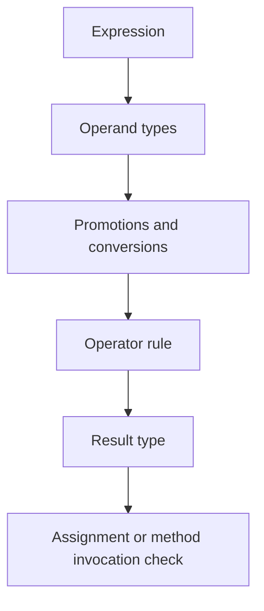

# Primitives, Operators, and Conversions

Java has primitive types for numeric, character, and boolean values, and it has reference types for objects and arrays. The source book treats primitives carefully because they behave differently from objects in assignment, method invocation, default values, arithmetic, comparison, and boxing. A Java programmer must know both worlds because ordinary code constantly crosses between them.

Operators make expressions compact, but compactness can hide conversions. Arithmetic may promote smaller integer types to `int`, integer division discards a remainder, compound assignment performs an implicit cast, `==` compares primitive values or reference identity depending on operands, and member access uses the dot operator. The chapter on operators is therefore less about memorizing symbols and more about predicting the type and value of each expression.

## Definitions

The source basis for this page is Chapters 8 and 9 on primitive wrapper types, boxing conversions, arithmetic operations, general operators, expressions, type conversions, precedence, associativity, and member access. The terms below are written as contracts: each one tells you what the compiler can check, what the runtime must preserve, and what a reader of the program may rely on.

**Primitive type.** A primitive type stores a non-object value. Java's primitive categories are integral types, floating-point types, `char`, and `boolean`. In Java, this is rarely just vocabulary. It controls which operations are legal, when a value exists, what names are visible, or which object receives a message. When reading code, ask what the term promises before asking how the implementation happens to work.

**Wrapper type.** A wrapper class such as `Integer`, `Double`, `Character`, or `Boolean` provides an object representation for a primitive value. The source covers common wrapper behavior and Java 5 boxing conversions. In Java, this is rarely just vocabulary. It controls which operations are legal, when a value exists, what names are visible, or which object receives a message. When reading code, ask what the term promises before asking how the implementation happens to work.

**Boxing conversion.** Boxing converts a primitive value to a corresponding wrapper object when a reference is needed. Unboxing extracts the primitive value from a wrapper when a primitive operation is required. In Java, this is rarely just vocabulary. It controls which operations are legal, when a value exists, what names are visible, or which object receives a message. When reading code, ask what the term promises before asking how the implementation happens to work.

**Numeric promotion.** Numeric promotion is the set of rules that convert operands to a common type for arithmetic. For many integer operations, `byte`, `short`, and `char` are promoted to `int`. In Java, this is rarely just vocabulary. It controls which operations are legal, when a value exists, what names are visible, or which object receives a message. When reading code, ask what the term promises before asking how the implementation happens to work.

**Compound assignment.** An operator such as `+=` combines an operation with assignment. In Java it includes an implicit conversion back to the left-hand variable type when the operation is allowed. In Java, this is rarely just vocabulary. It controls which operations are legal, when a value exists, what names are visible, or which object receives a message. When reading code, ask what the term promises before asking how the implementation happens to work.

**Precedence.** Precedence determines how operators group when parentheses are absent. Associativity determines grouping among operators at the same precedence level. In Java, this is rarely just vocabulary. It controls which operations are legal, when a value exists, what names are visible, or which object receives a message. When reading code, ask what the term promises before asking how the implementation happens to work.

**Member access.** Member access uses `.` to select a field, method, or nested type from a type name, object reference, or package-qualified name, depending on context. In Java, this is rarely just vocabulary. It controls which operations are legal, when a value exists, what names are visible, or which object receives a message. When reading code, ask what the term promises before asking how the implementation happens to work.

## Key results

**Expression type matters as much as expression value.** The expression `1 + 2` has an integer value and an `int` type. The expression `1 + 2.0` has a floating-point value and a `double` type. Later assignment, overload selection, and method invocation depend on the type produced by the expression, not only on the mathematical value. A good check is to rewrite the idea as a rule a compiler, library, or maintainer can enforce. If the rule cannot be stated clearly, the design is probably relying on habit instead of a contract.

**Integer division is not real-number division.** If both operands of `/` are integer types, Java performs integer division and discards the fractional part. The operation is not rounded to the nearest integer. To get floating-point division, at least one operand must be converted to `float` or `double` before the division. A good check is to rewrite the idea as a rule a compiler, library, or maintainer can enforce. If the rule cannot be stated clearly, the design is probably relying on habit instead of a contract.

**`==` has two different everyday meanings.** For primitives, `==` compares values. For references, `==` compares whether two reference values refer to the same object or are both `null`. Object content equality is normally expressed by a method such as `equals`, whose contract belongs to the class. A good check is to rewrite the idea as a rule a compiler, library, or maintainer can enforce. If the rule cannot be stated clearly, the design is probably relying on habit instead of a contract.

**Boxing is convenient but not invisible design.** Autoboxing reduces boilerplate when primitives move into generic collections or wrapper APIs. It can also hide object creation, null unboxing failures, and identity confusion. The source presents boxing as a conversion feature, not as a reason to forget the primitive/reference distinction. A good check is to rewrite the idea as a rule a compiler, library, or maintainer can enforce. If the rule cannot be stated clearly, the design is probably relying on habit instead of a contract.

**Parentheses are cheap documentation.** Operator precedence rules are precise, but readers should not have to reconstruct a difficult expression mentally. Parentheses can make intended grouping obvious, especially around assignment inside conditions, bit operations, and mixed arithmetic. A good check is to rewrite the idea as a rule a compiler, library, or maintainer can enforce. If the rule cannot be stated clearly, the design is probably relying on habit instead of a contract.

A practical expression-tracing method is to annotate every subexpression with a type. Start with literals and variables, apply promotions, apply the operator, then check assignment conversion at the end. For example, `short s = 1; s = s + 1;` fails because `s + 1` is promoted to `int`, while `s += 1;` is allowed because compound assignment includes a conversion back to `short`. That behavior is not arbitrary; it follows from the separate rules for binary numeric promotion and compound assignment. The same discipline catches integer division errors and overloaded-method surprises.

## Visual

| Operation family | Example | Important rule | Common check |
|---|---|---|---|
| Arithmetic | `a + b`, `x / y` | Numeric promotion determines result type | Are both operands integers? |
| Comparison | `x < y`, `a == b` | Produces `boolean`; `==` depends on operand kind | Are references being compared by identity? |
| Logical | `&&`, `||`, `!` | Operates on `boolean`; short-circuit forms skip work | Can the right side be skipped? |
| Bitwise | `&`, `|`, `^`, `~`, shifts | Operates on integral values or booleans for some operators | Is sign extension relevant? |
| Assignment | `=`, `+=`, `*=` | Stores into a variable after conversion checks | What is the left-hand declared type? |
| Member access | `obj.method()`, `Type.field` | Selects members by type or object reference | Is the receiver a type name or reference? |



## Worked example 1: predicting integer and floating division

Problem: Compute `int a = 7 / 2; double b = 7 / 2; double c = 7 / 2.0;`.

Method:

1. For `a`, both operands are integer literals, so Java performs integer division. `7 / 2` produces `3`, and `3` is assigned to `a`.
2. For `b`, the expression is still evaluated before assignment. Both operands are integers, so `7 / 2` again produces integer `3`.
3. The integer result `3` is then widened to `double` for assignment, producing `3.0` in `b`.
4. For `c`, `2.0` is a `double` literal, so the other operand is converted and floating-point division is used.
5. `7.0 / 2.0` produces `3.5`, and that value is assigned to `c`.

Checked answer: `a` is `3`, `b` is `3.0`, and `c` is `3.5`. Assignment to `double` after integer division cannot recover the discarded fractional part.

## Worked example 2: understanding compound assignment

Problem: Explain why `short s = 10; s += 5;` compiles, while `s = s + 5;` requires a cast.

Method:

1. `s` has declared type `short`, but arithmetic on `short` values is promoted to `int` for the binary `+` operator.
2. In `s = s + 5`, the right side has type `int`. Assigning an arbitrary `int` to a `short` is a narrowing conversion and is not allowed implicitly in this context.
3. In `s += 5`, Java defines compound assignment roughly as `s = (short)(s + 5)`, with the left-hand variable evaluated only once.
4. The implicit narrowing conversion is part of the compound assignment rule, so the statement compiles.
5. The programmer is still responsible for understanding possible overflow or truncation.

Checked answer: `s += 5` compiles because compound assignment includes conversion back to the left-hand type. `s = s + 5` exposes the promoted `int` result and needs an explicit cast if the programmer accepts narrowing.

## Code

```java
public class OperatorTrace {
    public static void main(String[] args) {
        int a = 7 / 2;
        double b = 7 / 2;
        double c = 7 / 2.0;

        short s = 10;
        s += 5;

        Integer boxed = Integer.valueOf(s);
        int unboxed = boxed.intValue();

        System.out.println("a = " + a);
        System.out.println("b = " + b);
        System.out.println("c = " + c);
        System.out.println("s = " + s);
        System.out.println("unboxed = " + unboxed);
    }
}
```

## Common pitfalls

- Do not assume a `double` variable forces floating-point division. The division expression may have already been evaluated as integer arithmetic.
- Do not use `==` for object content unless the class explicitly defines identity as the desired comparison. Use `equals` when the object contract says so.
- Do not forget that unboxing a `null` wrapper reference fails at runtime.
- Do not rely on readers remembering obscure precedence combinations. Use parentheses when grouping affects interpretation.
- Do not treat compound assignment as merely shorthand. It has a specific conversion rule and evaluates the left-hand side only once.

## Connections

- [Tokens, Values, and Variables](/cs/programming/java/tokens-values-variables): supplies declared types and values for expressions.
- [Control Flow, Arrays, and Strings](/cs/programming/java/control-flow-arrays-strings): uses boolean expressions to drive branches and loops.
- [Generics, Wildcards, and Erasure](/cs/programming/java/generics-wildcards-erasure): explains why primitives need wrappers for generic collections.
- [Collections, Iteration, and Maps](/cs/programming/java/collections-iteration-maps): shows boxing in practical collection code.
