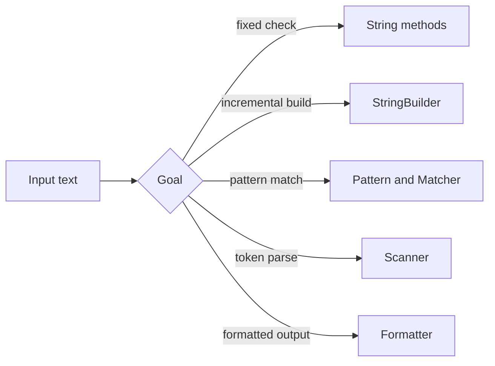

# Strings, Regular Expressions, Formatter, and Scanner

Text handling in Java centers on immutable `String` objects, mutable builders, regular expressions, formatted output, and token scanning. The source book places strings before many utility classes because text appears everywhere: command-line arguments, diagnostic messages, file contents, formatted reports, parsed input, resource bundles, and object descriptions.


*Figure: Java's early development at Sun shaped its portability, virtual-machine model, and library ecosystem. Image: [Wikimedia Commons](https://commons.wikimedia.org/wiki/File:Sun_Microsystems_logo.svg), Sun Microsystems and Afrank99, public domain text logo.*

The most important design distinction is immutability versus mutation. A `String` value does not change after creation. A `StringBuilder` changes as text is appended, inserted, or replaced, then produces a `String` when needed. Regular expressions and scanners add pattern-based matching and parsing, while `Formatter` provides controlled conversion of values to text.

## Definitions

The source basis for this page is Chapter 13 on character sequences, `String`, regular expression matching, `StringBuilder`, UTF-16, and Chapter 22 sections on `Formatter` and `Scanner`. The terms below are written as contracts: each one tells you what the compiler can check, what the runtime must preserve, and what a reader of the program may rely on.

**`String`.** `String` is an immutable object representing a sequence of characters. String literals create or refer to string objects, and string concatenation produces string results. In Java, this is rarely just vocabulary. It controls which operations are legal, when a value exists, what names are visible, or which object receives a message. When reading code, ask what the term promises before asking how the implementation happens to work.

**Character sequence.** `CharSequence` is an interface for readable sequences of characters. `String`, `StringBuilder`, and other types can be treated through this interface. In Java, this is rarely just vocabulary. It controls which operations are legal, when a value exists, what names are visible, or which object receives a message. When reading code, ask what the term promises before asking how the implementation happens to work.

**`StringBuilder`.** `StringBuilder` is a mutable sequence useful for constructing text through repeated changes before producing an immutable string. In Java, this is rarely just vocabulary. It controls which operations are legal, when a value exists, what names are visible, or which object receives a message. When reading code, ask what the term promises before asking how the implementation happens to work.

**Regular expression.** A regular expression is a pattern language for matching text. Java's regex support lets strings be matched, split, and searched by pattern. In Java, this is rarely just vocabulary. It controls which operations are legal, when a value exists, what names are visible, or which object receives a message. When reading code, ask what the term promises before asking how the implementation happens to work.

**`Pattern` and `Matcher`.** `Pattern` represents a compiled regular expression, and `Matcher` applies a pattern to a particular character sequence. In Java, this is rarely just vocabulary. It controls which operations are legal, when a value exists, what names are visible, or which object receives a message. When reading code, ask what the term promises before asking how the implementation happens to work.

**`Formatter`.** `Formatter` produces formatted text using format strings and arguments. It supports conversions for strings, numbers, dates, and other values. In Java, this is rarely just vocabulary. It controls which operations are legal, when a value exists, what names are visible, or which object receives a message. When reading code, ask what the term promises before asking how the implementation happens to work.

**`Scanner`.** `Scanner` tokenizes text and parses primitive values or strings using delimiters and regular expression patterns. It implements `Iterator<String>` in the source-era API. In Java, this is rarely just vocabulary. It controls which operations are legal, when a value exists, what names are visible, or which object receives a message. When reading code, ask what the term promises before asking how the implementation happens to work.

**UTF-16.** Java strings are based on UTF-16 code units. Some Unicode characters require surrogate pairs, so character counting and user-visible character counting can differ. In Java, this is rarely just vocabulary. It controls which operations are legal, when a value exists, what names are visible, or which object receives a message. When reading code, ask what the term promises before asking how the implementation happens to work.

## Key results

**String immutability makes sharing safe.** Because a `String` cannot be modified, it can be shared freely without fear that one holder will change text seen by another holder. The cost is that repeated concatenation can create many intermediate strings unless a builder or compiler optimization handles it. A good check is to rewrite the idea as a rule a compiler, library, or maintainer can enforce. If the rule cannot be stated clearly, the design is probably relying on habit instead of a contract.

**Use builders for incremental construction.** When the algorithm appends text in a loop or conditionally assembles many parts, `StringBuilder` communicates mutability and often avoids unnecessary temporary objects. Convert to `String` at the boundary where immutable text is needed. A good check is to rewrite the idea as a rule a compiler, library, or maintainer can enforce. If the rule cannot be stated clearly, the design is probably relying on habit instead of a contract.

**Regex is powerful but should not replace simple string operations.** A regular expression is excellent for pattern validation, token recognition, and flexible splitting. For fixed prefix, suffix, index, or equality checks, direct `String` methods are often clearer and cheaper to read. A good check is to rewrite the idea as a rule a compiler, library, or maintainer can enforce. If the rule cannot be stated clearly, the design is probably relying on habit instead of a contract.

**`Formatter` separates layout from value computation.** Formatted output lets the programmer specify width, precision, alignment, and conversion rules in a format string. This is useful for tables and reports, but the format string becomes part of the output contract and must match the supplied arguments. A good check is to rewrite the idea as a rule a compiler, library, or maintainer can enforce. If the rule cannot be stated clearly, the design is probably relying on habit instead of a contract.

**`Scanner` is convenient token parsing, not a universal parser.** `Scanner` can parse primitive values and strings from text sources, but its delimiter and locale behavior must be understood. For performance-critical or grammar-heavy parsing, a more explicit parser may be appropriate. A good check is to rewrite the idea as a rule a compiler, library, or maintainer can enforce. If the rule cannot be stated clearly, the design is probably relying on habit instead of a contract.

When reading text code, first identify the unit of processing. Is the program working with whole strings, tokens, regex matches, characters, UTF-16 code units, or formatted fields? Many bugs come from silently changing units. For example, `length()` counts UTF-16 code units, not necessarily user-perceived characters. `Scanner.nextInt()` reads a token parseable as an integer, not an entire line. `replaceAll` uses regex replacement rules, not simple literal replacement. Once the unit is clear, the right API is usually clear too.

## Visual



| Task | Better source-era tool | Reason |
|---|---|---|
| Append many pieces in a loop | `StringBuilder` | Mutable construction |
| Check exact prefix | `String.startsWith` | Simpler than regex |
| Validate shape like digits-dash-digits | `Pattern` / `Matcher` | Pattern language fits |
| Parse whitespace-separated numbers | `Scanner` | Token and primitive parsing |
| Align report columns | `Formatter` | Width and conversion rules |

## Worked example 1: building a report line safely

Problem: Create the line `Ada        95.50` from a name and score with aligned columns.

Method:

1. Identify that this is formatted output, not a general string-concatenation problem.
2. Choose a format with a left-aligned string field and a numeric field with two decimal places.
3. `%-10s` means a string in a field of width 10, padded on the right.
4. `%6.2f` means a floating-point number in a field of width 6 with two digits after the decimal point.
5. Apply the values `"Ada"` and `95.5` to the format.

Checked answer: A checked format is `String.format("%-10s %6.2f", "Ada", 95.5)`, producing a stable report-style line with controlled spacing and precision.

## Worked example 2: extracting numbers with `Scanner`

Problem: Given text `red 10 blue 2.5 green`, sum the numeric tokens that can be read as doubles.

Method:

1. Create a `Scanner` over the string. By default, it tokenizes on whitespace.
2. Loop while `scanner.hasNext()` is true.
3. For each token, test `hasNextDouble()`. If true, read it with `nextDouble()` and add it to the sum.
4. If false, consume the token with `next()` so the scanner advances.
5. After processing tokens `red`, `10`, `blue`, `2.5`, and `green`, only `10` and `2.5` contributed.

Checked answer: The checked sum is `12.5`. The important step is consuming nonnumeric tokens; otherwise the loop would repeatedly inspect the same token.

## Code

```java
import java.util.Scanner;
import java.util.regex.Matcher;
import java.util.regex.Pattern;

public class TextToolsDemo {
    public static void main(String[] args) {
        String[] names = { "Ada", "Linus", "Grace" };
        StringBuilder builder = new StringBuilder();
        for (int i = 0; i < names.length; i++) {
            builder.append(String.format("%-8s %5.1f%n", names[i], 90.0 + i));
        }
        System.out.print(builder.toString());

        Pattern code = Pattern.compile("[A-Z]{2}-[0-9]{3}");
        Matcher matcher = code.matcher("ID AB-123 and bad A-99");
        while (matcher.find()) {
            System.out.println("matched " + matcher.group());
        }

        Scanner scanner = new Scanner("red 10 blue 2.5 green");
        double total = 0.0;
        while (scanner.hasNext()) {
            if (scanner.hasNextDouble()) {
                total += scanner.nextDouble();
            } else {
                scanner.next();
            }
        }
        System.out.println("total = " + total);
    }
}
```

## Common pitfalls

- Do not assume `String` operations mutate the original object. Store the returned string or use `StringBuilder` for mutation.
- Do not use regex when a direct string method states the intent more clearly.
- Do not forget to consume a token after `Scanner.hasNextXxx()` returns false, or the loop may not advance.
- Do not assume `String.length()` counts user-perceived characters for all Unicode text.
- Do not let a format string and its arguments drift apart. Mismatched conversions fail at runtime.

## Connections

- [Control Flow, Arrays, and Strings](/cs/programming/java/control-flow-arrays-strings): introduces loop-based string and array processing.
- [I/O Streams, Files, Serialization, and NIO](/cs/programming/java/io-streams-files-serialization-nio): supplies text sources and sinks.
- [Packages, Documentation, System, and Internationalization](/cs/programming/java/packages-documentation-system-i18n): connects formatting to locale-sensitive output.
- [Collections, Iteration, and Maps](/cs/programming/java/collections-iteration-maps): uses token streams to populate collections.
