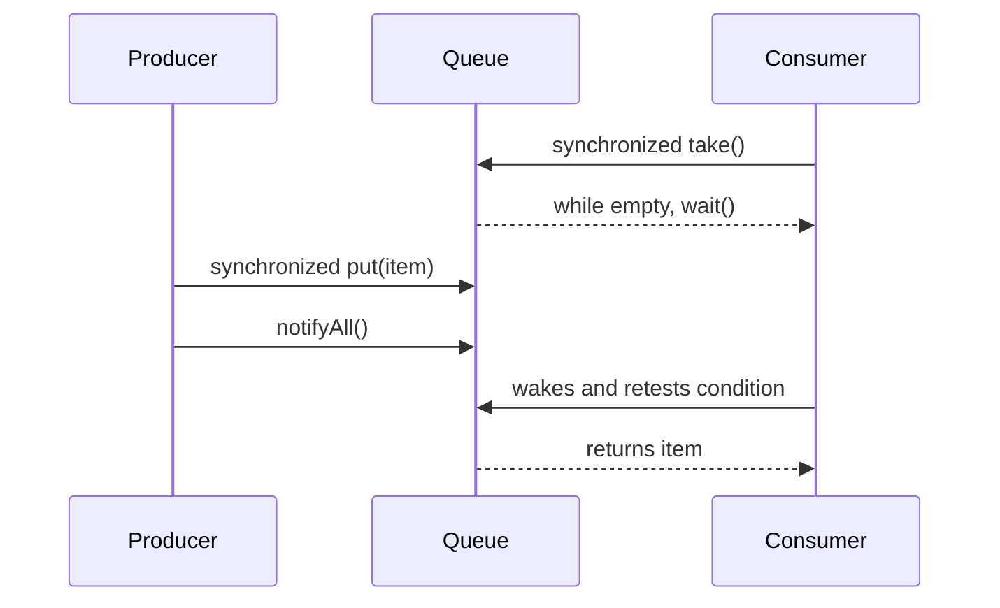

# Threads, Synchronization, and the Memory Model

A thread is a sequence of execution within a program. Most simple programs run one step at a time, but Java supports multiple threads that may execute concurrently and interact through shared objects. The source book introduces threads with a concrete race: two operations on shared state can interleave unless the program uses synchronization to define a safe order.


*Figure: Java's early development at Sun shaped its portability, virtual-machine model, and library ecosystem. Image: [Wikimedia Commons](https://commons.wikimedia.org/wiki/File:Sun_Microsystems_logo.svg), Sun Microsystems and Afrank99, public domain text logo.*

Threading is difficult because correctness depends on more than individual statements. Visibility, atomicity, ordering, locks, waiting, notification, deadlock, and termination all matter. The Java memory model gives meaning to synchronization and `volatile`, while the object monitor mechanism provides `synchronized`, `wait`, `notify`, and `notifyAll`.

## Definitions

The source basis for this page is Chapter 14 on creating threads, `Runnable`, synchronization, `wait`, `notifyAll`, scheduling, deadlocks, ending threads, application exit, synchronization and `volatile`, thread groups, exceptions, `ThreadLocal`, and debugging. The terms below are written as contracts: each one tells you what the compiler can check, what the runtime must preserve, and what a reader of the program may rely on.

**Thread.** A thread is an independent path of execution represented by a `Thread` object and scheduled by the runtime and operating system. In Java, this is rarely just vocabulary. It controls which operations are legal, when a value exists, what names are visible, or which object receives a message. When reading code, ask what the term promises before asking how the implementation happens to work.

**`Runnable`.** `Runnable` is an interface whose `run` method represents a unit of work. A `Thread` can be constructed with a `Runnable`. In Java, this is rarely just vocabulary. It controls which operations are legal, when a value exists, what names are visible, or which object receives a message. When reading code, ask what the term promises before asking how the implementation happens to work.

**Race condition.** A race condition occurs when correctness depends on timing or interleaving among threads rather than on enforced ordering. In Java, this is rarely just vocabulary. It controls which operations are legal, when a value exists, what names are visible, or which object receives a message. When reading code, ask what the term promises before asking how the implementation happens to work.

**Monitor lock.** Every object has a monitor lock used by `synchronized` methods and blocks. A thread must hold the relevant lock to enter synchronized code for that object. In Java, this is rarely just vocabulary. It controls which operations are legal, when a value exists, what names are visible, or which object receives a message. When reading code, ask what the term promises before asking how the implementation happens to work.

**`synchronized`.** `synchronized` enforces mutual exclusion and also participates in memory visibility guarantees. In Java, this is rarely just vocabulary. It controls which operations are legal, when a value exists, what names are visible, or which object receives a message. When reading code, ask what the term promises before asking how the implementation happens to work.

**`wait`.** `wait` makes the current thread release the object's monitor and suspend until notified, interrupted, or timed out. It must be called while holding the monitor. In Java, this is rarely just vocabulary. It controls which operations are legal, when a value exists, what names are visible, or which object receives a message. When reading code, ask what the term promises before asking how the implementation happens to work.

**`notifyAll` and `notify`.** Notification wakes waiting threads associated with an object's monitor. `notifyAll` wakes all; `notify` wakes one chosen by the runtime. In Java, this is rarely just vocabulary. It controls which operations are legal, when a value exists, what names are visible, or which object receives a message. When reading code, ask what the term promises before asking how the implementation happens to work.

**`volatile`.** A volatile variable has special visibility and ordering rules. It is not a replacement for synchronized compound actions. In Java, this is rarely just vocabulary. It controls which operations are legal, when a value exists, what names are visible, or which object receives a message. When reading code, ask what the term promises before asking how the implementation happens to work.

## Key results

**Shared mutable state requires a synchronization policy.** If multiple threads read and write the same object state, the class needs a clear rule for which lock protects which fields or which variables are volatile. Without that policy, apparently simple operations such as increment can lose updates. A good check is to rewrite the idea as a rule a compiler, library, or maintainer can enforce. If the rule cannot be stated clearly, the design is probably relying on habit instead of a contract.

**Synchronization protects atomicity and visibility.** A synchronized block prevents two threads from executing protected code for the same monitor at once. It also establishes memory effects so changes made by one synchronized action become visible in the right order to another synchronized action using the same monitor. A good check is to rewrite the idea as a rule a compiler, library, or maintainer can enforce. If the rule cannot be stated clearly, the design is probably relying on habit instead of a contract.

**Wait conditions must be tested in loops.** A waiting thread should test the condition it needs, call `wait` while the condition is false, and retest after waking. Notification is not the same as proof that the condition is true; another thread may have changed the state first, or a wakeup may occur for other reasons. A good check is to rewrite the idea as a rule a compiler, library, or maintainer can enforce. If the rule cannot be stated clearly, the design is probably relying on habit instead of a contract.

**Deadlock is a design failure the runtime may not fix.** If two threads hold locks while waiting for each other's locks, both can stop forever. The source emphasizes avoiding deadlocks through design, such as consistent resource ordering, instead of hoping the runtime detects and resolves them. A good check is to rewrite the idea as a rule a compiler, library, or maintainer can enforce. If the rule cannot be stated clearly, the design is probably relying on habit instead of a contract.

**Thread termination should be cooperative.** Abruptly stopping threads can leave shared objects inconsistent. Better designs arrange for a thread to notice a shutdown condition, finish current work safely, release resources, and return from `run`. A good check is to rewrite the idea as a rule a compiler, library, or maintainer can enforce. If the rule cannot be stated clearly, the design is probably relying on habit instead of a contract.

To reason about threaded code, annotate every shared field with its guard. For example, `balance guarded by this` means all access to `balance` must occur while holding the receiver's monitor. Then check every method. If a method reads or writes `balance` without the guard, the policy is broken. For wait/notify code, annotate the condition predicate, such as `queue not empty`, and make sure wait occurs in a loop testing that predicate. This discipline is more reliable than visually scanning for the word `synchronized` because synchronization is about a consistent policy, not decoration.

## Visual



| Problem | Source-era tool | Essential rule |
|---|---|---|
| Lost update | `synchronized` block or method | Guard read-modify-write as one action |
| Visibility of stop flag | `volatile` or synchronization | Reader must see writer's update |
| Condition waiting | `wait` and `notifyAll` | Hold monitor and wait in a loop |
| Deadlock | Lock ordering design | Acquire multiple locks consistently |
| Per-thread state | `ThreadLocal` | Avoid accidental sharing |

## Worked example 1: fixing a lost deposit

Problem: Two threads call `deposit(100)` on an account whose balance starts at `0`. Explain how the final balance can incorrectly be `100`.

Method:

1. Without synchronization, thread A reads balance `0`.
2. Before A writes, thread B also reads balance `0`.
3. Thread A computes `0 + 100` and writes `100`.
4. Thread B computes from its stale read `0 + 100` and writes `100`.
5. Both deposits returned, but one update was overwritten.
6. Make the read-modify-write operation synchronized on the same monitor so one deposit completes before the other begins.

Checked answer: The incorrect final balance is possible because incrementing is not atomic. A synchronized `deposit` method makes the final balance `200` for these two calls.

## Worked example 2: using wait in a bounded buffer

Problem: A consumer should take an item only when a queue is nonempty. Show the correct wait pattern.

Method:

1. Enter a synchronized method or block for the queue object so the condition and queue state are protected by the same monitor.
2. Test the condition `queue.isEmpty()`.
3. While it is empty, call `wait()`. The call releases the monitor and suspends the thread.
4. When awakened, reacquire the monitor and retest the condition in the loop.
5. Only remove and return an item after the loop proves the queue is nonempty.

Checked answer: The checked pattern is `while (empty) wait();` followed by removal under the same lock. Notification is a hint to retest, not a guarantee that the item is available.

## Code

```java
public class SynchronizedCounterDemo {
    static class Counter {
        private int value;

        public synchronized void increment() {
            value++;
        }

        public synchronized int value() {
            return value;
        }
    }

    public static void main(String[] args) throws InterruptedException {
        final Counter counter = new Counter();
        Runnable work = new Runnable() {
            public void run() {
                for (int i = 0; i < 10000; i++) {
                    counter.increment();
                }
            }
        };

        Thread a = new Thread(work);
        Thread b = new Thread(work);
        a.start();
        b.start();
        a.join();
        b.join();
        System.out.println(counter.value());
    }
}
```

## Common pitfalls

- Do not synchronize different methods on different locks if they protect the same state.
- Do not call `wait`, `notify`, or `notifyAll` without holding the object's monitor.
- Do not use `if` instead of `while` around a wait condition.
- Do not assume `volatile` makes compound actions atomic. It mainly addresses visibility and ordering for the variable.
- Do not design code that acquires locks in inconsistent orders. Deadlock prevention is a design responsibility.

## Connections

- [Interfaces, Nested Classes, and Enums](/cs/programming/java/interfaces-nested-classes-enums): covers `Runnable` as an interface contract.
- [Concurrent Utilities and Executors](/cs/programming/java/concurrent-utilities-executors): introduces higher-level concurrency utilities from the standard package survey.
- [Classes, Objects, and Encapsulation](/cs/programming/java/classes-objects-encapsulation): connects private state to synchronization policies.
- [Exceptions and Assertions](/cs/programming/java/exceptions-assertions): explains interruption and exceptions around threaded operations.
