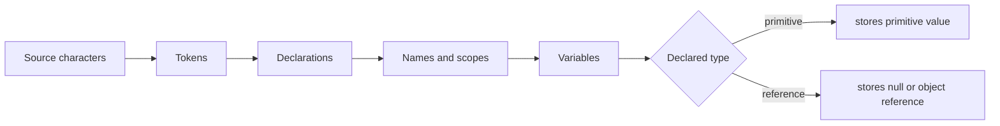

# Tokens, Values, and Variables

Java source code is a stream of lexical elements before it is a program. Keywords, identifiers, literals, operators, separators, and comments are recognized first; only then can declarations and expressions be parsed. That lexical layer matters because small spelling differences can change meaning completely: a keyword cannot be used as a variable name, a string literal is not an identifier, and a comment is ignored by the compiler.

Variables connect names to values. For primitive types the value is the primitive data itself; for reference types the value is a reference to an object or array. The source book returns to this distinction repeatedly because it affects assignment, parameter passing, object mutation, arrays, equality checks, and garbage collection.

## Definitions

The source basis for this page is Chapter 7 on tokens, values, variables, array variables, and names, with support from Chapter 1's quick-tour variables and constants. The terms below are written as contracts: each one tells you what the compiler can check, what the runtime must preserve, and what a reader of the program may rely on.

**Token.** A token is a lexical unit such as an identifier, keyword, literal, operator, or separator. The compiler forms tokens before it can decide whether a declaration or expression is legal. In Java, this is rarely just vocabulary. It controls which operations are legal, when a value exists, what names are visible, or which object receives a message. When reading code, ask what the term promises before asking how the implementation happens to work.

**Identifier.** An identifier is a programmer-chosen name for a variable, method, class, package component, label, or other named entity. Identifiers are case-sensitive and must not collide with reserved keywords. In Java, this is rarely just vocabulary. It controls which operations are legal, when a value exists, what names are visible, or which object receives a message. When reading code, ask what the term promises before asking how the implementation happens to work.

**Literal.** A literal is a source-code representation of a value, such as `42`, `3.14`, `'x'`, `true`, `null`, or `"text"`. Literals have types, and those types participate in overload resolution and assignment conversion. In Java, this is rarely just vocabulary. It controls which operations are legal, when a value exists, what names are visible, or which object receives a message. When reading code, ask what the term promises before asking how the implementation happens to work.

**Variable.** A variable is a named storage location whose declared type controls what values may be assigned. Local variables, fields, parameters, and array components are all variables, but they differ in lifetime and initialization rules. In Java, this is rarely just vocabulary. It controls which operations are legal, when a value exists, what names are visible, or which object receives a message. When reading code, ask what the term promises before asking how the implementation happens to work.

**Field.** A field is a variable declared as a member of a class or interface. Instance fields belong to objects, while static fields belong to a class. In Java, this is rarely just vocabulary. It controls which operations are legal, when a value exists, what names are visible, or which object receives a message. When reading code, ask what the term promises before asking how the implementation happens to work.

**Local variable.** A local variable is declared inside a method, constructor, initializer, or block. It must be definitely assigned before use, which prevents reading an uninitialized local value. In Java, this is rarely just vocabulary. It controls which operations are legal, when a value exists, what names are visible, or which object receives a message. When reading code, ask what the term promises before asking how the implementation happens to work.

**Array variable.** An array variable holds a reference to an array object. The array object has a length and components; assigning the variable changes which array is referenced, not the contents of the old array. In Java, this is rarely just vocabulary. It controls which operations are legal, when a value exists, what names are visible, or which object receives a message. When reading code, ask what the term promises before asking how the implementation happens to work.

**Name meaning.** The meaning of a name depends on its syntactic context and scope. Java's rules determine whether a name denotes a package, type, variable, method, field, or label. In Java, this is rarely just vocabulary. It controls which operations are legal, when a value exists, what names are visible, or which object receives a message. When reading code, ask what the term promises before asking how the implementation happens to work.

## Key results

**Declarations create readable contracts.** A declaration such as `int count` tells the compiler and the reader that `count` is intended to hold integer values. That information limits assignments, guides overload resolution, and documents intent. The book's examples emphasize declarations because Java wants type information visible in the source. A good check is to rewrite the idea as a rule a compiler, library, or maintainer can enforce. If the rule cannot be stated clearly, the design is probably relying on habit instead of a contract.

**Local variables are not default-initialized for use.** Fields and array components receive default values, but local variables must be assigned before they are read. This definite-assignment rule catches common mistakes where a branch might leave a value unset. It also explains why moving code from a field to a local can change whether it compiles. A good check is to rewrite the idea as a rule a compiler, library, or maintainer can enforce. If the rule cannot be stated clearly, the design is probably relying on habit instead of a contract.

**Reference assignment shares objects.** If two reference variables are assigned the same object reference, both variables can be used to reach the same object. Reassigning one variable does not reassign the other, but mutating the shared object is visible through both references. This distinction is central to arrays, collections, and object design. A good check is to rewrite the idea as a rule a compiler, library, or maintainer can enforce. If the rule cannot be stated clearly, the design is probably relying on habit instead of a contract.

**`null` is a reference value, not an object.** `null` can be stored in a reference variable to mean that the variable refers to no object. Invoking a method or selecting a field through `null` fails at runtime. A null check is therefore a check about reference availability, not about object state. A good check is to rewrite the idea as a rule a compiler, library, or maintainer can enforce. If the rule cannot be stated clearly, the design is probably relying on habit instead of a contract.

**Scope is a correctness tool.** A name should be visible only where it is meaningful. Narrow scopes make code easier to reason about because fewer statements can observe or change a variable. This principle supports the book's later advice to keep fields private and to avoid exposing representation unnecessarily. A good check is to rewrite the idea as a rule a compiler, library, or maintainer can enforce. If the rule cannot be stated clearly, the design is probably relying on habit instead of a contract.

When tracing variables, write down four columns: name, declared type, current value, and lifetime. For primitive variables, the value column contains the data value. For reference variables, the value column contains either `null` or a reference to an object, and object state should be tracked separately. This small discipline resolves many confusing Java questions. Why did two arrays seem to change together? They were two variables holding the same reference. Why did a method fail on a variable that had been declared? The variable may have held `null`. Why did a local variable require an assignment while a field did not? The definite-assignment rules are different.

## Visual



| Variable kind | Where declared | Default usable value? | Typical risk |
|---|---|---|---|
| Local variable | Block, method, constructor | No, must be definitely assigned | Branch leaves it unset |
| Parameter | Method or constructor header | Supplied by caller | Caller passes unexpected value |
| Instance field | Class body | Yes, default for type | Object invariant not established |
| Static field | Class body with `static` | Yes, default for type | Shared mutable state |
| Array component | Inside array object | Yes, default for component type | Confusing array reference with array contents |

## Worked example 1: tracking primitive and reference assignments

Problem: Given `int a = 3; int b = a; int[] x = {3}; int[] y = x; b = 4; y[0] = 9;`, determine `a`, `b`, `x[0]`, and `y[0]`.

Method:

1. `a` is an `int` variable initialized with primitive value `3`.
2. `b = a` copies the primitive value `3` into `b`. The two variables are independent after the copy.
3. `x` is a reference variable initialized with a reference to a new one-element array whose component is `3`.
4. `y = x` copies the reference value, so `x` and `y` refer to the same array object.
5. `b = 4` changes only `b`; `a` remains `3`.
6. `y[0] = 9` changes the shared array object's first component. Reading through either `x` or `y` sees that same component.

Checked answer: `a` is `3`, `b` is `4`, `x[0]` is `9`, and `y[0]` is `9`. Primitive assignment copied data; reference assignment copied access to one shared object.

## Worked example 2: checking definite assignment

Problem: Decide whether `int result; if (ready) result = 10; System.out.println(result);` is legal.

Method:

1. Declare `result` as a local variable. Local variables do not receive a usable default value.
2. Analyze the `if` statement. If `ready` is true, `result` is assigned `10`.
3. Analyze the false branch. There is no `else`, so if `ready` is false, execution reaches the print statement without assigning `result`.
4. Apply the definite-assignment rule before the read in `println`. Every path to the read must have assigned the variable.
5. The false path violates the rule. Add an initializer, add an `else`, or return/throw on the false path.

Checked answer: The code is not legal because `result` is not definitely assigned before use. A checked fix is `int result = 0;` or `if (ready) result = 10; else result = -1;` before printing.

## Code

```java
public class VariableTrace {
    public static void main(String[] args) {
        int a = 3;
        int b = a;

        int[] x = new int[] { 3 };
        int[] y = x;

        b = 4;
        y[0] = 9;

        System.out.println("a = " + a);
        System.out.println("b = " + b);
        System.out.println("x[0] = " + x[0]);
        System.out.println("y[0] = " + y[0]);
    }
}
```

## Common pitfalls

- Do not say that an object variable contains the object. It contains a reference value that can be copied, compared, assigned, or set to `null`.
- Do not rely on field default values to express a complete invariant. Constructors should establish meaningful object state.
- Do not read a local variable on a path where it may not have been assigned. The compiler rejects this because it is a real ambiguity.
- Do not confuse scope with lifetime. A name may be out of scope while the object it once referenced remains reachable through another reference.
- Do not choose names that hide meaning. Short names are fine for tight loops, but wider scopes need names that state the role of the value.

## Connections

- [Primitives, Operators, and Conversions](/cs/programming/java/primitives-operators-conversions): explains operations on values declared by variables.
- [Control Flow, Arrays, and Strings](/cs/programming/java/control-flow-arrays-strings): shows how assignment and scope interact with branches and loops.
- [Classes, Objects, and Encapsulation](/cs/programming/java/classes-objects-encapsulation): uses fields and private state to protect object invariants.
- [Garbage Collection, References, and Memory](/cs/programming/java/garbage-collection-references-memory): follows references into reachability and reclamation.
