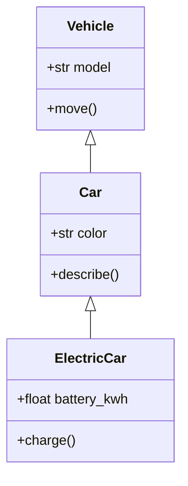

# Classes, OOP, and Dataclasses

Classes let Python programs define new kinds of objects. The textbook introduces classes with a `Car` example: attributes such as model and color, an initializer, object creation, and methods that print object state. That is the right starting point. Object-oriented programming becomes useful when data and behavior belong together and when the program benefits from a named concept rather than loose dictionaries and functions.

Python's object model is broad. It includes ordinary classes, special or "dunder" methods, properties, inheritance, mixins, and dataclasses. The main engineering judgment is knowing when a class clarifies the design. If a problem is just transforming a list of numbers, a function is enough. If the problem has entities with state, invariants, and operations, a class may make the code easier to reason about.

## Definitions

A **class** is a blueprint for objects:

```python
class Car:
    def __init__(self, model, color):
        self.model = model
        self.color = color
```

An **object** or **instance** is a value created from a class:

```python
car = Car("Tesla", "red")
```

An **attribute** is data stored on an object, such as `car.model`. A **method** is a function defined inside a class and called on an object, such as `car.describe()`.

`self` is the conventional name for the current instance. It is passed automatically when a method is called with dot syntax:

```python
car.describe()
```

is conceptually similar to:

```python
Car.describe(car)
```

A **dunder method** has double underscores before and after its name, such as `__init__`, `__repr__`, `__str__`, `__len__`, and `__eq__`. These methods customize how objects interact with Python syntax and built-in functions.

A **property** exposes method-controlled access using attribute syntax. It is useful for computed attributes or validation.

**Inheritance** lets one class reuse and specialize another class. A **mixin** is a small class meant to provide methods to other classes through inheritance, usually without standing alone as a complete domain object.

A **dataclass** is a class generated by the `@dataclass` decorator from the standard library. It reduces boilerplate for classes that primarily store data.

## Key results

The first key result is that `__init__` initializes a new object after creation. It does not return the new object; Python handles that. Returning a value from `__init__` other than `None` is an error.

The second result is that methods should protect object invariants. If an account balance should never become negative, put withdrawals through a method that validates the operation instead of modifying `account.balance` freely from all over the program.

The third result is that `__repr__` is one of the most useful dunder methods for debugging. It should return an unambiguous string representation:

```python
def __repr__(self):
    return f"Car(model={self.model!r}, color={self.color!r})"
```

The fourth result is that inheritance should represent a real "is-a" relationship or a deliberate interface. Do not use inheritance simply to share a few lines of code. Composition, where one object contains another, is often clearer.

The fifth result is that dataclasses are ideal for plain data records with optional validation in `__post_init__`. They automatically generate an initializer, representation, and equality comparison unless configured otherwise.

The sixth result is that class attributes and instance attributes differ. A class attribute is shared through the class; an instance attribute belongs to one object. Mutable class attributes are a frequent source of bugs.

A seventh result is that classes are most useful when they protect a concept, not merely when they group names. A `Temperature` class can protect units and conversions. A `BankAccount` class can protect balance invariants. A `Rectangle` class can keep width, height, area, and validation together. By contrast, a class named `Utilities` that contains unrelated static methods usually adds ceremony without improving the model.

An eighth result is that public attributes are acceptable in Python when the data is simple and no invariant is being enforced. Python does not require getter and setter methods for every field. Start with clear attributes. Introduce a property when access needs validation, conversion, lazy computation, or backward-compatible behavior. This keeps simple classes simple while leaving a path for future control.

A final design result is to prefer composition when the relationship is "has-a" rather than "is-a." A `Report` may have a `Path`, a list of rows, and a formatter. It is not a kind of path or a kind of list. Inheritance is powerful, but a shallow object graph with explicit attributes is often easier to test and change.

## Visual



| Feature | Use for | Example |
|---|---|---|
| `__init__` | Initialize attributes | `self.model = model` |
| `__repr__` | Debug representation | `Car(model='Ford')` |
| `@property` | Computed or validated attribute access | `rectangle.area` |
| Inheritance | Specialize a base type | `ElectricCar(Car)` |
| Mixin | Add narrow reusable behavior | `JsonMixin` |
| `@dataclass` | Data-focused classes | `Point(x, y)` |

## Worked example 1: build a small class with validation

Problem: create a `Temperature` class that stores Celsius and exposes Fahrenheit as a computed property.

Method:

1. Store the canonical value in Celsius.
2. Validate that the value is numeric enough for conversion.
3. Use a property for Fahrenheit because it is derived.
4. Add `__repr__` for debugging.

Work:

```python
class Temperature:
    def __init__(self, celsius):
        self.celsius = float(celsius)

    @property
    def fahrenheit(self):
        return self.celsius * 9 / 5 + 32

    def __repr__(self):
        return f"Temperature(celsius={self.celsius!r})"
```

Use:

```python
t = Temperature(20)
print(t.celsius)
print(t.fahrenheit)
print(t)
```

Step-by-step:

1. `Temperature(20)` calls `__init__`.
2. `float(20)` stores `20.0`.
3. `t.fahrenheit` calls the property method.
4. The formula gives:

$$
\begin{aligned}
20 \times 9/5 + 32 &= 36 + 32 \\
                  &= 68
\end{aligned}
$$

5. `print(t)` uses `__repr__` if `__str__` is not defined.

Checked output includes `20.0`, `68.0`, and `Temperature(celsius=20.0)`.

## Worked example 2: replace boilerplate with a dataclass

Problem: represent a 2D point and compute its distance from the origin.

Manual class:

```python
class Point:
    def __init__(self, x, y):
        self.x = x
        self.y = y
```

Dataclass method:

```python
from dataclasses import dataclass
from math import hypot

@dataclass(frozen=True)
class Point:
    x: float
    y: float

    def distance_from_origin(self):
        return hypot(self.x, self.y)
```

Method:

1. Use `@dataclass` to generate `__init__`, `__repr__`, and `__eq__`.
2. Use `frozen=True` to make instances immutable after creation.
3. Add a method for behavior that belongs to the point.

Check:

```python
p = Point(3, 4)
print(p)
print(p.distance_from_origin())
```

Manual calculation:

$$
\begin{aligned}
d &= \sqrt{3^2 + 4^2} \\
  &= \sqrt{9 + 16} \\
  &= 5
\end{aligned}
$$

Checked answer: `Point(x=3, y=4)` and `5.0`.

## Code

```python
from dataclasses import dataclass

@dataclass
class BankAccount:
    owner: str
    balance: float = 0.0

    def deposit(self, amount):
        if amount <= 0:
            raise ValueError("deposit amount must be positive")
        self.balance += amount

    def withdraw(self, amount):
        if amount <= 0:
            raise ValueError("withdrawal amount must be positive")
        if amount > self.balance:
            raise ValueError("insufficient funds")
        self.balance -= amount

account = BankAccount("Ada", 100.0)
account.deposit(25.0)
account.withdraw(40.0)
print(account)
```

The class keeps account rules near account data. Callers do not need to know every invariant; they use methods that enforce them.

This does not mean every attribute must be hidden. The `owner` field is simple public data, while balance changes go through methods because they have rules. That mixture is idiomatic Python. Start with the simplest public shape that preserves correctness, then add properties or methods where the object has to protect itself. The design question is always practical: where can invalid state enter, and which method or constructor should stop it?

For dataclasses, remember that generated methods are conveniences, not a complete domain model. Add explicit behavior when the object has rules.

When deciding between a dictionary and a class, ask how many places need to know the field names and rules. A dictionary is fine when data is temporary and simple. A class is stronger when the same structure travels through many functions, must reject invalid state, or benefits from named behavior. For example, a dictionary can store `{"width": 3, "height": 4}`, but a `Rectangle` class can guarantee positive dimensions and provide `.area` without every caller repeating the formula.

Classes also make refactoring safer when paired with tests. If all account updates pass through `deposit` and `withdraw`, changing the internal representation from dollars to cents affects fewer call sites. That is the practical value of encapsulation: not hiding code for its own sake, but limiting how much of the program must change when the implementation changes.

## Common pitfalls

- Forgetting `self` in method definitions.
- Returning a value from `__init__`.
- Using mutable class attributes when each instance needs its own list or dictionary.
- Creating a class with only one function and no meaningful state. A plain function may be clearer.
- Overusing inheritance for code sharing instead of modeling.
- Writing properties with surprising side effects. Attribute access should feel cheap and predictable.
- Making dataclasses mutable by default when instances are intended to be value objects. Consider `frozen=True`.

## Connections

- [Functions, Arguments, and Decorators](/cs/programming/python/functions-arguments-and-decorators)
- [Containers and Idioms](/cs/programming/python/containers-and-idioms)
- [Errors, Exceptions, and Debugging](/cs/programming/python/errors-exceptions-and-debugging)
- [Testing and the Scientific Stack](/cs/programming/python/testing-and-scientific-stack)
