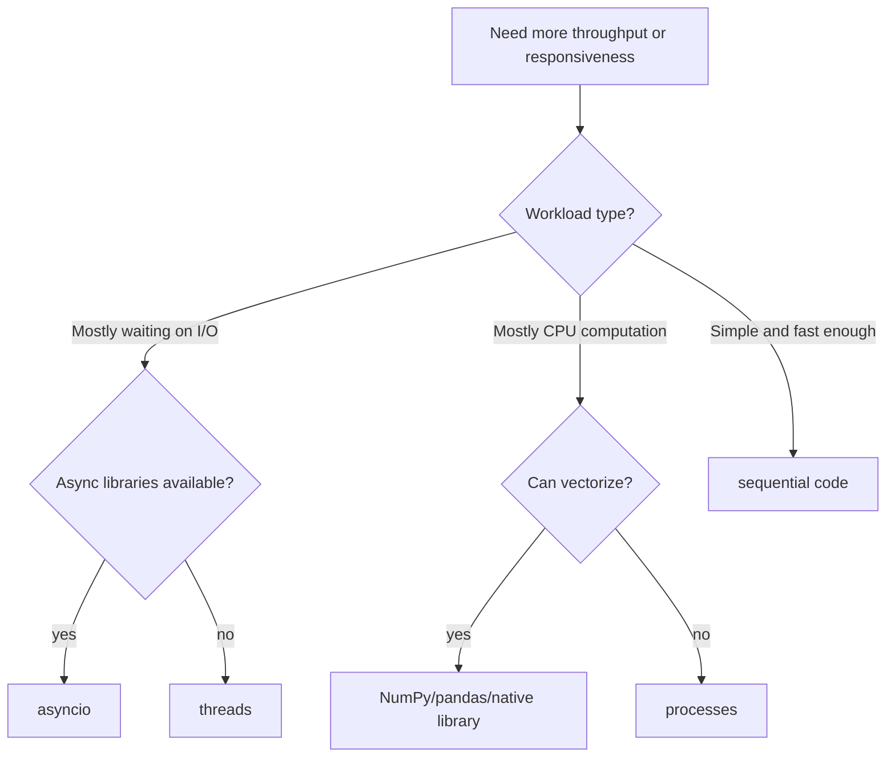

# Concurrency Overview

Concurrency is about handling multiple tasks whose lifetimes overlap. The textbook is introductory and does not center concurrency, but Python programmers eventually meet it when programs wait on files, networks, user interfaces, subprocesses, sensors, or many independent calculations. The core question is not "how do I make code parallel?" It is "what is the program waiting for, and what model matches that waiting?"

Python offers several concurrency tools. Threads are useful for overlapping I/O-bound work. Processes are useful for CPU-bound work because they avoid the limitations of the global interpreter lock in standard CPython. `asyncio` is useful for large numbers of cooperative I/O tasks when the libraries involved support async APIs. Each tool has costs, so start with clear sequential code and introduce concurrency only when measurement or design need justifies it.

## Definitions

**Concurrency** means multiple tasks are in progress during the same time period. **Parallelism** means multiple tasks are executing at the exact same time, usually on multiple CPU cores. Concurrency may or may not be parallel.

A **thread** is a flow of execution inside one process. Threads share memory, which makes communication easy but also creates race conditions when mutable state is shared.

A **process** is an independent program instance with its own memory. Processes communicate through files, queues, pipes, sockets, or other inter-process mechanisms. They have more overhead than threads but are safer for CPU-heavy work.

The **global interpreter lock** or **GIL** in standard CPython prevents multiple Python bytecode threads from executing at the same instant in one process. This means threads do not usually speed up CPU-bound pure Python loops, but they can still help with I/O-bound tasks where threads spend time waiting.

**Asynchronous programming** uses an event loop and coroutines. A coroutine declared with `async def` can pause at `await`, allowing other tasks to run while it waits for I/O.

An **I/O-bound** task spends most time waiting on external resources, such as network responses or disk. A **CPU-bound** task spends most time doing computation.

A **race condition** occurs when program behavior depends on unpredictable timing between tasks. A **lock** protects shared state so only one thread enters a critical section at a time.

## Key results

The first key result is that the workload determines the model. If the program downloads many URLs, reads many files, or waits on sensors, threads or async may help. If the program computes millions of independent numeric results in pure Python, processes or vectorized libraries are better candidates.

The second result is that `concurrent.futures` is often the most approachable interface. `ThreadPoolExecutor` and `ProcessPoolExecutor` share a similar API, letting you submit independent functions and gather results.

The third result is that shared mutable state is the main danger in threaded code. Prefer passing inputs to worker functions and collecting returned outputs. When sharing is unavoidable, use locks or thread-safe queues.

The fourth result is that process workers require picklable inputs and outputs. Functions submitted to a process pool should usually be defined at module top level, not nested inside another function.

The fifth result is that async code requires async-compatible libraries. You cannot make ordinary blocking file or network calls magically nonblocking by putting them inside `async def`. The awaited operation must cooperate with the event loop.

The sixth result is that concurrency should be tested with failure in mind. Workers can raise exceptions, time out, return partial results, or be cancelled. A concurrent program that only works on the success path is fragile.

A seventh result is that concurrency changes observability. Print statements from several threads or processes can interleave, making logs hard to read. A task that fails in a worker may not show a traceback until its future is inspected. Timing-dependent bugs may disappear when debug output is added. Use structured logging, collect results deliberately, and keep worker functions small enough that they can be tested sequentially.

An eighth result is that cancellation and shutdown are part of the design. A program that starts background work should know how to stop it when the user exits, when a timeout expires, or when one task fails. Context managers around executors help because they define a lifetime for the pool. In async code, cancellation propagates through awaited tasks, so cleanup should use `try` and `finally` where resources must be released.

Finally, prefer data isolation over locks when possible. If each worker receives input and returns output without touching shared state, the program is easier to reason about. Queues, immutable inputs, and result collection are often simpler than shared dictionaries protected by locks. Use locks for small critical sections, not as a way to make a complex shared design barely safe.

## Visual



| Model | Best for | Shared memory | Main risk |
|---|---|---:|---|
| Sequential | Small or simple tasks | n/a | Slow if much waiting |
| Threads | Blocking I/O | yes | Race conditions |
| Processes | CPU-bound work | no | Serialization overhead |
| `asyncio` | Many cooperative I/O tasks | one thread by default | Blocking the event loop |
| Vectorized libraries | Numeric arrays | library-managed | Memory use and API complexity |

## Worked example 1: use threads for I/O-style waiting

Problem: simulate five slow I/O requests and run them concurrently with threads.

Method:

1. Write a worker function that sleeps to simulate waiting.
2. Use `ThreadPoolExecutor`.
3. Submit several independent inputs.
4. Collect results as they complete.

Work:

```python
from concurrent.futures import ThreadPoolExecutor, as_completed
from time import sleep

def fetch_simulated(name):
    sleep(0.5)
    return f"{name}: done"

names = ["A", "B", "C", "D", "E"]

with ThreadPoolExecutor(max_workers=5) as executor:
    futures = [executor.submit(fetch_simulated, name) for name in names]
    results = [future.result() for future in as_completed(futures)]
```

Step-by-step:

1. Sequential execution would sleep `0.5` seconds five times, about `2.5` seconds total.
2. With five worker threads, all five sleeps can overlap.
3. Each worker returns a string.
4. `as_completed` yields futures as they finish.
5. `future.result()` either returns the worker result or re-raises the worker exception.

Checked answer: `results` contains five strings, one for each name. The order may differ from the input order because completion order is not guaranteed.

## Worked example 2: use asyncio for cooperative tasks

Problem: run three coroutines that wait for different delays, then gather their results.

Method:

1. Define an `async def` coroutine.
2. Use `await asyncio.sleep(...)` for nonblocking waiting.
3. Use `asyncio.gather` to run tasks concurrently.
4. Start the event loop with `asyncio.run`.

Work:

```python
import asyncio

async def wait_and_report(name, delay):
    await asyncio.sleep(delay)
    return f"{name} waited {delay}"

async def main():
    results = await asyncio.gather(
        wait_and_report("short", 0.1),
        wait_and_report("medium", 0.2),
        wait_and_report("long", 0.3),
    )
    return results

results = asyncio.run(main())
```

Step-by-step:

1. `asyncio.run(main())` starts an event loop.
2. `main()` schedules three coroutines with `gather`.
3. Each coroutine reaches `await asyncio.sleep(delay)` and yields control.
4. The event loop resumes coroutines when their delay expires.
5. `gather` returns results in the same order as the input awaitables.

Checked answer:

```python
results == [
    "short waited 0.1",
    "medium waited 0.2",
    "long waited 0.3",
]
```

The total time is close to the longest delay, not the sum of all delays.

## Code

```python
from concurrent.futures import ProcessPoolExecutor

def count_divisors(n):
    count = 0
    for candidate in range(1, n + 1):
        if n % candidate == 0:
            count += 1
    return n, count

if __name__ == "__main__":
    numbers = [20_000, 20_100, 20_200, 20_300]

    with ProcessPoolExecutor() as executor:
        for number, divisors in executor.map(count_divisors, numbers):
            print(f"{number} has {divisors} divisors")
```

The `if __name__ == "__main__"` guard is important for process-based code, especially on Windows, because child processes import the main module.

Before replacing sequential code with this pattern, measure one worker function by itself. Process pools have startup and serialization overhead, so tiny tasks can become slower when distributed. A good process-pool task is large enough to justify the handoff and independent enough that workers do not need constant communication. If the function spends most of its time in a NumPy operation that already releases the GIL or uses optimized native code, vectorization may be a better first step than multiprocessing.

## Common pitfalls

- Adding concurrency before measuring whether sequential code is actually too slow.
- Using threads for CPU-bound pure Python loops and expecting linear speedup.
- Sharing mutable data between threads without locks or queues.
- Forgetting that concurrent results may arrive in a different order.
- Blocking the `asyncio` event loop with ordinary slow functions.
- Submitting nested functions or non-picklable objects to a process pool.
- Ignoring exceptions inside futures. Always call `.result()` or otherwise inspect failures.

## Connections

- [Iterators, Generators, and Functional Tools](/cs/programming/python/iterators-generators-and-functional-tools)
- [Files and Context Managers](/cs/programming/python/files-and-context-managers)
- [Errors, Exceptions, and Debugging](/cs/programming/python/errors-exceptions-and-debugging)
- [Testing and the Scientific Stack](/cs/programming/python/testing-and-scientific-stack)
