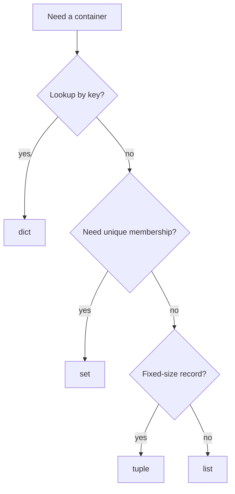

# Containers and Idioms

Python's built-in containers are one of the main reasons the language feels productive. Lists, tuples, sets, and dictionaries cover most everyday data modeling needs without importing anything. Halvorsen's early chapters use arrays in the beginner sense and then loop over data. In idiomatic Python, the usual built-in sequence for a growable ordered collection is a list; specialized numeric arrays are introduced later through NumPy.


*Figure: Python provides the practical environment for many CS, ML, and data examples. Image: [Wikimedia Commons](https://commons.wikimedia.org/wiki/File:Python-logo-notext.svg), Python Software Foundation, GPL-compatible free license; trademark terms apply.*

Choosing the right container is a design decision. If order and mutation matter, use a list. If fixed position and unpacking matter, use a tuple. If uniqueness and membership tests matter, use a set. If lookup by key matters, use a dictionary. Most beginner code becomes simpler when data is put into the container that matches the operation being performed.

## Definitions

A **list** is an ordered, mutable sequence:

```python
readings = [21.5, 22.0, 20.75]
readings.append(23.1)
```

Lists support indexing, slicing, iteration, appending, sorting, and in-place updates.

A **tuple** is an ordered, immutable sequence:

```python
point = (3, 4)
x, y = point
```

Tuples are useful for fixed records, multiple return values, and dictionary keys when all contained values are hashable.

A **set** is an unordered collection of unique hashable values:

```python
seen = {"red", "green", "blue"}
seen.add("red")
```

Adding `"red"` again has no effect. Sets are excellent for membership tests and mathematical set operations.

A **dictionary** maps keys to values:

```python
student = {"name": "Ada", "score": 95}
student["score"] = 98
```

Keys must be hashable. Values can be any object.

An **idiom** is a common, readable pattern used by experienced programmers. Examples include `for item in items`, `if key in mapping`, `for index, value in enumerate(items)`, and `for key, value in mapping.items()`.

## Key results

The first key result is that container choice follows access pattern. If code repeatedly asks "have I seen this value?", a set is usually better than a list because membership testing is designed for that use. If code repeatedly asks "what value belongs to this name?", a dictionary is the natural structure.

The second result is that list methods divide into mutating and non-mutating operations. `append`, `extend`, `sort`, and `reverse` mutate the list and return `None`. `sorted(items)` returns a new list. Confusing these is a common beginner bug:

```python
numbers = [3, 1, 2]
result = numbers.sort()
print(result)  # None
```

The third result is that iteration should expose meaning. Use `.items()` for dictionary key-value pairs:

```python
for name, score in scores.items():
    print(name, score)
```

This is clearer than looping over keys and indexing manually.

The fourth result is that mutability controls aliasing. A tuple cannot be resized, but it can contain mutable objects. A list copied with `b = a` is not copied at all; both names refer to the same list. Use `a.copy()` for a shallow copy, and `copy.deepcopy()` only when nested mutable structures require independent copies.

The fifth result is that comprehensions often express container transformations better than manual loops, provided the transformation is simple. A list comprehension builds a list, a set comprehension builds a set, and a dictionary comprehension builds a dictionary.

A sixth result is that containers can model records, relationships, and indexes. A list of dictionaries is natural for rows read from JSON or CSV. A dictionary of lists is natural for grouping scores by student. A dictionary whose values are dictionaries can model nested lookup, but it can also become hard to validate. When a container structure needs a long explanation, consider whether a dataclass or small class would make the data shape explicit.

A seventh result is that ordering should be intentional. Lists and tuples are ordered by position. Dictionaries preserve insertion order in modern Python, but they are still primarily key-value structures. Sets should not be used when meaningful output order is required. If a report must be stable, sort the data at the point of output:

```python
for name in sorted(scores):
    print(name, scores[name])
```

An eighth result is that container operations often communicate complexity. `if item in seen_set` tells readers that membership is central and expected to be efficient. `for key, value in mapping.items()` tells readers that both sides of a mapping are needed. `name, score = row` tells readers that the tuple has exactly two fields. These small idioms reduce the amount of mental bookkeeping needed to read a program.

## Visual

| Container | Ordered | Mutable | Unique values | Main operation | Literal |
|---|---:|---:|---:|---|---|
| `list` | yes | yes | no | append, index, sort | `[1, 2]` |
| `tuple` | yes | no | no | unpack, fixed record | `(1, 2)` |
| `set` | no | yes | yes | membership, union | `{1, 2}` |
| `dict` | insertion order | yes | unique keys | key lookup | `{"a": 1}` |



## Worked example 1: summarize scores with a dictionary

Problem: given `(student, score)` pairs, keep the highest score for each student.

Data:

```python
attempts = [
    ("Ada", 82),
    ("Grace", 91),
    ("Ada", 95),
    ("Linus", 78),
    ("Grace", 89),
]
```

Method:

1. Use a dictionary from student name to best score.
2. Loop over each attempt.
3. If the student is new, store the score.
4. If the student already exists, compare and keep the maximum.

Work:

```python
best = {}

for name, score in attempts:
    if name not in best:
        best[name] = score
    elif score > best[name]:
        best[name] = score
```

Step-by-step:

1. `("Ada", 82)` is new, so `best["Ada"] = 82`.
2. `("Grace", 91)` is new, so `best["Grace"] = 91`.
3. `("Ada", 95)` already exists; `95 > 82`, so update Ada to `95`.
4. `("Linus", 78)` is new, so store `78`.
5. `("Grace", 89)` exists; `89` is not greater than `91`, so keep `91`.

Checked answer:

```python
{"Ada": 95, "Grace": 91, "Linus": 78}
```

The dictionary is the right tool because the central operation is lookup by name.

## Worked example 2: find duplicates with a set

Problem: identify repeated sample IDs while preserving a list of duplicate occurrences.

Data:

```python
sample_ids = ["A1", "B2", "A1", "C3", "B2", "B2"]
```

Method:

1. Use `seen` to record IDs encountered at least once.
2. Use `duplicates` to record repeated occurrences.
3. For each ID, test membership in `seen`.
4. Add unseen IDs to `seen`; append repeated IDs to `duplicates`.

Work:

```python
seen = set()
duplicates = []

for sample_id in sample_ids:
    if sample_id in seen:
        duplicates.append(sample_id)
    else:
        seen.add(sample_id)
```

Step-by-step:

1. `"A1"` not in `seen`; add it.
2. `"B2"` not in `seen`; add it.
3. `"A1"` already seen; append to duplicates.
4. `"C3"` not in `seen`; add it.
5. `"B2"` already seen; append to duplicates.
6. `"B2"` still already seen; append again.

Checked answer:

```python
seen == {"A1", "B2", "C3"}
duplicates == ["A1", "B2", "B2"]
```

If only the set of duplicated IDs is needed, use `duplicate_ids = set(duplicates)`, which gives `{"A1", "B2"}`.

## Code

```python
from collections import defaultdict

def group_scores(rows):
    grouped = defaultdict(list)
    for name, score in rows:
        grouped[name].append(score)
    return dict(grouped)

def average_scores(grouped):
    return {
        name: sum(scores) / len(scores)
        for name, scores in grouped.items()
    }

attempts = [("Ada", 82), ("Grace", 91), ("Ada", 95), ("Linus", 78)]
grouped = group_scores(attempts)
averages = average_scores(grouped)

print(grouped)
print(averages)
```

This snippet combines tuples for records, a dictionary for grouping, lists for collected scores, and a dictionary comprehension for final averages.

The same pattern appears in many data-processing scripts. First, choose a record shape for one observation. Second, choose an index or grouping container for the question being asked. Third, compute a derived result in a separate pass. Keeping these stages separate makes it easier to print intermediate structures and to test each part. If grouping is wrong, inspect `grouped`; if averaging is wrong, test `average_scores` with a small hand-built dictionary.

When performance matters, this structure also gives you a clear place to improve. You can replace a list with a set for membership, a dictionary with `Counter` for counting, or a list of dictionaries with a pandas DataFrame for tabular analysis.

For learning, inspect containers with `repr()` or the debugger rather than only printing final answers. Seeing the intermediate list, set, or dictionary often reveals whether the program grouped by the right key, preserved the needed order, or accidentally reused the same mutable object.

## Common pitfalls

- Using a list for repeated membership tests when a set would be clearer and faster.
- Assigning the result of `list.sort()` and expecting a sorted list. The method mutates and returns `None`.
- Modifying a dictionary while iterating over it. Iterate over `list(mapping)` or build a new dictionary.
- Forgetting that `{}` creates an empty dictionary, not an empty set. Use `set()` for an empty set.
- Expecting sets to preserve a meaningful order. If output order matters, sort explicitly.
- Confusing shallow copies with deep copies in nested structures.
- Using parallel lists for related fields when a dictionary, tuple, dataclass, or small class would make relationships explicit.

## Connections

- [Control Flow and Comprehensions](/cs/programming/python/control-flow-and-comprehensions)
- [Strings and Text Processing](/cs/programming/python/strings-and-text-processing)
- [Functions, Arguments, and Decorators](/cs/programming/python/functions-arguments-and-decorators)
- [Standard Library Highlights](/cs/programming/python/standard-library-highlights)
