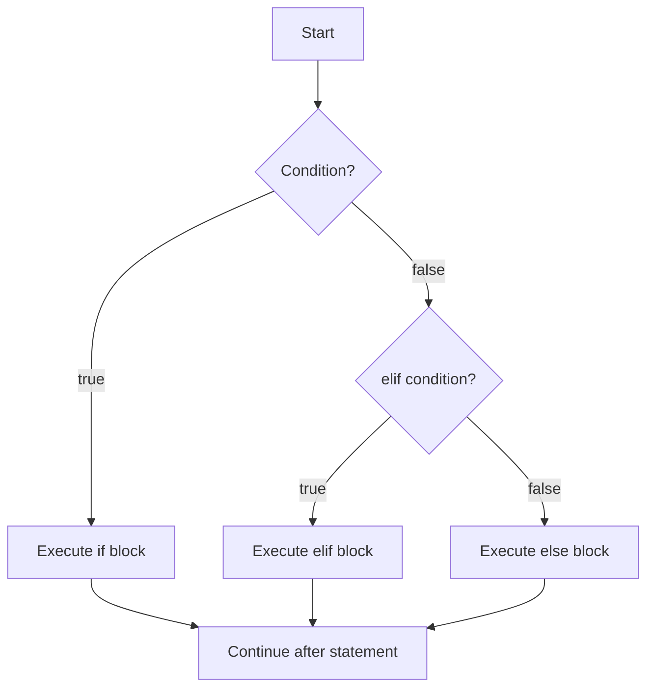

# Control Flow and Comprehensions

Control flow is how a program decides what to do next. Halvorsen's textbook introduces `if ... else`, arrays or list-like data, `for` loops, nested loops, and `while` loops as the first major step beyond straight-line scripts. These constructs make programs respond to data instead of merely executing a fixed sequence of assignments and prints.

Python's control flow is deliberately small. Conditions choose branches. Loops repeat work. `break` exits a loop. `continue` skips to the next iteration. Comprehensions build collections from existing iterables. Once these pieces are clear, many programs become combinations of filtering, transforming, accumulating, and stopping at the right time.

## Definitions

An **`if` statement** selects a block based on a condition:

```python
if temperature > 25:
    print("warm")
elif temperature > 15:
    print("mild")
else:
    print("cold")
```

A **condition** is an expression used for truth testing. It does not have to be literally `True` or `False`; Python uses truthiness rules. Empty strings and containers are falsey, while non-empty ones are truthy.

A **`for` loop** iterates over an iterable:

```python
for name in names:
    print(name)
```

An **iterable** is an object that can produce items one at a time, such as a list, tuple, string, dictionary, set, range, file, generator, or many library objects.

A **`while` loop** repeats as long as a condition remains truthy:

```python
while attempts < 3:
    attempts += 1
```

A **comprehension** is compact syntax for building a collection from an iterable:

```python
squares = [x * x for x in range(10)]
even_squares = [x * x for x in range(10) if x % 2 == 0]
```

Python has list, set, dictionary, and generator comprehensions. The general order is: output expression, `for` clause, optional `if` filter.

## Key results

The first key result is that conditions should say the real decision. Instead of writing `if len(items) > 0:`, Python usually favors `if items:`. Instead of `if valid == True:`, write `if valid:`.

The second result is that `for` loops are usually preferred over index-based loops when the index itself is not needed. Compare:

```python
for item in items:
    process(item)
```

with:

```python
for i in range(len(items)):
    process(items[i])
```

The first version is shorter and avoids off-by-one errors. When both index and value are needed, use `enumerate(items)`.

The third result is that `range()` represents a sequence of integers without storing all of them in memory. `range(5)` produces `0, 1, 2, 3, 4`. `range(2, 10, 3)` produces `2, 5, 8`. This is the usual tool for counted loops.

The fourth result is that `while` loops are best when the number of iterations is not known in advance: reading until end-of-file, retrying until valid input, or simulating until a threshold is reached. If the iteration is over known data, use `for`.

The fifth result is that comprehensions are expressions, not a replacement for every loop. They are excellent for clear transformations and filters. Use a normal loop when the body needs several statements, error handling, logging, or mutation of multiple outputs.

The sixth result is that loop `else` exists in Python. A loop's `else` block runs only if the loop finishes without `break`. It is useful for search problems, but many teams use it sparingly because it is unfamiliar.

## Visual



| Construct | Use when | Typical example | Common exit |
|---|---|---|---|
| `if` | Choose one path | validate input | End of selected block |
| `for` | Iterate known data | process rows | Iterable exhausted |
| `while` | Repeat until state changes | retry prompt | Condition becomes false |
| `break` | Stop early | found target | Immediate loop exit |
| `continue` | Skip current item | ignore invalid row | Next iteration |
| comprehension | Build a new collection | filter and map | Iterable exhausted |

## Worked example 1: classify measurements

Problem: given temperatures in Celsius, classify each as `freezing`, `cool`, `comfortable`, or `hot`, and count how many values fall in each category.

Data:

```python
readings = [-3, 4, 12, 21, 24, 31]
```

Method:

1. Create counters for each category.
2. Loop over each reading.
3. Use ordered conditions. The most restrictive low-temperature test must come first.
4. Increment the matching counter.
5. Verify the total number of classifications equals the input length.

Work:

```python
counts = {"freezing": 0, "cool": 0, "comfortable": 0, "hot": 0}

for c in readings:
    if c <= 0:
        counts["freezing"] += 1
    elif c < 18:
        counts["cool"] += 1
    elif c <= 25:
        counts["comfortable"] += 1
    else:
        counts["hot"] += 1
```

Step-by-step:

1. `-3 <= 0`, so freezing becomes `1`.
2. `4` is not freezing but is `< 18`, so cool becomes `1`.
3. `12` is cool, so cool becomes `2`.
4. `21` is between `18` and `25`, so comfortable becomes `1`.
5. `24` is comfortable, so comfortable becomes `2`.
6. `31` reaches the `else`, so hot becomes `1`.

Checked answer:

```python
{"freezing": 1, "cool": 2, "comfortable": 2, "hot": 1}
```

The counts sum to `6`, which equals `len(readings)`.

## Worked example 2: replace a loop with a comprehension

Problem: from a list of raw sensor strings, keep valid numeric readings and convert them to floats.

Data:

```python
raw = ["22.5", "", "19.0", "error", "25.25"]
```

A direct comprehension using `float(text)` would fail on `"error"`. First define what "valid" means.

Method:

1. Write a helper that attempts conversion.
2. Use a normal loop when handling exceptions.
3. Once the data is clean, use a comprehension for the simple transformation.

Work:

```python
valid_text = []

for text in raw:
    try:
        float(text)
    except ValueError:
        continue
    else:
        valid_text.append(text)

readings = [float(text) for text in valid_text]
```

Step-by-step:

1. `"22.5"` converts, so append it.
2. `""` raises `ValueError`, so skip it.
3. `"19.0"` converts, so append it.
4. `"error"` raises `ValueError`, so skip it.
5. `"25.25"` converts, so append it.

Now:

```python
valid_text == ["22.5", "19.0", "25.25"]
readings == [22.5, 19.0, 25.25]
```

Checked answer: the resulting list contains three floats, and each came from a string that successfully passed the conversion test.

## Code

```python
def moving_average(values, window):
    if window <= 0:
        raise ValueError("window must be positive")
    if window > len(values):
        return []

    averages = []
    for start in range(0, len(values) - window + 1):
        chunk = values[start:start + window]
        averages.append(sum(chunk) / window)
    return averages


temperatures = [20, 22, 21, 24, 25, 23]
print(moving_average(temperatures, 3))
print([value for value in temperatures if value >= 23])
```

The function uses `if` for validation, `range()` for controlled indexing, slicing to extract each window, and a comprehension to filter high readings.

## Common pitfalls

- Writing `if x = 3:` instead of `if x == 3:`. Assignment and comparison are different.
- Forgetting the colon after `if`, `elif`, `else`, `for`, or `while`.
- Creating an infinite `while` loop because the loop condition never changes.
- Using `range(len(items))` when direct iteration or `enumerate()` would be clearer.
- Mutating a list while iterating over it. Build a new list or iterate over a copy.
- Making comprehensions too clever. If the expression needs explanation, use a normal loop.
- Putting conditions in the wrong order. In an `elif` chain, the first true branch wins.

## Connections

- [Operators and Expressions](/cs/programming/python/operators-and-expressions)
- [Containers and Idioms](/cs/programming/python/containers-and-idioms)
- [Functions, Arguments, and Decorators](/cs/programming/python/functions-arguments-and-decorators)
- [Iterators, Generators, and Functional Tools](/cs/programming/python/iterators-generators-and-functional-tools)
