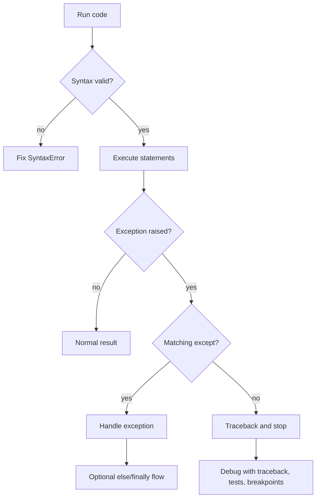

# Errors, Exceptions, and Debugging

Errors are not a side topic in programming; they are how a running program tells you which assumption failed. Halvorsen's textbook distinguishes syntax errors from exceptions, shows examples such as missing quotes and division by zero, and introduces `try`, `except`, and `finally`. It also has a short debugging chapter that frames debugging as the process of finding and resolving defects.

The practical goal is not to prevent every error message. The goal is to make failures local, understandable, and recoverable when recovery is possible. Syntax errors must be fixed before the program runs. Exceptions may indicate invalid input, missing files, unavailable resources, or programmer mistakes. Debugging is the disciplined process of reducing the distance between observed behavior and intended behavior.

## Definitions

A **syntax error** is invalid Python grammar. The interpreter cannot run the program until it is fixed:

```python
print("Hello"
```

An **exception** is an error detected while a syntactically valid program runs. Examples include `ZeroDivisionError`, `TypeError`, `ValueError`, `FileNotFoundError`, `KeyError`, and `IndexError`.

A **traceback** is the stack of calls that led to an exception. Read it from bottom for the exception type and message, then move upward to find which of your lines triggered the failure.

A **`try` block** contains code that may raise an exception. An **`except` block** handles selected exception types. An **`else` block** runs if no exception occurred. A **`finally` block** runs whether or not an exception occurred.

```python
try:
    value = float(text)
except ValueError:
    value = None
else:
    print("conversion succeeded")
finally:
    print("conversion attempted")
```

To **raise** an exception is to signal a failure explicitly:

```python
raise ValueError("window must be positive")
```

A **debugger** lets a programmer pause execution, inspect variables, step through code, and resume. Editors such as Spyder, VS Code, PyCharm, and Visual Studio provide integrated debuggers; Python also includes `pdb`.

## Key results

The first key result is that exception types matter. Catching bare `except:` hides too much, including programming mistakes and keyboard interrupts. Catch the narrow exception you expect:

```python
try:
    number = float(text)
except ValueError:
    ...
```

The second result is that exceptions should be handled at the level that can do something useful. A low-level parsing function may raise `ValueError`; a user-interface function may catch it and print a helpful message. Catching too early often loses context.

The third result is that `finally` is for cleanup, not ordinary success logic. Context managers often make `finally` unnecessary for files because `with` handles cleanup directly.

The fourth result is that `assert` is for internal sanity checks and tests, not user input validation in production code. Python can run with assertions disabled using optimization flags.

The fifth result is that debugging is faster when you can reproduce the failure. Capture the input, the expected behavior, the actual behavior, and the smallest code path that shows the issue. Random changes without a hypothesis waste time.

The sixth result is that logging is often better than scattered `print()` statements in larger programs. The standard `logging` module can include timestamps, severity levels, module names, and output destinations.

## Visual



| Exception | Common cause | Better response |
|---|---|---|
| `ValueError` | Text cannot be converted to number | Ask again or reject record |
| `TypeError` | Operation on incompatible type | Fix caller or validate input |
| `KeyError` | Missing dictionary key | Use `.get()`, defaults, or validate schema |
| `IndexError` | Sequence index out of range | Check length or loop directly |
| `FileNotFoundError` | Missing path | Show path, create file, or fail clearly |
| `ZeroDivisionError` | Divisor is zero | Validate denominator |

## Worked example 1: handle invalid numeric input

Problem: ask for a temperature and convert it to Fahrenheit, but do not crash when the user types invalid text.

Initial code:

```python
text = input("Celsius: ")
celsius = float(text)
fahrenheit = celsius * 9 / 5 + 32
print(fahrenheit)
```

If the user enters `abc`, `float("abc")` raises `ValueError`.

Method:

1. Wrap only the risky conversion in `try`.
2. Catch `ValueError`.
3. Keep the successful calculation outside or in the `else` block.
4. Print a clear message for invalid input.

Work:

```python
text = input("Celsius: ")

try:
    celsius = float(text)
except ValueError:
    print(f"{text!r} is not a valid number")
else:
    fahrenheit = celsius * 9 / 5 + 32
    print(f"{fahrenheit:.1f} F")
```

Step-by-step for input `20`:

1. `float("20")` succeeds and returns `20.0`.
2. The `except` block is skipped.
3. The `else` block computes `68.0`.
4. Output is `68.0 F`.

Step-by-step for input `abc`:

1. `float("abc")` raises `ValueError`.
2. The `except ValueError` block runs.
3. The `else` block does not run.
4. Output is `'abc' is not a valid number`.

Checked answer: valid input calculates; invalid input is reported without a traceback.

## Worked example 2: debug an off-by-one error

Problem: a function should return the average of every three consecutive readings, but it misses the final window.

Buggy code:

```python
def moving_average(values):
    result = []
    for start in range(0, len(values) - 3):
        window = values[start:start + 3]
        result.append(sum(window) / 3)
    return result
```

For `values = [10, 20, 30, 40]`, expected windows are `[10, 20, 30]` and `[20, 30, 40]`, so expected averages are `[20.0, 30.0]`.

Method:

1. Print or inspect `start` values.
2. For length `4`, `range(0, len(values) - 3)` becomes `range(0, 1)`.
3. That produces only `0`.
4. The last valid start index is `len(values) - 3`, which is `1`.
5. Because `range` excludes the stop value, the stop must be `len(values) - 3 + 1`.

Fixed code:

```python
def moving_average(values):
    result = []
    for start in range(0, len(values) - 3 + 1):
        window = values[start:start + 3]
        result.append(sum(window) / 3)
    return result
```

Check:

1. For length `4`, range is `range(0, 2)`, producing `0` and `1`.
2. `start = 0` gives average `(10 + 20 + 30) / 3 = 20.0`.
3. `start = 1` gives average `(20 + 30 + 40) / 3 = 30.0`.

Checked answer: `[20.0, 30.0]`.

## Code

```python
import logging

logging.basicConfig(level=logging.INFO, format="%(levelname)s: %(message)s")


def safe_mean(values):
    if not values:
        raise ValueError("cannot compute mean of empty data")
    return sum(values) / len(values)


datasets = [[1, 2, 3], [], [10, 20]]

for data in datasets:
    try:
        average = safe_mean(data)
    except ValueError as error:
        logging.warning("skipping dataset %r: %s", data, error)
    else:
        logging.info("mean of %r is %.2f", data, average)
```

The snippet uses explicit validation, a narrow exception handler, and logging with severity levels.

## Common pitfalls

- Catching every exception with bare `except:` and hiding real bugs.
- Placing too much code inside `try`, making it unclear which operation failed.
- Printing an error but continuing with invalid data.
- Using `assert` for user-facing validation.
- Ignoring tracebacks instead of reading the bottom exception type and relevant file line.
- Debugging by changing many things at once. Change one hypothesis at a time.
- Swallowing exceptions in libraries that should let callers decide how to handle failure.

## Connections

- [Files and Context Managers](/cs/programming/python/files-and-context-managers)
- [Control Flow and Comprehensions](/cs/programming/python/control-flow-and-comprehensions)
- [Testing and the Scientific Stack](/cs/programming/python/testing-and-scientific-stack)
- [Standard Library Highlights](/cs/programming/python/standard-library-highlights)
