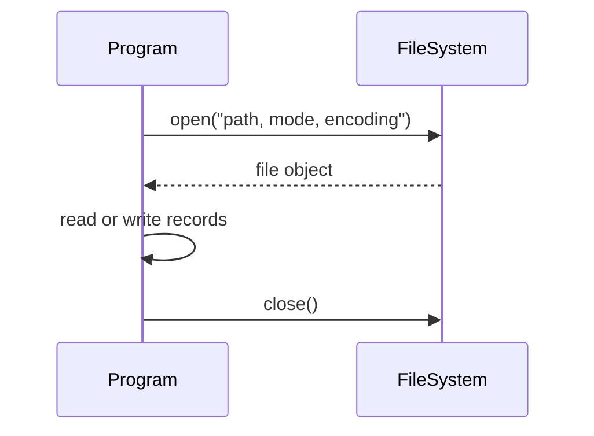

# Files and Context Managers

Files let Python programs persist data beyond one run. The textbook introduces the built-in `open()` function, file modes such as read, write, append, and create, and simple data logging examples. That is the right foundation, but modern Python code should add two habits immediately: use context managers with `with`, and prefer `pathlib.Path` for filesystem paths.


*Figure: Python provides the practical environment for many CS, ML, and data examples. Image: [Wikimedia Commons](https://commons.wikimedia.org/wiki/File:Python-logo-notext.svg), Python Software Foundation, GPL-compatible free license; trademark terms apply.*

File handling is a boundary between a program and the outside world. That boundary can fail: a file may not exist, a directory may be missing, permissions may block access, data may have the wrong encoding, or a record may be malformed. Good file code is explicit about mode, encoding, expected format, and cleanup.

## Definitions

A **file object** is returned by `open()` and provides methods such as `.read()`, `.readline()`, `.write()`, and iteration over lines.

A **file mode** controls what operations are allowed:

```python
open("data.txt", "r")  # read text
open("data.txt", "w")  # write text, replacing existing content
open("data.txt", "a")  # append text
open("data.txt", "x")  # create new file, fail if it exists
open("image.png", "rb") # read binary
```

Text mode is the default, but specifying it can improve clarity. Binary mode uses bytes and is required for images, compressed files, and arbitrary binary data.

A **context manager** is an object used with `with` that sets up and tears down a resource reliably:

```python
with open("data.txt", "r", encoding="utf-8") as file:
    text = file.read()
```

When the block ends, the file is closed even if an exception occurs.

`pathlib.Path` is a standard library class for paths:

```python
from pathlib import Path

path = Path("logs") / "temperature.txt"
```

It avoids many platform-specific string path problems.

A **record** is one logical unit in a file, often one line in a text file. A **delimiter** separates fields inside a record, such as a comma in CSV.

## Key results

The first key result is that `with open(...)` should be the default pattern. Manual `close()` works in tiny examples, but it is easy to forget when exceptions occur. A context manager makes cleanup structural.

The second result is that file modes have consequences. Mode `"w"` truncates existing files. Mode `"a"` preserves existing content and writes at the end. Mode `"x"` is useful when overwriting would be a bug. A surprising number of data-loss mistakes come from using `"w"` casually.

The third result is that text needs an encoding. If no encoding is specified, Python uses a platform default. That can differ across machines. Use `encoding="utf-8"` for most modern text files unless a specific format requires something else.

The fourth result is that iteration over a file reads line by line and is memory efficient:

```python
with open("large.txt", encoding="utf-8") as file:
    for line in file:
        ...
```

Use `.read()` when the whole file is expected to be small and needed as one string.

The fifth result is that standard formats deserve standard parsers. Use `json` for JSON, `csv` for CSV, and `configparser` or `tomllib` for configuration formats where appropriate. Manual `.split(",")` is fine for controlled exercises but fails on quoted commas and escaped delimiters.

The sixth result is that paths and files should be validated at the boundary. Check whether a path exists when absence is expected, create directories when needed, and raise clear errors when input is invalid.

A seventh result is that file formats are contracts. A text file with one float per line is simple, but it cannot store units, timestamps, sensor names, or missing values without inventing extra conventions. CSV handles tables. JSON handles nested records. Plain text handles human-readable logs. Choosing a format is part of the design, not an afterthought. When another program will read the file, document or enforce the schema.

An eighth result is that file writes should be considered failure-prone. A disk can be full, a directory can be missing, or a file can be locked by another process. For important data, write to a temporary file and then replace the target, or use a database designed for transactional updates. That is beyond beginner exercises, but the habit begins with not ignoring exceptions from file operations.

Finally, keep parsing and computation separate. A reader function should convert file text into structured Python values. A calculation function should accept those values without knowing which file they came from. This makes it possible to test the calculation with in-memory sample data and test the parser with tiny fixture files.

## Visual



| Mode | Meaning | Creates file? | Existing content | Typical use |
|---|---|---:|---|---|
| `"r"` | read | no | preserved | read input |
| `"w"` | write | yes | replaced | generate output |
| `"a"` | append | yes | preserved | logs |
| `"x"` | exclusive create | yes | error if exists | avoid overwrite |
| `"rb"` | read binary | no | preserved | images or binary data |
| `"wb"` | write binary | yes | replaced | generated binary output |

## Worked example 1: write and read a small log

Problem: write temperature readings to a text file, one reading per line, then read them back as floats.

Method:

1. Choose a path.
2. Open the file for writing with UTF-8.
3. Write each numeric value as text followed by newline.
4. Open the file for reading.
5. Strip each line and convert to `float`.
6. Check that the read values match the original values.

Work:

```python
from pathlib import Path

path = Path("temperature_log.txt")
readings = [21.5, 22.0, 20.75]

with path.open("w", encoding="utf-8") as file:
    for value in readings:
        file.write(f"{value}\n")

loaded = []
with path.open("r", encoding="utf-8") as file:
    for line in file:
        loaded.append(float(line.strip()))
```

Step-by-step:

1. The first `with` block opens the file and guarantees closure.
2. The loop writes:

```text
21.5
22.0
20.75
```

3. The second `with` block reads one line at a time.
4. `line.strip()` removes the newline.
5. `float(...)` converts the text to a number.

Checked answer:

```python
loaded == [21.5, 22.0, 20.75]
```

The values survive a write-read cycle.

## Worked example 2: write structured data as JSON

Problem: save experiment metadata and readings in a format that preserves structure better than plain lines.

Method:

1. Represent the data as dictionaries and lists.
2. Use the `json` module instead of manual formatting.
3. Write with indentation for readability.
4. Read the file back and check fields.

Work:

```python
import json
from pathlib import Path

data = {
    "experiment": "heating-test",
    "unit": "C",
    "readings": [21.5, 22.0, 20.75],
}

path = Path("experiment.json")
with path.open("w", encoding="utf-8") as file:
    json.dump(data, file, indent=2)

with path.open("r", encoding="utf-8") as file:
    loaded = json.load(file)
```

Step-by-step:

1. `json.dump` converts Python dictionaries, lists, strings, and numbers to JSON text.
2. `indent=2` makes the file easier for humans to inspect.
3. `json.load` parses the text back into Python objects.
4. `loaded["unit"]` is `"C"`.
5. `loaded["readings"][1]` is `22.0`.

Checked answer:

```python
loaded["experiment"] == "heating-test"
sum(loaded["readings"]) / len(loaded["readings"]) == 21.416666666666668
```

The structure is explicit, so a later script does not have to guess which line means unit and which line means data.

## Code

```python
import csv
from pathlib import Path

def write_readings_csv(path, rows):
    with path.open("w", newline="", encoding="utf-8") as file:
        writer = csv.DictWriter(file, fieldnames=["time_s", "temp_c"])
        writer.writeheader()
        writer.writerows(rows)

def read_readings_csv(path):
    with path.open("r", newline="", encoding="utf-8") as file:
        reader = csv.DictReader(file)
        return [
            {"time_s": int(row["time_s"]), "temp_c": float(row["temp_c"])}
            for row in reader
        ]

path = Path("readings.csv")
rows = [{"time_s": 0, "temp_c": 21.5}, {"time_s": 10, "temp_c": 22.0}]
write_readings_csv(path, rows)
print(read_readings_csv(path))
```

The `csv` module handles delimiters and newlines more reliably than manual string concatenation.

This code also separates serialization from calculation. The writer receives rows that are already structured, and the reader returns rows with corrected types. A later average-temperature function should not need to know that the data came from CSV. That separation is what makes the file layer replaceable: the same calculation could be fed by JSON, a database query, or a hard-coded test list. Good file code turns external bytes into internal values and back again with as little hidden policy as possible.

## Common pitfalls

- Forgetting to close files when not using `with`.
- Using `"w"` and accidentally erasing a file that should have been appended to.
- Reading an entire large file into memory when line-by-line iteration would be safer.
- Omitting `encoding="utf-8"` and getting platform-specific behavior.
- Splitting CSV lines manually even though quoted fields can contain commas.
- Building paths with string concatenation instead of `Path` or `os.path.join`.
- Catching file errors and silently continuing, which hides missing input data.

## Connections

- [Strings and Text Processing](/cs/programming/python/strings-and-text-processing)
- [Errors, Exceptions, and Debugging](/cs/programming/python/errors-exceptions-and-debugging)
- [Modules, Packages, and Environments](/cs/programming/python/modules-packages-and-environments)
- [Standard Library Highlights](/cs/programming/python/standard-library-highlights)
