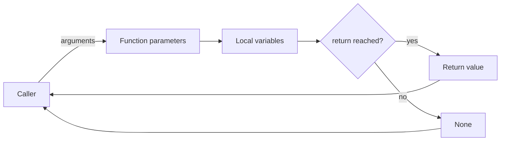

# Functions, Arguments, and Decorators

Functions are the first major abstraction in Python. They turn a sequence of statements into a named operation with inputs, outputs, and a local workspace. Halvorsen's textbook introduces functions after control flow, including functions with multiple return values. That placement is natural: once code can branch and loop, it quickly becomes worth packaging repeated logic into reusable pieces.


*Figure: Python provides the practical environment for many CS, ML, and data examples. Image: [Wikimedia Commons](https://commons.wikimedia.org/wiki/File:Python-logo-notext.svg), Python Software Foundation, GPL-compatible free license; trademark terms apply.*

Modern Python functions go further than simple `def name(x): return y`. They support positional arguments, keyword arguments, defaults, variable-length argument lists, closures, lambdas, decorators, annotations, and multiple return values through tuples. These features should serve readability. A good function makes one idea easy to call and easy to test; a clever signature that hides behavior is usually worse than a few explicit lines.

## Definitions

A **function definition** binds a name to a callable object:

```python
def celsius_to_fahrenheit(celsius):
    return celsius * 9 / 5 + 32
```

A **parameter** is the name in the function definition. An **argument** is the value supplied at call time. In `celsius_to_fahrenheit(20)`, `celsius` is the parameter and `20` is the argument.

A **return value** is the result sent back to the caller with `return`. If a function reaches the end without `return`, it returns `None`.

A **positional argument** is matched by position. A **keyword argument** is matched by name:

```python
pow(2, 3)
round(number=3.14159, ndigits=2)
```

A **default argument** supplies a value when the caller omits that parameter:

```python
def greet(name, punctuation="!"):
    return f"Hello, {name}{punctuation}"
```

`*args` gathers extra positional arguments into a tuple. `**kwargs` gathers extra keyword arguments into a dictionary. Use them when writing wrappers or flexible APIs, not as a default substitute for clear parameters.

A **closure** is a function that remembers variables from an enclosing scope after that scope has finished executing.

A **lambda** is a small anonymous function expression:

```python
key = lambda item: item["score"]
```

A **decorator** is a callable that receives a function and returns a replacement function, often a wrapper that adds behavior before or after the original call.

## Key results

The first key result is that a function should have a clear contract: what it expects, what it returns, and what side effects it performs. A calculation function should usually return a value rather than printing directly. Printing is useful at the user-interface boundary; returning is useful for tests and reuse.

The second result is that Python naturally returns multiple values by returning a tuple. This is the technique used in many beginner exercises:

```python
def min_max(values):
    return min(values), max(values)

low, high = min_max([3, 1, 4])
```

The third result is that default values are evaluated once, when the function is defined, not each time it is called. Therefore mutable defaults are dangerous:

```python
def add_item(item, items=[]):  # avoid
    items.append(item)
    return items
```

Use `None` as the default and create the list inside the function.

The fourth result is that scope follows the LEGB rule: local, enclosing, global, built-in. Assignment inside a function creates a local name unless declared `global` or `nonlocal`. Most functions should avoid modifying globals; pass values in and return values out.

The fifth result is that decorators are just function transformations. The syntax:

```python
@decorator
def f():
    ...
```

means roughly:

```python
def f():
    ...

f = decorator(f)
```

The sixth result is that type hints document expectations and help tools, but they do not enforce types at runtime by themselves:

```python
def area(width: float, height: float) -> float:
    return width * height
```

A seventh result is that function size should follow testability. A function that reads input, parses text, calculates a value, writes a file, and prints a report has too many reasons to change. Splitting those steps into `parse_input`, `calculate`, `save`, and `display` creates small contracts. The calculation can be tested without files. The file writer can be tested with temporary paths. The display function can be changed without touching the formula.

An eighth result is that argument order is part of the interface. Put required, stable, central parameters first. Put optional tuning parameters after them, usually with defaults. If a call has several boolean flags or numbers whose meaning is not obvious, keyword arguments are clearer than positional arguments. `plot(values, normalize=True, window=5)` is easier to review than `plot(values, True, 5)`.

Finally, decorators should be introduced only when the repeated pattern is real. Logging, timing, caching, authorization, validation, and retry behavior are common decorator uses. A decorator used once may hide more than it helps. Before writing one, ask whether a direct helper function or context manager would make the control flow more visible.

## Visual



| Feature | Syntax | Use | Caution |
|---|---|---|---|
| Positional args | `f(2, 3)` | Short obvious calls | Order must be remembered |
| Keyword args | `f(width=2, height=3)` | Clarity at call site | Names become part of API |
| Defaults | `def f(x=0)` | Optional behavior | Avoid mutable defaults |
| `*args` | `def f(*values)` | Variable count | Can hide required shape |
| `**kwargs` | `def f(**options)` | Forward options | Validate accepted keys |
| Lambda | `lambda x: x.score` | Small callback | Avoid complex lambda bodies |
| Decorator | `@timer` | Cross-cutting behavior | Preserve metadata with `wraps` |

## Worked example 1: write and test a conversion function

Problem: implement Celsius-to-Fahrenheit and Fahrenheit-to-Celsius functions, then check a round trip.

Method:

1. Write one function per conversion.
2. Return numeric values instead of printing inside the functions.
3. Use known reference points to check correctness.
4. Test a round trip: Celsius to Fahrenheit and back to Celsius.

Work:

```python
def c2f(celsius):
    return celsius * 9 / 5 + 32

def f2c(fahrenheit):
    return (fahrenheit - 32) * 5 / 9

freezing_f = c2f(0)
boiling_f = c2f(100)
back_to_c = f2c(c2f(37))
```

Step-by-step:

1. For `c2f(0)`:

$$
\begin{aligned}
0 \times 9/5 + 32 &= 32
\end{aligned}
$$

2. For `c2f(100)`:

$$
\begin{aligned}
100 \times 9/5 + 32 &= 180 + 32 \\
                    &= 212
\end{aligned}
$$

3. For the round trip with `37`:

$$
\begin{aligned}
F &= 37 \times 9/5 + 32 = 98.6 \\
C &= (98.6 - 32) \times 5/9 = 37
\end{aligned}
$$

Checked answer:

```python
freezing_f == 32
boiling_f == 212
round(back_to_c, 10) == 37
```

Rounding in the final check avoids false failures from tiny floating-point representation differences.

## Worked example 2: build a decorator for timing

Problem: create a decorator that prints how long a function call takes, then apply it to a slow function.

Method:

1. A decorator receives the original function.
2. It defines a wrapper that accepts arbitrary arguments.
3. The wrapper records time before and after calling the function.
4. The wrapper returns the original function's result.
5. `functools.wraps` preserves the original name and docstring.

Work:

```python
from functools import wraps
from time import perf_counter, sleep

def timed(func):
    @wraps(func)
    def wrapper(*args, **kwargs):
        start = perf_counter()
        result = func(*args, **kwargs)
        elapsed = perf_counter() - start
        print(f"{func.__name__} took {elapsed:.3f} s")
        return result
    return wrapper

@timed
def wait_and_add(a, b):
    sleep(0.2)
    return a + b
```

Call:

```python
answer = wait_and_add(2, 3)
```

Step-by-step:

1. `@timed` replaces `wait_and_add` with `timed(wait_and_add)`.
2. Calling `wait_and_add(2, 3)` actually calls `wrapper(2, 3)`.
3. `wrapper` records `start`.
4. It calls the original function with `func(*args, **kwargs)`.
5. The original function returns `5`.
6. `wrapper` prints elapsed time and returns `5`.

Checked answer: `answer` is `5`, and a timing line near `0.200 s` is printed.

## Code

```python
from functools import wraps

def require_non_empty(func):
    @wraps(func)
    def wrapper(values, *args, **kwargs):
        if not values:
            raise ValueError("values must not be empty")
        return func(values, *args, **kwargs)
    return wrapper

@require_non_empty
def mean(values):
    return sum(values) / len(values)

print(mean([10, 20, 30]))
```

The decorator separates validation from the average formula. For small programs this may be more abstraction than necessary; it becomes useful when the same validation wraps several functions.

In ordinary coursework, write the direct version first. After two or three functions repeat the same validation, timing, logging, or conversion code, then consider a decorator. This keeps the abstraction earned by repetition. The same discipline applies to `*args`, `**kwargs`, and higher-order functions: they are valuable when they simplify a real calling pattern, but they can make beginner code harder to trace if introduced before the basic function contract is stable.

## Common pitfalls

- Printing from a function that should return a value. This makes reuse and testing harder.
- Using mutable default arguments such as `[]` or `{}`.
- Writing functions that depend on hidden global variables instead of explicit parameters.
- Catching every possible argument with `*args` and `**kwargs` when a clear signature would document the function better.
- Forgetting to return the result from a wrapper decorator.
- Omitting `functools.wraps` in decorators, which hides the original function metadata.
- Using lambdas for multi-step logic. Define a named function when the operation deserves a name.

## Connections

- [Control Flow and Comprehensions](/cs/programming/python/control-flow-and-comprehensions)
- [Containers and Idioms](/cs/programming/python/containers-and-idioms)
- [Modules, Packages, and Environments](/cs/programming/python/modules-packages-and-environments)
- [Testing and the Scientific Stack](/cs/programming/python/testing-and-scientific-stack)
