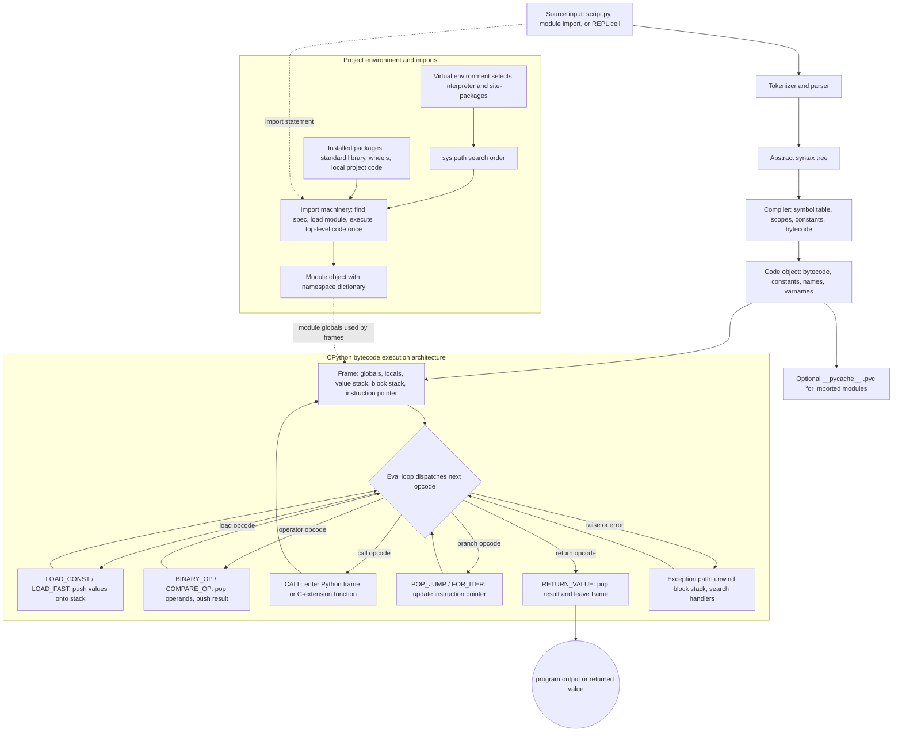

# Python Programming

These notes are based on **Python Programming** by **Hans-Petter Halvorsen**. The extracted front matter identifies the book as *Python Programming*, Hans-Petter Halvorsen, 2019, with copyright text dated August 12, 2020 and ISBN `978-82-691106-4-7`. The book is an introductory programming text: it starts with why Python is useful, moves through installation and first scripts, then covers variables, packages, plotting, control flow, functions, classes, modules, file handling, error handling, debugging, environments, editors, and a short mathematics/scientific-computing section.


*Figure: Python provides the practical environment for many CS, ML, and data examples. Image: [Wikimedia Commons](https://commons.wikimedia.org/wiki/File:Python-logo-notext.svg), Python Software Foundation, GPL-compatible free license; trademark terms apply.*

The wiki pages in this section follow the book's practical order but expand the treatment for a modern Python study path. Where the textbook introduces a beginner concept, these notes keep that foundation and add idioms students need when moving into larger scripts: virtual environments, context managers, comprehensions, decorators, dataclasses, iterators, `pathlib`, testing, and the scientific stack. The source book is the anchor; the wiki organization is designed to make the material easier to revisit topic by topic.

## Definitions

**Python** is an interpreted, high-level, general-purpose programming language. The textbook emphasizes that Python is cross-platform, open source, popular, and useful in many domains, including scripting, scientific computing, simulation, web work, database work, and education.

An **interpreter** executes Python code. In interactive mode it behaves like a REPL with the `>>>` prompt. In script mode it runs a `.py` file. The book demonstrates both modes using the Python shell, operating-system consoles, IDLE, Spyder, and other editors.

An **editor** or **IDE** is where code is written and often run. The source discusses IDLE, Visual Studio Code, Spyder, Visual Studio, PyCharm, Wing Python IDE, and Jupyter Notebook. The basic idea is that beginners can start with simple tools, while larger projects benefit from debugging, project navigation, terminals, and environment selection.

A **module** is a Python file that can be imported. A **package** is a collection of modules. The textbook introduces both built-in modules such as `math` and external packages such as NumPy, SciPy, Matplotlib, and pandas.

An **environment** is the interpreter plus installed packages available to a project. The book discusses the official Python distribution, Anaconda, PIP, Conda, and virtual environments. These notes treat environment management as a core skill because package confusion is one of the most common beginner blockers.

An **introductory Python scope** includes syntax, variables, strings, numbers, operators, control flow, functions, classes, modules, files, exceptions, and basic package use. This wiki section also includes standard-library practice, testing, concurrency overview, and scientific-stack orientation so the course can connect beginner examples to real project habits.

## Key results

The first key result from the source book is that Python rewards immediate practice. The book repeatedly uses small examples and exercises: print a message, assign variables, compute a formula, import a module, plot values, loop over data, define functions, create classes, write files, and handle exceptions. Students should run code, not only read it.

The second result is that Python's simplicity is not the same as looseness. Python does not require variable declarations, but values still have types. Python does not use braces for blocks, but indentation is strict syntax. Python does not require compilation by the user, but runtime errors still need careful interpretation.

The third result is that external libraries are central to Python's ecosystem. The book notes that Python's core is intentionally not everything; packages extend it into scientific computing, plotting, data analysis, web development, and more. This makes package management and imports part of basic fluency.

The fourth result is that a beginner can use Python in several valid workflows. The official Python installer plus IDLE is enough for first programs. Anaconda plus Spyder is useful for scientific and numerical work. Visual Studio Code, PyCharm, and similar editors are useful for larger projects. Jupyter Notebook is useful for exploratory code, equations, plots, and narrative analysis.

The fifth result is that the book's chapter sequence moves from use to structure. It begins with setup and first scripts, then introduces basic language constructs, then functions/classes/modules, then files/errors/debugging, then environments and editors, and finally mathematical applications and resources.

The extracted table of contents gives this chapter map:

| Part | Chapters | Main topics |
|---|---|---|
| I. Getting Started with Python | 1-4 | Introduction, what Python is, installation, editors, first scripts, variables, built-ins, standard library, packages, plotting |
| II. Python Programming | 5-12 | `if`, loops, arrays, functions, classes, modules, files, error handling, debugging, package installation |
| III. Python Environments and Distributions | 13-15 | Environments, PIP, Conda, virtual environments, Anaconda, Enthought Canopy |
| IV. Python Editors | 16-22 | Python editors, Spyder, Visual Studio Code, Visual Studio, PyCharm, Wing Python IDE, Jupyter Notebook |
| V. Python for Mathematics Applications | 23 | Basic math functions, statistics, trigonometric functions, polynomials |
| VI. Resources | 24 | Distributions, libraries, editors, tutorials, Visual Studio resources |
| VII. Solutions to Exercises | final section | Exercise solutions |

## Visual



This diagram shows Python as an execution pipeline rather than only a learning path: source text becomes an AST, then a code object, then bytecode interpreted by CPython frames and the eval loop. The environment branch explains why virtual environments and imports affect runtime behavior: imported modules execute into module dictionaries that later frames use as globals.

| Wiki page | Primary source connection | Expansion added here |
|---|---|---|
| Setup, REPL, and Environments | Chapters 2-3, 12-13 | Virtual environment workflow and interpreter diagnostics |
| Syntax, Variables, and Types | Chapter 4 | Mutability, truthiness, aliasing, and naming practice |
| Operators and Expressions | Chapters 4-5 | Precedence, identity vs equality, modulo use |
| Control Flow and Comprehensions | Chapter 5 | Idiomatic loops, `enumerate`, comprehensions |
| Strings and Text Processing | Chapter 4 | Formatting, parsing, encoding, raw strings |
| Containers and Idioms | Chapter 5 | Lists, tuples, sets, dictionaries, idiomatic iteration |
| Functions, Arguments, and Decorators | Chapter 6 | Defaults, closures, lambdas, decorators, type hints |
| Modules, Packages, and Environments | Chapters 8, 12-13 | Import design, package isolation, dependency confusion |
| Files and Context Managers | Chapter 9 | `with`, `pathlib`, JSON and CSV basics |
| Errors, Exceptions, and Debugging | Chapters 10-11 | Narrow exception handling, traceback reading, logging |
| Classes, OOP, and Dataclasses | Chapter 7 | Dunders, properties, inheritance, dataclasses |
| Iterators, Generators, and Functional Tools | Chapters 5-6 foundation | `yield`, lazy pipelines, `itertools`, `functools` |
| Standard Library Highlights | Chapters 4, 9, 23 foundation | `pathlib`, `collections`, `datetime`, `json`, `re` |
| Concurrency Overview | Beyond main source scope | Threading, multiprocessing, and `asyncio` orientation |
| Testing and the Scientific Stack | Exercises and Chapter 23 | `unittest`, pytest basics, NumPy, pandas, Matplotlib |

## Worked example 1: choose a learning path from the chapter map

Problem: a student has never programmed before and wants to use Python for simple data logging and plotting. Which wiki pages should they read first?

Method:

1. Identify the minimum setup topics.
2. Add core language topics needed for simple scripts.
3. Add file handling because data logging persists values.
4. Add plotting/scientific-stack orientation.
5. Delay advanced topics until the first script works.

Step-by-step path:

1. Start with [Setup, REPL, and Environments](/cs/programming/python/setup-repl-and-environments). The student needs to run Python, recognize the `>>>` prompt, and run a `.py` script.
2. Continue to [Syntax, Variables, and Types](/cs/programming/python/syntax-variables-and-types). Data logging needs numbers, strings, names, and conversion from text input.
3. Read [Operators and Expressions](/cs/programming/python/operators-and-expressions). Unit conversions and time calculations use arithmetic, comparison, and modulo.
4. Read [Control Flow and Comprehensions](/cs/programming/python/control-flow-and-comprehensions). A logger repeats readings and may skip invalid data.
5. Read [Containers and Idioms](/cs/programming/python/containers-and-idioms). Readings naturally live in lists or dictionaries.
6. Read [Files and Context Managers](/cs/programming/python/files-and-context-managers). Logging requires safe writes and later reads.
7. Finish the first pass with [Testing and the Scientific Stack](/cs/programming/python/testing-and-scientific-stack), focusing on NumPy and Matplotlib overview.

Checked answer: this path covers setup, values, calculations, loops, storage, files, and plotting. It postpones decorators, dataclasses, concurrency, and advanced iterators because they are not necessary for the first data-logging script.

## Worked example 2: map a textbook exercise to maintainable code

Problem: the source book includes file-logging style exercises, such as recording temperature values at intervals and reading them back. How should that become maintainable Python?

Method:

1. Identify the core calculation or data operation.
2. Put it in a function.
3. Use a context manager for the file.
4. Choose a structured format when more than one field is saved.
5. Add a small testable check.

Suppose each record has time in seconds and temperature in Celsius:

```python
rows = [
    {"time_s": 0, "temp_c": 21.5},
    {"time_s": 10, "temp_c": 22.0},
]
```

Step-by-step design:

1. The data has two named fields, so a CSV file is more appropriate than a plain one-number-per-line file.
2. A writer function should accept a path and rows, then write the header and records.
3. A reader function should return dictionaries with `int` and `float` values, not raw strings.
4. A test can write a tiny sample, read it back, and compare the result.

Checked answer outline:

```python
def round_trip_ok(write_func, read_func, path, rows):
    write_func(path, rows)
    loaded = read_func(path)
    return loaded == rows
```

This maps the textbook's practical exercise into a reusable pattern: isolate I/O, preserve structure, convert types at the boundary, and check that the saved data can be loaded correctly.

## Code

```python
import platform
import sys
from pathlib import Path

def python_study_snapshot():
    return {
        "executable": sys.executable,
        "version": sys.version.split()[0],
        "platform": platform.platform(),
        "working_directory": str(Path.cwd()),
    }

if __name__ == "__main__":
    for key, value in python_study_snapshot().items():
        print(f"{key}: {value}")
```

Run this script at the start of a course or project. It records which Python executable and version are actually being used, which helps diagnose many editor and package-installation issues.

## Common pitfalls

- Treating the textbook's old version references as a reason to install exactly that version. The source says Python 3.7.0 was current in its context; these notes focus on Python 3 concepts and stable idioms.
- Reading examples without running them. The book is exercise-heavy because programming skill comes from execution and correction.
- Skipping environment setup and then losing time to `ModuleNotFoundError`.
- Mixing REPL experiments, notebook cells, and scripts without knowing where state lives.
- Memorizing library names without learning imports and package managers.
- Jumping to advanced topics before understanding variables, functions, loops, containers, and files.
- Assuming a plot or printout proves code is correct. Add small checks and tests.

## Connections

- [Setup, REPL, and Environments](/cs/programming/python/setup-repl-and-environments)
- [Syntax, Variables, and Types](/cs/programming/python/syntax-variables-and-types)
- [Control Flow and Comprehensions](/cs/programming/python/control-flow-and-comprehensions)
- [Files and Context Managers](/cs/programming/python/files-and-context-managers)
- [Testing and the Scientific Stack](/cs/programming/python/testing-and-scientific-stack)
